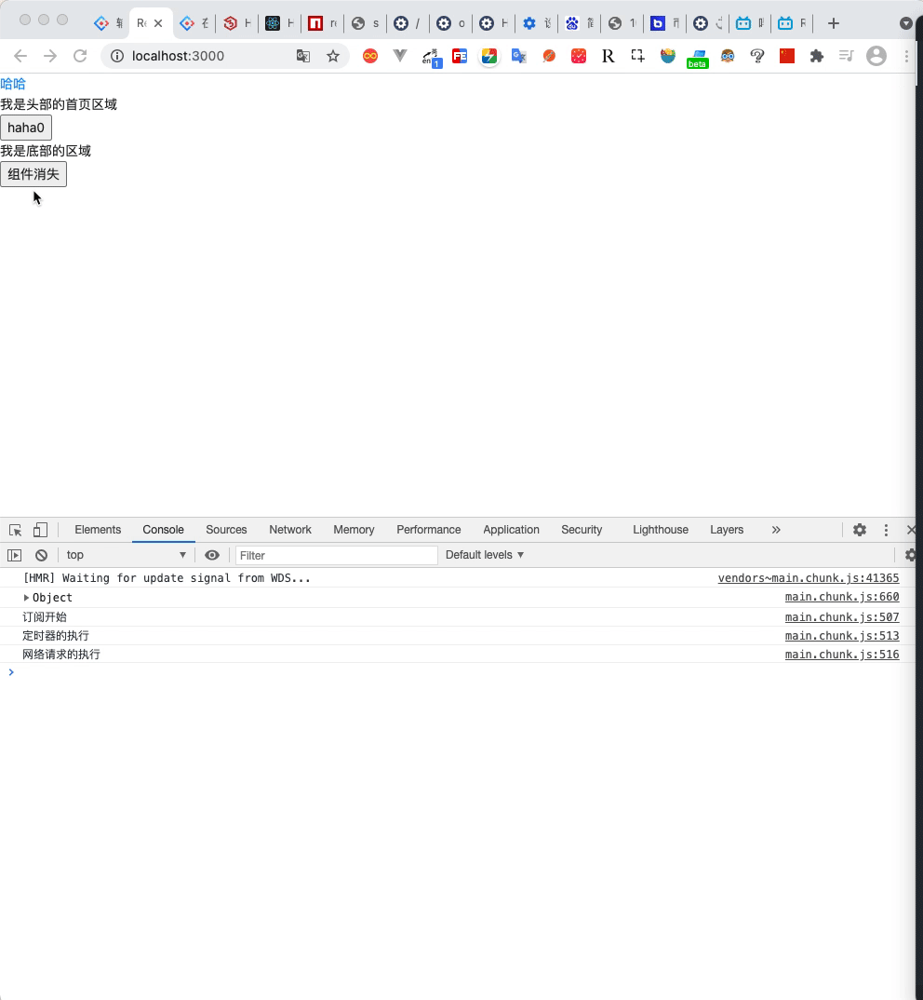

#  课程内容介绍

* 基础
  * 基本用法
  * 脚手架
  * 组件化
  * 路由用法
  * 案例练习

* 项目：移动端网站-`好客租房` 
  * 技术栈：react + react-router-dom + axios + sass + ant-mobile
  * 项目优化和部署

* 扩展
  * redux：复杂应用状态管理工具  

> 提示: 类比vue  学习react

---

 

# react基础


---

## 学习目标一基本使用

* [ ] React概述
* [ ] React的基本使用
* [ ] React脚手架的使用

### React概述

#### 1.1 什么是React

- **React 是一个用于构建用户界面的 JavaScript 库。** 
- 用户界面：HTML页面（前端） 
- React 主要用来写HTML页面，或构建Web应用 
- React 仅仅是**视图层（V）**，也就是只负责视图的渲染，而并非提供了 完整的 M 和 C 的功能。 
- React 起源于 Facebook 的内部项目，后又用来架设 Instagram 的网站，并于 2013 年5月开源


#### 1.2 React特点

1. 声明式

   你只需要描述 UI（HTML）看起来是什么样，就**跟写HTML一样** 。

   React 负责渲染 UI，并在数据变化时更新 UI 。

   > 注意: react是用很像js的语言写标签

   ```jsx
   const jsx = <div className="app"><h1>Hello React! 动态变化数据：{count}</h1> </div>
   ```

2. 基于组件

   - 组件是 React 最重要的内容 
   -  组件表示页面中的部分内容 
   - 组合、复用多个组件，可以实现完整的页面功能 

3. 学习一次 随处使用

   - 使用 React 可以开发 Web 应用（browser/server） 
   -  使用 React 可以开发移动端原生应用（react-native） (client/server)
   -  使用 React 可以开发 VR（虚拟现实）应用（react 360） 


扩展阅读：https://react.docschina.org

### React的基本使用

#### 2.1 React的安装

- 安装命令：` $ npm i react react-dom` 

- react 包是核心，提供创建元素、组件等功能 
-  react-dom 包提供 DOM 相关功能等 

#### 2.2 HelloWorld

1. 引入 react 和 react-dom 两个 js 文件 

  ```html
  <script src="./node_modules/react/umd/react.development.js"></script> 
  <script src="./node_modules/react-dom/umd/react-dom.development.js"></script> 
  ```

2.  创建 React 元素 

3. 渲染React元素到页面中

   ```html
   <div id="root"></div>
   
   <script> 
       const title = React.createElement('h1', null, 'Hello React') 
       ReactDOM.render(title,document.getElementById('root'))
   </script> 
   
   ```

`方法说明`

 1. React.createElement() 说明（知道） 

    - 返回值：React元素 
    - 第一个参数：要创建的React元素名称 （html规范定义的标签）
    - 第二个参数：该React元素的属性 
    - 第三个及其以后的参数：该React元素的子节点 

 2. ReactDOM.render() 说明 

    - 返回值:React元素

    - 第一个参数：要渲染的React元素 
    - 第二个参数：DOM对象，用于指定渲染到页面中的位置 

### React脚手架的使用

#### 3.1 React脚手架的意义

1. 脚手架是开发现代Web 应用的必备。
2. 高效利用 Webpack、Babel、ESLint 等工具辅助项目开发。 
3. 零配置，无需手动配置繁琐的工具即可使用。 
4. 关注业务，而不是工具配置

#### 3.2 使用脚手架初始化项目

1. 初始化项目，命令`npx create-react-app my-app`
2.  启动项目，在项目根目录执行命令：npm start 


`补充说明` -> npx命令介绍

- npm v5.2.0 引入的一条命令 
- 目的：提升包内提供的命令行工具的使用体验 
-  原来：先安装脚手架包，再使用这个包中提供的命令 
- 现在：无需安装脚手架包，就可以直接使用这个包提供的命令 

#### 3.3 在脚手架中使用React

1. 导入 react 和 react-dom 两个包。 

   ```js
   import React from 'react' 
   import ReactDOM from 'react-dom' 
   ```

2. 调用 React.createElement() 方法创建 react 元素。

3. 调用 ReactDOM.render() 方法渲染 react 元素到页面中。 

### 小结

1. React是构建用户界面的JavaScript库 
2. 使用 react 时，推荐使用脚手架方式。 
3. 初始化项目命令：npx create-react-app my-app 。 
4. 启动项目命令：npm start。 
5. React.createElement() 方法用于创建 react 元素（知道）。 
6. ReactDOM.render() 方法负责渲染 react 元素到页面中。 


---


## 学习目标二-JSX基本用法

* [ ] JSX 的基本使用 
* [ ] JSX 中使用 JavaScript 表达式
* [ ] JSX 的条件渲染 
* [ ] JSX 的列表渲染 
* [ ] JSX 的样式处理 

### JSX基本使用

`实际上,jsx仅仅只是React.createElement()函数的语法糖`

`所有的jsx最终都会被转换成React.createElement的函数调用`


#### 1.1 createElement()的问题

1. 繁琐不简洁。 
2. 不直观，无法一眼看出所描述的结构。 
3. 不优雅，用户体验不爽。 


#### 1.2 JSX简介

- JSX 是 JavaScript XML 的简写，表示在 JavaScript 代码中写 XML（HTML） 格式的代码。 
- 优势：声明式语法更加直观、与HTML结构相同，降低了学习成本、提升开发效率 
- JSX 是 React 的核心内容。 

#### 虚拟DOM和真实DOM的差别

- 虚拟DOM获取的是对象,真实的DOM获取的是标签的元素


-  真实DOM上的获取的属性比较多,而虚拟DOM上获取的属性比较少,因为虚拟DOM上获取的属性只为React进行服务

#### 1.3 JSX使用步骤

1. 使用 JSX 语法创建 react 元素 

   ```jsx
   // 使用 JSX 语法，创建 react 元素： 
   const title = <h1>Hello JSX</h1> 
   ```

2. 使用 ReactDOM.render() 方法渲染 react 元素到页面中 

  ```jsx
  // 渲染创建好的React元素 
  ReactDOM.render(title, root) 
  ```

#### 1.4 在脚手架中使用JSX和原理

1. JSX 不是标准的 ECMAScript 语法，它是 ECMAScript 的语法扩展。 
2. 需要使用 babel 编译处理后，才能在浏览器环境中使用。 
3. create-react-app 脚手架中已经默认有该配置，无需手动配置。 

`注意`: **JSX是React.createElement方法的语法糖**

#### 1.5 使用注意

1. React元素的有些属性名使用小驼峰命名法

   * 特殊属性名：class -> className、for -> htmlFor、tabindex -> tabIndex 。 

2. 声明的jsx元素，只能有一个根元素。 

3. 推荐：使用小括号包裹 JSX ，从而避免 JS 中的自动插入分号陷阱。 

   1. ​	1.定义虚拟DOM的时候不需要写引号,

   ​       2.标签中混入js表达式时,需要使用{}进行括号包裹

   ​        3.样式的类名不能使用class属性,只能使用className属性

   ​        4.内联样式,使用style的时候不能试用贴style=""的方式必须使用style={{fontSize:小驼峰命名的方式}}

   ​        5.在jsx中只能有一个根标签

   ​        6.使用单标签的时候必须要进行闭合

   ​        7.在使用标签的时候,如果使用的是小写的标签,则会把该标签转为html中同名的元素,如果是大写的标签则会转换成react中的组件

4. ```jsx
   // 使用小括号包裹 JSX 
   const dv = ( 
     <div>Helo JSX</div> 
   ) 
   ```

   

### JSX中使用JS表达式

#### 2.1 嵌入 JS 表达式 

-  数据存储在JS中 

- 语法：{ JavaScript表达式 }

- 注意：语法中是**单大括号**，不是双大括号！ 

  ```jsx
  const name = 'Jack' 
  const div = ( 
    <div>你好，我叫：{name}</div> 
  ) 
  ```

#### 2.2 数据类型支持和使用注意

- 单大括号中可以使用任意的 JavaScript 表达式 （值，变量，函数调用，三元运算符，数组(基本类型，jsx)）
-  **JSX 自身也是 JS 表达式** 
-  注意：不能在{}中出现语句和对象（比如：if/for，{a:100} 等） 

```js
/*
 jsx语法的注意事项
    在jsx{}语句中,只能后使用表达式,不能够使用语句
    表达式:一个变量产生一个值,放在需要值的地方
    1.变量 2.a+b 3.fun() 4.数组的方法 5.function add(){} 
    语句:
    1.for循环 2. if判断语句 3.switch
*/
```


 

### JSX条件渲染

#### 3.1 语法

- 场景：loading效果
- 条件渲染：根据条件渲染特定的 JSX 结构 
-  可以使用if/else或三元运算符来实现 


### JSX列表渲染

#### 4.1 语法

-  如果要渲染一组数据，应该使用**数组的 map()** 方法 

  ```jsx
  const songs = [ 
    {id: 1, name: '野狼disco'}, 
    {id: 2, name: '像我这样的人'}, 
    {id: 3, name: '桥边姑娘'}, 
  ] 
  const list = ( 
    <ul> 
      {songs.map(item => <li key={item.key}>{item.name}</li>)} 
    </ul> 
  ) 
  ```

#### 4.2 注意

- 如果要渲染一组数据，应该使用数组的 map() 方法 

- 注意：渲染列表时应该添加 key 属性，key 属性的值要保证唯一 

- 原则：map() 遍历谁，就给谁添加 key 属性 

- 注意：尽量避免使用索引号作为 key !

  ```jsx
  const songs = [ 
    {id: 1, name: '野狼disco'}, 
    {id: 2, name: '像我这样的人'}, 
    {id: 3, name: '桥边姑娘'}, 
  ] 
  const list = ( 
    <ul> 
      {songs.map(item => <li key={item.id}>{item.name}</li>)} 
    </ul> 
  ) 
  ```

  

### JSX样式处理

#### 5.1 行内样式-style

* style属性{{属性:值}}

```jsx
<h1 style={{ color: 'red', backgroundColor: '#eee' }}> 
  JSX的样式处理 
</h1> 
```


#### 5.2 类名-className(推荐)

* 属性名小驼峰命名

```jsx
<h1 className="title"> 
 JSX的样式处理 
</h1> 
```

### 小结

1. JSX 是React 的核心内容。 
2. JSX 表示在JS代码中写HTML结构，是React声明式的体现。 
3. 使用 JSX 配合嵌入的 JS 表达式、条件渲染、列表渲染，可以描述任意 UI 
    结构。 
4. 推荐使用 className 的方式给JSX添加样式。 
5. React 完全利用 JS 语言自身的能力来编写UI，而不是造轮子增强 HTML 功
    能。 


---


## 学习目标三-组件用法

* [ ] React 组件介绍 
* [ ] React 组件的两种创建方式 
* [ ] React 事件处理 
* [ ] 事件回调函数绑定 this 指向 
* [ ] 有状态组件和无状态组件 
* [ ] 组件中的 state 和 setState()
* [ ] 表单处理 

### React 组件介绍 

> vue组件特点？.vue文件（组件）=》1. template 2. script  3. style

#### 1.1 react组件的特点

- 组件是 React 的一等公民，**使用 React 就是在用组件** 

- 组件表示页面中的部分功能 

- 组合多个组件实现完整的页面功能 

- 特点：可复用、独立、可组合 

  

### React 组件的创建

#### 2.1 使用函数创建组件

##### 语法

- 函数组件：使用 JS 的函数（或箭头函数）创建的组件 
  - 函数体内要返回元素
- 渲染函数组件：用函数名作为**组件标签名** 

示例：

```jsx
import React from 'react';
function Hello() { 
  return ( 
    <div>这是我的第一个函数组件！</div> 
  ) 
} 
ReactDOM.render(<Hello />, root) 
```

##### 注意事项

`函数名称必须以大写字母开头，使用**大驼峰命名法**`

`函数组件必须有返回值，表示该组件的结构 `

`组件标签可以单闭合`

##### 拓展:

###### **Es5和Es6之间的继承**

**Es5使用构造函数**

构造函数的名称一般都是首字母大写
挂载在this上面的属性为实例属性，实例属性再每个实例间都是独立的
原型链属性通过prototype添加，他是所有实例共享的
`类方法/静态属性只能由构造函数本身访问`
当实例属性和原型链上的属性重名时，优先访问实例属性，没有实例属性再访问原型属性
大多数浏览器的 ES5 实现之中，每一个实例的对象都有__proto__属性，指向其的构造函数的prototype属性对象

```js
<script>
    // 创建构造函数
    function Person(name,age){
        // 挂载在this上面的都是实例属性
        this.name = name
        this.age = age
    }

    // 创建实例
    var p1 = new Person("张三",20)
    var p2 = new Person("李四",18)
    // 访问实例属性
    console.log(p1.name,p1.age) //张三 20
    console.log(p2.name,p2.age) //李四 18
    // 修改实例属性
    p1.age = 25
    p2.age = 23
    console.log(p1.name,p1.age) //张三 25
    console.log(p2.name,p2.age) //李四 23

    // 添加原型链属性/方法（所有实例共享）
    Person.prototype.sayHello = function(){
        console.log(`我的名字是${this.name},今年${this.age}岁`)
    }
    // 访问原型链方法
    p1.sayHello() //我的名字是张三,今年25岁
    p2.sayHello() //我的名字是李四,今年23岁
    // 类方法/静态属性（只能由构造函数本身访问）
    Person.title = "这是构造函数的标题"
    console.log(Person.title) //"这是构造函数的标题"
    console.log(p1.title) //undefined
    console.log(p2.title) //undefined

    // 动态创建实例方法（与原型链方法重名）
    p1.sayHello = function(){
        console.log("我是p1的sayHello()")
    }
    // 优先从实例属性中读取
    p1.sayHello() //我是p1的sayHello()
    // p2没有相关实例属性，所以访问原型链方法
    p2.sayHello() //我的名字是李四,今年23岁

    // __proto__属性
    console.log(p2.__proto__) //{sayHello: ƒ, constructor: ƒ}
</script>
```

**ES5使用构造函数实现继承**

`**在当前构造函数中调用父级构造函数,使用call()方法修改this指向，并将参数传递给他，使用他间接为当前this添加实例属性**`
**将当前构造函数的prototype指向父级构造函数的匿名实例，以便访问它的原型链方法,此时要修改constructor的指向**
**如果当前构造函数要添加新的原型方法，可以在prototype对象上接着添加**

```js
<script>
    // 创建父类构造函数
    function Person(name,age){
        if(name){
            this.name = name
        }
        if(age){
            this.age = age
        }
    }
    Person.prototype.sayHello = function(){
        console.log(`我的名字是${this.name},今年${this.age}岁`)
    }

    // 创建继承Person的构造函数
    function Student(name,age,school){
        // 挂载实例属性
        this.school = school
        // 调用Person()并强制绑定this，为实例挂载属性
        Person.call(this,name,age)
    }
    // 绑定原型链为Person的匿名实例
    Student.prototype = new Person()
	//将指向器指向自己
	Student.prototype.constructor=Student
    // 为Student添加新的原型方法
    Student.prototype.motto = function(){
        console.log("好好学习，天天向上")
    }

    // 创建实例
    var s1 = new Student("李四",25,"蓝翔")
    // 访问实例属性
    console.log(s1.name,s1.age,s1.school)
    // 访问Person原型上的方法
    s1.sayHello() //我的名字是李四,今年25岁
    // 访问Student原型上的方法
    s1.motto() //好好学习，天天向上
</script>

```

**Es5中使用Object.create()实现继承**

```js

// 关于继承的练习
// Es5的继承
function Father (name,age) {
    this.name = name
    this.age=age
}
// 原型定义方法
Father.prototype.fn = function () {
    console.log(this.name,this.age);

}
Father.child='我是认真'
// 定义一个子类
function Child (name,age) {
    // 继承父类的元素
    Father.call(this,name,age)
}

// 方法继承的实现
// Child.prototype = // Child.prototype = new Parent();
Child.prototype = Object.create(Father.prototype, {
  constructor: {
    value: Child
  }
})

// Child.prototype.constructor = Child
let c = new Child('erzi',50)
// console.log(c.name);
// console.log(c.fn());
console.log(c);
```


#### 2.2 使用class创建组件

##### 使用class创建组件

**ES6的class可以看作只是一个语法糖，它的绝大部分功能，ES5 都可以做到，新的class写法只是让对象原型的写法更加清晰、更像面向对象编程的语法而已。**
`**类就是将原先写在构造函数内部的代码，写入到constructor()中**`
**将原先写在prototype上面的属性直接写在类里面**
**将静态属性直接写在类里面并且在前面添加static关键字**
`**类的数据类型就是函数，类本身就指向构造函数**`

```js

// 创建一个类
    class Person{
        // constructor内部的数据是每个实例有独有一份
        constructor(name,age){
            this.name = name
            this.age = age
        }
        // 原型链方法
        sayHello(){
            console.log(`我的名字是${this.name},今年${this.age}岁`)
        }
        // 静态方法（只能由类本身访问）
        static foo(){
            console.log("我是类的静态方法")
        }
        // 静态属性（只能由类本身访问）
        static title = "这是类的标题"
    }
    // 创建实例
    var p1 = new Person("张三",20)
    var p2 = new Person("李四",18)
    // 访问实例属性
    console.log(p1.name,p1.age) //张三 20
    console.log(p2.name,p2.age) //李四 18
    // 修改实例属性
    p1.age = 25
    p2.age = 23
    console.log(p1.name,p1.age) //张三 25
    console.log(p2.name,p2.age) //李四 23

    // 访问原型链方法
    p1.sayHello() //我的名字是张三,今年25岁
    p2.sayHello() //我的名字是李四,今年23岁
    // 类方法/静态属性（只能由类本身访问）
    Person.foo() //"我是类的静态方法"
    console.log(Person.title) //"这是类的标题"
    console.log(p1.title) //undefined
    console.log(p2.title) //undefined

    // 类的本质
    console.log(typeof Person) //function
    console.log(p1.sayHello === Person.prototype.sayHello) //true
```

**class实现继承**

子类通过extends可以继承父类的实例属性和实例方法之外，还可以有自己的实例属性和实例方法
子类继承父类的本质，相当于把子类的原型链指向了父类

```js
 // 创建一个类
    class Person{
        // constructor内部的数据是每个实例有独有一份
        constructor(name,age){
            this.name = name
            this.age = age
        }
        // 原型链方法
        sayHello(){
            console.log(`我的名字是${this.name},今年${this.age}岁`)
        }
        // 静态方法（只能由类本身访问）
        static foo(){
            console.log("我是类的静态方法")
        }
        // 静态属性（只能由类本身访问）
        static title = "这是类的标题"
    }
    // Student类继承Person
    class Student extends Person {
        // name,age,school就是创建时传入的参数
        constructor(name,age,school){
            // super()是父类的构造器,将name和age传递给他
            super(name,age)
            // 添加新的实例属性，接收school参数（学生这个类有自己的实例属性）
            this.school = school
        }
        // 添加原型链方法
        motto(){
            console.log("好好学习，天天向上")
        }
        // 添加类属性
        static title = "我是Studnet类的标题"
    }
    // 创建实例
    var stu1 = new Student("小明",16,"蓝翔")
    var stu2 = new Student("小强",17,"新东方")
    // 访问实例属性
    console.log(stu1.name,stu1.age,stu1.school) //小明 16 蓝翔
    console.log(stu2.name,stu2.age,stu2.school) //小强 17 新东方
    // 修改实例属性
    stu1.age = 20
    stu2.age = 21
    console.log(stu1.name,stu1.age,stu1.school) //小明 20 蓝翔
    console.log(stu2.name,stu2.age,stu2.school) //小强 21 新东方

    // 访问原型链方法
    stu1.sayHello() //我的名字是小明,今年20岁
    stu2.sayHello() //我的名字是小强,今年21岁
    stu1.motto() //好好学习，天天向上
    stu2.motto() //好好学习，天天向上

    // 类方法/静态属性（只能由类本身访问）
    console.log(Student.title) //"我是Studnet类的标题"
    console.log(stu1.title) //undefined
    console.log(stu2.title) //undefined

    // 类的本质
    console.log(typeof Student) //function
    console.log(stu1.motto === Student.prototype.motto) //true

    // 子类的原型链指向了父类
    console.log(stu1)
    // Student {name: "小明", age: 20, school: "蓝翔"}
    // age: 20
    // name: "小明"
    // school: "蓝翔"
    // __proto__: Person
```

##### 在react中的使用

- 类组件：使用 **ES6 的 class关键字** 创建的组件 
- 类组件应该继承 React.Component 父类，从而可以使用父类中提供的方法和属性  

##### 注意事项

- 类名称也必须以大写字母开头，使用大驼峰命名法  
- 类组件必须提供 render() 方法 
- render() 方法必须有返回值，表示该组件的结构 

```jsx
import React from 'react';
class Hello extends React.Component { 
  render() { 
    return <div>Hello Class Component!</div> 
  } 
} 
ReactDOM.render(<Hello />, root) 
```


#### 2.3 将组件抽离为js文件

- 思考：项目中的组件多了之后，该如何组织这些组件呢？  
- 选择一：将所有组件放在同一个JS文件中 
- 选择二：将每个组件放到单独的JS文件中 
- 组件作为一个独立的个体，一般都会放到一个单独的 JS 文件中 

##### 步骤

1. 创建Hello.js 
2. 在 Hello.js 中导入React 核心包
3. 创建组件（函数 或 类） 
4. 在 Hello.js 中导出该组件 
5. 在 index.js 中导入 Hello 组件 
6. 渲染组件 


hello.js

```js
// 此时需要导入react和component 
import React, { Component } from 'react';
class Non extends Component{
  //rende函数是react中自带的方法,需要return出去一个组件的结构
  render(){
    return <div>nihaoma </div>
  }
}
export default Non
```

index.js

```js
//导入组件
import Non from"./text.js"
//进行渲染
render(<Non/>, document.getElementById('root'))
```


注意：

1. 首先引入React核心包
2. 创建组件
3. 导出组件 

### React 事件处理 

#### 原生js的事件绑定处理方式

- 使用addEventListener('click',()=>{})
- 使用onclick事件进行绑定
- 在标签属性中使用onClick

#### 3.1 事件绑定

- React 事件绑定语法与 DOM 事件语法相似 
- 语法：on+事件名称={事件处理程序fn}，比如：onClick={() => {}} 
-  注意：React 事件采用**小驼峰命名法**，比如：onMouseEnter、onFocus 
- 在组件中绑定事件： 


#### 3.2 事件对象

- 可以通过事件处理程序的默认参数获取到事件对象 
- React 中的事件对象叫做：合成事件（对象） 
- 合成事件：兼容所有浏览器，无需担心跨浏览器兼容性问题 

> 怎么传递实参给事件处理函数？函数套函数

 ```jsx
function handleClick(e) { 
  e.preventDefault() 
  console.log('事件对象', e) 
} 
<a href="http://www.baidu.com" onClick={handleClick}>点我，不会跳转页面</a> 
 ```


#### 3.3 类组件中事件绑定 this 指向 

注意：只有类组件下有这个问题（函数组件没有this）

##### 利用bind修改this指向组件实例

```jsx
// Function.prototype.bind() 
class Hello extends React.Component {
  num = 0;
  addNum() {
    this.num += 1;
    alert(this.num)
  }
  render() {
    return (
      <div>
        <h1 onClick={this.addNum.bind(this)}>数字加一</h1>
      </div>
    )
  }
}
```

##### 利用箭头函数方法(推荐)

- 利用箭头函数定义方法 
- 注意：该语法是实验性语法，但是，由于babel的存在可以直接使用 

```jsx
class Hello extends React.Component {
  num = 0;
  addNum = () => {
    this.num += 1;
    alert(this.num)
  }
  render() {
    return (
      <div>
        <h1 onClick={this.addNum}>数字加一</h1>
      </div>
    )
  }
}
```


### 有状态组件和无状态组件 

Vue =》 script {data(){reutn {key:val}}} => 数据驱动视图

* 函数组件->无状态组件

* 类组件class->有状态组件

#### 4.1 有状态组件和无状态组件的区别

- 函数组件又叫做无状态组件，类组件又叫做有状态组件 
- 状态（state）即数据，某个时刻的值  
- 类组件有自己的状态，负责更新 UI，让页面“动” 起来 （响应式）
- 函数组件没有自己的状态，只负责数据展示（静）
- 比如计数器案例中，点击按钮让数值加 1 。0 和 1 就是不同时刻的状态，而由 0 变为 1 就表示状态发生了变 化。状态变化后，UI 也要相应的更新。React 中想要实现该功能，就要使用有状态组件来完成。 

### 表单处理 

#### 6.1 受控组件（双向绑定(v-model)=》自个儿实现）

##### 定义

- HTML 中的表单元素是可输入的，也就是有自己的可变状态 
-  而React 中可变状态通常保存在 state 中，并且只能通过 setState() 方法来修改 
- React将 state 与表单元素值value绑定到一起，由 state 的值来控制表单元素的值 
- 受控组件：**其值受到 React 控制的表单元素** 


##### 步骤

1. 给表单元素value绑定state状态
3.  在 change 事件处理程序中来修改对应的state 

示例：

```js
class Hello extends React.Component {
  constructor() {
    super();
    // 初始化状态
    this.state = {
      val: 'me'
    }
  }
  changeVal = (e) => {
    // 改变状态
    this.setState({
      val: e.target.value
    })
  }
  render() {

    return (
      <div>
      	// 绑定state状态,注册change事件
        <input type="text" value={this.state.val} onChange={this.changeVal} />
      </div>
    )
  }
}

```

适用场景：获取表单元素数据（双向绑定）


#### 6.2 非受控组件

##### 定义

- 说明：借助于 ref，使用原生 DOM 方式来获取表单元素值 
- ref 的作用：获取 DOM 或组件实例 

##### 使用ref的时候,推荐使用回调函数或者是creteRef()的写法

1. 回调函数的写法推荐写在class类里面

`在更新过程中它会被执行两次，第一次传入参数 null，然后第二次会传入参数 DOM 元素。这是因为在每次渲染时会创建一个新的函数实例，所以 React 清空旧的 ref 并且设置新的。通过将 ref 的回调函数定义成 class 的绑定函数的方式可以避免上述问题，但是大多数情况下它是无关紧要的。`

```js
render() {
                console.log('获取的this',this);
                return (
                <div>  
                    <input ref={this.puts}  type="text" />
                    <button onClick={this.changeHa}>显示</button>
                    <input type="text"/>
                </div>
            )
            }
            puts=(e)=>{this.input=e;console.log('ref更新了');}
}
```

此时render函数在执行的时候,ref中的函数就不会执行两次了

##### 步骤

1. 调用 React.createRef() 方法创建一个 ref 对象 

   ```jsx
   constructor() { 
       super() 
       this.txtRef = React.createRef() 
   } 
   ```

2. 将创建好的 ref 对象添加到文本框中 

  ```jsx
  <input type="text" ref={this.txtRef} /> 
  ```

3. 通过 ref 对象获取到文本框的值 

  ```jsx
  console.log(this.txtRef.current.value) 
  ```

##### 注意

- `不能在函数组件上使用ref，因为它没有实例。`

- 不要过度使用Refs。

适用场景：

* 操作DOM元素和类组件
  * 控制元素样式或媒体播放等

#### 函数中获取ref属性

```js
//函数中获取ref需要使用forwardRef属性
const Haha=forwardRef((props,ref)=>{
   return (
    <button ref={ref} className="FancyButton"></button>
   )
})
 <Haha ref={this.HahaRef}></Haha>
```

### Portals

portals提供了一个将子节点渲染到存在于父组件以外的DOM节点的优秀方案

`ReactDOM.createPortal(child,container)`

第一个参数是任何可以渲染的react子元素,如一个元素/字符串/或者是fragment

第二个参数是一个DOm元素

场景:对话框/提示框等


### react中的参数传递

1.**使用箭头函数参数的传递**

```jsx
//点击p标签传递参数
//第一个参数是需要的参数
//第二个参数是事件对象
<p onClick={(e)=>this.deleArr(i,e)
       }  style={{float:"right", cursor: "pointer"}}>删除</p>
      </p>

```

2.使用bind改变箭头函数传递参数

```jsx
//使用箭头函数改变this 的指向
<p onClick={this.deleArr.bind(this,i)
       }  style={{float:"right", cursor: "pointer"}}>删除</p>
      </p>
```

### react中css样式的处理

#### 行内样式

```jsx
<div style={{fontSize:"40px"}}></div>
```

#### 普通css的引入

每个js文件中引入style.css的样式

#### css module

将 css/less/scss 设置为scss.module less.module

```jsx
//引入的时候 以组件的方式引入
import appStyle from"./style.module.less"
<div className={appStyle.profile} ></div>
```

#### css in js

### 借助classnames实现样式的变化

使用第三方的组件 calssnames

https://www.npmjs.com/package/classnames

### 纯函数

- 所谓纯函数是指由确定的输出,一定会有确定的输出,
- 函数执行过程中不会产生副作用
- 

### 小结

1. 组件的两种创建方式：函数组件和类组件 
2. 无状态（函数）组件，负责静态结构展示 
3. 有状态（类）组件，负责更新 UI ，让页面动起来 
4. 类组件：绑定事件注意 this 指向问题 =》箭头函数
5. 推荐使用**受控组件**（双向绑定）来处理表单 -> **受控的input**->1. value为state数据2.onChange={修改state=》setS}
6. 完全利用 JS 语言的能力创建组件，这是 React 的思想 


---


## 案例练习-评论

* [ ] 完成案例效果（使用准备好的结构和样式：`02-其它资源/案例-评论-模版`）

### 效果演示


### 需求分析

1. 渲染评论列表 （列表渲染）
2. 无评论数据展示：暂无评论（条件渲染）
3. 获取评论信息，包括评论人和评论内容（受控组件）
4. 发表评论，更新评论列表（setState())
5. 根据功能拆分组件（组件拆分）

### 功能实现

#### 评论列表

1. 在 state 中初始化评论列表数据 

```js
class Mon extends React.Component {
  // 定义输入框的内容
  state = {
    // 绑定输入框的数据
    text: '',
    // 绑定表单域的数据
    area:'',
    // 定义[评论的数据]
    textArr: [

    ]
  }
}

```


1. 使用数组的map方法遍历state中的列表数据 

```js
//定义底部评论列表的数据
fooder () {
    return this.state.textArr.length===0?<h1>暂无数据</h1>: <ul>{this.state.textArr.map(i => {
      return <li key={i.id}>
        <div>评论人:{i.name}</div>
        <div>评论内容:{i.content}</div>
      </li>
    })}</ul>
  }
  //定义头部输入框的数据
 fooder () {
    return this.state.textArr.length===0?<h1>暂无数据</h1>: <ul>{this.state.textArr.map(i => {
     //添加key属性
      return <li key={i.id}>
        <div>评论人:{i.name}</div>
        <div>评论内容:{i.content}</div>
      </li>
    })}</ul>
  }
  
  //在render函数中使用
  render () {
    return <div>

      <div>{this.header()}</div>
      <div>{this.fooder()}</div>
    </div>
  }
```


1. 给每个被遍历的li元素添加key属性 

#### 暂无评论

1. 判断列表数据的长度是否为0 
2. 如果为0，则渲染暂无评论 

#### 获取评论信息

1. 使用受控组件方式处理表单元素 

   ```jsx
    // 输入框改变数据
     changetext = (e) => {
       // 从输出的内容看一发现我们可以实现对于多个输入框进行一个事件的绑定
       // 通过e.target.value获取表单的内容
       // 进行数据的修改
       console.log(e.target.name);
       // 此时获取到数据即可进行修改
       this.setState({
         [e.target.name]:e.target.value
       })
       // 通过方法修改文本域的值
       // 定义一个name属性来进行修改
     }
     
    
      header () {
       return
          <div>
          <input type="text" name="text" value={this.state.text} onChange={this.changetext}></input>
         //定义一个name属性来进行数据的修改
          <textarea name="area" value={this.state.area} onChange={this.changetext}></textarea>
         <br/>      
         <button onClick={this
           .submit}>提交</button>
       </div>      
        
     }
   
   ```

   

#### 发表评论

1. 给按钮绑定单击事件 

2. 在事件处理程序中，通过state获取评论信息 

3. 将评论信息添加到state中的list数组，并调用 setState() 方法刷新评论列表

4. 边界情况：清空文本框

5. 边界情况：非空判断 

   ```js
     //点击按钮提交数据
     submit =()=> {
       // 对内容进行判断
       if (this.state.area ===''||this.state.text === '') {
       return  alert('请输入内容')
       }
       // 有值就对数据进行添加
       // 定义一个id
       const ids = this.state.textArr.length === 0 ? 0 : this.state.textArr.length - 1
       let obj = {
         id: ids,
         name: this.state.text,
         content:this.state.area
       }
       // 添加到数组中
       // 使用this.se进行数组的添加
       // 最后清空结果
       this.setState({
        //   对数组进行添加数据
         textArr: [...this.state.textArr, obj],
         text: '',
         area:''
       })
   
   
   
     }
   ```

#### 组件拆分和通信（扩展）

> 如何根据功能，简单拆分组件？

1. 把评论功能拆分为两个组件
   * 发表评论
   * 评论列表

2. 简单了解组件通信，把父组件的数据传递给子组件渲染评论列表


---


## 学习目标四-组件通讯和封装

* [ ] 组件通讯介绍 
* [ ] 组件的 props 
* [ ] 组件通讯的三种方式 
* [ ] Context 
* [ ] props 深入
* [ ] 类组件的生命周期 
* [ ] render-props和高阶组件 

### 组件通讯介绍 

#### 1.1 什么是组件通讯

组件是独立且封闭的单元，默认情况下，只能使用组件自己的数据。在组件化过程中，我们将一个完整的功能 拆分成多个组件，以更好的完成整个应用的功能。而在这个过程中，多个组件之间不可避免的要共享某些数据 。为了实现这些功能，就需要打破组件的独立封闭性，让其与外界沟通。这个过程就是组件通讯。 


### 组件的 props 

#### 2.1 props的介绍和使用

- 组件是封闭的，要接收外部数据应该通过 props 来接收
- props的作用：接收传递给组件的数据 
- 传递数据：给组件标签添加属性  
- 接收数据：函数组件通过参数props接收数据，类组件通过 this.props 接收数据 


#### 2.2 props特点

1. 可以给组件传递任意类型的数据 
2. **props 是只读**（const）的对象，只能读取属性的值，无法修改对象 
3. 注意：`使用类组件时，如果写了构造函数，应该将 props 传递给 super()，否则，无法在构造函数中获取到 props！ `


### 组件通讯的三种方式 

#### 3.1 父组件传递数据给子组件 

1. 父组件提供要传递的state数据 
2. 给子组件标签添加属性，值为 state 中的数据 
3. 子组件中通过 props 接收父组件中传递的数据 


#### 3.2 子组件传递数据给父组件 

思路：利用回调函数，父组件提供回调，子组件调用，将要传递的数据作为回调函数的参数。 

1. 父组件提供一个回调函数（用于接收数据）
2. 将该函数作为属性的值，传递给子组件 
3. 子组件通过 props 调用回调函数 
4. 将子组件的数据作为参数传递给回调函数 

`父组件`


`子组件`


#### 3.3 兄弟组件 

- 将共享状态提升到最近的公共父组件中，由公共父组件管理这个状态 
- 思想：**状态提升**  : 父->子A和子B-> 把A和B共同的state放到父组件中维护
- 公共父组件职责：1. 提供共享状态 2. 提供操作共享状态的方法 
- 要通讯的子组件只需通过 props 接收状态或操作状态的方法 


### Context 

#### 4.1 为什么要使用Context

思考：App 组件要传递数据给 Child 组件，该如何处理？ 

- 更好的姿势：使用 Context 
- 作用：Context 提供了一个无需为每层组件手动添加 props，就能在组件树间进行数据传递的方法。 


#### 4.2 Context使用步骤

1. 调用 React. createContext() 创建 Provider（提供数据） 和 Consumer（消费数据） 两个组件。 

  ```jsx
  const { Provider, Consumer } = React.createContext() 
  ```

2. 使用 Provider 组件作为父节点。 

  ```jsx
  <Provider> 
    <div className="App"> 
      <Child1 /> 
    </div> 
  </Provider> 
  ```

3. 设置 value 属性，表示要传递的数据。 

   ```jsx
   <Provider value="pink">
   ```

4.  调用 Consumer 组件接收数据

   ```jsx
   <Consumer>{data => <span>data参数表示接收到的数据：{data}</span>}</Consumer> 
   ```

#### 4.3 Context注意

1. 如果两个组件是远方亲戚（比如，嵌套多层）可以使用Context实现组件通讯 
2. Context提供了两个组件：Provider 和 Consumer 
3. Provider组件：用来提供数据 
4. Consumer组件：用来消费数据 

### props 深入 

#### 5.1 children属性

```jsx
//  定义一个子组件
function Son(props){
 console.log(props
 )
    //此时接收到的props就是里面的span标签
    
    
    
  return(
    <div>
    <button >按钮</button>
    </div>
  )
  
}
//定义的父组件
class App extends Component {
  render(){
    return(
     <div>
      <div>我是父组件</div>
      //子组件传值
      <Son><span>span</span></Son>
     
     
     </div>
    )
  }
}
```

`此时子组件props接收到的值就是children对象`


- children 属性：表示组件标签的子节点。当组件标签有子节点时，props 就会有该属性 
- children 属性与普通的props一样，值可以是任意值（文本、React元素、组件，甚至是函数）
- `children出现的几种情况:`传入的值是虚拟DOM/对象/数组/或者是字符串


#### 5.2 props校验

- 对于组件来说，props 是外来的，无法保证组件使用者传入什么格式的数据 
- 如果传入的数据格式不对，可能会导致组件内部报错 
- 关键问题：组件的使用者不知道明确的错误原因 

```jsx
// 小明创建的组件Colors 
function Colors(props) { 
  const arr = props.colors 
  const lis = arr.map((item, index) => <li key={index}>{item.name}</li>) 
  return (<ul>{lis}</ul>) 
} 
 
// 小红使用组件Colors<Colors colors={19} /> 
```

- props 校验：允许在创建组件的时候，就指定 props 的类型、格式等 
- 作用：捕获使用组件时因为props导致的错误，给出明确的错误提示，增加组件的健壮性 


`步骤`

1. 安装包 prop-types （npm install --save prop-types）
2.  导入 prop-types 包 
3. 使用组件名.propTypes = {} 来给组件的props添加校验类型
4. 校验类型通过 PropTypes 对象来指定 

```jsx
import PropTypes from 'prop-types'; 
function App(props) { 
  return (<h1>Hi, {props.colors}</h1>)
} 
// 类型定义
App.propTypes = {   
  // 约定colors属性为array类型   
  // 如果类型不对，则报出明确错误，便于分析错误原因   
  colors: PropTypes.array 
} 

```

`注意`

1. 常见类型：array、bool、func、number、object、string 
2. React元素类型：element 
3. 必填项：isRequired 
4. 特定结构的对象：shape({  })  

```jsx
// 常见类型 
optionalFunc: PropTypes.func, 
// 必选 
requiredFunc: PropTypes.func.isRequired, 
// 特定结构的对象 
optionalObjectWithShape: PropTypes.shape({ 
  color: PropTypes.string, 
  fontSize: PropTypes.number  
}) 

```

#### 5.3 props默认值

- 场景：分页组件 ->  每页显示条数 
- 作用：给 props 设置默认值，在未传入 props 时生效 

```jsx
function App(props) { 
  return ( 
    <div> 
      此处展示props的默认值：{props.pageSize} 
    </div> 
  ) 
} 
// 设置默认值 
App.defaultProps = { 
  pageSize: 10 
} 
// 不传入pageSize属性 <App /> 

```


### 组件的生命周期 

vue=》几个生命周期？8个周期（mounted）

声明周期查看地址:`https://projects.wojtekmaj.pl/react-lifecycle-methods-diagram/`

#### 6.1 概述

- 意义：组件的生命周期有助于理解组件的运行方式、完成更复杂的组件功能和分析组件错误原因等 
- 组件的生命周期：组件从被创建到挂载到页面中运行，再到组件不用时卸载的过程 
- 生命周期的每个阶段总是伴随着一些方法调用，这些方法就是生命周期的钩子函数。 
- 钩子函数的作用：为开发人员在不同阶段操作组件提供了时机。 
- 只有 **类组件** 才有生命周期。 

#### 6.2 三个阶段

1. 每个阶段的执行时机 
2. 每个阶段钩子函数的执行顺序 
3. 每个阶段钩子函数的作用 


##### 创建时(挂载阶段)

- 执行时机:组件创建时(页面加载时)
- 执行顺序

挂载时执行的函数:

`

- [**`constructor()`**](https://zh-hans.reactjs.org/docs/react-component.html#constructor)
- [`static getDerivedStateFromProps()`](https://zh-hans.reactjs.org/docs/react-component.html#static-getderivedstatefromprops)
- [**`render()`**](https://zh-hans.reactjs.org/docs/react-component.html#render)
- [**`componentDidMount()`**](https://zh-hans.reactjs.org/docs/react-component.html#componentdidmount)

`

##### constructor阶段

constructor阶段通知只做两件事情

- 通过给this.state赋值对象来初始化内部的state
- 为事件绑定实例(this)

##### componentDidMount

- 依赖于DOM的操作
- 在此处发送网络请求
- 可以添加一些订阅

##### componentDidUpdate

- 当组件更新后,对DOM进行操作
- 更新前后的props进行了比较,也可以选择在此处进行网络请求

##### componentWillmount

- 执行必要的清理操作
- 清除定时器,取消网络请求


```js
//页面初始化的阶段会执行这三个钩子函数
import React from 'react'
export default class Header extends React.Component {
    //constructor阶段
    constructor() {
        super()
        console.log(1);
    }
    //render阶段
    render () {
        console.log(2);

        return <div></div>
    }
	//components阶段
    componentDidMount () {
        console.log(3);

    }
}
//最后的输出结果是:1,2,3
```

嵌套子组件的执行顺序

```js
import React from 'react'
export default class Header extends React.Component {
    constructor() {
        super()
        console.log(1);

    }
    render () {
        console.log(2);

        return <div>
            <Son></Son>
        </div>
    }

    componentDidMount () {
        console.log(3);

    }
}
// 定义一个子组件
class Son extends React.Component {
    constructor() {
        super()
        console.log('zi1');

    }
    render () {
        console.log('zi2');

        return <div></div>
    }

    componentDidMount () {
        console.log('zi3');

    }
}
//此时执行的顺序就是:先执行父组件的render,在执行子组件里面的数据,最后执行父组件的组件完成钩子函数
/*
1
 2
zi1
zi2
zi3
3
*/
```


##### 更新时(更新阶段)

- 执行时机：**1. setState()  2. forceUpdate()  3. 组件接收到新的props**  
- 说明：以上三者任意一种变化，组件就会重新渲染 

- [`static getDerivedStateFromProps()`](https://zh-hans.reactjs.org/docs/react-component.html#static-getderivedstatefromprops)
- [`shouldComponentUpdate()`](https://zh-hans.reactjs.org/docs/react-component.html#shouldcomponentupdate)
- [**`render()`**](https://zh-hans.reactjs.org/docs/react-component.html#render)
- [`getSnapshotBeforeUpdate()`](https://zh-hans.reactjs.org/docs/react-component.html#getsnapshotbeforeupdate)
- [**`componentDidUpdate()`**](https://zh-hans.reactjs.org/docs/react-component.html#componentdidupdate)

`

```js
import React from 'react'
export default class Header extends React.Component {
    constructor() {
        super()
        console.log(1);

    }
    state = {
        stat:1
    }
    render () {
        console.log('我是父组件的render');

        return <div>
            <Son name={this.state.stat}></Son>
            <button onClick={this.sendMsg}>anniu</button>
        </div>
    }

    sendMsg = () => {
        this.setState({
            stat:this.state.stat+1
        })
    }
    componentDidMount () {
        console.log(3);

    }
    componentDidUpdate (data,age) {
        console.log(data,age,'更新完毕');

    }
}
// 定义一个子组件
class Son extends React.Component {
    constructor() {
        super()
        console.log('zi1');

    }
    render () {
        console.log('zi2');

        return <div></div>
    }

    componentDidMount () {
        console.log('zi3');

    }
    componentDidUpdate (data,age) {
        console.log(data,age,'子组件更新完毕');

    }
}
////点击事件,修改state的时候,此时会执行的有:
/*
父组件的render
子组件的render
子组件的componentDidUpdate
父组件的componentDidUpdate


*/
```

`在componentDidUpdate中有两个参数(参数1,参数2)`

**参数一:是组件的props属性**

**参数二:是组件state中修改前的数据**


- 执行顺序： 


##### 卸载时

- 执行时机：组件从页面中消失 


#### 17.0.1中关于旧生命周期函数的处理

- `componentWillMount`
- `componentWillReceiveProps`
- `componentWillUpdate`

此三个钩子函数会被处理会带来潜在的问题,所以在新版本的使用中,需要添加"UNSAFE_"前缀来记性处理,这里的unsafe不是不安全的意思,`而是表示使用这些生命周期的代码在 React 的未来版本中更有可能出现 bug，尤其是在启用异步渲染之后。`

#### 17.0中新增的两个生命周期

##### getDerivedStateFromProps

`getDerivedStateFromProps` 会在调用 render 方法之前调用，并且在初始挂载及后续更新时都会被调用。它应返回一个对象来更新 state，如果返回 `null` 则不更新任何内容。

此方法适用于[罕见的用例](https://zh-hans.reactjs.org/blog/2018/06/07/you-probably-dont-need-derived-state.html#when-to-use-derived-state)，即 state 的值在任何时候都取决于 props。例如，实现 `<Transition>` 组件可能很方便，该组件会比较当前组件与下一组件，以决定针对哪些组件进行转场动画。

##### getSnapshotBeforeUpdate

`getSnapshotBeforeUpdate()` 在最近一次渲染输出（提交到 DOM 节点）之前调用。它使得组件能在发生更改之前从 DOM 中捕获一些信息（例如，滚动位置）。此生命周期的任何返回值将作为参数传递给 `componentDidUpdate()`。

`此方法需要搭配着componentDidUpdate来一起结合使用`

应返回 snapshot 的值（或 `null`）。


#### react新生命周期的总结

在原有的基础上增加了getDerivedStateFromProps和getSnapshotBeforeUpdate两个生命周期函数,但是用的不太多.


#### 函数式组件的钩子函数

##### useEffect

可以把 `useEffect` Hook 看做 `componentDidMount`，`componentDidUpdate` 和 `componentWillUnmount` 这三个函数的组合。

useEffect在挂载,更新,以及卸载的时候都会被调用,如何进行effect的性能优化?

- useEffect(()=>{},[参数二]),根据参数二进行数据的变化,如果参数二的数据是不变的,则对于React来说,会跳过这个effect,由此就实现了性能的优化
- 如果想执行只运行一次的 effect（仅在组件挂载和卸载时执行），可以传递一个空数组（`[]`）作为第二个参数。这就告诉 React 你的 effect 不依赖于 props 或 state 中的任何值，所以它永远都不需要重复执行。这并不属于特殊情况 —— 它依然遵循依赖数组的工作方式。

```js
/*
不加依赖项的useEffect的执行原理

*/
const fn=function(){
  console.log('我开始执行了')
  return ()=>{
    console.log('我被销毁了')
  }
}
let f=fn()
f()
f=null
let f1=fn()
```

##### useLayoutEffect

其函数签名与 `useEffect` 相同，但它会在所有的 DOM 变更之后同步调用 effect。可以使用它来读取 DOM 布局并同步触发重渲染。在浏览器执行绘制之前，`useLayoutEffect` 内部的更新计划将被同步刷新。


### 组件封装

#### 7.1 组件复用概述

- 思考：如果两个组件中的部分功能相似或相同，该如何处理？ 
- 处理方式：**复用相似**的功能 
- 复用什么？1.  state  2.  操作state的方法 （组件状态逻辑 ） 
- 两种方式：1.  **render props模式**  2.  **高阶组件（HOC）**  
- 注意：这两种方式不是新的API，而是利用React自身特点的编码技巧，演化而成的**固定模式**（写法） 

#### 7.2 render props模式

实现：鼠标移动小案例（演示：`02-其它资源/演示文件/组件封装演示`）

> 复用的是组件的状态和功能，传入的是UI要呈现的效果。（ajax=》前后端分离）

- 思路：将要复用的state和操作state的方法封装到一个组件中 
- 问题1：如何渲染任意的UI？  
- 使用该函数的返回值作为要渲染的UI内容（需要组件内部调用渲染）
- 问题2：如何拿到该组件中复用的state？  
- 组件内部调用渲染方法的时候传入实参  


`步骤`

1. 创建Mouse组件，在组件中提供复用的状态逻辑代码（1. 状态  2. 操作状态的方法） 

2. 将要复用的状态作为 props.render(state) 方法的参数，暴露到组件外部 

3. 使用 props.render() 的返回值作为要渲染的内容 


```js
import React from 'react'
class Header extends React.Component {
    state = {
        good:20
    }
  render() {
      return (
          //this.props.render('good')将组件内的状态暴露出去
          <div>{this.props.render('good')}</div>
    )
  }
}
```

另一个组件

```js
export default class Father extends React.Component {

  render() {
      return (
          <div>
          //使用render的方法进行接收,其中要使用方法进行接收状态,进而对数据进行样式的修改
              <Header render={
                  (state) => {
                      return <h1>{state}</h1>

                  }
              }></Header>
        </div>
    )
  }
}

```


 

#### 7.3 高阶组件

> 高阶函数(形式上):如果一个**函数**的形参或者返回值也是**函数**
>
> 高阶函数:
>
> 1.回调函数
>
> 2.闭包
>
> 3.函数的柯里化

函数的柯里化:

概念:`是把接受多个参数的函数变换成接受一个单一参数（最初函数的第一个参数）的函数，并且返回接受余下的参数而且返回结果的新函数的技术。`

```js
// 普通的add函数
function add(x, y) {
    return x + y
}

// Currying后
function curryingAdd(x) {
    return function (y) {
        return x + y
    }
}

add(1, 2)           // 3
curryingAdd(1)(2)   // 3
```


* 高阶组件本质上就是高阶函数。

高阶组件：**参数为组件**，返回值为**新组件的函数。**

示例：

```js
// 定义高阶组件方法
const withHoc = (WrappedComponent) =>{
    return class extends React.Component{
    		state = {
          a:0
        }	
   
        add=()=> {
          this.setState({
            a: ++this.state.a
          })
        }
      
        render(){
            return (
              <div>
                // 参数是组件
                <WrappedComponent a={this.state.a} fn={this.add} />    
              </div>
            )
        }
    }
}
```

 

`概述`

- 目的：实现状态逻辑复用 
- 采用 包装（装饰）模式 ，比如说：手机壳 
- 手机：获取保护功能 
- 手机壳 ：提供保护功能 
- 高阶组件就相当于手机壳，通过包装组件，增强组件功能 

`分析`

- 高阶组件（HOC，Higher-Order Component）**是一个函数**，接收要包装的组件，返回增强后的组件 
- 高阶组件内部创建一个类组件，在这个类组件中提供复用的状态逻辑代码，通过props将复用的状态传递给被包装组件 WrappedComponent 


`步骤`

1. 创建一个函数，名称约定以 with 开头 
2. 指定函数参数，参数应该以大写字母开头（作为要渲染的组件）
3. 在函数内部创建一个类组件，提供复用的状态逻辑代码，并返回 
4. 在该组件中，渲染参数组件，同时将状态通过prop传递给参数组件
5. 调用该高阶组件，传入要增强的组件，通过返回值拿到增强后的组件,并将其渲染到页面中 

```jsx
function withMouse(WrappedComponent) { 
  class MouseHoc extends React.Component {
    state = {
      x:0,
      y:0
    }
    
    render() {
      // Mouse组件的render方法
      return <WrappedComponent {...this.state} /> 
    }
  } 
  return MouseHoc 
} 

// 创建组件 
const MousePosition = withMouse(Position) 
 
// 渲染组件 
<MousePosition /> 
```

`传递props	`

- 问题：props丢失 
- 原因：高阶组件没有往下传递props 
- 解决方式：渲染 WrappedComponent 时，将 state 和 this.props 一起传递给组件  
- 传递方式： 

```jsx
<WrappedComponent {...this.state} {...this.props} />
```

组件.displayName=''hha"

对组件的名称进行修改

### 小结

1. 组件通讯是构建 React 应用必不可少的一环。 
2. props 的灵活性让组件更加强大。 
3. 状态提升是React组件的常用模式。 
4. 组件生命周期有助于理解组件的运行过程。 
5. 钩子函数让开发者可以在特定的时机执行某些功能。 
6. render props模式和高阶组件都可以实现组件状态逻辑复用。


### 意义:


---


## 学习目标五-路由使用

* [ ] React路由介绍和安装 
* [ ] 三种路由组件
* [ ] 路由的基本使用
* [ ] 编程式导航 
* [ ] 匹配模式  
* [ ] 路由扩展知识

### React路由

#### 1.1 介绍

现代的前端应用大多都是 SPA（单页应用程序），也就是只有一个 HTML 页面的应用程序。因为它的用户体 验更好、对服务器的压力更小，所以更受欢迎。为了有效的使用单个页面来管理原来多页面的功能，前端路由 应运而生。 

- 前端路由的功能：让用户从一个视图（页面）导航到另一个视图（页面） 
- 前端路由是一套映射规则，在React中，是 URL路径 与 组件 的对应关系 
- 使用React路由简单来说，就是配置 路径和组件（配对） 

#### 1.2 安装

> vue-router

> [react-router-dom](https://react-router.docschina.org)(路由5版本的包名) 

```bash
$ npm i react-router-dom 
```


### 路由的基本使用 

### 路由实现的原理


#### 2.1 三种基础组件

##### 1. 路由组件（router components）

​	每个 React Router 应用程序的核心是一个 router 组件。对于 Web 项目，react-router-dom 提供了`<BrowserRouter>`(**推荐**)和`<HashRouter>`两种路由组件。

示例：

```jsx
import { BrowserRouter } from "react-router-dom";
ReactDOM.render(
  <BrowserRouter>
    <App />
  </BrowserRouter>,
	document.getElementById('root')
);
```


##### 2. 路由匹配组件（route matching components）

​	有两个路由匹配组件： `<Route>` 和 `<Switch>`。

* 通过`<Route>`组件的path属性匹配当前地址，当匹配成功时就渲染component属性指定的组件。

```jsx 
import { Route, Switch } from "react-router-dom";

...
// 当前路径是'/about'
<Route path='/about' component={About}/> // renders <About/>
<Route path='/contact' component={Contact}/> // renders null
<Route component={Always}/> // renders <Always/>
```

* 可选组件`<Switch>`会遍历其所有的子 `<Route>` 元素，并仅渲染与当前地址匹配的第一个元素，例如可以实现没有匹配到路由显示一个404的组件。

```jsx
import { Route, Switch } from "react-router-dom";

// 当前路径是'/about'
<Switch>
  <Route exact path="/" component={Home} />
  <Route path="/about" component={About} />
  <Route path="/contact" component={Contact} />
  {/* 当什么都没匹配到，<NoMatch> 组件将会渲染 */}
  <Route component={NoMatch} />
</Switch>
```


##### 3. 导航组件（navigation components）

有两个主要的导航组件：`<Link>` 和`<NavLink>` 。

* React Router 提供了一个 `<Link>` 组件来在你的应用程序中创建链接，渲染后为html的`<a>`标签。	

示例：

```jsx
<Link to="/">Home</Link> =》 a标签
```

* 其中`<NavLink>` 是一种特殊类型的`<Link>`， 当它的 `to` 属性与当前地址匹配时，可以自动为其添加`active`的状态。

```jsx
// 当路径是 '/react '时
<NavLink to="/react" activeClassName="active">
  React
</NavLink>
```


#### 2.2 基本使用步骤

1. 安装：npm i react-router-dom 

2. 导入路由的三个核心组件：Router / Route / Link 

   ```jsx
   import { BrowserRouter as Router, Route, Link } from 'react-router-dom' 
   ```

3. 使用 Router 组件包裹**整个应用**（重要） 

   ```jsx
   <Router>
     <nav className="menu">
   		// ... 			
     </nav>
     <div className="app">
   		// ...路由配置
     </div>
   </Router>
    
   ```

4. 使用 Link 组件作为导航菜单（路由入口） 

   ```jsx
   <Link to="/home">首页</Link> 
   ```

5. 使用 Route 组件配置路由规则和要展示的组件（路由出口） 

   ```jsx
   // 首页组件
   class Home extends Component {
     render() {
       return (
         <div>
           <h1>首页</h1>
         </div>
       );
     }
   }
   
   ...
   // 路由配置和导航
   <Router>
     <nav className="menu">
       <Link to="/home">home</Link>
     </nav>
     <div className="app">
       <Route path="/home" component={Home} />
     </div>
   </Router>
   
   ```

**使用注意**：

- Router 组件：包裹整个应用，一个 React 应用只需要使用一次 


* Route、Link组件：必须在Router 组件内部


### 路由输出的对象

```js
{
    "history": {
        "length": 1,
        "action": "POP",
        "location": {
            "pathname": "/",
            "search": "",
            "hash": ""
        }
    },
    "location": {
        "pathname": "/",
        "search": "",
        "hash": ""
    },
    "match": {
        "path": "/",
        "url": "/",
        "isExact": true,
        "params": {}
    }
}
```


### 动态路由和404页面配置

#### 动态路由

* 动态路由在Route组件的path属性中以：`{/url/:parameter}`

示例：

```jsx
{/* 动态组件配置 */}
<Route path="/about/:id" component={About} />
```


#### 404页面的配置

1. 使用Switch组件配置404页面

```jsx
// 404页面
function Nothing () {
    return (
        <div>暂无数据</div>
    )
}
//在路由中使用switch进行包裹
 <Switch>
                <Route path="/home" component={Home}></Route>
                <Route path="/home/:id" component={Action}></Route>
                <Route component={Nothing}></Route>
    {/*    //设置404的路由 */}
                </Switch>
```


###  默认路由 

#### 默认路由

- 问题：现在的路由都是点击导航菜单后展示的，如何在进入页面的时候就展示呢？  
- 默认路由：表示进入页面时就会匹配的路由 
- 默认路由path为：/ 
- react路由默认是模糊匹配即以/相关的路劲都会被访问

```jsx
<Route path="/" exact component={Home} /> 
```

注意：使用exact属性开启路由的精确匹配模式


#### 重定向

使用Redirect

```js
//注意添加exact属性,否则不会出现内容   
<Redirect exact from="/" to="/home" />
```


### 匹配模式

- 问题：当 Link组件的 to 属性值为 “/first”时，为什么 默认路由 也被匹配成功？ 
- 默认情况下，React 路由是**模糊匹配模式** 
- 模糊匹配规则：只要 pathname 以 path 开头就会匹配成功 


- 问题：默认路由任何情况下都会展示，如何避免这种问题？ 
- 给 Route 组件添加 exact 属性，让其变为精确匹配模式 
- 精确匹配：只有当 path 和 pathname 完全匹配时才会展示该路由 

```jsx
// 此时，该组件只能匹配 pathname=“/” 这一种情况 
// 推荐：给默认路由添加 exact 属性。 
<Route exact path="/" component=... /> 
```


### 编程式导航 

> 场景：点击登录按钮，登录成功后，通过代码跳转到后台首页，如何实现？  

编程式导航：通过 JS 代码来实现页面跳转。

* `只有通过Route组件配置后,才能通过this.props获取到history参数`

1. 通过组件的props的**history属性**获取：

- push(path)：跳转到某个页面，参数 path 表示要跳转的路径 
- go(n)： 前进或后退到某个页面，参数 n 表示前进或后退页面数量（比如：-1 表示后退到上一页） 

示例：

```jsx
class Login extends Component { 
  handleLogin = () => { 
    // ... 
    this.props.history.push('/home') 
  } 
  render() {...省略其他代码} 
} 
```

2. 动态路由的参数获取：

通过组件的props的**match属性**获取：

match.params：获取动态路由的参数值

语法：

```js
// ...
this.props.match
```


### 路由扩展知识

1. **二级路由**：在匹配到的一级路由组件中使用Link和Route。

示例：

```js
// 路由配置
...
<Route path="/contact" component={Contact} />

// 二级路由页面
const Fna = ()=><div><h3>Contact下a页面</h3></div>

// 一级路由组件
const Contact = () => {
  return (
    <div>
      <h2>黑马程序员</h2>
      <hr />
      <Link to="/contact/a">Contact下a页面</Link>
      <Route path="/contact/a" component={Fna} />
    </div>
  )
}
```

注意：二级路由要包含一级路由的路径

2. **自定义Route**：为了设置访问限制条件，自定义Route。(路由守卫=》系统鉴权)

前端鉴权

1.session

2.token

系统鉴权场景简单示例：

* 自定义Route组件

```js
const Auth = ({ path, component: Component, history }) => {
  console.log('auth：', history);
  let token = sessionStorage.getItem('auth')
  return (
    // jsx html
    <Route path={path} render={(props) => {
      console.log('route：', props);
      if (token) {
        // 将 props 传递给组件，组件中才能获取到路由相关信息
        return <Component {...props} />
      } else {
        alert('请登录！')
        return <Redirect to="/login" />
      }
    }} />
  )
}
```

* 路由配置

```jsx
{/* <Route path="/" exact component={Home} /> */}
<Redirect exact from="/" to="/home" />
{/* 需要鉴权访问 */}
<Auth exact path='/home' component={Home} />
```

3. **withRouter**高阶组件：让一个组件的props增加了一些路由属性和方法，history、match、location。

示例：

```js
import { withRouter } from 'react-router-dom'
const 增强后的组件 = withRouter(要增强的组件)
```


### 小结

1. React 路由可以有效的管理多个视图（组件）实现 SPA 
2. Router组件包裹整个应用，**只需要使用一次** 
3. Link组件是入口，Route组件是出口(**配置路由**) 
4. 通过 props.history 实现**编程式导航** 
5. 默认模糊匹配，添加 exact 变精确匹配 
6. React 路由的一切都是组件，可以像思考组件一样思考路由 

### 补充:路由的传参

#### params传参

##### 传递单个参数(刷新页面后参数不消失，参数会在地址栏显示)

```jsx
路由页面：<Route path='/demo/:id' component={Demo}></Route>  //注意要配置 /:id
路由跳转并传递参数：
    链接方式：<Link to={'/demo/'+'6'}>XX</Link>
        或：<Link to={{pathname:'/demo/'+'6'}}>XX</Link>

    js方式：this.props.history.push('/demo/'+'6')  
        或：this.props.history.push({pathname:'/demo/'+'6'})
获取参数：this.props.match.params.id    //注意这里是match而非history
```

##### params传参(多个动态参数)

```jsx
state={
    id:88,
    name:'Jack',
}
路由页面：<Route path='/demo/:id/:name' component={Demo}></Route>  
路由跳转并传递参数：
    链接方式：<Link to={{pathname:`/demo/${this.state.id}/${this.state.name}`}}>XX</Link>

//    js方式：this.props.history.push({pathname:`/demo/${this.state.id}/${this.state.name}`})
获取参数：this.props.match.params     //结果 {id: "88", name: "Jack"}
```

#### query传参(刷新页面后参数消失)

```jsx
路由页面：<Route path='/demo' component={Demo}></Route>  //无需配置
路由跳转并传递参数：
    链接方式：<Link to={{pathname:'/demo',query:{id:22,name:'dahuang'}}}>XX</Link>
    js方式：this.props.history.push({pathname:'/demo',query:{id:22,name:'dahuang'}})
获取参数： this.props.location.query.name
```

#### state传参( 刷新页面后参数不消失，state传的参数是加密的，比query传参好用)

```jsx
路由页面：<Route path='/demo' component={Demo}></Route>  //无需配置
路由跳转并传递参数：
    链接方式： <Link to={{pathname:'/demo',state:{id:12,name:'dahuang'}}}>XX</Link> 
    js方式：this.props.history.push({pathname:'/demo',state:{id:12,name:'dahuang'}})
获取参数： this.props.location.state.name
```


## 学习目标六-开发技巧

* [ ] setState() 的说明 
* [ ] JSX 语法的转化过程 
* [ ] 组件更新机制 
* [ ] 组件性能优化 
* [ ] 虚拟 DOM 和 Diff 算法 

### 1. setState() 的说明 

#### 1.1 第一个参数

##### 1.1.1 对象语法

```jsx
setState(stateChange[, callback])
```

1. setState() 是**异步**更新数据的 
2. 注意：使用该语法时，后面的 setState() 不要依赖于前面的 setState() ；可以在第二个参数的回调函数中获取更新后的状态
3. **可以多次调用 setState() ，但是react会做批处理和覆盖，且只会触发一次重新渲染** 

```jsx
...
state = { count: 0 } 

this.setState({ 
  count: this.state.count + 1 
}) 
// 第二次加一
this.setState({ 
  count: this.state.count + 2 
}) 
console.log(this.state.count) // 0 
```

##### 1.1.2 函数语法

```
setState(updater[, callback])
```

- 了解：使用 setState((state, props) => {}) 语法，支持异步批量更新 
- 参数state：表示最新的state 
- 参数props：表示最新的props 

```jsx
this.setState((state, props) => { 
  return { 
    count: state.count + 1 
  } 
}) 
```

#### 1.2 第二个参数

- 场景：在状态更新（页面完成重新渲染）后立即执行某个操作 
- 语法： setState(updater[, callback])  

```jsx
this.setState( 
  (state, props) => {}, 
  () => {console.log('这个回调函数会在状态更新后立即执行')} 
) 
```

#### 在setState使用对象和函数定义的区别:

使用对象调用多个this.setState的时候,此时后面的调用会覆盖前面的调用

```js

state = {
        nums:1
    }
//如:我们在一个按钮里面进行一个点击事件 
changeNum= ()=> {
        this.setState({
            // eslint-disable-next-line react/no-direct-mutation-state
            nums:this.state.nums+1
        })
        this.setState({
            // eslint-disable-next-line react/no-direct-mutation-state
            nums:this.state.nums+2
        })
       console.log(this.state.nums);
 }
```

此时控制台的输出是:


**此时使用函数进行声明:**

```js
 this.setState((state) => {

            return {
                nums:state.nums+1
            }
        })
        this.setState((state) => {

            return {
                nums:state.nums+2
            }
        })
	console.log(this.state.nums);
}
```

此时输出的结果是:**每次执行的结果都是+3**


### 2. JSX 语法的转化过程 

- JSX 仅仅是 createElement() 方法的**语法糖**（简化语法） 
- JSX 语法被 @babel/preset-react 插件编译为 createElement() 方法 
- React 元素：是一个对象（虚拟DOM=》Html），用来描述你希望在屏幕上看到的内容 


### 3. 组件更新机制 

- setState() 的两个作用： 1. 修改 state 2. 更新组件（UI） 
- 过程：父组件重新渲染时，也会重新渲染子组件。但只会渲染当前组件子树（当前组件及其所有子组件） 


点击setState的时候此时会进入组件的更新阶段:组件内的render以及子组件都会执行:


此时初始化页面的时候各个组件之间的render执行的顺序


点击父组件的this.setState的时候执行的顺序


此时点击父组件的this.setState的时候组件的执行顺序


### 4. 组件性能优化 

> Vue的data定义什么数据？：定义与UI相关的数据（后续可能会触发界面重新渲染的一些数据）

data=》vue处理 =>依赖收集 =〉getter setter => 性能影响

#### 4.1 轻量state

- 轻量 state：**只存储跟组件渲染相关的数据**（比如：count / 列表数据 / loading 等） 
- 注意：不用做渲染的数据不要放在 state 中，比如定时器 id等 
- 对于这种需要在多个方法中用到的数据，应该放在 this 中 

```jsx
class Hello extends Component {   
  componentDidMount() {     
    // timerId存储到this中，而不是state中     
    this.timerId = setInterval(() => {}, 2000)   
  }  
  componentWillUnmount() { 
    clearInterval(this.timerId) 
  }   
  render() { … } 
} 
```

#### 4.2 减少不必要的重新渲染

- 组件更新机制：父组件更新会引起子组件也被更新
- 问题：子组件没有任何变化时也会重新渲染 
- 如何避免不必要的重新渲染呢？ 
- 解决方式：使用钩子函数 **shouldComponentUpdate(nextProps, nextState)** 
- 作用：通过返回值决定该组件是否重新渲染，返回 true 表示重新渲染，false 表示不重新渲染 
- 触发时机：更新阶段的钩子函数，组件重新渲染前执行 （shouldComponentUpdate -> render） 

如图:

```js
import React, { Component } from 'react'
//定义的子组件
class Son extends Component{

    render () {
        console.log('子组件执行了');

        return (
            <div>我是子组件
            </div>

        )
    }
}

//定义的父组件
export default class login extends Component {
    state = {
        a:10
    }
    render () {
        return (
            <div>
                <Son></Son>
              <div>  {this.state.a}</div>
             <button onClick={this.sendMsg}>提交</button>
            </div>
        )
    }
    //点击按钮进行+1
    sendMsg = () => {
        this.setState({
            a:this.state.a+1
        })
    }
    //定义是否渲染的组件:
    //里面有两个参数:参数一,未来props的值,未来state的值
    shouldComponentUpdate (nextProps,nextState) {
        console.log(nextProps, nextState);
        // 根据条件判断子组件是否要进行执行
        if (nextState.a >= 12) {
           return false
        }
        return true
    }
}
```

没有 shouldComponentUpdate组件的时候


此时我们每次点击的时候子组件都会被渲染


**加上shouldComponentUpdate后**


此时当值大于12的时候子组件就不会渲染了


```jsx
class Hello extends Component { 
  // 根据条件，决定是否重新渲染组件
  shouldComponentUpdate(nextProps, nextState) {       
 		return true
    ...
    return false
  } 
  render() {…} 
} 
```

#### 4.3 纯组件

- 纯组件：PureComponent  与 React.Component 功能相似 
- 区别：PureComponent 内部自动实现了 shouldComponentUpdate 钩子，不需要手动比较 
  - 原理：纯组件内部通过分别 对比 前后两次 props 和 state 的值，来决定是否重新渲染组件 ,

```jsx
class Hello extends React.PureComponent {   
  render() { 
    return ( 
      <div>纯组件</div>     
    )   
  } 
} 
```

**注意**

`值类型`（栈：有结构）

- 对于值类型来说：比较两个值是否相同（直接赋值即可，没有坑） 

```jsx
...
state = {
    count: 0
  }
  updateValue = () => {
    this.setState({
      count: 2
    })
  }
  // PureComponent内部比较
  count !== this.state.count
  // 执行渲染
...  
```

`引用类型` （堆：无结构）

- 问题：对于引用类型来说：**只比较对象的引用（地址）是否相同** 

```jsx
...
  state = {
    obj: {
      a: 1,
      b: 2
    }
  }
  updateObj = () => {
    // 错误
    this.state.obj.a = 100;
    // 无法更新视图
    this.setState({
      obj: this.state.obj
    })
  }
...
```

* 解决办法：state 或 props 中属性值为引用类型时，应该**创建新数据**，不要直接修改原数据！（示例）
  * 说明：纯组件内部的对比是 shallow compare（浅层对比） 
  * 对于引用类型来说：只比较对象的引用（地址）是否相同 

```jsx
...
// 正确！创建新数据 
const newObj = {...state.obj, number: 2} 
setState({ obj: newObj }) 
 
// 正确！创建新数据 
// 不要用数组的push / unshift 等直接修改当前数组的的方法 
// 而应该用 concat 或 slice 等这些返回新数组的方法 
this.setState({ 
  list: [...this.state.list, {新数据}] 
}) 
...


```

`PureComponent主要是来处理类组件的问题,对于函数式组件,并不会进行限制`

##### Memo

使用:

```js
const MyComponent=React.memo(function Component(props){
//  使用props进行渲染
})


```

`React.memo` 仅检查 props 变更。如果函数组件被 `React.memo` 包裹，且其实现中拥有 [`useState`](https://zh-hans.reactjs.org/docs/hooks-state.html)，[`useReducer`](https://zh-hans.reactjs.org/docs/hooks-reference.html#usereducer) 或 [`useContext`](https://zh-hans.reactjs.org/docs/hooks-reference.html#usecontext) 的 Hook，当 context 发生变化时，它仍会重新渲染。

### 5. 虚拟 DOM 

- React 更新视图的思想是：**只要 state 变化就重新渲染视图**
- 问题：组件中只有一个 DOM 元素需要更新时，也得把整个组件的内容重新渲染到页面中？
- 理想状态：部分更新，**只更新变化的地方**。 
- 问题：React 是如何做到部分更新的？ 

#### 概述

> React.createElement方法创建

- 虚拟 DOM：本质上就是一个 **JS 对象**，用来描述你希望在屏幕上看到的内容（UI）。 
- 在数据和真实 DOM 之间**建立了一层缓冲区**。

#### 执行过程

1. 初次渲染时，React 会根据初始state（Model）结合jsx元素结构，创建一个虚拟 DOM 对象（树）。 
2. 根据虚拟 DOM 生成真正的 DOM，渲染到页面中。 
3. 当数据**变化后**（setState()），重新根据新的数据，**创建新的虚拟DOM对象**（树）。 
4. 与上一次得到的虚拟 DOM 对象，使用 **Diff 算法** 对比（找不同），得到需要更新的内容。 
5. 最终，React 只将变化的内容更新（**patch**）到 DOM 中，重新渲染到页面。 


### 6. Diff算法说明

#### Diff 算法情况 - 元素类型

- 如果两棵树的根元素类型不同，React 会销毁旧树，创建新树

```jsx
// 旧树
<div>
  <Counter />
</div>

// 新树
<span>
  <Counter />
</span>

执行过程：destory all -> insert new
```

#### Diff 算法情况- 元素属性

- 对于类型相同的 React DOM 元素，React 会对比两者的属性是否相同，只更新不同的属性
- 当处理完这个 DOM 节点，React 就会递归处理子节点。

```jsx
// 旧
<div className="before" title="stuff"></div>
// 新
<div className="after" title="stuff"></div>
只更新：className 属性值

// 旧
<div style={{color: 'red', fontWeight: 'bold'}}></div>
// 新
<div style={{color: 'green', fontWeight: 'bold'}}></div>
只更新：color 属性值
```

#### Diff 算法情况 - 修改元素

##### 索引

- 1. 当在子节点的后面添加一个节点，这时候两棵树的转化工作执行的很好

```js
// 旧
<ul>
  <li>first</li>
  <li>second</li>
</ul>

// 新
<ul>
  <li>first</li>
  <li>second</li>
  // 添加一个新的 
  <li>third</li>
</ul>

执行过程：
React会匹配新旧两个<li>first</li>，匹配两个<li>second</li>，然后添加 <li>third</li> tree
```

- 2. 但是如果你在开始位置插入一个元素，那么问题就来了：

```js
// 旧
<ul>
  <li>1</li>
  <li>2</li>
</ul>

// 新
<ul>
  <li>3</li> // 一次  1->3
  <li>1</li> // 一次  2->1
  <li>2</li> // 新增一次
</ul>

执行过程：
React将改变每一个子节点，而非保持 <li>1</li> 和 <li>2</li> 不变
```

##### key 属性

> 为了解决以上问题，React 提供了一个 key 属性。当子节点带有 key 属性，React 会通过 key 来匹配原始树和后来的树。

```js
// 旧
<ul>
  <li key="2015">1</li>
  <li key="2016">2</li>
</ul>

// 新
<ul>
  <li key="2014">3</li>  // 添加
  <li key="2015">1</li>  
  <li key="2016">2</li>  
</ul>

执行过程：
现在 React 知道带有key '2014' 的元素是新的，对于 '2015' 和 '2016' 仅仅移动位置即可
```

- 说明：key 属性在 React 内部使用，但不会传递给你的组件
- 推荐：在遍历数据时，推荐在组件中使用 key 属性：`<li key={item.id}>{item.name}</li>`
- 注意：**key 只需要保持与他的兄弟节点唯一即可，不需要全局唯一**
- 注意：**尽可能的减少数组 index 作为 key，数组中插入元素的等操作时，会使得效率低下**

### redux


### 小结

1. 工作角度：应用第一，原理第二。 
2. 原理有助于更好地理解 React 的自身运行机制。 
3. setState()**异步**更新数据。 
4. 父组件更新导致子组件更新，纯组件提升性能。 
5. 思路清晰简单为前提，虚拟 DOM 和 Diff 局部更新（提高性能）。 
6. 虚拟 DOM -> state + JSX。 
7. 虚拟 DOM 的真正价值从来都不是性能。=》 真正价值是实现跨平台 **(多端应用)**


---

## hooks

### class组件存在的一些问题:


### 类组件中的 state 和 setState() 

#### state的基本使用 

> Vue 组件中data

- 状态（state）即数据，是组件内部的私有数据，只能在组件内部使用 
- state 的值是对象，表示一个组件中可以有多个数据 


- 获取状态：this.state 


####  setState()修改状态 

- 状态是可变的 

  - 语法：this.setState({ key:val, key2:val2 }) 

- 注意：不要直接修改 state 中的值，这是错误的！！！ ->this.state.num=2这样写不可以!

- setState() 作用：

  - 修改 state 

  - 更新UI 

    `this.setState()是一个异步函数`

  - 思想：数据驱动视图 

  

### useEffect()

`函数组件调用时候进行执行`

useEffect中共有两个参数,第一个参数传入一个函数,此函数会在组件创建的时候进行执行,在此函数中会返回一个函数,会在组件销毁的时候进行执行,

第二个参数会在函数执行的时候,进行性能的优化传入[] 

```js
import { useEffect, useState } from "react"

export default function Content() {
    let [state, setstate] = useState(0)
    useEffect(() => {
        console.log('订阅开始');
         return ()=>{
             console.log('取消订阅');
         }
      })
    function changeBtn(){
        console.log('wodiuan jie ');
       setstate(++state)
    }
  
   
    return (
        <div>
            <button onClick={e=>changeBtn()}>haha{state}</button>
        </div>
    )
}
//Content组件会在创建的时候进行调用useEffect函数,在销毁的时候会执行函数中返回的函数

```

场景:

如果不传入第二个参数,此时当里面的button数据改变的时候,useEffect的函数也会被执行



第二个参数出纳入空数组,则该函数只会在创建的时候执行一下,其他时候,都不会执行

若:第二个参数传入的是属性,则只有该属性发生变化的时候,useEffect才会执行,其他时候不会进行执行

### useContext

接收一个 context 对象（`React.createContext` 的返回值）并返回该 context 的当前值。当前的 context 值由上层组件中距离当前组件最近的 `<MyContext.Provider>` 的 `value` prop 决定。

使用:

```js
//在App.js中创建一个context

export const Status=React.createContext()

.....
   <Status.Provider value={this.state.show}>
        {this.state.show && <Content></Content>}
   </Status.Provider>


.....
         
         
//context.js中进行使用
         
import React, { useContext } from 'react'
import { Status } from '.'

export default function Context() {
    const sus=useContext(Status)
    console.log('获取的sus',sus);
    return (
        <div>
            函数组件context
        </div>
    )
}
//此时就能拿到父组件传入的值

```

### useReducer

>useReducer是useState的替代品,主要是处理useState在处理复杂数据 


```js
//App.js
export default function Context() {
    // const sus=useContext(Status)
    const [state, dispatch] = useReducer(reducer, {count:0})
    // console.log('获取的sus',sus);
    function addBtn(){
        dispatch({type:'incre'})
    }
    return (
        <div>
           函数家家
           <button onClick={e=>addBtn()}>佳佳{state.count}</button>
        </div>
    )
}


//content.js
export default function Context() {
    // const sus=useContext(Status)
    const [state, dispatch] = useReducer(reducer, {count:0})
    // console.log('获取的sus',sus);
    function addBtn(){
        dispatch({type:'incre'})
    }
    return (
        <div>
           函数家家
           <button onClick={e=>addBtn()}>佳佳{state.count}</button>
        </div>
    )
}


//reducer.js
export function reducer(state,action){
    switch (action.type) {
        case 'incre':
            return {count:state.count+1};
        case 'decr':
            return{
                count:state.count-1
            }
    }
}


```

上述函数中,App.js和content.js中公用的是函数的执行,而非状态的共享.

### useCallback

useCallback 将返回一个回调函数,memoized

`把内联回调函数及依赖项数组作为参数传入 `useCallback`，它将返回该回调函数的 memoized 版本，该回调函数仅在某个依赖项改变时才会更新。当你把回调函数传递给经过优化的并使用引用相等性去避免非必要渲染（例如 `shouldComponentUpdate`）的子组件时，它将非常有用。`

```js
//场景
import React, { memo, useCallback, useState } from "react";

// function reducer(state,action){
//     switch (action.type) {
//         case 'incre':
//             return {count:state.count+1};
//         case 'decr':
//             return{
//                 count:state.count-1
//             }
//     }
// }
const Buttons=memo((props) =>{
  console.log("props", props);
  return <button onClick={props.addBtn}>haha</button>;
})
export default function Context() {
  // const sus=useContext(Status)
  console.log('zujian chuxainle',);
  let [state, setstate] = useState(0);
  let [login, setlogin] = useState(true);
  // console.log('获取的sus',sus);
  function addBtn() {
    console.log("useState");
    setstate(state + 1);
  }
  const incre = useCallback(() => {
    setstate(state + 1);
  }, [state]);
  return (
    <div>
      函数家家
      (
        <>
          <Buttons  addBtn={addBtn}></Buttons>
          <Buttons  addBtn={incre}></Buttons>
        </>
      )
      <button onClick={()=>{setlogin(!login)}}>更新</button>
    </div>
  );
}
//此时我们点击更新按钮,会调用setlogin函数,此时整个Context函数将会被重新渲染
```


### useRef()

##### 使用

使用useRef获取到DOM的元素

useRef()此方法不能放在函数组件上面,会出现报错;必须放在类组件上

```js
//获取当前元素的值,可以使用current属性获取
const buttonRef=useRef()
<div ref={buttonRef}>我是按钮区域</div>
//通过buttonRef.current属性能够获取到div的值,可以对值进行修改


```

>几点思考:react中是如何区分类组件还是函数的

https://overreacted.io/zh-hans/how-does-react-tell-a-class-from-a-function/

##### 拓展

useRef(initValue)

`useRef` 返回一个可变的 ref 对象，其 `.current` 属性被初始化为传入的参数（`initialValue`）。返回的 ref 对象在组件的整个生命周期内保持不变。

```jsx
let buttonRef=useRef(0)
<div>{buttonRef.current}</div>
//通过buttonRef.current的可以获取到固定的值,此时的buttonRef.current不再是一个DOM对象,而是一个固定的值

//我们可以使用useRef()获取组件上次执行的结果
export default function Context() {
  // const sus=useContext(Status)
  console.log('zujian chuxainle',);
  let [state, setstate] = useState(0);
  let [login, setlogin] = useState(true);
  let buttonRef=useRef(state)
  // console.log('获取的sus',sus);
  function addBtn() {
    console.log("useState");
    setstate(state + 1);
+    buttonRef.current=state
    //在执行点击操作的时候,将获取到的之前的值,进行重新赋值即可,此时useRef不会执行,而是等到下次执行的时候,才会发生变化
  }
  const incre = useCallback(() => {
    setstate(state + 1);
    
  }, [state]);
  return (
    <div>
      函数家家
      {buttonRef.current} {'state'+state}
      (
        <>
          <Buttons   addBtn={addBtn}></Buttons>
          <Buttons  addBtn={incre}></Buttons>
        </>
      )
    </div>
  );
}
```


forwardRef()

> 会创建一个React组件,在这个组件能够接受ref属性转发到其他组件数下的另一个组件中.如在父组件总获取子组件的值

```jsx
const Buttons = forwardRef((props, ref) => {
  console.log("获取的props", props, ref);
  return <button ref={ref}>anniu </button>;
});
export default function Context() {
  // const sus=useContext(Status)
  let buttonRef = useRef();
  return (
    <div>
      函数家家 (
      <>
        <Buttons ref={buttonRef}> </Buttons>
      </>
      )
      <button onClick={e=>{
         buttonRef.current.innerHTML='haha'
      }}>gaibai</button>
    </div>
  );
}
```


### useImperativeHandle()

>父组件在获取子组件的DOM节点的时候,子组件能够使用此函数,按需返回DOM的中方法

```jsx
const Buttons = forwardRef((props, ref) => {
  console.log("获取的props", props, ref);
  const inputRef = useRef();
  useImperativeHandle(ref, () => ({
    focus: () => {
      inputRef.current.focus();
    }
  }));
  return <input ref={inputRef} />;
});
export default function Context() {
  // const sus=useContext(Status)
  console.log("zujian chuxainle");
  let buttonRef = useRef();
  // console.log('获取的sus',sus);
  return (
    <div>
      函数家家 (
      <>
        <Buttons ref={buttonRef}> </Buttons>
      </>
      )
      <button onClick={e=>{
          buttonRef.current.focus()
        //  console.log();
      }}>gaibai</button>
    </div>
  );
}

```

此时我们点击按钮,就能够使input输入框获取到聚焦的状态

当父组件在执行的时候,执行的是子组件中传入的focus函数


### useLayoutEffect()

其函数签名与 `useEffect` 相同，但它会在z所有的 DOM 变更之后同步调用 effect。可以使用它来读取 DOM 布局并同步触发重渲染。在浏览器执行绘制之前，`useLayoutEffect` 内部的更新计划将被同步刷新。

useLayoutEffect()

```js
//此方法,会在页面渲染前进行执行,先于render函数执行
```


### useMemo()

```js
useMemo(()=>{},[依赖项])
useMemo根据传入的依懒项进行数据的更新
```

## 自定义hook的出现

### 自定义hook是一个函数,名称必须要以use开头,函数内部可以调用其他的hook

### 自定义hookContext的进行组件之间的传值

```js

//App.js
import React, { PureComponent } from "react";
import Content from "./content";


export const Status=React.createContext()
export default class HomeIndex extends PureComponent {
  state = {
    show: true,
  };
  render() {
    console.log(this.props);
   
    return (
      <div>
        <Status.Provider value={this.state.show}>
        {this.state.show && <Content></Content>}
        </Status.Provider>
       
      </div>
    );
  }
}
//content.js
import { useCustommHook } from "../../hook/user_hook"
export default function Content(){
    const data=useCustommHook()
    console.log('获取的user的值',data);
    return (
        <div>基于hook进行数据的封装</div>
    )
}

//user_hook.js
import { useContext } from "react"
import { Status } from "../views/home"

export  function useCustommHook(){
    const status=useContext(Status)
    return [status]
}


```


