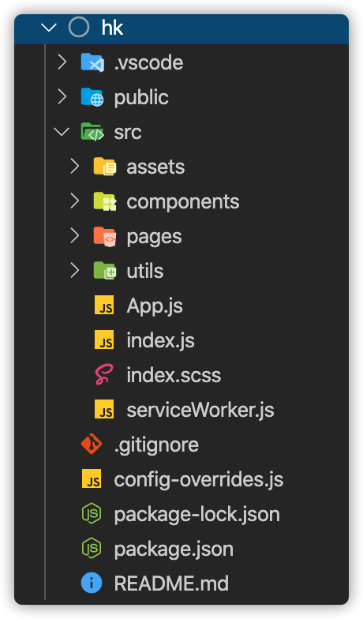
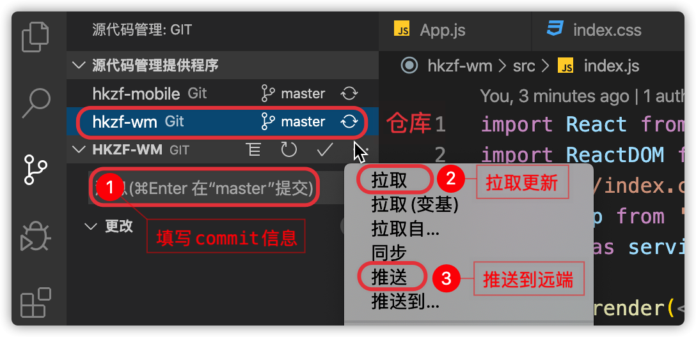

## React-项目

### 准备工作

#### 01-项目团队组成

> 团队组成:产品PM、设计UI、交互UE、前端FE、后端RD 、测试QA 、运维OP(标配)


1. 产品PM：技术+表达+原型图设计+PS+xmind->产出的结果 [**prd**](https://www.jianshu.com/p/1bec658a6f79)(产品需求文档)+原型图

2. 设计UI：用户页面设计师->psd设计稿、sketch设计稿(高保真)

3. 交互UE：用户/视觉体验设计师->交互稿

4. **前端FE**：（切图=》html）

   * **Web**
   1. PCWeb
   2. mobileWeb（h5）
   3. 小程序
   4. 公众号
   5. **混合app**(hybrid) 
     
      1. 基于vue的weex框架
      2. 基于react的RN框架
      3. **安卓/iOS：**app下的H5页面，通过webview(iframe)（控件=》html）嵌入和原生代码通信
      
   6. node.js=〉express/koa(接口)

5. 后端RD：
      1. 接口->**express/KOA**/python/java/php...
      2. 数据库(DBA)

6. 测试QA：自动化测试+测试用例() app.test.js
   1. 开发->自测->提测->反馈->调整->
   2. 最好不要出现 S 级的 bug-> git push->没有权限

7. 运维OP：管理网络和服务器+项目上线+后期维护

扩展阅读：[互联网职位介绍](https://blog.zhengbenwu.com/2017/12/14/%E4%BA%92%E8%81%94%E7%BD%91%E8%A1%8C%E4%B8%9A%E8%81%8C%E4%BD%8D%E7%AE%80%E7%A7%B0%E6%80%BB%E7%BB%93/)   [那个职位更有钱途](https://www.zhihu.com/question/27407196)

项目预览：https://lamphc.github.io/hkzf-mobile/#/home

项目源码：https://github.com/lamphc/hkzf-mobile

#### 02-项目技术栈介绍

`说明`: 基于react技术栈开发的mobileWeb(H5)

`技术栈`:react+脚手架+路由(react-router-dom)+UI组件库(ant-design-mobile)+axios+ 辅助功能组件等

扩展阅读：[web主流技术文档](https://docschina.org/) 


#### 03-项目素材  

> 02-其它资源目录文件说明

1. 素材/fonts->字体文件
2. 素材/images-> 本地图片文件
4. **hkzf_api_v1.zip-> 接口服务器** 
5. hkzf_备用数据库.sql-> 数据库数据文件(统一用这个sql文件，导入表和数据)
6. **hkzf-mobile-> 项目完整代码**
7. **接口使用说明-> 接口如何使用**
8. 准备组件/ 提前准备好的组件(标签+css+js方法)

后端接口线上地址：http://api-haoke-dev.itheima.net


#### 04-本地部署（预览效果）


* 后台

1. 开启MySQL->**phpStudy、XAMPP**等
2. **navicat.exe-**>连接->新建数据库->运行hkzf_备用数据库.sql文件
3. 解压**hkzf_api_v1.zip** -> 修改数据库配置文件 -> **config/mysql.js**->(自己的用户名root密码root)
4. 打开cmd->**npm start**->接口服务器启动(cmd控制台看到'数据库连接成功')
5. 在cmd窗口看到 '数据库连接成功'->启动成功
6. 接口文档->[http://localhost:8080](http://localhost:8080/)  -> 看接口+测试接口

* **前台**

1. 解压**hkzf-mobile**项目代码
2. 进入目录安装依赖
3. cmd->**npm start**启动开发服务器	

`提示`: 发送请求代码没问题,但是没数据->此时检查cmd是否假死->**激活+回车**


#### 05-搭建项目结构-简化模板

1. 来到期望项目所在的目录
2. 打开cmd/命令行工具
3. 脚手架：`npx create-react-app hkzf`
4. `cd hkzf`
5. `npm start`-> 启动开发模式
6. 简化代码

`提示`: 回顾每个文件的职责->知道相关代码的位置


#### 06-设计项目目录结构



1. assets/组件的静态资源->字体图标/图片
2. components/ 全局公共组件（复用）
3. pages/ 业务功能组件, 比如首页/找房/我的等
4. utils/ -> 公共工具方法模块, 比如全局方法、axios和接口的配置等

#### 07-版本控制-git-上传项目到github

> 在github创建一个新项目

* git基本使用

```shell
// 第一次使用
git init 
git add .
git commit -m "注释"
git remote add origin https://github.com/自己的账号/hkzf.git
git push -u origin master

// 后续
git status 
git add .
git commit -m ""
git push

// 检查提交日志(--oneline 一行显示)
git log --oneline
```

`提示` : 每完成独立的业务 就commit push

* 使用vscode自带的git工具提交代码（推荐）



1. 点开左侧工具栏=》源代码管理
2. 选中代码仓库，有更改时，会列出更改文件
3. 使用可视化菜单方式：首先填写commit信息，然后拉取，最后推送

* **创建dev分支作为开发分支**

1. 选中代码仓库，使用=》签出到（切换和创建分支） =〉从当前分支创建dev新分支
2. 点击=》发布分支，同步到远端