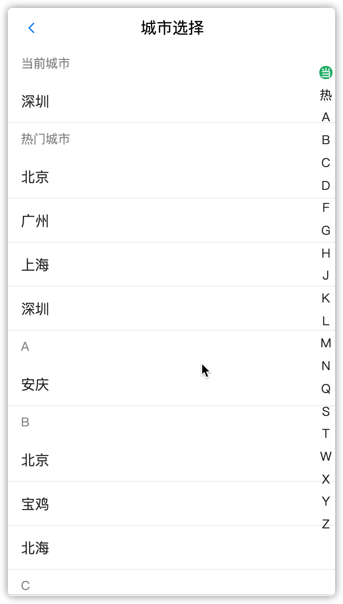

### 城市选择

#### 01-城市选择-请求城市列表数据



`目的`: 发送请求获取城市选择列表所需数据

```js
 getCities = async () => {
    const res = await axios.get(`http://localhost:8080/area/city`, {
      params: {
        level: 1
      }
    })
    console.log(res)
  }

```

`提示`:

    1. 当前城市数据无法直接使用,**需要二次处理**
    2. url参数level为1->表示一级城市


#### 02-城市选择-分析数据结构

> 根据城市列表展示效果分析

1. 后台获取的数据结构=>response

```js
[
  {
    label:'北京',
    value:'AREA|88cff55c-aaa4-e2e0',
    pinyin:'beijing',
    short:'bj'
  },
  ...
]
```

2. 按照城市拼音首字母做归类，**设计的数据结构**=>cityList

```js
let cityList = {
    'a':[{label:'安庆',short:'aq'},.....],
    'b':[{label:'北京',short:'bj'},{label:'宝鸡',short:'bj'},...],
    'c':[{label:'长沙',short:'cs'},{label:'成都',short:'cd'}....]
    ...
} 
```

3. 根据拼音首字母获取=》以该字母开头的城市列表

* 列表渲染**需要的是数组**

```js
// 获取所有城市的拼音首字母，放到数组里=》Object.keys(obj)
let cityIndex = ['a','b','c',......]
// 以该字母开头的城市列表
cityIndex.map((item)=>{
  // 以该字母开头的城市列表
  console.log(cityList[item])
})                 
```


`提示`

1. 实际开发中=>接口需要二次处理->让后台人员改
2. express中间层服务转换数据


#### 03-城市选择-设计和处理数据结构

> 处理后台返回的城市列表数据

`步骤：`

1. 创建formatCities方法
2. 定义变量
   * 按拼音首字母归类的城市数据=〉cityList = {}
   * 所有城市首字母数据=》cityIndex=[]
3. 遍历后台返回的数据（利用=》**对象的属性不能相同的特点**）
4. 通过Object.keys(cityList)获取**所有城市首字母数组**

```js
  // 格式化城市列表数据
  formatCities = (data) => {
    let cityList = {}, cityIndex;
    data.forEach((item) => {
      // 截取首字母
      let first = item.short.slice(0, 1);
      // 判断对象中是否存在某个属性
      if (!(first in cityList)) {
        cityList[first] = [item]
      } else {
        cityList[first].push(item)
      }
    })
    cityIndex = Object.keys(cityList).sort()
    console.log('formated:', cityList, cityIndex);
    return {
      cityIndex,
      cityList
    }
  }

 // 获取城市列表所需数据
  getCityData = async () => {
    const res = await axios.get(`http://localhost:8080/area/city`, {
      params: {
        level: 1
      }
    })
    // console.log(res.data.body)
    const { cityIndex, cityList } = this.formatCities(res.data.body)
    console.log(cityList, cityIndex)
  }
```

#### 04-城市选择-请求-热门城市

`目的`:发送请求获取热门城市

1. 通过接口获取热门城市数据
2. 放入到设计的数据结构（`cityList`和`cityIndex`）中

```js
 // 获取城市列表所需数据
  getCityData = async () => {
    const res = await axios.get(`http://localhost:8080/area/city`, {
      params: {
        level: 1
      }
    })

    // a-z的城市
    const { cityIndex, cityList } = this.formatCities(res.data.body)
    // 热门城市
    const res2 = await axios.get(`http://localhost:8080/area/hot`)
    // console.log(res2.data.body)
    cityIndex.unshift('hot')
    cityList['hot'] = res2.data.body

    console.log(cityList, cityIndex)
  }
```

#### 05-城市选择-定位当前城市-抽取模块

`目的` : 多个组件都要使用定位当前城市的业务,所以将该功能进行封装

1. 新建模块`utils/index.js`（定义所有全局共用的工具方法）
2. 定义=》`getCurrCity`公共方法，它返回一个Promise对象

> 业务流程

1. 如果没有本地数据->利用百度地图API获取当前城市->发送请求**获取城市详细信息**->并保存本地数据->Promise返回城市数据
2. 如果有本地数据->直接Promise.resolve(数据)返回

* `utils/index.js`封装

```js
export const getCurrCity = () => {
  const currCity = JSON.parse(window.localStorage.getItem('hkzf_city'))
  if (!currCity) {
    console.log('没有')
    return new Promise(resolve => {
      const myCity = new window.BMap.LocalCity()
      // 异步
      myCity.get(async result => {
        const res = await axios.get(`http://localhost:8080/area/info`, {
          params: {
            name: result.name
          }
        })
        // return res.data.body
        const { label, value } = res.data.body
        localStorage.setItem('hkzf_city', JSON.stringify({ label, value }))

        resolve({ label, value })
      })
    })
  } else {
    console.log('有')
    return Promise.resolve(currCity)
  }
}

```

* 调用

```js
import { getCurrCity } from '../../utils'

getCities = async () => {
    const res = await axios.get(`http://localhost:8080/area/city?level=1`)
    const { cityIndexs, cityList } = this.formatCities(res.data.body)
    // 获取热点城市
    const hotres = await axios.get(`http://localhost:8080/area/hot`)
    cityIndexs.unshift('hot')
    cityList['hot'] = hotres.data.body
    // 获取当前定位城市数据
    const currCity = await getCurrentCity()
    cityIndexs.unshift('#')
    cityList['#'] = [currCity]

  }
```

`注意：`首页=》中使用封装的获取城市方法


#### 扩展-本地存储方法-封装

代码示例：

```js
// 数据持久化
// 当前城市KEY
const CURR_CITY = 'hkzf_city';

export const getLocalData = (key) => {
  return window.localStorage.getItem(key)
}
export const setLocalData = (key, val) => {
  window.localStorage.setItem(key, val)
}
export const removeLocalData = (key) => {
  window.localStorage.removeItem(key)
}
```


#### 06-城市选择-布局-列表组件-基础配置

> 使用非常流行的react列表组件库react-virtualized

`列表` 

1. 数据过多->**必须做缓存**->可视区域内的dom元素->找自带缓存的列表组件->并不是ant-mobile
2. 这里用的是react开发常用的列表集合-> **react-virtualized** (react开发常用列表的集合,比如瀑布流、宫格、列表、表格等)

`步骤`

1. 安装：`npm i  react-virtualized`
2. 导入List组件
3. 提供数据->提供方法-》渲染列表

扩展阅读：[List-开发文档](https://github.com/bvaughn/react-virtualized/blob/master/docs/List.md) 

```js
// 数据
const list = new Array(100)
// 渲染列表项
function rowRenderer({
  key, // Unique key within array of rows
  index, // Index of row within collection
  isScrolling, // The List is currently being scrolled
  isVisible, // This row is visible within the List (eg it is not an overscanned row)
  style // Style object to be applied to row (to position it)
}) {
  return (
    <div key={key} style={style}>
      {index}
    </div>
  )
}
...
// 组件
<List
  width={300}
  height={300}
  rowCount={list.length}
  rowHeight={100}
  rowRenderer={rowRenderer}
/>
```


#### 07-城市选择-布局-列表组件-自适应宽高

> 使用 react-virtualized提供的AutoSizer组件

1. 通过AutoSizer**高阶组件**=》列表自适应宽高
2. 使用ant的NavBar组件，添加导航返回

扩展阅读：[AutoSizer-开发文档](https://github.com/bvaughn/react-virtualized/blob/master/docs/AutoSizer.md) 

```jsx
{/* 导航返回 */}
<NavBar
  mode="dark"
  icon={<Icon type="left" />}
  onLeftClick={() => this.props.history.goBack()}
>
	城市选择
</NavBar>

{/* 列表 */}
<AutoSizer>
  {({ height, width }) => (
    <List
    height={height}
    rowCount={list.length}
    rowHeight={20}
    rowRenderer={rowRenderer}
    width={width}
    />
    )}
</AutoSizer>

// 设置样式
.cityList {
  height: calc(100% - 45px);
}
```


#### 08-城市选择-布局-列表组件-内容

> 使用准备好的结构和样式代码，渲染模版文件

* 设置列表状态数据

```js
  state = {
    cityIndex: [],
    cityList: {}
  }
```

* 每行结构内容

```html
<div key={key} style={style} className="city-item">
  <div className="title">A</div>
  <div className="name">安庆</div>
</div>
```

* 样式

```css
// 城市列表
.city-item {
  background: #fff;
  .title {
      font-size: 14px;
      padding: 10px 15px;
      color: #999;
  }
  .name {
      width: 100%;
      height: 50px;
      padding: 0 15px;
      line-height: 50px;
      border-bottom: 1px solid #eeeeee;
      font-size: 16px;
      color: #333;
      cursor: pointer;
  }
}
```


#### 09-城市选择-布局-列表组件-渲染

> 渲染城市列表

1. 使用处理过的数据`cityIndex, cityList`渲染列表每行的数据
2. 处理当前城市和热门城市的显示和索引字母大写

* 行渲染方法

```js
  // 渲染列表项
  rowRenderer = ({
    key, // Unique key within array of rows
    index, // Index of row within collection
    isScrolling, // The List is currently being scrolled
    isVisible, // This row is visible within the List (eg it is not an overscanned row)
    style, // Style object to be applied to row (to position it)
  }) => {
    const { cityIndex, cityList } = this.state;
    const letter = cityIndex[index];
    return (
      <div key={key} style={style} className="city">
        <div className="title">{this.formatLetter(letter)}</div>
        {
          cityList[letter].map((item) => <div key={item.value} className="name">{item.label}</div>)
        }
      </div>
    );
  }
```

* 格式化城市索引

```js
  // 格式化字母
  formatLetter(letter) {
    switch (letter) {
      case 'hot':
        return '热门城市';
      case '#':
        return '当前城市';
      default:
        return letter.toUpperCase();
    }
  }
```


#### 10-城市选择-布局-列表组件-计算行高

> 需求：已知标题和城市的固定高度，计算行高

1. 根据List组件的rowHeight属性=》传入方法返回的索引值（0-》20）
2. 然后通过cityIndexs[index]，获取**当前行城市拼音首字母**
3. 通过cityList[letter]，获取到当前行城市拼音首字母下的**城市数量**

```js
// 动态获取行高
getRowheight = ({ index }) => {
  const { cityIndex, cityList } = this.state;
  let letter = cityIndex[index];
  // title高度+城市高度*城市个数
  return 36 + 50 * cityList[letter].length
} 
```


#### 扩展：虚拟长列表渲染原理

> 性能优异?

用数组保存所有列表元素的位置，**只渲染可视区内的列表元素**，当可视区滚动时**，根据滚动的offset大小**以及所有列表元素的位置，**计算在可视区应该渲染哪些元素**。

> 实现步骤

1. 首先确定列表所在父元素的大小，父元素的大小决定了可视区的宽和高
   * 父元素一般使用position：relative

2. 确定列表每一个列表元素的宽和高，同时初始的条件下计算好长列表每一个元素相对于父元素的位置，并用一个数组来保存所有列表元素的位置信息
   * 子元素定位一般使用：position：absolute

3. 首次渲染时，只展示相对于父元素可视区内的子列表元素。在滚动时，根据父元素滚动的offset重新计算应该在可视区内的子列表元素。这样保证了无论如何滚动**，真实渲染出的dom节点只有可视区内的列表元素**。

例如：可视区内能展示10个子列表元素，咱们的列表总共有1000个元素。实际上每次滚动，真实渲染出来的dom节点只有10个。


#### 11-城市选择-点击列表-切换城市

`需求`: 北上广深有数据=》切换；点击其它城市提示：该城市暂无房源数据！

```js
const hasData = ['北京', '上海', '广州', '深圳'];
```

1. 在rowRenderer方法中给**每个城市**注册click事件
2. 如果是北上广深，**更新本地存储的当前城市数据**，并返回首页
3. 如果不是，提示无数据

```js
import { NavBar, Icon, Toast } from 'antd-mobile';
import { getCurrCity, setLocalData, CURR_CITY } from '../../utils';
...
// 城市列表点击事件
// 切换城市
changeCity = (city) => {
  const hasData = ['北京', '上海', '广州', '深圳'];
  if (hasData.includes(city.label)) {
    setLocalData(CURR_CITY, JSON.stringify(city));
    this.props.history.goBack()
  } else {
    Toast.info('该城市暂无房源数据！', 2)
  }
}
```


#### 12-城市选择-布局-渲染右侧索引列表（扩展）

> 使用准备好的结构和样式，渲染右侧索引列表

* 结构

```js
render() {
  return (
  ...
    {/* 右侧索引列表 */}
    <ul className="city-index">
       {this.renderCityIndex()}
    </ul>  
    
  )
}
```

* 渲染方法

```js
  // 格式化字母（处理热门城市和当前城市）
  formatLetter(letter, first) {
    switch (letter) {
      case 'hot':
        return first ? '热' : '热门城市';
      case '#':
        return first ? '当' : '当前城市';
      default:
        return letter.toUpperCase();
    }
  } 

// 渲染右侧索引
  renderCityIndex = () => {
    const { cityIndex } = this.state;
    return cityIndex.map((item, index) => {
      return (
        <li
          key={item}
          className="city-index-item"
        >
          <span className={0 === index ? 'index-active' : ''}>
            {this.formatLetter(item, true)}
          </span>
        </li>
      )
    })
  }
```

* 样式

```scss
 // 右侧索引
  .city-index {
    position: absolute;
    display: flex;
    flex-direction: column;
    right: 5px;
    z-index: 1;
    height: 90%;
    box-sizing: border-box;
    padding-top: 20px;
    text-align: center;

    .city-index-item {
      flex: 1;
    }

    .index-active {
      color: #fff;
      background-color: #21b97a;
      border-radius: 100%;
      display: inline-block;
      font-size: 12px;
      width: 15px;
      height: 15px;
      line-height: 15px;
    }
  }
```


#### 13-城市选择-根据索引-定位列表（扩展）

> 实现点击和滚动时，定位列表项位置的功能

1. 实现点击索引=》**定位列表项位置**

思路：**获取List组件实例**，调用实例提供的滚动到指定索引位置方法，进行列表项定位

* 创建ref对象=》React.createRef
* 绑定到List组件上=》ref={this.listRef}
* 获取到组件实例，调用scrollToRow方法

```js
componentDidMount() {
  // 创建ref
  this.listRef = React.createRef();
}
// 绑定ref
<List ref={this.listRef} />

```

```js
...
  // 渲染右侧索引
  renderCityIndex = () => {
    const { cityIndex, activeIndex } = this.state;
    return cityIndex.map((item, index) => {
      return (
        <li
          key={item}
          className="city-index-item"
          onClick={() => {
            console.log(this.listRef);
            // 调用
            this.listRef.current.scrollToRow(index)
          }}
        >
          <span className={activeIndex === index ? 'index-active' : ''}>
            {this.formatLetter(item, true)}
          </span>
        </li>
      )
    })
  }
```

注意：设置scrollToAlignment="start"属性，定位时始终将行与列表顶部对齐


2. 根据列表当前滚动位置=》**高亮索引**

> 提示：利用List列表组件提供的onRowsRendered钩子函数改变索引激活状态

```js
...
// 定义当前激活的索引值
  state = {
    cityIndex: [],
    cityList: {},
    // 当前位置的索引,激活索引样式状态
    activeIndex: 0
  }

...
  // 滚动列表触发(每次重新渲染列表后都会触发)
  onRowsRendered = ({ startIndex }) => {
    if (this.state.activeIndex !== startIndex) {
      console.log(startIndex);
      this.setState({
        activeIndex: startIndex
      })
    }
  }

```


#### 14-城市选择-总结