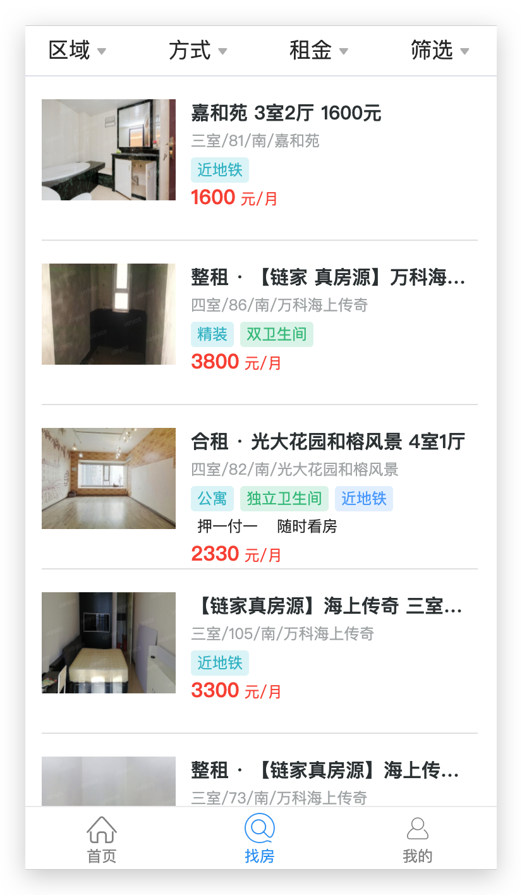
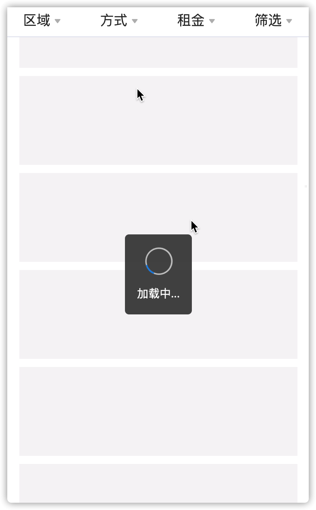

### 列表找房

#### 01-列表找房-准备组件-说明



> 使用`02-其它资源/HouseList和FilterFooter`（模版：结构和样式）

1. HouseList复制和替换House文件夹下组件
2. FilterFooter组件放到全局`components`目录下

> css module局部样式使用说明 

`目的` : **让css有作用域** -> **CSS in JS** （vue=>style=>scope=>局部样式）

1. 文件名  xxx.module.css-> 里面的代码和原来的css写法完全一样
2. 使用 (导入) -> import styles from './xxx.module.css'
3. 使用->  <div className={styles.content}></div>

注：`:global(.className)`的语法，声明一个全局规则（不会被编译成哈希字符串）

> 准备文件说明

目录：`pages/House`

1. index.js->入口
   1. 使用Filter/index.js
2. index.module.css->样式
3. components
   1. Filter
      1. index.js
         1. 使用FilterTitle/index.js
         2. 使用FilterPicker/index.js
         3. 使用FilterMore/index.js
      2. index.module.css
   2. FilterTitle（过滤标题模版）
      1. index.js
      2. index.module.css
   3. FilterPicker（过滤选择器模版）
      1. index.js
         1. 使用antd-mobile里面的PickerView
         2. 使用**公共组件的FilterFooter**/index.js
      2. index.module.css
   4. FilterMore（过滤内容模版）
      1. index.js
         1. 使用**公共组件的FilterFooter**/index.js
      2. index.module.css

2. components/FilterFooter（过滤选择按钮模版）
   1. index.js
   2. index.module.css

#### 02-列表找房-FilterTitle-显示

`目的`: FilterTitle->map遍历title

```js
// 函数组件 
<Flex align="center" className={styles.root}>
      {titleList.map(item => {
        return (
          <Flex.Item key={item.type}>
            {/* 选中类名： selected */}
            <span className={[styles.dropdown].join(' ')}>
              <span>{item.title}</span>
              <i className="iconfont icon-arrow" />
            </span>
          </Flex.Item>
        )
      })}
    </Flex>
```


#### 03-列表找房-FilterTitle-高亮-准备

> 根据type值控制标题高亮状态（父传子）

目录：`Filter/index.js`(父组件)

1. 根据type设置高亮默认对象

```js
// 标题高亮状态(默认值)
const titleSelectedStatus = {
area: false,
mode: false,
price: false,
more: false
}
```

2. 设置高亮状态数据=》titleSelectedStatus

```js
// 设置状态
state = {
  titleSelectedStatus: { ...titleSelectedStatus }
}
...
// 父组件传值控制状态
<FilterTitle titleSelectedStatus={this.state.titleSelectedStatus} />
```

3. 子组件接收数据

目录：`FilterTitle/index.js`

```js
...
const { titleSelectedStatus } = props; 
<Flex.Item key={item.type}>
    {/* 选中类名： selected */}
  <span
      className={[
             styles.dropdown,
             titleSelectedStatus[item.type] ? styles.selected : ''
             ].join(' ')}
               >
                 <span>{item.title}</span>
     <i className="iconfont icon-arrow" />
    </span>
</Flex.Item>
```


#### 04-列表找房-FilterTitle-高亮-点击切换

> 子组件改变父组件的状态（子传父）

`目的`: FilterTitle中点击按钮，改变父组件Filter的数据，**高亮当前title**

`父`

```js
  onTitleClick = type => {
    // console.log(type)
    this.setState({
      titleSelectedStatus: { ...titleSelectedStatus, [type]: true }
    })
  }
```

`子`

```js
<Flex.Item
          key={item.type}
          onClick={() => {
            onTitleClick(item.type)
          }}
        >
```

`注意`

1. ES6 对象的特性 key名可以是变量 ->{[key]:值}
2. 子传父->子组件调用父组件的方法

#### 05-列表找房-FilterPicker-显示

`目的`:点击前三个菜单，显示Picker组件和蒙层

1. 根据点击title时获取的type值，设置当前打开的筛选器状态数据=》openType
2. openType等于区域、方式、租金中任意一个就显示=〉前三个菜单对应的内容

注意：封装判断是否显示前三个菜单的方法

```js
// 定义openType状态数据
// 标题高亮状态
state = {
  titleSelectedStatus: { ...titleSelectedStatus },
  // 打开当前type状态
  openType: ''
}
```

```js
// 判断是否为前三个菜单
isShow = () => {
  const { openType } = this.state;
  return openType === 'area' || openType === 'mode'
  || openType === 'price'
}
```

```js
// 调用
render() {
    return (
      <div className={styles.root}>
        {/* 前三个菜单的遮罩层 */}
        {
          this.isShow() ? <div className={styles.mask} /> : null
        }
        <div className={styles.content}>
          {/* 标题栏 */}
          <FilterTitle titleSelectedStatus={this.state.titleSelectedStatus} onTitleClick={this.onTitleClick} />

          {/* 前三个菜单对应的内容： */}
          {
            this.isShow() ? <FilterPicker /> : null
          }

          {/* 最后一个菜单对应的内容： */}
          {/* <FilterMore /> */}
        </div>
      </div>
    )
  }
```


#### 06-列表找房-FilterPicker-隐藏

`目的`：关闭前三个菜单内容

1. 点击蒙层,关闭Picker 
2. 点击取消,关闭Picker（父传子）
3. 点击确定,关闭Picker（父传子）

`提示`: 通过浏览器react插件查看-》组件树关系

* Filter组件提供方法>传递给FilterPicker组件->在孙子组件FilterFooter中调用方法

```js
  // 关闭前三个筛选器内容和遮罩层
  onCancel = () => {
    this.setState({
      openType: ''
    })
  }

  // 确定选择过滤条件
  onOk = () => {
    this.setState({
      openType: ''
    })
  }
```


#### 07-列表找房-获取筛选条件数据

`目的`: 发送请求获取房屋查询条件(需要提供当前城市id)

`步骤`

1. 调用之前封装的获取城市信息方法=》getCurrCity，获取城市ID

2. 根据城市ID，调用后台接口获取筛选条件数据

3. 把数据=〉存储到组件的成员属性filterData上（默认不展示过滤条件）

```js
// 获取过滤条件
getFilterData = async () => {
    const { value } = await getCurrCity()
    const res = await axios.get(
      `http://localhost:8080/houses/condition?id=AREA%7C88cff55c-aaa4-e2e0`,
      {
        params: {
          id: value
        }
      }
    )
    // 把组件筛选数据存放到组件实例的成员属性上
    this.filterData = res.data.body;
  }
```

```js
  // ------对象地段说明------
  // area 区域
  // characteristic 更多条件
  // floor 楼层
  // rentType 方式(整租||合租|| 不限)
  // oriented 朝向
  // price 价格
  // roomType 户型
  // subway 地铁
```


#### 08-列表找房-提供Picker所需数据

`目的`: 根据点击FilterTitle时=》当前type值和后台数据 =〉当前Picker筛选条件数据(父传子)

`步骤`：

1. 了解ant的PickerView组件用法
2. 分析后台返回的数据(8种)
3. 找出所需要的数据(4种)
4. 将之前FilterPicker组件的使用=》进行封装renderFilterPicker()
5. 利用switch-case给FilterPicker传递对应data数据

部分代码：

`Filter/index.js`

```js
  renderFilterPicker = () => {
    if (openType === 'area' || openType === 'mode' || openType === 'price') {
    // 获取当前筛选类型
    const {
      openType,
    } = this.state
    // 获取筛选条件
    const { area, subway, rentType, price } = this.filterData;
    let data,
    col = 1 // 控制PickerView的列数
      
      switch (openType) {
        case 'area':
          data = [area, subway]
          col = 3
          break
        case 'mode':
          data = rentType
          break
        case 'price':
          data = price
          break
        default:
          break
      }

      return (
        <FilterPicker
          data={data}
          col={col}
          onOk={this.onOk}
          onCancel={this.onCancel}
        />
      )
    } else {
      return null
    }
  }
```

`FilterPicker/index.js`

```js
// 接收数据
const { onCancel, onOk, data, cols } = this.props;
...
<PickerView data={data} value={null} cols={col} />
```

`提示`: PickerView组件中使用了React语法  <> </>  作用等用于 <div></div>,但是它不生成额外的元素。

#### 09-列表找房-获取FilterPicker选中值

`目的`: 筛选器选中选项,获取选中的值

`步骤`:

1. 在FilterPicker组件中，添加状态数据value
2. PickerView 添加onChange事件
3. 点击确定,将picker选中的value传递给父组件

`提示`: 和表单元素的处理方式一样（受控组件）

`Filter/index.js`

```js
// 确定=》获取选中的筛选条件
onOk = (val) => {
  console.log('选中值：', val)
  this.setState({
    openType: ''
  })
}
```

`FilterPicker/index.js`

```js
// 受控组件
<PickerView
  data={data}
  value={this.state.value}
  onChange={(val) => {
    this.setState({
      value: val
    })
  }}
  cols={cols}
/>

  {/* 底部按钮 */}
<FilterFooter
  onCancel={onCancel}
 // 传递数据（子传父） 
  onOk={() => {
    onOk(this.state.value)
  }}
/>
```

`提示`: 

1. 受控组件表单元素 value onChange
2. 子传父->点击确定按钮->把已选数据的value交给父组件


#### 10-列表找房-设置FilterPicker当前选中值

`目的`: 存储筛选器的选中选项,并在下次打开时作为默认值显示

`步骤`：

1. Filter 提供默认选中值数据selectedValues对象，以openType为属性，**存储到实例属性上**(this)

`Filter/index.js`

```js
// 选中数据维护(测试)
const selectedValues = {
  area: ['area', 'null'],
  // area: ['area', 'AREA|69cc5f6d-4f29-a77c', 'AREA|73aa1890-64c7-51d9'],
  mode: ['null'],
  // mode: ['true'],
  price: ['null'],
  // price: ['PRICE|1000'],
  more: []
}
// class组件
...
  componentDidMount() {
    // 初始化：存储到实例属性上
    this.selectedValues = { ...selectedValues };
		...
}
    
onOk = (value) => {
   const { openType } = this.state;
    // 存储当前选中筛选数据
    this.selectedValues[openType] = sel;
    this.setState({
      openType: ''
    })
}    
```

2. 根据openType获取当前类型的选中值value,通过props传递给FilterPicker

```js
 // 给Picker组件提供数据
  renderFilterPicker = () => {
    if (this.isShow()) {
      const { openType } = this.state;
      const { area, subway, rentType, price } = this.filterData;
      let data, cols = 1;
      switch (openType) {
        case 'area':
          data = [area, subway];
          cols = 3
          break;
        case 'mode':
          data = rentType;
          cols = 1
          break;
        case 'price':
          data = price;
          cols = 1
          break;
      }    
      return <FilterPicker 
      data={data} 
      // 传递当前选中的筛选数据
      value={this.selectedValues[openType]} 
      cols={cols} 
      onCancel={this.onCancel} 
      onOk={this.onOk} />

    }
  }
```


3. 在FilterPicker组件中,将**value状态值设置为当前传入的value值**(注意代码位置)


`FilterPicker/index.js`

```js
 state = {
    // 设置当前选中的值
    value: this.props.value
}
```


#### 11-FilterPicker当前选中值-调优-key的用法

`解释：` 

1. 当点击确定（或者取消）按钮->关闭Picker组件->销毁组件->再次点击title->**重新new组件实例**->constructor 重新执行

2. 当直接切换不同的title时**,之前的默认选中值失效（只记录了第一次的值）->这种情况不是重新创建组件->**constructor 只执行第一次

`解决方案：`

* 生命周期钩子：`componentWillReceiveProps`（即将弃用）

* **推荐**：给组件添加key={openType} ->回顾 : **key作用是什么? && diff算法**(key发生变化，会销毁组件，重新渲染)

```js
  return (
        <FilterPicker
          key={openType}
          value={this.selectedValues[openType]}
          data={data}
          col={col}
          onCancel={this.onCancel}
          onOk={this.onOk}
        />
      )
```

`测试：` 

点击title切换时，之前选择的条件依然可以正常显示。

#### 12-列表找房-FilterTitle-高亮-已选择

`目的`: 点击确定或者取消时**高亮已选择条件**的title

`步骤`

1. 遍历筛选器所有选中的值=>**selectedValues对象**

2. 分别判断每个筛选器类型对应的筛选条件中有没有选中值

3. 如果有,保持高亮

4. 如果没有,去掉高亮

`Filter/index.js`

* 处理高亮方法

```js
  // 处理筛选器选中后有无条件的高亮状态
  handlerSel = () => {
    // 创建新的标题选中状态对象
    const newTitleSelectedStatus = {};
    // 遍历selectedValues
    Object.keys(this.selectedValues).forEach((key) => {
      // 获取当前过滤器选中值=》数组
      let cur = this.selectedValues[key];
      // 判断数组的值
      if (
        (key === 'area') && (cur[1] !==
          "null" || cur[0] === 'subway')) {
        newTitleSelectedStatus[key] = true
      } else if (key === 'mode' && cur[0] !== "null") {
        newTitleSelectedStatus[key] = true
      } else if (key === 'price' && cur[0] !== "null") {
        newTitleSelectedStatus[key] = true
      } 
      // 后续处理
      else if (key === 'more' && cur.length !== 0) {
        // 更多选择项 FilterMore 组件情况
        newTitleSelectedStatus[key] = true
      } else {
        newTitleSelectedStatus[key] = false
      }
    })
    return newTitleSelectedStatus
  } 
```

* 调用

```js
// 确定后
  // 确定选择过滤条件
  onOk = (sel) => {
    const { openType } = this.state;
    console.log('sel:', openType, sel);
    // 存储到实例属性上
    this.selectedValues[openType] = sel;
    // 处理高亮
    let newSel = this.handlerSel();
    console.log('s', newSel);
    this.setState({
      openType: '',
      titleSelectedStatus: newSel
    })
  }
  
// 取消后
  // 关闭前三个筛选器内容和遮罩层
  onCancel = () => {
    // 处理高亮
    let newSel = this.handlerSel();
    this.setState({
      openType: '',
      titleSelectedStatus: newSel
    })
  }  
```


#### 13-列表找房-FilterMore-显示和隐藏

`目的`: 点击第四个条件筛选按钮,显示FilterMore组件；并传递筛选器数据

`步骤`:

1. 创建renderFilterMore方法
2. 根据openType控制显示和隐藏
3. 传递组件需要的数据、确定和取消事件方法

`Filter/index.js`

```js
renderFilterMore = () => {
  const {
    openType
  } = this.state;
  if (openType === 'more') {
    console.log(this.filterData);
    // 传递筛选器数据
    const { roomType, oriented, floor, characteristic } = this.filterData;
    const data = { roomType, oriented, floor, characteristic }
    return <FilterMore
        data={data}
        value={this.selectedValues[openType]}
        onOk={this.onOk}
        onCancel={this.onCancel}
      />
  }
    return null
  }
```


#### 14-列表找房-FilterMore-渲染页面内容

`目的`: 根据传入的筛选器数据，渲染页面内容

```js
export default class FilterMore extends Component {
  // 渲染标签
  renderFilters(data) {
    // 高亮类名： styles.tagActive
    return (
      data.map((item) => <span key={item.value} className={[styles.tag, styles.tagActive].join(' ')}>{item.label}</span>)
    )
  }

  render() {
    const {
      data: { roomType, oriented, floor, characteristic },
      onCancel
    } = this.props
    console.log(roomType, oriented, floor, characteristic)

    return (
      <div className={styles.root}>
        {/* 遮罩层 */}
        <div
          className={styles.mask}
          onClick={() => {
            onCancel()
          }}
        />

        {/* 条件内容 */}
        <div className={styles.tags}>
          <dl className={styles.dl}>
            <dt className={styles.dt}>户型</dt>
            <dd className={styles.dd}>{this.renderFilters(roomType)}</dd>

            <dt className={styles.dt}>朝向</dt>
            <dd className={styles.dd}>{this.renderFilters(oriented)}</dd>

            <dt className={styles.dt}>楼层</dt>
            <dd className={styles.dd}>{this.renderFilters(floor)}</dd>

            <dt className={styles.dt}>房屋亮点</dt>
            <dd className={styles.dd}>{this.renderFilters(characteristic)}</dd>
          </dl>
        </div>
        {/* 底部按钮 */}
        <FilterFooter onOk={onOk} onCancel={onCancel} className={styles.footer} />
      </div>
    )
  }
}
```


#### 15-列表找房-FilterMore-获取选中值

`目的：`点击某一项加入选中数据中，再次点击即取消选择，从选中数据中删除

`步骤：`

1. 创建选中的状态数据=>[]
2. 添加点击事件处理选中数据=>indexOf判断是否存在
   * 不存在，添加
   * 存在，删除（splice）
```js
  // 获取选中数据
  handlerSel = (val) => {
    const { selected } = this.state;
    const newSelected = [...selected]
    // 没有该值，新增（高亮显示）
    let index = newSelected.indexOf(val);
    if (index < 0) {
      newSelected.push(val)
    } else {
      //有，删除（取消高亮）
      newSelected.splice(index, 1)
    }
    console.log('选中：', newSelected);
    this.setState({
      selected: newSelected
    })
  }
  
  // 添加事件
  // 渲染标签
  renderFilters(data) {
    // 高亮类名： styles.tagActive
    return data.map((item) => <span onClick={() => this.handlerSel(item.value)} key={item.value} className={[styles.tag, styles.tagActive].join(' ')}>{item.label}</span>)
  }
```


3. 点击确定时把选中的数据传递给父组件


#### 16-列表找房-FilterMore-高亮显示和设置选中数据

`目的：`处理选中高亮和默认选中值；处理more筛选器=>已有选择条件=》高亮（12小节）

`步骤：`

1. 模版中判断当前项的value是否在选中状态数据中（includes)

```js
  // 渲染标签
  renderFilters(data) {
    // 高亮类名： styles.tagActive
    // return (
    //   <span className={[styles.tag, styles.tagActive].join(' ')}>东北</span>
    // )
    const { selected } = this.state;
    return data.map((item) => <span
      onClick={() => this.handlerSel(item.value)}
      key={item.value}
      className={[styles.tag, selected.includes(item.value) ? styles.tagActive : ''].join(' ')}>
      {item.label}
    </span>)
  }
```

2. 再次点击显示之前选中的值

* 设置选中状态数据：默认接受props传入
* 父组件传入上一次确定时保存的选中数据

```js
// 设置选中值状态
state = {
  selected: this.props.value
}
```


#### 17-列表找房-设计和组装筛选条件数据

`目的`: 筛选器中点击确定按钮,获取所有筛选条件=》随后获取房屋列表时使用

> 获取房屋列表=>后台需要的筛选条件数据说明

| 筛选字段           | 说明                                  |
| ------------------ | ------------------------------------- |
| **area 或 subway** | 取选中的value信息（根据数组长度处理） |
| **mode=>rentType** | 数组中第一位的值                      |
| **price**          | 数组中第一位的值                      |
| **more**           | 多个值使用' , '分割                   |

`步骤：`

1. 根据后端接口需要，创建handlerFilters()

```js
   // 处理后台需要的筛选条件数据
  handlerFilters = (selectedValues) => {
    // 筛选条件数据
    const { area, mode, price, more } = selectedValues;
    // 组装数据
    const filters = {};
    // area | subway
    let areaKey = area[0], aval;
    if (area.length === 2) {
      aval = area[1]
    } else {
      if (area[2] !== 'null') {
        aval = area[2]
      } else {
        aval = area[1]
      }
    }
    filters[areaKey] = aval;
    // mode
    filters.rentType = mode[0]
    // price
    filters.price = price[0]
    // more
    filters.more = more.join(',')
    console.log('filters:', filters);
    return filters
  }
```

2. 点击确定的时候，调用
```js
// 确定选择过滤条件
  onOk = (sel) => {
		...
    this.setState({
      openType: '',
      titleSelectedStatus: newSel
    }, () => {
      // 处理筛选条件数据
      this.handlerFilters(this.selectedValues)
    })
  }
```


#### 18-列表找房-获取房屋列表数据

`目的：` 上一步已经设计完毕filters数据,现在按照filters内容发送请求获取房屋列表数据

`步骤：`

1. 将设计好的filters数据传递给HouseList组件
2. HouseList组件中提供方法onFilter,接收filters组件筛选条件数据，保存到this中
3. 获取当前城市ID，保存到this中
4. 创建方法getHouseList获取房屋列表数
5. 将城市ID、筛选条件数据与分页数据合并后，作为接口的参数，发送请求

目录：`House/index.js`

```js
// 设置回调，接收数据  
  onFilter = async (filters) => {
    console.log('找房列表获取filter数据：', filters);
    this.filters = filters;
    this.getHouseList()
  }
  
  async componentDidMount() {
    // 获取城市ID
    const { value } = await getCurrCity();
    this.cityId = value;
    
  }
  
// 获取房屋列表
  getHouseList = async () => {
    const res = await axios.get(`http://localhost:8080/houses`, {
      params: {
        cityId: this.cityId,
        ...this.filters,
        start: 1,
        end: 20
      }
    })
  }
```


#### 19-列表找房-首屏房屋数据

`目的`: 在进入页面时,获取房屋列表数据

```js
  async componentDidMount() {
    // 获取城市ID
    const { value } = await getCurrCity();
    this.cityId = value;
    // 默认加载一次
    this.getHouseList()
  }
```

注意：无法滚动列表，关闭浏览器窗口，重新打开即可

#### 20-列表找房-列表简单展示

`目的`: 使用之前用过的List组件=》简单展示找房列表

`步骤：`

1. 使用`react-virtualized`的List组件
2. 设置房屋列表状态数据=> list
3. 使用后端返回的数据设置=> list

```js
  state = {
    // 房屋列表数据
    list:[]
  } 

// 渲染列表项方法
  renderHouseItem = ({
    key, // Unique key within array of rows
    index, // Index of row within collection
    isScrolling, // The List is currently being scrolled
    isVisible, // This row is visible within the List (eg it is not an overscanned row)
    style, // Style object to be applied to row (to position it)
  }) => {

    return (
      <div key={key} style={style} className="">
        {index}
      </div>
    );
  }
  
    {/* 列表 */}
  <AutoSizer>
    {({ height, width }) => (
      <List
      height={height}
      rowCount={this.state.list.length}
      rowHeight={130}
      rowRenderer={this.renderHouseItem}
      width={width}
    />
   )}
    </AutoSizer>
```


#### 21-列表找房-渲染列表内容

`目的`: 将每行的内容进行渲染，使用 HouseItem组件

`提示`: 使用=》02-其它资源中/HoustItem，放入`src/components`

`步骤：`

1. 使用单独方法渲染列表=〉renderHouseList()
2. 给列表添加className={styles.houseList}样式，控制留白
3. 根据HoustItem组件高度，设置List组件的`rowHeight=130`

```js
  // 渲染列表项
  renderHouseItem = ({
    key, // Unique key within array of rows
    index, // Index of row within collection
    isScrolling, // The List is currently being scrolled
    isVisible, // This row is visible within the List (eg it is not an overscanned row)
    style, // Style object to be applied to row (to position it)
  }) => {
    const { list } = this.state
    const item = list[index]
    // 处理图片地址
    item.src = BASEURL + item.houseImg;
    // console.log(item);
    return <HouseItem {...item} key={key} style={style} />
  }
    
  // 渲染列表
  renderHouseList = () => {
    const { list } = this.state;
    return (
      <AutoSizer>
        {({ height, width }) => (
          <List
            className={styles.houseList}
            width={width}
            height={height}
            rowCount={list.length}
            rowHeight={130}
            rowRenderer={this.rowRenderer}
          />
        )}
      </AutoSizer>
    )
  }    
```


#### 22-列表找房-InfiniteLoader-加载更多

`目的`: 目前只能加载前20条数据,使用react-virtualized库的[InfiniteLoader](https://github.com/bvaughn/react-virtualized/blob/master/docs/InfiniteLoader.md)组件让List可以在滑动时加载更多数据

`步骤：`

1. 设置状态数据count，修改List组件rowCount属性=》count
2. 分析=〉InfiniteLoader组件用法
   * 分析和处理isRowLoaded和loadMoreRows方法

```js
 // 判断列表中的每一行是否加载完成
  isRowLoaded = ({ index }) => {
    // console.log('rowloaded:', index);
    const { list } = this.state;
    return !!list[index];
  }

  // 下拉加载更多时触发：加载下一页数据
  loadMoreRows = ({ startIndex, stopIndex }) => {
    console.log('loadmore', startIndex, stopIndex);
    // 调用封装的api(返回一个Promise对象)
    return getHouseByFilters(this.cityId, this.filters, startIndex, stopIndex).then((res) => {
      console.log('loadmore:', res);
      // 刷新视图
      this.setState({
        list: [...this.state.list, ...res.data.list]
      }, () => console.log(this.state.list.length))
    });
  }

  // 渲染列表
  renderHouseList = () => {
    return (
      <InfiniteLoader
        isRowLoaded={this.isRowLoaded}
        loadMoreRows={this.loadMoreRows}
        // 远程数据总条数
        rowCount={this.state.count}
      >
        {({ onRowsRendered, registerChild }) => (
          <AutoSizer>
            {({ height, width }) => (
              <List
                className={styles.houseList}
                height={height}
                rowCount={this.state.count}
                rowHeight={130}
                rowRenderer={this.renderHouseItem}
                onRowsRendered={onRowsRendered}
                ref={registerChild}
                width={width}
              />
            )}
          </AutoSizer>
        )}
      </InfiniteLoader>
    )
  }
```

注意：

1. 下拉加载过快时出现错误处理：列表渲染方法renderHouseItem中增加判断

```js
  const { list } = this.state
    const item = list[index]
    // 处理暂时没有加载到数据情况
    if (!item) return null;
```

2. 两个逻辑非使用

一般处理null，undefined和空值判断。

#### 23-列表找房-加载更多-无数据提示

`目的`: 由于下拉加载需要调用后台接口获取数据，所以有一定的时间延迟；数据item可能为undefined,需要进行处理,显示预先加载的空内容(骨架屏)



`步骤：`

1. 使用准备好的结构和样式=》`styles.loading`

```js
 if (!item) {
      return (
        <div style={style} key={key}>
          <p className={styles.loading}></p>
        </div>
      )
}
```


#### 24-列表找房-列表加载提示

`目的：` 列表找房加载时，提供数据有无提示

`步骤：`

1. 列表加载提示-> 
   * 有数据->**提示数据条数**+渲染List列表

   * 无数据->渲染**NoHouse**组件 (`02-其它资源`中准备好的`NoHouse`组件，放入`src/components`)

```js
  // 加载房屋列表数据
  getHouseList = async () => {
    let res = await getHouseByFilters(this.cityId, this.filters, 1, 20);
    const { list, count } = res.data;
    if (count !== 0) {
      Toast.success(`获取到${count}条房源信息`,1)
    }
    this.setState({
      list,
      count
    })
  }

  // 渲染列表
  renderHouseList = () => {
    const { count } = this.state;
    // 没有数据渲染NoHouse组件
    return count === 0 ? <NoHouse>没有更多房源,请换个搜索条件吧</NoHouse> : (
      <InfiniteLoader
        isRowLoaded={this.isRowLoaded}
        loadMoreRows={this.loadMoreRows}
        // 远程数据总条数
        rowCount={this.state.count}
      >
        {({ onRowsRendered, registerChild }) => (
          <AutoSizer>
            {({ height, width }) => (
              <List
                className={styles.houseList}
                height={height}
                rowCount={this.state.count}
                rowHeight={130}
                rowRenderer={this.renderHouseItem}
                onRowsRendered={onRowsRendered}
                ref={registerChild}
                width={width}
              />
            )}
          </AutoSizer>
        )}
      </InfiniteLoader>
    )
  }
```


#### 25-列表找房-条件筛选-样式调整

`目的`: 当Picker显示后,房源信息布局错乱(位置移动)

`步骤：`

1. `Filter/index.module.css` 

```js
.root {   
    position: relative;
    z-index: 3;
  	// 设置高度40px
    height: 40px;
}

.content {
    // 相对改绝对
    position: absolute;
    width: 100%;
    z-index: 3;
    background-color: #fff;
}
```


#### 26-列表找房-房源详情-展示

`目的`: 在找房列表页面中,点击每条房源,进入到房源详情页面

`提示：` `02-其它资源/HouseDetail和/HousePackage`，放入到`src/components`

`步骤：`

1. HouseDetail 房源详情和HousePackage的房屋配套组件(冰箱,电视,沙发等)分析
2. 在根组件中配置详情的路由
3. 在House组件中，给HouseItem组件添加`onClick`属性，传递点击事件

`App.js`

```js
// 配置路由
 <Route path="/detail" component={HouseDetail} />

```


#### 27-列表找房-房源详情-配套组件说明

`目的`: 把房屋详情中的HousePackage组件进行解释

`HousePackage`组件说明：

```js
// 所有配套的内容数据
const HOUSE_PACKAGE = [...]

// 组件用法=》list是当前房屋存在的配套内容
<HousePackage list={supporting} />
// 从所有配套内容数组中，过滤存在的内容； 然后遍历有的配套，添加图标类名显示
 const data = HOUSE_PACKAGE.filter(v => list.includes(v.name))

```


#### 28-列表找房-房源详情-路由参数

`目的：` 点击房源列表的某条消息HouseItem,通过路由参数,展示房屋详情

`步骤：`

1. 配置动态路由

2. HouseItem 中=》获取history

3. 获取houseCode（房源ID）

   * match.params 

   * push方法传递参数->push({pathname:'path', data:123})=>location.state

4. 点击NavBar左侧按钮返回房源列表

`扩展：`

1. 某组件需要使用history->该组件不是路由匹配的->props={}？

   * 在使用该组件时，通过prop传值=》将history进行传递

   * 利用路由的HOC高阶组件**withRouter(Component)**为该组件增加路由数据

`注意：`

> HOC相当于工厂->加工某组件->为该组件添加零件


#### 29-总结