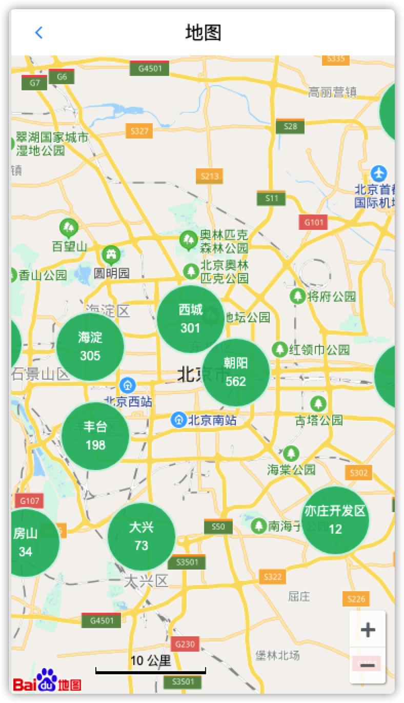
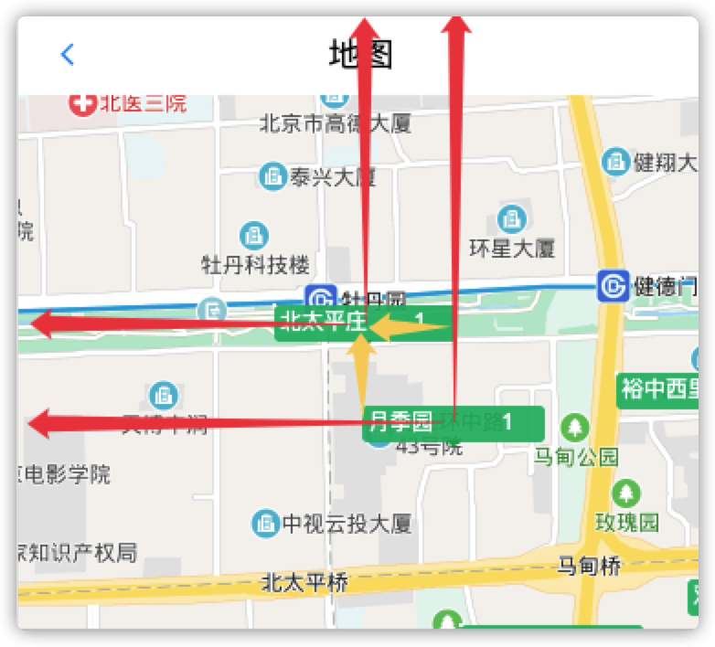

### 地图找房

#### 01-地图找房-业务分析

> 查看效果，分析功能



**功能说明**

根据不同的缩放级别，绘制不同类型的地图覆盖物显示对应房源信息

* 三个zoom级别

1. 行政区的范围：>=10 && <12
2. 镇的范围：\>=12  && <14
3. 小区的范围：\>=14 && <16

* 事件

> 默认显示行政区覆盖物和房源数据

1. 点击行政区覆盖物（圆形）=》显示镇范围的覆盖物和房源数据
2. 点击镇范围覆盖物（圆形）=》显示小区范围的覆盖物和房源数据
3. 点击小区范围覆盖物（方形）=> 地图下方显示该小区下的房源列表数据

**业务流程**

1. 单击覆盖物后：
   1. 设置缩放级别，放大地图
   2. 获取数据，渲染下一级覆盖物（重复第一步）。 
2. 区、镇：单击事件中，清除现有覆盖物，创建新的覆盖物。 
3. 小区：不清除覆盖物。移动地图，展示该小区下面的房源列表。 

**注意：** 一共三层(区(顺义)->镇/街道(马坡)->小区(某某小区)) ->加载点击小区下的房源列表

#### 02-初始化地图

`目的：`初始化地图和添加控件

`步骤：`

1. 获取当前定位城市。 
2. 使用**百度地图的地址解析功能**解析当前城市坐标。 
3. 调用 centerAndZoom() 方法在地图中展示当前城市，并**设置缩放级别为11**。 
4. 在地图中添加**比例尺和平移缩放控件**。 

```js
  // 初始化地图
  initMap = async () => {
    const { BMap } = window;
    // 创建地图实例 
    let map = new BMap.Map("container");
    // 获取定位城市
    const { value, lable } = await getCurrCity();
    // 创建地址解析器实例     
    let myGeo = new BMap.Geocoder();
    // 将地址解析结果显示在地图上，并调整地图视野    
    myGeo.getPoint(null, function (point) {
      if (point) {
        // 初始化地图，设置中心点坐标和地图级别  
        map.centerAndZoom(point, 11);
        // 添加控件
        map.addControl(new BMap.NavigationControl());
        map.addControl(new BMap.ScaleControl());
        // map.addOverlay(new BMap.Marker(point));
      }
    },
      lable);
  }
```

注意：

1. 设置样式=》减去顶部导航的高度=〉calc(100% - 45px)
2. 地址解析=》第一个参数传null(不能传空值) => 地图居中显示

#### 03-创建文本覆盖物

`目的：`使用BMap.Label类，创建简单文本覆盖物

`分析文档：`[覆盖物api](http://lbsyun.baidu.com/cms/jsapi/reference/jsapi_reference_3_0.html#a3b9)  [覆盖物的demo](http://lbsyun.baidu.com/jsdemo.htm#c1_14)

```js
// initMap()
// 文本覆盖物
const opts = {
  position: point, // 指定文本标注所在的地理位置
  offset: new BMap.Size(0, 0) //设置文本偏移量
}
const label = new BMap.Label(
  '欢迎使用百度地图，这是一个简单的文本标注哦~',
  opts
) // 创建文本标注对象
label.setStyle({
  color: 'red',
  fontSize: '12px',
  height: '20px',
  lineHeight: '20px',
  fontFamily: '微软雅黑'
})
map.addOverlay(label)
```

#### 04-创建html覆盖物

`目的：`使用准备的结构和样式，显示html覆盖物

`步骤：`

1. 使用BMap.Label类的setContent方法，创建房源覆盖物html结构
2. 为覆盖物添加点击事件


* 准备样式： index.module.css

```css
/* 覆盖物样式 */
.bubble {
    width: 70px;
    height: 70px;
    line-height: 1;
    display: inline-block;
    position: absolute;
    border-radius: 100%;
    background: rgba(12, 181, 106, 0.9);
    color: #fff;
    border: 2px solid rgba(255, 255, 255, 0.8);
    text-align: center;
    cursor: pointer;
    /* 覆盖物以点为中心 */
    left: -35px;
    top: -35px;
}

.bubbleName {
    padding: 18px 0 6px 0;
}
```

* 准备覆盖物html结构

```jsx
<div class="${styles.bubble}">
  <p class="${styles.bubbleName}">浦东新区</p>
  <p>388套</p>
</div>
```

`代码：`

```js
// initMap()
const opts = {
    position: point,    // 指定文本标注所在的地理位置
    offset: new BMap.Size(0, 0)    //设置文本偏移量
  }
  const label = new BMap.Label(null, opts);  // 创建文本标注对象
  label.setContent(
    `
  <div class="${styles.bubble}">
    <p class="${styles.bubbleName}">浦东新区</p>
    <p>388套</p>
  </div>
  `
  )
  // 去除默认样式
  label.setStyle({
    border: 'none'
  });
  // 添加点击事件
  label.addEventListener('click', () => {
    console.log('覆盖物被点击了', point)
  })
  map.addOverlay(label);
```

注意：引入css module局部样式，如何处理成全局的样式=》:global(样式名)

#### 05-绘制当前城市-所有区的房源覆盖物

`目的：`根据后台数据（/area/map接口），绘制第一层覆盖物

`步骤：`

1. 获取**地图找房的房源数据**。
2. 遍历数据=》**获取当前坐标，创建覆盖物**。 
3. 给覆盖物添加单击事件。 
4. 在单击事件中，**设置当前下一层的坐标和缩放级别**为13。 
5. 调用 clearOverlays() 方法清除=》上一层覆盖物。


`代码：`

```js
// initMap()
    // 将地址解析结果显示在地图上，并调整地图视野    
    myGeo.getPoint(lable, async (point) => {
      if (point) {
        // 初始化地图，设置中心点坐标和地图级别  
        map.centerAndZoom(point, 11);
        // 添加控件
        map.addControl(new BMap.NavigationControl());
        map.addControl(new BMap.ScaleControl());
        // map.addOverlay(new BMap.Marker(point));
        // ----开始-----
        // 初始化区覆盖物
        // 调用后台接口
        let { status, data } = await getMapHouses(value);
        if (status === 200) {
          data.forEach((item) => {
            const {
              coord: { longitude, latitude },
              label: areaName,
              count,
              value
            } = item
            // 转换地理位置坐标
            const ipoint = new BMap.Point(longitude, latitude);
            // 绘制覆盖物
            const opts = {
              position: ipoint,    // 指定文本标注所在的地理位置
              offset: new BMap.Size(0, 0)    //设置文本偏移量
            }
            const label = new BMap.Label(null, opts);  // 创建文本标注对象
            label.setContent(
              `
              <div class="${styles.bubble}">
              <p class="${styles.bubbleName}">${areaName}</p>
              <p>${count}</p>
              </div>
              `
            )
            // 去除默认样式
            label.setStyle({
              border: 'none'
            });
            // 添加点击事件
            label.addEventListener('click', () => {
              // 设置显示下一区域的位置和缩放级别
              map.centerAndZoom(ipoint, 13);
              // 清除第一层覆盖物
              // map.clearOverlays();
              setTimeout(() => map.clearOverlays());
            })
            map.addOverlay(label);
          })
        }
      }
    },
      lable);
```

注意：clearOverlays()方法不可以放在主线程中!

报错原因分析：

1. 百度地图绑定了touchend

2. 先执行了click事件，把元素删除了
3. 在执行touchend就找不到元素了

#### 06-渲染覆盖物-renderOverlays() 封装

`目的：`把调用接口获取数据，渲染对应层级的覆盖物方法做封装

`步骤：`

1. 创建renderOverlays()（注意把**地图相关的API挂载到this上**）
2. 接收区域 id 参数，根据该参数获取房源数据，渲染覆盖物

* initMap()

```js
 // 初始化地图
  initMap = async () => {
    // 挂载到实例上
    this.BMap = window.BMap;
    // 创建地图实例 
    this.map = new this.BMap.Map("container");
    // 获取定位城市
    const { value, lable } = await getCurrCity();
    // 创建地址解析器实例     
    let myGeo = new this.BMap.Geocoder();
    // 将地址解析结果显示在地图上，并调整地图视野    
    myGeo.getPoint(lable, async (point) => {
      if (point) {
        // 初始化地图，设置中心点坐标和地图级别  
        this.map.centerAndZoom(point, 11);
        // 添加控件
        this.map.addControl(new this.BMap.NavigationControl());
        this.map.addControl(new this.BMap.ScaleControl());
        
        // map.addOverlay(new BMap.Marker(point));
        this.renderOverlays(value)
      }
    },
      lable);
  }
```

* renderOverlays()

```js
 // 根据区域渲染覆盖物
  renderOverlays = async (id) => {
    // 初始化区覆盖物
    let { status, data } = await getMapHouses(id);
    // =========根据当前地图缩放级别=》获取覆盖物形状和下一层缩放级别========
    const { type, nextLevel } = this.getTypeAndZoom();//下一节实现
    if (status === 200) {
      data.forEach((item) => {
        const {
          coord: { longitude, latitude },
          label: areaName,
          count,
          value
        } = item
        // 转换地理位置坐标
        const ipoint = new this.BMap.Point(longitude, latitude);
        // 绘制覆盖物
        const opts = {
          position: ipoint,    // 指定文本标注所在的地理位置
          offset: new this.BMap.Size(0, 0)    //设置文本偏移量
        }
        const label = new this.BMap.Label(null, opts);  // 创建文本标注对象
        label.setContent(
          `
          <div class="${styles.bubble}">
            <p class="${styles.bubbleName}">${areaName}</p>
            <p>${count}</p>
          </div>
          `
        )
        // 去除默认样式
        label.setStyle({
          border: 'none'
        });
        // 添加点击事件
        label.addEventListener('click', () => {
          // 设置显示下一区域的位置和缩放级别
          this.map.centerAndZoom(ipoint, 13);
          console.log(value);
          // 点击=》调用下一层
          this.renderOverlays(value)
          // 清除第一层覆盖物
          // map.clearOverlays();
          setTimeout(() => this.map.clearOverlays());
        })
        this.map.addOverlay(label);
      })
    }
  }


```


#### 07-getTypeAndZoom() 封装

`目的：`根据当前地图缩放级别，设置当前层=》覆盖物类别和下一层缩放级别

`步骤：`

1. 创建getTypeAndZoom()
2. 使用Map实例的getZoom方法获取缩放级别
3. 根据缩放级别条件，返回对应覆盖物形状和下一个缩放级别的值

`代码：`

```js
// 计算要绘制的覆盖物类型和下一个缩放级别
// 区   -> 11 ，范围：>=10 <12
// 镇   -> 13 ，范围：>=12 <14
// 小区 -> 15 ，范围：>=14 <16

  // 提供地图缩放级别和覆盖物类型
  getTypeAndZoom = () => {
    let type, nextLevel
    // 获取小区缩放级别

    const currZoom = this.map.getZoom() // 项目中默认缩放级别为：11
    if (currZoom >= 10 && currZoom < 12) {
      // 区
      type = 'circle'
      nextLevel = 13
    } else if (currZoom >= 12 && currZoom < 14) {
      // 镇
      type = 'circle'
      nextLevel = 15
    } else if (currZoom >= 14 && currZoom < 16) {
      // 小区
      type = 'rect'
    }
    return {
      type,
      nextLevel
    }
  }
```


#### 08-根据type渲染覆盖物-封装

`目的：`根据type类型，渲染不同形状的覆盖物

1. type是`rect`：小区
2. type是`circle`：区和镇

`步骤：`

1. 创建createOverlays()，接收type, nextLevel, item
2. 根据type渲染对应形状的覆盖物

`代码：`

```js
// 获取指定区域下的房源数据以及地图缩放级别和覆盖物类型
  renderOverlays = async id => {
    const { data } = await getMapHouses(id);
    const { type, nextLevel } = this.getTypeAndZoom()
    console.log(type, nextLevel, data)
    data.body.forEach(item => {
      // ======== 根据覆盖物类型和房源数据创建覆盖物 ========
      this.createOverlays(type, nextLevel, item)
    })
  }
  // 根据当前覆盖物的类型,决定调用哪个方法创建覆盖物
  createOverlays = (type, nextLevel, item) => {
    if (type === 'rect') {
      // 小区
      this.createRect()
    } else {
      // 区和镇
      this.createCircle()
    }
  }
```

#### 09-渲染覆盖物-createCircle()封装

`目的：`处理区和镇的情况

`步骤：`

* createOverlays()

```js
createOverlays = (type, nextLevel, item) => {
    if (type === 'circle') {
      // 区和镇（前两层）
      this.createCircle(nextLevel, item)
    } else {
      this.createRect(item)
    }
  }  
```


* createCircle()

1. 传入当前item数据
2. 点击某个覆盖物时，调用=》**renderOverlays(id)重新获取数据渲染下一层的覆盖物**

```js
// ========创建圆形覆盖物========
  // 处理区和镇的情况
  createCircle = (nextLevel, item) => {
    // 解构当前项数据
    const { coord: { longitude, latitude }, label: areaName, value, count } = item;
		// 处理坐标点
    let ipoint = new this.BMap.Point(longitude, latitude)
    // 绘制覆盖物
    const opts = {
      position: ipoint,    // 指定文本标注所在的地理位置
      offset: new this.BMap.Size(0, 0)    //设置文本偏移量
    }
    const label = new this.BMap.Label(null, opts);  // 创建文本标注对象
    label.setContent(
      `
    <div class="${styles.bubble}">
      <p class="${styles.bubbleName}">${areaName}</p>
      <p>${count}</p>
    </div>
     `
    )
    // 去除默认样式
    label.setStyle({
      border: 'none'
    });
    // 添加点击事件
    label.addEventListener('click', () => {
      // 设置显示下一区域的位置和缩放级别
      this.map.centerAndZoom(ipoint, nextLevel);
      this.renderOverlays(value);
      // 清除第一层覆盖物
      // map.clearOverlays();
      setTimeout(() => this.map.clearOverlays());
    })
    this.map.addOverlay(label);
  }
```

#### 10-渲染覆盖物-createRect()的封装

`目的：`处理小区情况

`步骤：`

1. 使用准备好的css代码

```css
/* 小区的覆盖物样式 */
.rect {
    height: 20px;
    line-height: 19px;
    width: 100px;
    padding: 0 3px;
    border-radius: 3px;
    position: absolute;
    background: rgba(12, 181, 106, 0.9);
    cursor: pointer;
    white-space: nowrap;
    color:#fff;
}

.arrow {
    display: block;
    width: 0;
    height: 0;
    margin: 0 auto;
    border: 4px solid transparent;
    border-top-width: 4px;
    border-top-color: #00a75b;
}

.housename {
    display: inline-block;
    width: 70px;
    overflow: hidden;
    text-overflow: ellipsis;
    white-space: nowrap;
    vertical-align: middle;
}

.housenum {
    display: inline-block;
    width: 20px;
}
```

2. 完善createRect()，使用准备的html结构（覆盖物设置偏移(-50, -28)）

```jsx
<div class="${styles.rect}">
  <span class="${styles.housename}">小区</span>
  <span class="${styles.housenum}">100</span>
  <i class="${styles.arrow}"></i>
</div>
```


`代码：`

```js
  // 处理小区情况
  createRect = (ipoint, areaName, count, value) => {
    // 绘制覆盖物
    const opts = {
      position: ipoint,    // 指定文本标注所在的地理位置
      offset: new this.BMap.Size(-50, -28)    //设置文本偏移量
    }
    const label = new this.BMap.Label(null, opts);  // 创建文本标注对象
    label.setContent(`
      <div class="${styles.rect}">
        <span class="${styles.housename}">${areaName}</span>
        <span class="${styles.housenum}">${count}</span>
        <i class="${styles.arrow}"></i>
      </div>
     `
    )
    // 去除默认样式
    label.setStyle({
      border: 'none'
    });
    // 添加点击事件
    label.addEventListener('click', () => {
      console.log('点击小区', value)
    })
    this.map.addOverlay(label);
  }
```


#### 11-获取点击小区的房源数据

`目的：`调用接口获取小区=》房源列表数据

`步骤：`

1. 创建handlerHouseList()，调用之前封装的根据过滤条件获取房源列表接口方法，传入小区的ID 
2. 在单击事件中，获取该小区的房源列表数据。 

`代码：`

* createRect()

```js
// createRect()
// 添加点击事件
label.addEventListener('click', () => {
  console.log('点击小区', value);
  this.handlerHouseList(value)
})

// 获取小区下的房源列表
// 调用之前定义的根据过滤条件获取房源列表方法，传入cityId
handlerHouseList = async (value) => {
  let res = await getHouseByFilters(value);
  console.log(res)
}
```


#### 12-点击小区覆盖物-渲染房源列表

`目的：`使用全局组件HouseItem，渲染当前点击小区的房源列表

`步骤：`

1. 使用准备好的样式和方法渲染列表（导入HouseItem组件）
2. 定义状态数据list:[]和isShowList:Boolean
3. 点击小区覆盖物后，获取该小区下的房源列表数据
4. 修改状态数据，显示和渲染列表

`准备css样式`

```css
/* 房源列表样式： */
.houseList {
  position: fixed;
  bottom: 0;
  left: 0;
  width: 100%;
  height: 330px;
  transition: all 1s;
  transform: translate3d(0, 330px, 0);
  background: #fff;
}

.show {
  transform: translate3d(0, 0, 0);
}

.titleWrap {
  position: relative;
  width: 100%;
  background: #c0c0c2;
  border-top: 1px solid #c8c8c8;
}

.listTitle {
  display: inline-block;
  padding-left: 10px;
  line-height: 43px;
  font-size: 16px;
  color: #1e1e1e;
  vertical-align: middle;
  margin:0
}

.titleMore {
  float: right;
  padding-right: 15px;
  line-height: 43px;
  font-size: 13px;
  color: #1e1e1e;
  vertical-align: middle;
}

.titleMore:visited {
  text-decoration: none;
}

/* 房屋列表项样式 */
.houseItems {
  padding: 0 10px;
  overflow-y: auto;
  height: 100%;
  padding-bottom: 45px;
}
```

`渲染列表js`

```html
  // 渲染小区下房屋列表
  renderHouseList = () => {
    return (
      <div
        className={[
          styles.houseList,
          this.state.isShowList ? styles.show : ''
        ].join(' ')}
      >
        <div className={styles.titleWrap}>
          <h1 className={styles.listTitle}>房屋列表</h1>
          <a className={styles.titleMore} href="/home/house">
            更多房源
    </a>
        </div>

        <div className={styles.houseItems}>
          {/* 房屋结构 */}
          {
            this.state.list.map(item => (
              <HouseItem
                onClick={() => this.props.history.push(`/detail/${item.houseCode}`)}
                key={item.houseCode}
                src={BASE_URL + item.houseImg}
                title={item.title}
                desc={item.desc}
                tags={item.tags}
                price={item.price}
              />
            ))
          }
        </div>
      </div>
    )
  }
```

#### 13-点击小区覆盖物-移动地图到当前小区位置

`目的：`使用地图提供的panBy方法，当点击某个小区的覆盖物=》移动地图到当前小区位置

`步骤：`

1. 创建moveToCenter()
2. 计算中心点坐标（排除列表高度）
3. 通过点击事件获取=》当前点击元素的坐标
4. 获取=》中心点坐标到当前点击元素坐标到偏移位置（减法）
   * `（x1 - x2, y1 - y2）`
5. 调用panBy方法移动到该位置



**说明**：坐标系从左上角开始：(0,0)

```js
  // 移动地图到当前小区位置
  moveToCenter = (e) => {
    let { clientX, clientY } = e.changedTouches[0];
    // 列表以上=》中心点
    console.log(window.innerWidth / 2, (window.innerHeight - 330) / 2, clientX, clientY)
    // 计算偏移值
    const x = window.innerWidth / 2 - clientX, y = (window.innerHeight - 330) / 2 - clientY;
    console.log(x, y)
    this.map.panBy(x, y)
  }
```


#### 14-地图移动时隐藏房源列表

`目的：`给地图实例map添加movestart事件

`步骤：`

1. 给地图实例添加=》movestart事件
2. 地图移动时=〉如果列表显示=》就隐藏

* initMap()

```js
// initMap()
this.map.addEventListener('movestart',()=>{
  if(this.state.isShowList) {
    this.setState({
      isShowList:false
    })
  }
}) 
```


#### 15-总结


