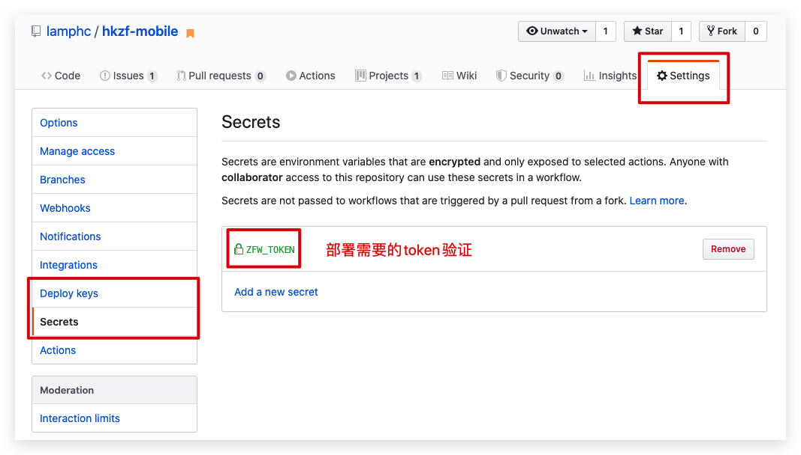

### 项目调试和部署

#### 01-项目调试 

> 推荐使用vscode自带的debugger功能

使用环境：

1. 安装Debugger for Chrome插件
2. 在项目根目录添加debugger配置文件

* 在调试窗口选中项目添加配置文件

```jso
{
  // 使用 IntelliSense 了解相关属性。 
  // 悬停以查看现有属性的描述。
  // 欲了解更多信息，请访问: https://go.microsoft.com/fwlink/?linkid=830387
  "version": "0.2.0",
  "configurations": [
    {
      "type": "chrome", // debugger类型：浏览器
      "request": "launch", // debugger时候请求启动调试程序的方式
      "name": "hkzf", // 调试程序的名字
      "url": "http://localhost:3000", // 已经启动调式程序的域名+端口号
      "webRoot": "${workspaceFolder}" // 调试程序（项目）的位置
    }
  ]
}
```

* 修改已经启动的服务端口号，进行调试

#### 02-项目部署

* 本地部署

1. 进入项目目录

2. 打开cmd

3. 执行：`npm run build`

4. 产生一个build文件夹

   * 使用Jenkins、FTP等工具
   * 部署到线上服务器的根目录中

5. 启动本地服务器测试生产代码

   * 安装：`npm i -g serve`

   * 测试：`serve -s ./build`

* 线上部署（git-pages）

> 使用GitHub Pages

1. 安装：gh-pages

```bash
$ npm install gh-pages --save-dev
```

2. 修改package.json 文件，添加：homepage字段，同时在scripts中加上部署脚本

```json
{
"name": "hkzf-mobile",
// 部署页面地址	
"homepage": "https://github账号.github.io/github的项目名称/",
"scripts": {
  // 部署脚本
  "predeploy": "npm run build",
  "deploy": "gh-pages -d build"   
} 
     "homepage":"https://monhly.gitee.io/reactdexuexi/",
```

3. 部署项目生产代码到GitHub page上

```bash
$ npm run deploy
```

说明：初次发布后，GitHub项目上会多一个gh-pages的分支，里边存放的是生产代码。	

注意：

1. 处理百度地图API的https引入问题
2. 接口基础路径也要改成https方式（https://api-haoke-web.itheima.net）支持跨域访问
3. 修改路由为hash模式

#### 扩展-打包-懒加载

扩展阅读：[代码分割](https://zh-hans.reactjs.org/docs/code-splitting.html)

目的：路由的按需加载=》做代码拆分，只加载当前页面的资源

1. 使用webpack处理
2. 使用React.lazy()做组件的动态导入
   * Suspense组件做懒加载组件的父组件，提示（loading）


#### 扩展-持续集成-CI

> 持续集成工具：持续拉取代码、测试、打包、发布上线（服务器=》用户使用）

##### Git actions

> github提供的CI工具

1. 仓库设置里边加入一对密钥：生成新的ssh key



2. 加入git actions流程：编写流程 =》事件：每次提交新代码（push）=> 自动部署git pages

源码地址：https://github.com/lamphc/hkzf-mobile