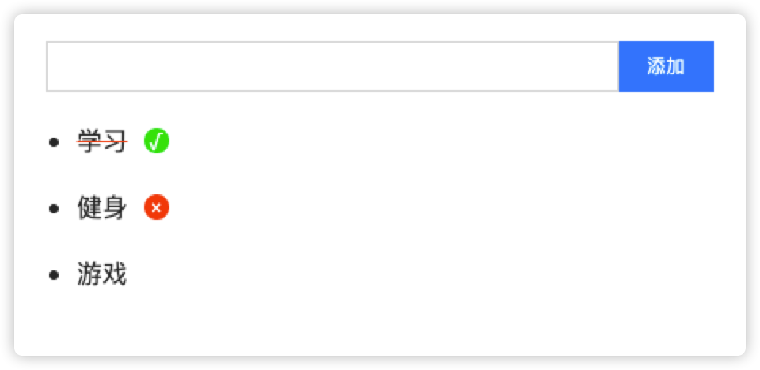

## react-扩展-redux-todo案例

####  01-案例-演示-准备



`技术栈`

1. react->视图->组件(JSX)
2. redux->状态管理（数据共享）->reducer + action + store
3. react-redux->简化使用redux->Provider&connect

`业务`

1. 列表展示
2. 添加任务
3. 删除任务
4. 切换任务状态

`准备`

1. 搭建react项目

2. 安装redux和react-redux插件

   `npm i react-redux redux`

3. 开始编写redux代码，src下新建redux目录，放置action和reducer
   * actionTypes/index.js

   * actions/index.js

   * reducer/index.js

创建完，拿到reducer创建store

预览效果：https://lamphc.github.io/react-redux-todo

#### 02-案例-创建actionTypes

```js
// actionTypes
/**
 * 1. 添加
 * 2. 删除
 * 3. 切换任务状态
 */

const ADD_TODO = 'ADD_TODO'
const DELETE_TODO = 'DELETE_TODO'
const TOGGLE_TODO = 'TOGGLE_TODO'

export { ADD_TODO, DELETE_TODO, TOGGLE_TODO }

```


#### 03-案例-创建action

```js
// action

import { ADD_TODO, DELETE_TODO, TOGGLE_TODO } from '../actionTypes'

// addTodo
// deleteTodo
// toggleTodo
// 一个任务的数据结构->
// [{id:1,task:'学习',done:true}
// {id:2,task:'健身',done:false}
// {id:3,task:'游戏',done:false}]

const addTodo = task => ({ type: ADD_TODO, task })
const deleteTodo = id => ({ type: DELETE_TODO, id })
const toggleTodo = id => ({ type: TOGGLE_TODO, id })

export { addTodo, deleteTodo, toggleTodo }

```


#### 04-案例-创建reducer-添加任务

```js
// reducer
import * as actionTypes from '../actionTypes'

const reducer = (state = [], action) => {
  switch (action.type) {
    case actionTypes.ADD_TODO:
      console.log('add')
      // 生成唯一ID
      let id = Math.random().toString(16).slice(2);
      const newTodo = [...state, { id, task: action.task, done: false }]
      return newTodo
    default:
      return state;
  }
}

export default reducer;
```

注意：可以在入口文件index.js中创建store测试

#### 05-案例-创建reducer-删除任务和切换状态

```js
// 删除任务
case actionTypes.DELETE_TODO:
    return state.filter(item => item.id !== action.id)
// 切换状态
case actionTypes.TOGGLE_TODO:
      return state.map(item => {
        const tempItem = { ...item }
        if (tempItem.id === action.id) {
          // 取反
          tempItem.done = !tempItem.done
        }
        return tempItem
})
```

`测试` =>index.js

```js

import { createStore } from 'redux'
import reducer from './reducer'
import { addTodo, deleteTodo, toggleTodo } from './actions'

const store = createStore(reducer)
store.subscribe(() => {
  console.log(store.getState())
})
store.dispatch(addTodo('吃饭'))
store.dispatch(addTodo('睡觉'))
store.dispatch(deleteTodo(1))
store.dispatch(toggleTodo(2))

```


#### 06-案例-组件结构和样式

> todo-list的界面

`App.js`

```html
<div className="todoList">
  {/* 添加任务 */}
  <div>
    <input type="text" /><button className="btn">添加</button>
  </div>
  {/* 任务列表 */}
  <ul>
    <li>
      <span>学习</span>
      <button className="btn-status del">&times;</button>
    </li>
    <li>
      <span className='done'>睡觉</span>
      <button className='btn-status ok'>&radic;</button>
      <button className="btn-status del">&times;</button>
    </li>
  </ul>
</div>
```

```css
*{
  margin:0;
  padding:0
}
html,body {
  color:#333;
  user-select: none;
}
/* 添加任务 */
.todoList {
  width:620px;
  padding:20px;
  margin:0 auto;
}
.todoList input {
  width:360px;
  height:30px;
  padding:0 10px;
  border:1px solid #ddd;
  outline: none;
}
/* 按钮 */
.todoList .btn {
  width:60px;
  height:32px;
  line-height: 32px;
  background: #008bfd;
  color:#fff;
  outline: none;
  border:none;
  cursor: pointer;
  vertical-align: middle;
}

.todoList .btn-status {
  width: 16px;
  height: 16px;
  border-radius: 100%;
  line-height: 16px;
  font-size: 12px;
  text-align: center;
  color: #fff;
  outline: none;
  border:none;
  cursor: pointer;
  position: relative;
  bottom: 2px;
display: none;
}

.todoList .btn-status.del {
  background: #fd5000;
}
/* 完成显示 */
.todoList .btn-status.ok {
  margin-right: 10px;
  display: inline-block;
  background: #38e205;
}

/* 任务列表 */
.todoList ul {
  margin-left:20px;
}
.todoList li {
  margin:20px 0;
}

.todoList li:hover .btn-status{
  display: inline-block;
}

.todoList li span {
  margin-right:10px
}

.todoList p {
  margin:20px 0;
  text-align: left;
  font-size: 16px;
}

/* 完成 */
.todoList li .done {
  text-decoration: line-through solid rgb(255, 81, 0);
}
```


#### 07-案例-组件拆分

> 拆分添加和列表组件

1. src下
   * pages/AddTodo

   * pages/TodoList

`App.js`

```js
import React from 'react';
import AddTodo from './pages/AddTodo';
import TodoList from './pages/TodoList';

function App() {
  return (
    <div className="todoList">
      {/* 添加任务 */}
      <AddTodo />
      {/* 任务列表 */}
      <TodoList />
    </div>
  );
}

export default App;
```


#### 08-案例-配置store和Provider

> 配置store，提供给react

`redux/index.js`

```js

import { createStore } from 'redux'

import reducer from './reducer'

const configStore = () => {
  const store = createStore(reducer)
  store.subscribe(() => {
    console.log(store.getState())
  })
  return store
}

export default configStore

```

`index.js`

```js
import React from 'react'
import ReactDOM from 'react-dom'
import App from './App'
import * as serviceWorker from './serviceWorker'
// react-redux
import { Provider } from 'react-redux'
import configStore from './redux';

const store = configStore()
ReactDOM.render(
  <Provider store={store}>
    <App />
  </Provider>,
  document.getElementById('root')
)

serviceWorker.unregister()
```


#### 09-案例-列表展示

> 渲染todo-list，连接store，使用初始化数据测试

```js
import React from 'react';
import { connect } from 'react-redux';

function TodoList(props) {
  const { list } = props;
  if (list.length === 0) {
    return <p>暂无任务</p>
  }
  return (
    <ul>
      {
        list.map((item) => <li key={item.id}>
          <span className={item.done ? 'done' : ''}>{item.task}</span>
          {item.done ? <button className='btn-status ok'>&radic;</button> : null}
          <button className="btn-status del">&times;</button>
        </li>)
      }

    </ul>
  );
}


const mapStateToProps = (state, ownProps) => {
  // console.log(state, ownProps);
  return {
    list: state
  }
}
export default connect(mapStateToProps)(TodoList);
```


#### 10-案例-添加任务

>  添加任务=>事件绑定、获取输入、非空校验和重置输入

```js
import React from 'react';

// 连接store
import { connect } from 'react-redux';
import { addTodo } from '../../redux/actions';

function AddTodo(props) {
  const { dispatch } = props;

  // 获取元素对象
  let inputDom;
  // 添加任务
  let addTask = () => {
    let task = inputDom.value.trim();
    // 处理空值
    if (!task) return;
    dispatch(addTodo(task));
    // 清空输入
    inputDom.value = ''
  }

  return (
    <div>
      <input ref={(e) => inputDom = e} type="text" />
      <button onClick={addTask} className="btn">添加</button>
    </div>
  );
}
const mapStateToProps = (state) => ({})
export default connect(mapStateToProps)(AddTodo);
```


#### 11-案例-切换任务

> 点击任务标题切换任务状态

```js
const { list, dispatch } = props;
// 切换任务状态
const handlerToggle = (id) => {
  dispatch(toggleTodo(id))
}
```


#### 12-案例-删除任务

> 点击红色按钮，删除任务

```js
const { list, dispatch } = props;
// 删除任务
const delTask = (id) => {
  dispatch(deleteTodo(id))
}
```


#### 13-案例-展示组件和容器组件-介绍

> 拆分UI和DATA

1. 展示组件：描述html和css（TodoList、AddTodo，不要和redux进行关联）
2. 容器组件：描述数据获取、状态更新，和redux直接关联

扩展阅读：[redux文档](https://www.redux.org.cn/docs/basics/UsageWithReact.html) 

#### 14-案例-展示组件和容器组件-拆分

> 使用容器组件=》管理redux数据

1. 新建containers目录
2. 建立对应视图组件的目录，使用connect()创建容器组件

例子：

* 容器组件

`containers/TodoList/index.js`

```js
/**
 * 任务列表容器
 */
import { connect } from 'react-redux'
import TodoList from '../../pages/TodoList'
import { toggleTodo, deleteTodo } from '../../redux/actions'

const mapStateToProps = (state) => {
  return {
    list: state
  }
}

const mapDispatchToProps = (dispatch) => {
  return {
    toggle: (id) => {
      dispatch(toggleTodo)
    },
    del: (id) => {
      dispatch(deleteTodo(id))
    }
  }
}


export default connect(
  mapStateToProps,
  mapDispatchToProps
)(TodoList)
```

展示组件：

`pages/TodoList/index.js`

```js
import React from 'react';

function TodoList(props) {
  const { list, toggle, del } = props;
  // 切换任务状态
  const handlerToggle = (id) => {
    toggle(id)
  }
  // 删除任务
  const delTask = (id) => {
    del(id)
  }
  if (list.length === 0) {
    return <p>暂无任务</p>
  }
  return (
    <ul>
      {
        list.map((item) => <li key={item.id}><span onClick={() => handlerToggle(item.id)} className={item.done ? 'done' : ''}>{item.task}</span>
          <button onClick={() => delTask(item.id)} className="btn-del">x</button></li>)
      }

    </ul>
  );
}


export default TodoList;
```

**目的:** 让视图层V和数据层M完全分离，解耦。=》可扩展性、可维护性 =>不用redux,可以轻松应对


#### 15 总结

1. 新建react项目

2. 安装redux、react-redux（Provider,connect()）

3. 完成todos案例效果
   1. 列表渲染
   2. 添加
   3. 删除
   4. 切换状态
   
4. 在展示组件从props获取store的数据和修改数据的方法，渲染界面

5. 在容器组件连接store和维护状态

   

线上源码：https://github.com/lamphc/react-redux-todo