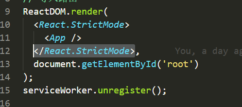
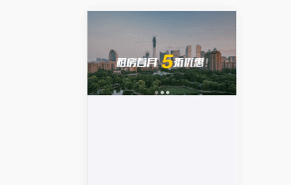
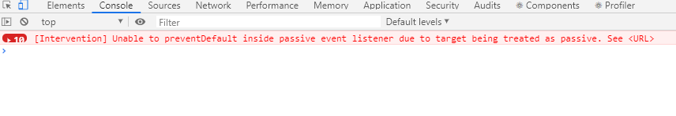
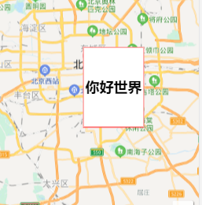
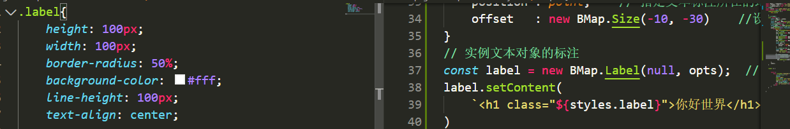
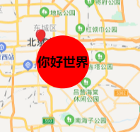
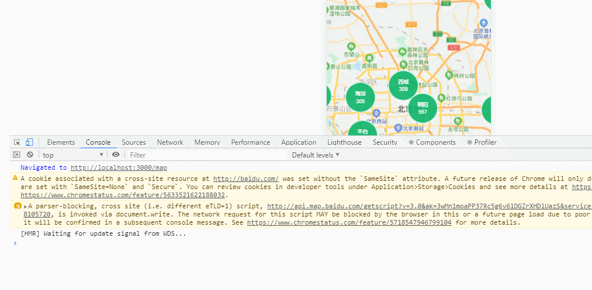
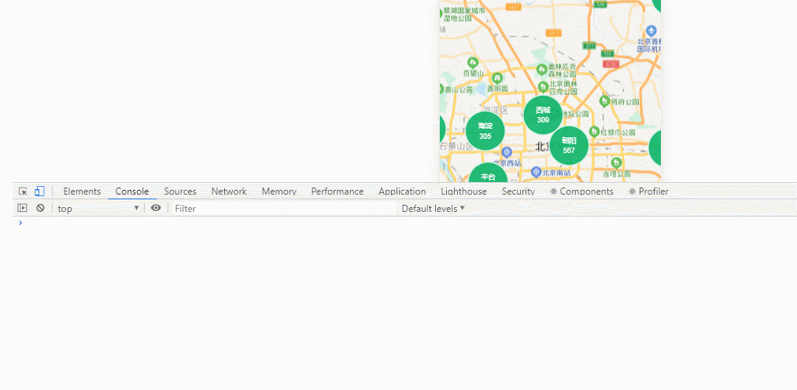

# react项目问题汇总:

## ant-design中引入走马灯组件出现报错:


原因:严格模式先组件的问题:

解决:在index.js中去除严格模式



去除react.strictMode元素即可

## 轮播图无法实现自动播放

刷新页面后无进行自动的播放



原因分析:数据的请求是异步的,当我们修改轮播图的数据的时候,此时轮播图的数据还没有请求到,所以自动播放的功能就失效了

解决:当请求完数据以后,对轮播图组件的数据状态进行修改:

```js
 // 修改数据
           this.setState({
               data:[...body]
           }, () => {
                //    修改自动播放的状态:
                   this.setState({
                       statusLunBo:true
                   })
           })
```

此时轮播图的状态:


## 触碰轮播图系统进行报错:

当我们修复好问题以后,此时滑动轮播图的时候,出现了一个错误:



面向百度以后,此时发现原因是这样的

```txt
由于浏览器必须要在执行事件处理函数之后，才能知道有没有掉用过 preventDefault() ，这就导致了浏览器不能及时响应滚动，略有延迟。
 
所以为了让页面滚动的效果如丝般顺滑，从 chrome56 开始，在 window、document 和 body 上注册的 touchstart 和 touchmove 事件处理函数，会默认为是 passive: true。浏览器忽略 preventDefault() 就可以第一时间滚动了。
 
举例：
wnidow.addEventListener('touchmove', func) 效果和下面一句一样
wnidow.addEventListener('touchmove', func, { passive: true })
```

解决方法:

解决方法有以下两种：
1. 注册处理函数时，用如下方式，明确声明为不是被动的

window.addEventListener('touchmove', func, { passive: false })
2. 为容器设置css属性touch-action，去除滑动时默认现象产生，但不影响事件触发

```css
  touch-action: pan-y;
```

## 使用calc计算的时候出现的问题:

calc在使用的时候等式两边一定要出现空格,否则会无效

```css
.listCitys{
    height:calc(100% - 45px);
}
/*上面的样式是可行的*/
.listCitys{
    height:calc(100%-45px);
}
/*下面的样式是无效的*/

```

## 实现子传父的时候出现错误

react 报错Warning: Cannot update during an existing state transition (such as within `render`). Render

原因:

报错的原因 是由于引用的子组件 通过props进行传递了 传递的过程中实际上已经处于render阶段了 ，在这个阶段 如果你再改变这个state值的话 就会包这个错 

尽量不要在render的时候通过点击改变state

解决方法:

在 React 组件中，每个方法的上下文都会指向该组件的实例，即自动绑定 this 为当前组件。 而且 React 还会对这种引用进行缓存，以达到 CPU 和内存的优化。在使用 ES6 classes 或者纯 函数时，这种自动绑定就不复存在了，我们需要手动实现 this 的绑定。

1.bind方法进行绑定，这个方法可以帮助我们绑定事件处理器内的 this ，并可以向事件处理器中传 递参数，如下图清晰明了：


bind方法绑定

2.箭头函数进行绑定，箭头函数不仅是函数的“语法糖”，它还自动绑定了定义此函数作用域的 this， 因此我们不需要再对它使用 bind 方法如下图：


箭头函数1

也可以是下面这种：

class App extends Component {

 handleClick(e) {    console.log(e);   } 

render() {return <button onClick={() => this.handleClick()}>Test</button>}

}

3.构造器内声明。在组件的构造器内完成了 this 的绑定，这种绑定方式的好处在于仅需要 进行一次绑定，而不需要每次调用事件监听器时去执行绑定操作


构造器内声明

以上就是三种事件绑定的方式，我个人觉得第三种比较好，只需要进行一次绑定操作优化性能。

最后附上渲染报错的例子如下：

***Warning: Cannot update during an existing state transition (such as within `render`). Render methods should be a pure function of props and state
\***

出现如上的提示说明事件并没有绑定到this实例上，按上述三种方式解决即可！！！

## 使用百度地图解决自带的边框和背景颜色

使用百度地图进行内容自定义的时候出现了百度自定义的边框和背景颜色





此时我的样式设置中并没有边框和背景色的设置

解决:

使用百度地图提供的api setStyle进行解决:

```js
   label.setStyle({
            backgroundColor: 'transparent',
            border:'none'
   });
```

效果如下:



## 使用百度地图对遮罩层进行事件绑定,清除遮罩层出现错误

```js
  // 设置遮罩层的点击事件
                        label.addEventListener('click',  (e)=> {
 console.log('你好');
   // 点击是销毁遮罩层
                            map.clearOverlays();                          map.centerAndZoom(point, 13);
                        })
      // 添加遮罩层
  map.addOverlay(label);
```



分析原因:

clearOverlays()方法不可以放在主线程中!

报错原因分析：

1. 百度地图绑定了touchend

2. 先执行了click事件，把元素删除了
3. 在执行touchend就找不到元素了

解决:将清除遮罩层设置为异步的函数

```js
 // 设置遮罩层的点击事件
                        label.addEventListener('click',  (e)=> {
                        console.log('你好');
                            // 点击是销毁遮罩层
 let id=setTimeout(() => {
       //   清除定时器
       clearTimeout(id)
         // 清除遮罩层
                            map.clearOverlays();
                          })
                            map.centerAndZoom(point, 13);
                        })
    // 添加遮罩层
      map.addOverlay(label);
```



## 点击租房实现路由的高亮显示

在从首页跳转到找房网页的时候,此时下方的路由没有实现高亮显示


解决方法：在组件渲染的时候对路由进行监听

组件销毁的时候,销毁路由的监听

```js
//组件创建前
componentDidMount () {
   this.unshift = this.props.history.listen((location) => {
      if (location.pathname !== this.state.selectedTab) {
        this.setState({
          selectedTab: location.pathname,
        });
      }

    })

  }
 // 组件销毁
 componentWillUnmount() {
    // 销毁路由监听事件
    this.unlisten()
  }
```

