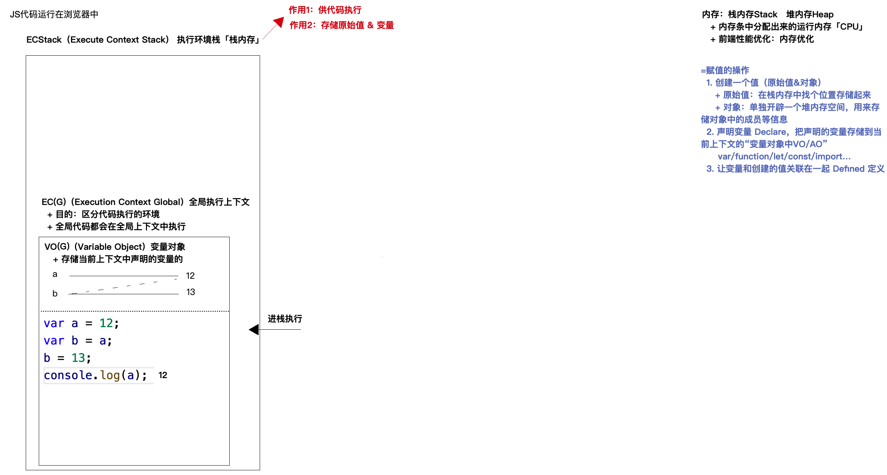
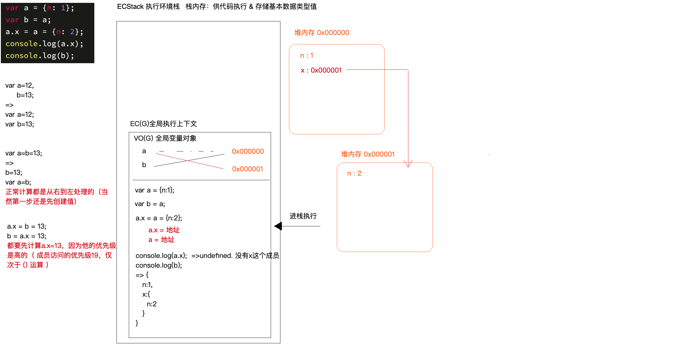

## 第一讲：JS 中的堆栈内存及函数底层处理机制

## js 的数据类型

### 基本的数据类型(值类型和原始的类型)

- number
- string
- boolean
- null
- undefined
- symbol

  - static Symbol
  - Symbol.prototype

- bigint

使用 typeof 进行基础类型的检测

使用 typeof 的一些缺点,不能检测复杂的数据类型

`为什么typeof不能检测`

typeof 的原理

```js
/*
typeof的原理:
1.所有的数据类型值在计算机中存储的都是按照二进制存储的
null的值开头是000000
而在计算机中只要是对象都是以000开头的,所以检测null的时候检测到的是object对象的类型
2.typeof检测的时候,是按照计算机存储的二进制的值来进行检测的

*/
```

检测值是否是有效的数字

```js
/*
1.使用isNan进行数字检测
	isNaN(a)

2.使用Object.is(value1, value2);
Object.is(null, null);       // true

*/
```

**symbol 类型**

symbol 实例是唯一且不可改变的

“foo” 转换成 symbol 类型。它每次都会创建一个新的 symbol 类型：

```js
Symbol('foo') === Symbol('foo') // false
```

下面带有 [`new`](https://developer.mozilla.org/zh-CN/docs/Web/JavaScript/Reference/Operators/new) 运算符的语法将抛出 [`TypeError`](https://developer.mozilla.org/zh-CN/docs/Web/JavaScript/Reference/Global_Objects/TypeError) 错误：

```js
var sym = new Symbol() // TypeError
```

这会阻止创建一个显式的 Symbol 包装器对象而不是一个 Symbol 值。围绕原始数据类型创建一个显式包装器对象从 ECMAScript 6 开始不再被支持。 然而，现有的原始包装器对象，如 `new Boolean`、`new String`以及 `new Number`，因为遗留原因仍可被创建。

**bigint 实现的原理**

js 最大精度问题 js 最大的数值精度是 2 的 53 次方

超过后所进行的一系列的计算都是错误的值

```js
9007199254740991 + 6
//此时计算出现错误9007199254740996
```

所以采取的方法就是

```js
9007199254740991n + 6n
//此时得到的就是正确的值 : 9007199254740997n
typeof 9007199254740997n
;('bigint')
```

### 引用的数据类型

object

- 普通对象
- 数组对象
- 正则对象
- 日期对象
- JSON 对象
- Set
- Map
- ……

function

- 普通函数
- 构造函数
- 箭头函数
- 生成器函数
- ……

区别:

`基本类型直接存储在栈内存中,直接按照值进行操作;引用数据类型值是开辟单独的堆内存来进行存储信息,操作的都是引用地址:`

### null 和 undefined 的区别

### 数据类型和数据结构的区别

## **栈内存 Stack & 堆内存 Heap**

js 代码的运行环境

- 浏览器 内核引擎
- node 环境
- webview

### 栈内存

`浏览器能够运行js代码的原因:`

```js
//1.浏览器会待在计算机中的内存中(内存条)中分配出一块内存,用来供代码执行,==>栈内存 执行环境栈ECStack

//2.为了区分是哪个环境(全局或者是函数等)下的执行代码,会产生一个执行上下文==>全局执行上下文EC

//3.vo(全局变量对象):variable Object 存储当前上下文声明的变量

//4.在变量对象中会有变量的声明和赋值 : var xxx=xxx
//此时先定义值,在声明变量,defined值,如没有值则是undefined
```

流程:

```js
/*
形成执行环境栈===>全局执行上下文EC(G)====>执行上下文中的变量====>近栈执行====>存储值=====>声明变量======>赋值给变量
*/
```



### 堆内存

对于对象类型的处理

```js
//首先是开辟执行栈
//其次是全局执行上下文
//全局执行上下文
//浏览器遇到引用类型的数据,开辟堆内存,进行存储,随后生成十六进制的地址,存储在栈内存中,
//对象引用的都是堆内存中一个地址,所以对值进行修改之后,堆里面的值也发生了变化,
//var a={n:11}
//var b=a
//b['n']=15
//对象成员的访问
/*
b首先基于地址找到堆内存
把堆内存中的成员为n的值修为15
*/
```


案例:

```js
var a = { n: 1 }
var b = a
a.x = a = { n: 2 }
//a.x=undefined
//b={n:1,x:{n:2}}
```

js 的优先计算

https://developer.mozilla.org/zh-CN/docs/Web/JavaScript/Reference/Operators/Operator_Precedence

|                                                                                                                          优先级 | 运算类型                                                                                                                  | 关联性        | 运算符  |
| ------------------------------------------------------------------------------------------------------------------------------: | :------------------------------------------------------------------------------------------------------------------------ | :------------ | :------ |
|                                                                                                                              20 | [`圆括号`](https://developer.mozilla.org/zh-CN/docs/Web/JavaScript/Reference/Operators/Grouping)                          | n/a（不相关） | `( … )` |
|                                                                                                                                 | [`成员访问`](https://developer.mozilla.org/zh-CN/docs/Web/JavaScript/Reference/Operators/Property_Accessors#点符号表示法) | 从左到右      | `… . …` |
| [`需计算的成员访问`](https://developer.mozilla.org/zh-CN/docs/Web/JavaScript/Reference/Operators/Property_Accessors#括号表示法) | 从左到右                                                                                                                  | `… [ … ]`     |         |
|                           [`new`](https://developer.mozilla.org/zh-CN/docs/Web/JavaScript/Reference/Operators/new) (带参数列表) | n/a                                                                                                                       | `new … ( … )` |         |
|                                             [函数调用](https://developer.mozilla.org/zh-CN/docs/Web/JavaScript/Guide/Functions) | 从左到右                                                                                                                  | `… ( … )`     |         |
|    [可选链（Optional chaining）](https://developer.mozilla.org/zh-CN/docs/Web/JavaScript/Reference/Operators/Optional_chaining) | 从左到右                                                                                                                  | `?.`          |         |

`var a =b =13`==>**b=13 var a=13**

正常的计算都是从右到左进行处理

此时计算的结果是:

```js
//b={n:1}
//a=a.x={n:2}
//此时 a={n:1,x:{n:2}}
//然后a={n:2}又进行了赋值,
//a.x会先进行执行,所以在a之前进行了赋值
//所以此时a={n:2}
//那么 a.x=undefined
//b={n:1,x:{n:2}}
```



### 函数的执行上下文

js 的执行上下文分为三种

- 全局上下文
- 函数执行形成的私有上下文
- 块级私有上下文

创建一个函数和创建一个变量类似:

- 都是声明一个变量存储值
- 函数的函数名也是一个变量

function fn(){}

类似于

var fn=function(){}

函数在创建的时候也会开辟出一个堆内存进行存储

```js
//函数堆内存与对象堆内存的区别

//对象的堆内存:

//对象的堆内存存储的是键值对的形式

//函数的堆内存:

//函数的堆内存存储的是对应的代码
```

`需要注意的是:函数在创建的时候,就声明了他的作用域.scope内部的值是当前创建函数时候所处的上下文`

```js
var x = [12, 23]
function fn(y) {
  y[0] = 100
  y = [100]
  y[1] = 200
  console.log(y)
}
fn(x)
console.log(x)
//此时输出的y的值 : [100,200]
//此时输出x的值: [100,23]
```

#### 函数执行的步骤

- 形成一个执行上下文,存储当前上下文中声明的变量,然后进栈执行
- 代码执行之前,

  初始化作用域链,

  <当前自己的私有上下文,函数的作用域>==>值的右侧是当前上下文的'上级上下文'

  初始化 this

  初始化 arguments

  形参的赋值

- 代码的执行
- 出栈释放


#### GC 垃圾回收机制

栈内存的释放:

1. 加载页面,形成一个全局的上下文,只要页面关闭后,全局上下文才会被释放
2. 函数的执行会形成一个私有的上下文,进栈执行,当函数中的代码执行完成以后,大部分的情况下,形成的上下文都会被出栈释放掉,以此优化栈的内存大小

堆内存的释放:

1. 标记查找:(如:谷歌)

   浏览器在空闲的时候,查看所有的堆内存,没有被任何东西占用的堆内存释放掉,但是占用的是不会被释放掉的

2. 引用计数:(如:IE)

   创建了堆内存,被占用一次,则浏览器计数为 1 取消占用-1 数字为 0 的时候内存释放,某些情况下导致计数混乱,会出现内存泄漏的情况

不能被出栈释放的情况:

```js
let x = 5
function fn(x) {
  return function (y) {
    console.log(y + ++x)
  }
}
let f = fn()
f()
```


`当前上下文EC中开辟的某个堆内存(函数或者是对象),被当前上下文以外的变量(或者是其他的事物)所占用,此时当前的上下文是不能被出栈释放的`

函数的执行,回形成一个私有的上下文

1. 里面的私有变量,受到了私有上下文的**保护**,不受外界干扰
2. 有可能会形成不被释放的上下文,里面的私有变量和一些值,就会被**保存**起来,这些值可以供其上下文中调取使用
3. 这种保存机制称之为闭包

闭包练习题:

```js
let x = 5
function fn(x) {
  return function (y) {
    console.log(y + ++x)
  }
}
let f = fn(6)
f(7)
fn(8)(9)
f(10)
console.log(x)
```

`i++和++i的区别:`

1. i++是先用原始的值进行运算,运算结束后,再进行加 1
2. ++i 是先让自身累加 1,累加后再拿结果进行运算的处理

```js
//i=1

console.log(5 + i++) //6
console.log(5 + ++i) //7
```


案例

```js
let a = 0,
  b = 0
function A(a) {
  A = function (b) {
    alert(a + b++)
  }
  alert(a++)
}
A(1) //1
A(2) //2+2
```

`判断是否函数被占用,看全局或者其他地方有没有被占用的地方`

`如被占用则会在栈中内被保存,下次调用里面的值会被继续使用;`

`如果没有被占用,则会被释放,在下次调用的时候,会新创建一个上下文`

```txt
解析:
//全局执行的时候,生成全局上下文,函数执行的时候生成局部上下文
//i++是先执行在进行加一,函数因为全局占用,所以还在内存中,没有被释放,下次执行会继续调用

```


### 经典面试题

```js
var buttons = document.querySelectorAll('button') //=>NodeList“类数组”集合
for (var i = 0; i < buttons.length; i++) {
  buttons[i].onclick = function () {
    console.log(`当前点击按钮的索引：${i}`)
  }
}
//此时输出的i的值是多少?
此时输出三次i = 3
```

解析

```js
/*
1.函数在执行的时候,会创建全局的上下文,此时全局的变量是i,在进行循环后,i的值已经变成了3.所以在点击的时候,函数的创建的私有上下文中i的值,来自全局的i,所每次输出的都是i=3
*/
```

修改:如何让每次的值输出是不同的索引

`方法一`使用闭包机制,让函数内部产生私有的作用域

```js
 var buttons = document.querySelectorAll('button'); //=>NodeList“类数组”集合
for (var i = 0; i < buttons.length; i++) {
  (
    buttons[i].onclick = function () {
        console.log(`当前点击按钮的索引：${i}`);
    };
  )(i)
    //此时每次调用产生的i将在里面进行保存,进而形成私有的变量
}


//其次是使用let 变量进行使用
 let buttons = document.querySelectorAll('button'); //=>NodeList“类数组”集合
for (let i = 0; i < buttons.length; i++) {
    buttons[i].onclick = function () {
        console.log(`当前点击按钮的索引：${i}`);
    };
}


```

方法二:

`自定义属性`

```js
let buttons = document.querySelectorAll('button') //=>NodeList“类数组”集合
for (let i = 0; i < buttons.length; i++) {
  button[i].index = i
  buttons[i].onclick = function () {
    this.index
    console.log(`当前点击按钮的索引：${this.index}`)
  }
}
```

方法三

`事件委托`

```js

// 方案三：事件委托 「比之前的性能提高40%-60%」
// + 不论点击BODY中的谁，都会触发BODY的点击事件
// + ev.target是事件源：具体点击的是谁
document.body.onclick = function (ev) {
    var target = ev.target,
        targetTag = target.tagName;

    // 点击的是BUTTON按钮
    if (targetTag === "BUTTON") {
        var index = target.getAttribute('index');
        console.log(`当前点击按钮的索引：${index}`);
    }
};
//此时html的页面结构是
<button index=1></button>
<button index=2></button>
<button index=3></button>
```

## var let const 之间的区别

let 声明的是一个变量,变量存储的值是可以改变的

const 声明的也是一个变量,只是这个值一旦赋值以后门就不再和其他的值进行关联(不允许指针进行重新的指向)

### var 和 let 的区别

```js
//var 存在变量提升,但是let是不存在的
/*
 * 变量提升：在当前上下文，代码执行之前，会把所有带“var/function”关键字的进行提前的声明或者定义
 *   + 带“var”的只是提前声明
 *   + 带“function”的是声明+定义
 */
// let VS var
//   + var存在变量提升，而let不存在
//如:
;(n = 12), //没有基于任何的关键字进行声明的,则相当于给window设置了一个属性,
  cnosole.log(n)
//此时的查找机制是先基于全局变量进行超值,如果不是,再查看是否是window的一个属性

//   + “全局上下文中”，基于var声明的变量，也相当于给GO(全局对象 window)新增一个属性，并且任何一个发生值的改变，另外一个也会跟着变化（映射机制）；但是基于let声明的变量，就是全局变量，和GO没有任何的关系；
//   + 在相同的上下文中，let不允许重复声明(不论你之前基于何种方式声明，只要声明过，则都不能基于let重复声明了)；而var很松散，重复声明也无所谓，反正浏览器也只按照声明一次处理；
//ru :
let n = 12
let n = 13
//此时就会出现报错,n不能重复声明

//+ 暂时性死区「浏览器暂存的BUG」如果区块中存在let和const命令,则这个区块对这些命令声明的变量从一开始就形成封闭的作用域.只要在声明之前使用这些变量,就会出错.这种语法称为"暂时性死区"
/*
// console.log(n); //Uncaught ReferenceError: n is not defined
// console.log(typeof n); //undefined 基于typeof检测一个为被声明的变量，不会报错，结果是undefined

// console.log(typeof n); //Uncaught ReferenceError: Cannot access 'n' before initialization
// let n = 12;
*/

//   + let/const/function会产生块级私有上下文，而var是不会的
```

### 函数中的 this 指向问题

this 函数的执行主体

- - 函数执行主体：谁把函数执行的
- - 函数执行上下文：在哪执行的
-
- 规律：
- 1.事件绑定:给当前元素的某个事件行为绑定方法，当事件触发、方法执行，方法中的 this 是当前元素本身
- 2.普通函数执行
- - 函数执行前面是否有“点”，没有“点”，this 就是 window（或者 JS 严格模式下是 undefined）

    如 obj.fn()里面的 this 指向 obj

- - 有“点”，“点”前面是谁 this 就是谁

  * - 匿名函数(自执行函数/回调函数)如果没有经过特殊的处理，则 this 一般都是 window/undefined，但是如果经过一些特殊处理，一切都以处理后的结果为主

  ```js
  ;(function () {
    console.log(this) //this->window/undefined
  })()
  
  function fn(callback) {
    callback() //this->window/undefined
  }
  let obj = {
    // sum:function(){}
    sum() {
      console.log(this)
    },
  }
  // obj.sum(); //this->obj
  // 回调函数：把一个函数作为实参值，传递给另外一个函数
  // => fn(function () {});
  fn(obj.sum)
  
  setTimeout(function () {
    console.log(this) //window或者undefined
  }, 1000)
  let obj = {
  sum() {
  console.log(this);
  }
  };
  obj.sum(); //this->obj
  (obj.sum)(); //this->obj
  // 括号表达式:小括号中包含“多项”(如果只有一项，和不加括号没啥本质区别)，其结果是只取最后一项；但是这样处理后，this 会发生改变，变为 window/undefined
  (10, obj.sum)(); //this->window
  
  //====================
  // 开启 JS 严格模式 => 扩展：严格模式和非严格模式的区别
  // "use strict";
  function fn() {
  console.log(this);
  }
  let obj = {
  name: '珠峰培训',
  fn: fn
  };
  fn(); //this->window/undefined
  obj.fn(); //this->obj
  
  document.body.onclick = function () {
  console.log(this); //body
  };
  document.body.addEventListener('click', function () {
  console.log(this); //body
  });
  // IE6~8 DOM2 事件绑定
  document.body.attachEvent('onclick', function () {
  console.log(this); //window
  });
  
  // 全局上下文中的 this 是 window；块级上下文中没有自己的 this，所用到的 this 都是所处上级上下文中的 this;
  console.log(this); //window
  {
  let n = 12;
  console.log(this); //window 上级上下文是全局上下文
  }
  ```
  
  

  ````js
  经典面试题:
  
  let arr=[10.18,0,10,25,23]
  arr=arr.map(parseInt)
  /*
  arr=arr.map((item,index)=>{
  
  })
  */
  parseInt(10.18,0)
  parseInt(0,1)
  
  console.log(arr)
  
  //进制转换机制
  //首先是从字符串的左侧第一个字符开始查找,找到符合[radix]进制的值(如果遇到不合法的,则停止查找,把找到的值变成数字,在按照把[radix]转换成十进制的处理规则)
  ````
  
  > ```
  > parseInt(string, radix)
  > radix:
  > 可选。表示要解析的数字的基数。该值介于 2 ~ 36 之间。
  >
  > 如果省略该参数或其值为 0，则数字将以 10 为基础来解析。如果它以 “0x” 或 “0X” 开头，将以 16 为基数。
  >
  > 如果该参数小于 2 或者大于 36，则 parseInt() 将返回 NaN。
  >
  > 如果字符串的第一个字符不能被转换为数字，那么 parseFloat() 会返回 NaN。
  > ```
  
  ## 变量提升
  
  > 所谓变量提升就是指,在当前的上下文中(全局/私有/块级),js 的代码自上而下指向之前,浏览器会提前处理一些事情(可以理解为词法解析的一个环节,词法解析一定发生在代码执行之前)
  >
  > 会把当前上下文中所有带 var/function 的关键字进行提前的声明或者定义
  
  基于 var 和 function 在全局上下文中声明的变量(全局变量)会映射到全局对象 window 中,作为他的属性,而且一个修改,另一个也会发生修改
  **全局上下文中的变量提升**
  不论条件是否成立,都要进行变量提升,(细节点:条件中带有 function 的在新版本的浏览器中只会提前声明,不会提前赋值)
  
  ```js
  //如
  if ('a' in window) {
    var a = 1
    function fn() {}
  }
  console.log(a)
  //此时不管条件是否是成立的,在window中声明了两个变量,一个是var a 一个是fn 只是都没有定义
  ```
  
  经典面试题
  
  ```js
  fn()
  function fn(){
      console.log(1)
  }
  fn()
  function fn(){
      console.log(1)
  }
  fn()
  function fn(){
      console.log(1)
  }
  fn()
  function fn(){
      console.log(1)
  }
  fn()
  var fn=function (){
  	console.log(5)
  }
  fn()
  function fn(){
      console.log(2)
  
  }
  fn()
  function fn(){
      console.log(2)
  
  }
  fn()
  function fn(){
      console.log(2)
  
  }
  fn()
  //代码的执行,当代码进行执行的时候,此时进行变量的提升
  //代码从上而下进行执行,先对函数进行变量的提升和定义
  //fn -----function
  //fn-----function
  //var fn
  //fn ----function
  //fn -----function
  //此时对function 进行定义后fn就是console.log(2)
  当执行到var fn 的地方的时候,此时的值就是对fn进进行重复的定义
  所以后面的调用fn 的时候输出的就是console.log(5)
  ```
  
  经典面试题 2
  
  ```js
  var foo = 1
  function bar() {
    if (!foo) {
      var foo = 10
    }
    console.log(foo)
  }
  bar()
  ```
  
  语法解析
  
  ```js
  //EG在全局的执行上下文中,首先进行变量的提升 var foo 以及 bar
  //当函数执行后,会在堆内存中开辟一个内存,然后栈中的bar变量指向堆中的地址,
  //函数执行的时候,会首先初始换作用域链,接下来初始化this 然后初始化arguments 然后进行形参赋值 变量提升等操作
  //接下来进行变量的提升,此时var foo进行了变量的提升,,foo就是undefined 所以在执行!foo的时候,此时就是true
  ```
  
  练习题:
  
  1. 变量提升
  
     ```js
     console.log(a, b, c)
     var a = 12,
       b = 13,
       c = 14
     function fn(a) {
       console.log(a, b, c)
       a = 100
       c = 200
       console.log(a, b, c)
     }
     b = fn(10)
     console.log(a, b, c)
     ```
  
     解析:
  
     ```js
     //浏览器执行的时候,形成执行上下文,全局变量进行变量的提升,所以abc进行变量的提升以后,输出的就是 vara;var b;var c 都是undefined函数也进行变量的提升,此时函数进行执行,函数执行以后,形成私有的执行上下文,初始化作用域链,形参的赋值,初始化this,变量提升,在函数中有私有的变量a,以及全局的变量c,所以函数中第一次输出的值是10,13,14第二次的值是 100,13,200 最后函数没有返回值,所以b=undefined 函数内部修改了全局的c所以c的值就是200
     ```
  
  2. 变量提升以及闭包机制
  
     ```js
     var i = 0
     function A() {
       var i = 10
       console.log(i)
       function x() {
         console.log(i)
       }
       return x
     }
     var y = A()
     y()
     function B() {
       var i = 20
       y()
     }
     B()
     ```
  
     解析:
  
     ```js
     /*
      * EC(G)
      *   变量提升:
      *     var i;
      *     A = 0x000; [[scope]]:EC(G)
      *     var y;
      *     B = 0x001; [[scope]]:EC(G)
      */
     var i = 0
  
     function A() {
       /*
        * EC(A1) 「闭包」
        *   作用域链:<EC(A1),EC(G)>
        *   形参赋值:--
        *   变量提升:
        *     var i;
        *     x = 0x100; [[scope]]:EC(A1)
        */
       var i = 10
  
       function x() {
         /*
          * EC(X1)
          *   作用域链:<EC(X1),EC(A1)>
          *   形参赋值:--
          *   变量提升:--
          */
         /*
          * EC(X2)
          *   作用域链:<EC(X2),EC(A1)>
          *   形参赋值:--
          *   变量提升:--
          */
         console.log(i) //10 10
       }
       return x //return 0x100;
     }
     var y = A() //y=0x100;
     y()
  
     function B() {
       /*
        * EC(B)
        *   作用域链:<EC(B),EC(G)>
        *   形参赋值:--
        *   变量提升:
        *     var i;
        */
       var i = 20
       y() //此处的y函数进行执行的时候,会去寻找它的上下文,因为是在A1中创建的所以值就是A1的值
     }
     B()
     // 函数执行，它的上级作用域(上下文)是谁，和函数在哪执行是没有关系的，“只和在哪创建有关系”：在哪创建的，它的[[scope]]就是谁，也就是它的上级上下文就是谁！！
     ```
  
     `函数执行，它的上级作用域(上下文)是谁，和函数在哪执行是没有关系的，“只和在哪创建有关系”：在哪创建的，它的[[scope]]就是谁，也就是它的上级上下文就是谁！！`
  
  3. 变量提升
  
     ```js
     var a = 1
     function fn(a) {
       console.log(a) //fn函数
       var a = 2
       console.log(a) //2
       function a() {}
     }
     fn(a)
     ```
  
     解析:
  
     ```js
     //代码在执行的时候,会先进行全局上下文的执行,变量提升 var a //函数fn=堆地址
     //在fn中形成私有的上下文,然后进行形参的赋值,变量的提升等操作,此时a=1 var a 然后对a 进行赋值,a=2 a=fn函数,函数在执行的时候,会进行参数的变量的定义和赋值,所以此时a的值就是fn函数,
     ```
  
  4. 变量提升
  
     
  
  ````js
  console.log(a);
  var a=12;
  function fn(){
  console.log(a);
  a=13;
  }
  fn();
  console.log(a);
  
  解析:
  
  //全局执行的时候,发生变量提升,var a 函数进行赋值和定义,此时fn =堆内存地址
  //此时第一个a输出的就是undefined
  //函数内部形成自己的私有上下文,进行变量提升,此时内部没有变量提升,所以a回去上下文中去寻找自己的值,所以第二个a就是12
  //函数内部修改了全局的a,所以第三个a就是13
  ````
  
  相似题目:
  
  ```js
  console.log(a)
  a = 12
  function fn() {
    console.log(a)
    a = 13
  }
  fn()
  console.log(a)
  ```
  
  解析:
  
  ```js
  //全局进行变量提升的过程中,没有发现有变量提升的值,所以在执行console.log(a)的时候,此时全局对象中灭有a,所以报错,a is not defined
  ```

  5. 变量提升
  
     ```js
     var foo='hello'
     (function(foo){
       console.log(foo)
       var foo=foo||'world
       console.log(foo)
     })(foo)
     console.log(foo)
     ```
  
     解析:
  
     ```js
     //此时全局执行的时候,全局进行变量的提升,自执行函数不会进行变量的提升,自执行函数执行的时候,此时进行参数的传递,函数执行的时候,会先初始化作用域链,然后进行形参的赋值,最后进行变量的提升,因为形参赋值过程中已经执行了参数,所以不需要进行变量的提升了,所以此时第一次的foo输出就是传递的参数,'hello',第二次的判断是或的逻辑,所以执行的时候,foo因为有值,所以返回的就是a的值,所以第二次输出的foo也是'hello',自执行函数中没有对全局的foo进行修改,所以在执行的时候,最后输出的foo也是hello的值
     ```

  6. 变量提升的经典题目
  
     新老版本浏览器对于块级作用域的执行

     ```js
     {
       function foo() {}
       foo = 1
     }
     console.log(foo)
     ```
  
     ```js
     //在老版本的浏览器中,会先进行变量的提升,对于函数会进行声明和定义,没有块级作用域的概念,所以再执行的时候,会将内容挂载到全局的上面,此时foo=1,会对foo的内容进行重新赋值,所以最终输出的foo就是1
     ```

     ```js
     //新版本的浏览器,遇到非函数和对象的花括号,会对里面的函数只进行声明,不会进行定义,所以全局就只有一个foo之定义没有进行声明,判断花括号中是否形成了自己的私有上下文:是否出现了let const 以及 函数function
     //此时在花括号中出现了function的字样,所以在花括号中会有自己的私有上下文
     //所以在执行的时候,花括号里面的会进行变量的提升.此时全局的foo的值,会被私有上下文的值给映射到,所以全局的值就是,.函数foo
     ```
  
     
  
     变量提升相关题目:

     ```js
     {
       function foo() {}
       foo = 1
       function foo() {}
     }
     console.log(foo)
     ```
  
     解析:
  
     ```js
     //前面的步骤与上面大同小异,只是在在私有上下文中在执行第二个函数的时候,私有函数会先进行执行前面的值,进行变量的赋值,所以此时输出的值就是数值1
     ```

  ## 数据类型的转换
  
  ### 对象转成数字或者是字符串

  1. 首先查找对象的 Symbol.toPrimitive 属性
  2. 如果不存在这个属性，紧接着调用对象 valueOf 方法获取原始值(基本类型值)
  3. 如果获取不到原始值，则再调用 toString & Number 转换和字符串或者数字

  **场景:**
  
  - 在“+加号”运算中，如果左右两边出现字符串(或者是部分对象值)则不是数学运算，会变为字符串拼接

  * alert([value]) 把值隐式转换为字符串输出
  * 模板字符串实现的是字符串拼接，对象会转换为字符串
  * 其余的数学运算中，“例如：- / \* % ...”，会把对象转换为数字
  * “==”比较的时候，也会把对象转换为字符串或者数字
  
  ```js
  let obj = { name: '张三' }
  console.log(10 + obj)
  //此时在输出值的时候,右侧的obj会先进行转化
  obj[Symbol.toPrimitive]
  //undefined
  obj.valueOf()
  //{name: "张三"} 此时获取的不是原始值,所以需要继续转换
  obj.toString()
  //"[object Object]" 最终toString()的结果
  console.log(10 + obj)
  //10[object Object]
  ```
  
  ```js
  // {}出现在左侧，把最左边的{}当作一个代码块，是不参与到运算中的
  {} + 0 ? console.log('OK') : console.log('NO');
  // {}出现在右侧，肯定参与运算
  0 + {} ? console.log('OK') : console.log('NO'); */
  
  /* // +value / ++value / value++ 都是转换为数字后再进行处理
  let str = '10';
  str = +str; //不论str是什么值，最后都一定是要转换为数字的
  console.log(str); */
   ;({}.toString()) // 结果："[object Object]"
    Object.prototype
      .toString()(
        // 结果："[object Object]"
        { name: 'xxx' }
      )
      .toString() // 结果： "[object Object]"


  > 说明：把其他类型转换为字符串，一般都是直接""包起来，只有{}普通对象调取 toString 是调取的 Obejct.prototype.toString，不是转换为字符串，而是检测数据类型，返回结果是 "[object Object]"。

  ### 在==比较的过程中，数据转换的规则：

  #### 基本数据类型的比较

  ==基本数据类型比较的是值是否相等

  #### 引用数据类型的比较

  ==引用数据类型比较的是堆内存地址

  #### 类型一样的几个特殊点

  {}=={}：false 对象比较的是堆内存的地址

  []==[]：false

  NaN==NaN：false

  #### 类型不一样的转换规则

  \1. null==undefined：true，但是换成===结果是 false（因为类型不一致），剩下 null/undefined 和其它任何数据类型值都不相等

  \2. 字符串==对象 要把对象转换为字符串。

  \3. 剩下如果==两边数据类型不一致，都是需要转换为数字再进行比较。

  \4.!非布尔值==布尔值之间的比较,在比较的时候,只有 ‘0、NaN、null、undefined、空字符串’ 五个值会变为布尔的 FALSE，其余都是 TRUE

  \* 面试题 **（** 面试常问 **）**

  ```js
  console.log([] == false) //结果：true
  console.log(![] == false) // 结果：true
  ```

  **分析：**

  1. console.log([] == false);

  对象 == 布尔 都转换为数字 （隐式转换）

  对象转换为数字：（应该是先基于 valueOf 获得原始值，没有原始值再去 toString），再转换为数字的。

  [] => '' => 0

  ```js
  //首先valueOf获取自身的原始值,没有原始值,在进行toString()的转换
  ;[].toString()
  //""
  Number('')
  //0
  //所以最后输出的结果是数值0
  ```

  false => 0 (true => 1)

  所以结果是：true

  2. console.log(![] == false);

  ```js
  //只有 ‘0、NaN、null、undefined、空字符串’ 五个值会变为布尔的FALSE，其余都是TRUE。
  //所以[]的布尔值是true
  //![]的值就是false
  ```

  ![] 把数组转换为布尔类型然后取反 false

  false == false => true

  ### Number 和 ParseInt 之间的转换机制

  #### **Number 的转换机制**

  > Number 对象主要用于:
  >
  > 如果参数无法被转换成数字,则返回 NaN
  >
  > 在非构造器上下文中(如果没有 new 操作符,)Number 能被用来执行类型的转换

  使用 Number 将其他类型的值转换成数字类型

  ```js
  console.log(Number('')) // 0
  console.log(Number('10')) // 10
  console.log(Number('10px')) // NaN 只要出现非有效数字字符结果都是NaN
  console.log(Number(true)) // 1
  console.log(Number(false)) // 0
  console.log(Number(null)) // 0
  console.log(Number(undefined)) // NaN
  console.log(Number(Symbol(10))) // 报错
  console.log(Number(BigInt(10))) // 10
  ```

  #### parseInt 的转换机制

  > ParseInt 机制：从字符串左侧第一个字符开始，查找有效数字字符 （遇到非有效数字字符停止查找，不论后面是否还有数字字符，都不再找了），把找到的有效数字字符转换为数字，如果一个都没找到结果就是 NaN（parseFloat 比他多识别一个小数点）。

  \* 基础面试题 **（** 面试常问 **）**

  ```js
  parseInt('') // NaN
  Number('') // 0
  isNaN('') // false 0是有效数字
  parseInt(null) // NaN
  Number(null) // 0
  isNaN(nul) // false
  parseInt('12px') // 12
  Number('12px') // NaN
  isNaN('12px') // true
  parseFloat('1.6px') + parseInt('1.2px') + typeof parseInt(null) // 2.6number
  ```

  **分析：**

  1）1.6 + 1 + "number"

  2）2.6 + "number" => "2.6number"

  > **说明：**在 js 中加号左右两边出现字符串，则变为字符串拼接(有特殊性)，如果出现对象（例如：1+ [] ）也会变为字符串拼接（因为原本，应该是把对象转换为数字，但是对象转数字需要先转换为字符串，则+遇到字符串直接变为字符串拼接 ）

  ```js
  isNaN(Number(!!Number(parseInt('0.8')))) // 结果：false
  ```

  **分析：**

  1）parseInt("0.8") => 0

  2）!!0 => false

  3）Number(false) => 0

  4）isNaN(0) => false

  ```js
  typeof !parseInt(null) + !isNaN(null) // 结果：booleantrue
  ```

  **分析：**

  1）parseInt(null) => NaN

  2）!NaN => true

  3）typeof true => "boolean"

  4）isNaN(null) => false

  5）!false => true

  结果：=> "booleantrue"

  \* 面试题 **（** 面试常问 **）**

  ```js
  let result = 10 + false + undefined + [] + 'Tencent' + null + true + {}
  console.log(result) //结果："NaNTencentnulltrue[object object]"
  ```

  **分析：**

  1）10 + false => 10

  2）10 + undefined => NaN 过程分析：10 + Number(undefined) = 10 + NaN

  3）NaN + [] => "NaN"

  4）"NaN" + "Tencent" => "NaNTencent"

  ... 都是字符串接接

  结果："NaNTencentnulltrue[object object]"

  > **说明：**加号即使一边出现字符串或者对象，也不一定是字符串拼接：++i/i++/+i 这种情况是数学运算。

  ```js
  let n = '10'
  console.log(++n) // 11
  console.log(+n) // 10
  {
  }
  ;+0 // 结果：0
  ```

  **分析：**

  1）左边的{}认为是一个代码块，不参与运算

  2）运算只处理的是+0 => 0

  function fn(){}+0

  ```js
  ({} + 0) 参与到数字运算中 // => "[object Object]0"
  0+ {} 这种情况是数学运算  // => "0[object Object]"
  [55].valueOf()  // => [55]
  [55].toString() // => "55"
  [55] == 55  // =>true
  {} + {}  // => "[object Object][object Object]"
  ({a:1}) == '{a: 1}' // => false
  ```

  ## 闭包面试题总结:

  ### 闭包面试题

  1. 闭包作用经典面试

     ```js
     var a = 9
     function fn() {
       a = 0
       return function (b) {
         return b + a++
       }
     }
     var f = fn()
     console.log(f(5))
     console.log(fn()(5))
     console.log(f(5))
     console.log(a)
     ```

     ```js
     /*
     代码执行形成私有的作用上下文,
     变量提升,函数进行声明和定义
     函数在执行的时候,如果当前上下文的变量被全局占用会形成闭包,不会被销毁,
     ```

     \*/

     ```
     
     ```

  2.

  ```js
  var x = 5,
    y = 6
  function func() {
    x += y
    func = function (y) {
      console.log(y + --x)
    }
    console.log(x, y)
  }
  func(4)
  func(3)
  console.log(x, y)
  ```

  ```js
  //解析:
  /*
  在全局的作用域中,
  变量 x 变量 y 变量func
  函数进行声明和定义
  执行func(4)的时候会先进行声明作用域,初始化作用域链 初始化this 初始化arguments 形参赋值 变量提升等操作;
  在作用域中里面的参数x 参数y 参数func等都是全局的参数.所以进行修改的时候,都是进行全局的修改.当前上下文中出现了被其他上下文占用的数据的时候,此时就出现了闭包,所以func=function里面的代码的操作,在函数执行完以后会被保存下来,

  再次执行函数func(3)的时候,此时func的指针发生了变化,指向的是上个堆内存被保留的函数,此时函数执行,里面的y值就是自己的私有变量,--x则修改的就是全局的变量x 函数执行完以后,没有被其他上下文占用,所以执行完后出栈,


  */
  ```

  

  ### 基于闭包的高级进阶

  #### JS 高阶编程技巧「本质：基于“闭包”的机制完成的」

  - 闭包的特点：
  - - 保护
  - - 保存
  - - 弊端:占用内存，消耗浏览器的性能（闭包可以用，但是不能滥用）

    应用 2：基于“闭包”实现早期的“模块化”思想

  - - 单例设计模式(模块化概念)
  - - AMD -> require.js
  - - CMD -> sea.js
  - - CommonJS -> Node 本身就是基于这种规范实现的
  - - ES6Module
  - - ...

  ```js
  //早期使用自执行函数进解决函数命名冲突的问题
  /*
  // 在没有对象类型值之前，我们很容易产生“全局变量的污染”
  /* let name = '王杨波';
  let age = 22;
  let girlfriend = false;

  let name = '张孟涛';
  let age = 81;
  let girlfriend = false; */

  // 解决变量冲突:闭包机制 -> 保护
  /* (function () {
      let name = '王杨波';
      let age = 22;
      let girlfriend = false;
      const skill = function () {};

      // 把私有的信息暴露到全局上，这样在其他的上下文中，就可以调用这些信息了；不能暴露太多，暴露多了，也会导致冲突；
      window.skill = skill;
  })();

  (function () {
      let name = '张孟涛';
      let age = 81;
      let girlfriend = false;

      skill();
  })(); */

  //对象出现后
  // 解决变量冲突:对象 -> 把描述当前事物特征的内容，全部汇总到一个对象中（存储到同一个堆内存中）
  //   + 对象在这里起到一个“分组”的作用
  //   + 新称呼：person1/person2 被称为命名空间；此处相当于，把描述同一个事物的属性，存放到相同的命名空间下，以此来进行分组，减少全局变量的污染；每一个对象都是Object这个类的一个实例，person1和person2是两个完全不同的实例，所以我们也可以把这种方式称之为“单例设计模式” -> 目的也是解决全局变量冲突和污染的；
  /* let person1 = {
      name: '王杨波',
      age: 22,
      girlfriend: false,
      skill: function () {}
  };

  let person2 = {
      name: '张孟涛',
      age: 81,
      girlfriend: false,
  }; */

  // 高级单例设计模式：JS中最早期的模块化开发思想 “模块之间的独立性以及互通性”
  //   + 把一个复杂或者大型的产品，按照功能特点拆分成一个个的模块
  //   + 每个模块都是独立的，相互之间的信息互不干扰（有助于团队协作开发）
  //   + 但是对于一些需要供其他模块用到的公共方法，我们是可以实现相互调用的

  // 前端组长 -> 公共方法封装
  let utils = (function () {
    let isWindow = true,
      num = 0
    const queryElement = function queryElement(selector) {}
    const formatTime = function formatTime(time) {}

    // 把需要供外界调用的方法，存储到一个命名空间(对象)中
    return {
      // queryElement:queryElement
      queryElement,
      formatTime,
    }
  })()

  // 程序猿A -> 搜索
  let searchModal = (function () {
    let num = 10
    const checkValue = function checkValue() {
      utils.formatTime()
    }
    const submit = function submit() {}

    return {
      checkValue,
    }
  })()

  // 程序媛B -> 换肤
  let skinModal = (function () {
    let num = 0
    const submit = function submit() {
      searchModal.checkValue()
    }

    return {}
  })()
  ```

  #### 应用函数:惰性函数

  ```js
  /*应用3：惰性函数(思想)
   *   + 懒：能够干一次的绝对不会干第二次
   */

  // 获取元素的样式
  //   + window.getComputedStyle([元素对象]) 不兼容IE6~8
  //   + [元素对象].currentStyle
  // 属性名 in 对象：检测当前这个属性是否属于这个对象

  /*
   * 性能上的问题：
   *   在某个浏览器中渲染页面(渲染代码)
   *     + 第一次执行 get_css 需要验证浏览器的兼容性
   *     + 后期每一次执行 get_css ，浏览器的兼容性检测都会执行一遍 “这个操作是没有必要的”
   */
  /* function get_css(element, attr) {
      if ('getComputedStyle' in window) {
          return window.getComputedStyle(element)[attr];
      }
      return element.currentStyle[attr];
  } */
  ```

  #### 应用函数 4:柯里化函数

  ```js
  //柯里化函数:
  /*应用4:柯里化函数 「预处理的思想:预先存储，后续拿来直接使用」
   *    + 执行函数，形成一个闭包，把一些信息(私有变量和值)存储起来「保存作用」
   *    + 以后其下级上下文中如果需要用到这些值，直接基于作用域链查找机制，拿来直接用即可
   */
  //通俗说法,在函数中return 一个小函数供外面使用,此时小函数被外界占用所以就形成了闭包,所以大函数中的变量就被保存下来,供小函数使用


  //经典面试题:
  //实现函数的fn,让其具有以下的功能
  let res = fn(1,2)(3);
  console.log(res); //=>6  1+2+3

  function fn() {
      // 存储执行fn传递的实参信息
      let outerArgs = Array.from(arguments);
  		//此处获取的是伪数组所以需要进行数组的转换
      return function anonymous() {
          // 存储执行小函数传递的实参信息
          let innerArgs = Array.from(arguments);

          // 存储两次执行函数传递的实参信息
          let params = outerArgs.concat(innerArgs);
          return params.reduce(function (result, item) {
              return result + item;
          });
      };

    //es6新语法
     const fn = (...outerArgs) => {
      return (...innerArgs) => {
          return outerArgs.concat(innerArgs).reduce((result, item) => {
              return result + item;
          });
      };
  };

  ```

  ##### 基于函数的柯里化思想实现数组的 reduce 方法的实现

  ```js
  //手写reduce
  /*
  arr 遍历的数组 callback回调函数 initIndex累加值开始的值
  */
  function reduce(arr, callback, initIndex) {
    //判断传入的初始值
    //根据传入的初始值进行判断
    var i = 0
    if (typeof initIndex === 'undefined') {
      //从数组的第一项开始遍历
      i = 1
    }
    for (; i < arr.length; i++) {
      //    每次循环调用函数
      //   获取的值传给下一个值
      initIndex = callback(initIndex, arr[i], i)
    }
    return initIndex
  }
  ```

  #### 应用函数: compose 组合函数

  > compose 组合函数

  - 概念：它将需要嵌套执行的函数平铺。嵌套执行指的是，一个函数的返回值将作为另一个函数的参数
  - 作用：实现函数式编程中的 pointfree 风格（无参数），使我们专注于【转换】而不是【数据】
  - 实现：接收多个函数作为参数，从右到左，一个函数的输入为另一个函数的输出
  - 意义：编程更精练、算法更清晰、无参数干扰
  - 威力：【任意组合】
  - 缺点：不能直观的看到参数

  ```js
  //函数的处理
  const add1 = (x) => x + 1
  const mul3 = (x) => x * 3
  const div2 = (x) => x / 2
  //使用函数进行调用
  div2(mul3(add1(0)))
  //此时我们发现函数的调用过于冗余,所以可以使用组合函数compose来进行实现
  //定义一个函
  const compose = (...argu) => {
    return (x) => {
      //根据传入的函数长度进行判断
      if (argu.length === 0) {
        return x
      }
      if (argu.length === 1) {
        return argu[0](x)
      }
      return argu.reduce((initValue, currentValue) => {
        //根据传入的函数进遍历
        return currentValue(initValue)
      }, x)
      //此处传入的x值就是初始化时需要的变量
    }
  }
  ```

  #### 应用函数:防抖和节流的使用

  `防抖的使用`

  ```js
  //防抖的使用
  //防抖的简单版本
 function debunce(func, wait = 300, immedia) {
        // 设置一个定时器
        let timer = null;
        return function (...params) {
          // 每次先清除定时器
          clearTimeout(timer);
          // 函数进行执行
          timer = setTimeout(() => {
            // 执行函数
            func.call(this, ...params);
          }, wait);
        };
  },
    //此时我们根据immediate参数来进行判断是立即执行函数
    //immediate为true则是立即执行函数;为false则是最后执行的函数


  /*
   * 函数的防抖（防止老年帕金森）：对于频繁触发某个操作，我们只识别一次(只触发执行一次函数)
   *   @params
   *      func[function]:最后要触发执行的函数
   *      wait[number]:“频繁”设定的界限
   *      immediate[boolean]:默认多次操作，我们识别的是最后一次，但是immediate=true，让其识别第一次
   *   @return
   *      可以被调用执行的函数
   */
  // 主体思路：在当前点击完成后，我们等wait这么长的时间，看是否还会触发第二次，如果没有触发第二次，属于非频繁操作，我们直接执行想要执行的函数func；如果触发了第二次，则以前的不算了，从当前这次再开始等待...
  function debounce(func, wait = 300, immediate = false) {
      let timer = null;
      return function anonymous(...params) {
          let now = immediate && !timer;

          // 每次点击都把之前设置的定时器清除
          clearTimeout(timer);

          // 重新设置一个新的定时器监听wait时间内是否触发第二次
          timer = setTimeout(() => {
              // 手动让其回归到初始状态
              timer = null;
              // wait这么久的等待中，没有触发第二次
              !immediate ? func.call(this, ...params) : null;
          }, wait);

          // 如果是立即执行
          now ? func.call(this, ...params) : null;
      };
  }
  ```

  `节流的使用`

  ```js
  function throttle(func,wait){
    var pre=0,
        timer=null;
    return function proxy(){
      var now=+new Date()
      var remaining=wait-(now-pre);
      if(remaining<=0){
        if(timer){
          clearTimeout(timer)
          timer=null
        }
        func()
        pre=+new Date()
      }else if(!timer){
        timer=setTimeOut(()=>{
          if(timer){
            clearTimeOut(timer)
            timer=null
          }
          func()
          pre=+new Date()
          
        },remaining)
      }
    }
    
  }
  ```

  ## 构造函数和普通函数的区别以及原型和原型链

  ### 构造函数

  1. 构造函数执行,最开始的时候会像普通函数执行的一样,形成一个私有的上下文

     AO=>作用域链=>形参赋值=>变量提升=>代码执行

  **不同之处**:

  1. 创建上下文之后,浏览器会默认帮助我们创建一个对象"实例对象",

     把当前的 Fn 函数当做一个类"构造函数"

     创建的对象就是这个类的一个实例

  2. 初始 this 的时候,让 this 指向当前创建的实例对象
  3. 在代码执行完,返回值的时候

     如果函数没有写 return,或者返回的是一个基本数据类型值,则浏览器会默认吧创建的实例对象返回

     如果函数本身返回的就是一个引用数据类型值,还是以自己返回的为主

  ```js
  function Fn(){
    this.x='a';
    this.y='hello'
    let obj=this.x
    return obj
  }
  let arr=new Fn()
  console.dir(arr)
  /**
  Fn
  x: "a"
  y: "hello"
  */

  return一个引用数据类型
  function Fn(){
    this.x='a';
    this.y='hello'
    let obj={a:'你好'}
    return obj
  }
  let arr=new Fn()
  console.dir(arr)
  //VM165:8 Objecta: "你好"__proto__: Object
  返回的就是就用引用数据类型,此时返回的就不是函数的实例对象了,

  ```

  `疑问?如何检测返回的数据是否是自己的实例`

  使用 instance of 进行检测

  ```js
  function Fn() {
    this.x = 'a'
    this.y = 'hello'
    let obj = this.x
    return obj
  }
  let arr = new Fn()
  console.log(arr instanceof Fn)

  // true

  function Fn() {
    this.x = 'a'
    this.y = 'hello'

    return { a: '你好' }
  }
  let arr = new Fn()
  console.log(arr instanceof Fn)
  //false
  ```

  **一些区分:**

  `构造函数加小括号和不加小括号的区别:`

  ```js
  function Fn() {
    this.x = 'a'
    this.y = 'hello'

    return { a: '你好' }
  }
  let arr = new Fn()
  let arr1 = new Fn()
  console.log(arr)
  console.log(arr1)
  ```

  **区别:**

  new Fn() VS new Fn

  都是把 fn 执行了,只是第一个没有传递实参,第二个可以传递实参而已;

  new Fn 的运算优先级是 18 (无参数列表 new)

  new Fn()的运算优先级是 19(有参数列表 new)

  ### 检测属性是否是当前对象的成员

  方法:

  1. 使用 属性名 in 对象的方法: 不论是私有属性函数公有属性,只要有就是 true;
  2. 使用对象.hasOwnProperty(属性名)的方法,必须是对象的私有属性,结果才是 true

  ```js
   console.log('say' in f1); //true
  console.log('toString' in f1); //true
  console.log('total' in f1); //false

  console.log(f1.hasOwnProperty('say')); //true
  console.log(f1.hasOwnProperty('toString')); //false
  console.log(f1.hasOwnProperty('total')); //false

  toString()是obj'的公共方法,私有是公有的属性,可以使用属性名 in 对象的方法实现'
  hasOwnProperty '的方法是获取的是私有属性所以toString是获取不到的'

  ```

  ### 函数/对象的数据类型

  1. 函数的数据类型
     - 普通函数
     - 箭头函数
     - 生成器函数
     - 构造函数
  2. 对象的数据类型
     - 普通对象/数组对象/正则对象/日期对象
     - 实例也是对象数据类型的(排除 7 中原始值的类型)
     - prototype/*proto*原型的属性值也是对象(排除 Function.prototype)
  3. 大部分函数(重点是构造函数)都内置了一个 prototype(原型/显式原型)的属性,属性值是一个对象,对象中存储的属性和方法,是提供当前类所属的实例,调用'公共'的属性和方法
     - 箭头函数没有 prototype 属性的
     - 在原型的对象上有一个内置的属性 constructor,属性值是当前函数的本身
  4. 每一个对象都内置了一个**proto**(原型链(隐式原型)的属性,属性值指向的是自己所属类的原型 prototype 对象
     - Object.prototype 这个对象的-proto-的值是 null,因为 Object 是所有对象的'基类'

  ### 原型和原型链

  以数组为例

  ```js
  //每一个数组都有一个数组的构造函数,在这个构造函数上都有一个prototype属性(原型),在这个原型上有许多数组的公共方法,同时也有一个-proto-的属性,在原型的_proto_指向的就是Object.prototype原型对象,
  //与此同时,每个数组都是Array累的实例,所以每一个数组的_proto_指向一定是Array.prototype属性
  ```

  

  原型和内置函数之间的关系

  - 1.除了 Object 其他所有内置函数的原型对象 prototype 的内置属性**proto** 都指 Object.prototype，Object 构造函数的内置属性**proto**为 null（即所有**函数的原型对象**都是 Objec.prototype 构造出来的，var 函数.prototype = new Object.prototype()）
  - 2.所有的内置函数（包括 Function，其实应该是所有构造函数）的内置属性**proto**都指向 Function.prototype 原型对象（即所有**内置函数**都是由 Function()构造出来的，相当于 var Array = new Function()）

  

  ### new 执行的原理

  new 执行的时候,

  1. 会首先创建一个实例对象, 实例对象的.*proto*指向所属类的.prototype 属性
  2. 会把构造函数当成普通函数进行执行,(私有上下文,作用域链的形成,初始化 this,形参赋值)
  3. 观察函数执行的返回值,如果没有返回值或者返回的是基本数据类型值,默认返回的都是实例对象,否则以自己返回的值为主

  ```js
  //手写一个new函数
  function Dog(name) {
    this.name = name
  }
  Dog.prototype.bark = function () {
    console.log('wangwang')
  }
  Dog.prototype.sayName = function () {
    console.log('my name is ' + this.name)
  }
  /*
  let sanmao = new Dog('三毛');
  sanmao.sayName();
  sanmao.bark();
  */
  function _new(Crtu, ...params) {
    //=>完成你的代码
    //  new函数的时候,首先创建一个对象
    let obj = {}
    //  将对象的_proto_指向构造函数的prototype属性
    obj._proto_ = Ctru.prototype
    //  将构造函数进行执行,同时将this指向创建的实例对象
    let result = Ctru.call(obj, ...params)
    //根据函数执行的结果进行判断
    //返回的结果不是基本数据类型,则直接返回
    if (/^(object|function)/.test(typeof result)) {
      return result
    }
    return obj
  }

  let sanmao = _new(Dog, '三毛')
  sanmao.bark() //=>"wangwang"
  sanmao.sayName() //=>"my name is 三毛"
  console.log(sanmao instanceof Dog) //=>true

  //_proto_属性IE11浏览器无法识别

  //优化
  function _new(Crtu, ...params) {
    //=>完成你的代码
    let obj = Object.create(Crtu.prototype)
    //  将构造函数进行执行,同时将this指向创建的实例对象
    let result = Ctru.call(obj, ...params)
    //根据函数执行的结果进行判断
    //返回的结果不是基本数据类型,则直接返回
    if (/^(object|function)/.test(typeof result)) {
      return result
    }
    return obj
  }
  ```

  ```
  Object.create(proto[, propertiesObject])
  ```

  `方法创建一个新对象，使用现有的对象来提供新创建的对象的__proto__。`

  - `proto`

    新创建对象的原型对象。

  - `propertiesObject`

    可选。需要传入一个对象，该对象的属性类型照[`Object.defineProperties()`](https://developer.mozilla.org/zh-CN/docs/Web/JavaScript/Reference/Global_Objects/Object/defineProperties)的第二个参数。如果该参数被指定且不为 [`undefined`](https://developer.mozilla.org/zh-CN/docs/Web/JavaScript/Reference/Global_Objects/undefined)，该传入对象的自有可枚举属性(即其自身定义的属性，而不是其原型链上的枚举属性)将为新创建的对象添加指定的属性值和对应的属性描述符。

  ```js
  //兼容IE 67版本的new操作
  //Object.create()方法不兼容IE6,7所以需要重写
  Object.create=function(obj){
    传入的是将_proto_指向obj
    return Fn(){}
    Fn.prototype=obj
    return new Fn
  }
  ```

  ### 基于原型链进行数组方法的拓展

  ```js
  /*
   * 扩展内置类原型上的方法
   *   + 调用的时候更加方便
   *   + 也更好的实现链式调用
   * 注意：自己编写的方法会覆盖内置的方法，所以自己命名的时候需要注意，一般都是设置前缀，例如：myUnique
   */

  /* Array.prototype.sort = function sort() {
      console.log('哈哈');
  }; */

  Array.prototype.unique = function unique() {
    // this->arr 一般是当前操作类的实例
    let result = new Set(this)
    result = Array.from(result)
    return result //返回的结果还是一个数组，则可以继续调用数组的其它方法 ->“链式调用”
  }

  // 先去重，再排序
  //  + sort是Array.prototype上的方法，所以数组可以直接调用
  let arr = [1, 2, 3, 2, 3, 4, 2, 3, 4, 2, 1, 2, 3, 4, 5, 3, 4]
  let result = arr.unique().sort((a, b) => a - b)
  console.log(arr, result)

  /*
  function unique(arr) {
      // 首先基于Set结构去重，最后转换为数组
      let result = new Set(arr);
      result = Array.from(result);
      return result;
  }
  let arr = [1, 2, 3, 2, 3, 4, 2, 3, 4, 2, 1, 2, 3, 4, 5, 3, 4];
  let result = unique(arr);
  console.log(result);
  */
  ```

  原型链的练习题

  ```js
  function fun() {
    this.a = 0
    this.b = function () {
      alert(this.a)
    }
  }
  fun.prototype = {
    b: function () {
      this.a = 20
      alert(this.a)
    },
    c: function () {
      this.a = 30
      alert(this.a)
    },
  }
  var my_fun = new fun()
  my_fun.b() //0
  my_fun.c() //30
  ```

  ```js
  function C1(name) {
    //判断name是否存在
    if (name) {
      this.name = name
    }
  }
  function C2(name) {
    //对name进行直接赋值
    this.name = name
  }
  function C3(name) {
    this.name = name || 'join'
  }
  C1.prototype.name = 'Tom'
  C2.prototype.name = 'Tom'
  C3.prototype.name = 'Tom'
  alert(new C1().name + new C2().name + new C3().name)
  //new C1().name 私有属性上没有name的属性
  //所以 回去寻找C1.prototype上的name属性 //Tom
  //new C2().name //undefined
  //new C3().name join
  ```

  ### 原型重定向的问题

  ```js
  function fun() {
    // 实例的私有属性和方法
    this.a = 0
    this.b = function () {
      alert(this.a)
    }
  }
  // 实例公有的属性和方法
  fun.prototype = {
    b: function () {
      this.a = 20
      alert(this.a)
    },
    c: function () {
      this.a = 30
      alert(this.a)
    },
  }
  var my_fun = new fun()
  my_fun.b()
  ```

  ```js
  //===============原型重定向
  // 1.内置类的原型是无法重定向的
  // 2.在大量向原型上扩充方法的时候，重定向的操作一方面可以简化代码的编写，一方面也可以把所有扩充的公共属性和方法统一管理起来
  // 弊端：重定向原型后，之前原型对象上存在的公共的属性和方法也都没有了（包含constructor）
  //  + 如果之前原型上没有手动扩充任何属性方法，则重定向的原型对象手动设置一个constructor即可
  //  + 如果之前原型上还存在其他的属性方法，则在重定向之前最好做“新老”原型对象的合并处理
  /*
  function Fn() {
      this.x = 100;
      this.y = 200;
  }
  // Fn.prototype = {
  //     constructor: Fn,
  //     ...
  // };
  Fn.prototype.write = function () {};
  Fn.prototype.read = function () {};
  Fn.prototype = Object.assign(Fn.prototype, {
      say() {},
      eat() {},
      song() {},
      jump() {}
  });
  let f1 = new Fn;
  console.log(f1);
  */
  ```

  `**Object.assign()**` 方法用于将所有可枚举属性的值从一个或多个源对象分配到目标对象。它将返回目标对象。

  ```js
  const target = { a: 1, b: 2 }
  const source = { b: 4, c: 5 }

  const returnedTarget = Object.assign(target, source)

  console.log(target)
  // expected output: Object { a: 1, b: 4, c: 5 }

  console.log(returnedTarget)
  // expected output: Object { a: 1, b: 4, c: 5 }
  ```

  ```js
  function Fn() {
    let a = 1
    this.a = a
  }
  Fn.prototype.say = function () {
    this.a = 2
  }
  Fn.prototype = new Fn()
  let f1 = new Fn()
  Fn.prototype.b = function () {
    this.a = 3
  }
  console.log(f1.a)
  console.log(f1.prototype)
  console.log(f1.b)
  console.log(f1.hasOwnProperty('b'))
  console.log('b' in f1)
  console.log(f1.constructor == Fn)
  ```

  

  ### 对象与函数

  #### 对象的数据类型值

  - 普通对象/数组对象/正则对象/日期对象/DOM 元素的对象/类数组集合
  - prototype 原型对象(排除 Function.prototype)
  - _proto_(排除 Object.prototype._proto_)

  #### 函数也是对象,函数有多种的角色

  函数

  - 普通函数
  - 箭头函数
  - 生成器函数
  - 构造函数

  对象

  - 普通对象

  Function 内置对象类

  ```js
  //Function.prototype本质上是一个"匿名空函数"Empty/Anonymous,执行这个函数啥效果都没有,==>但是浏览器底层处理的时候,还是会和其他的原型对象一样,进行相关的处理
  ```

  `所有的函数也是"普通对象",所以也都具备_proto_这属性(指向所有类的属性)`

  `所有函数都是Function这个类的一个实例`

  `Function作为一个函数,它也算自己的一个实例,所以:Function._proto_===Function.prototype`

  `因为所有的函数都是对象,所以Object即使函数也是对象,所以Object也有_proto_的属性 此时Object._proto_的属性指向的就是 Function.prototype的原型对象`

  `Object._proto_===Function.prototype`

  

  `Function和Object谁最大?`

  ```js
  //函数Function也是对象,所以它是Object的一个实例
  //对象Object也是一个函数,所以它是Function的一个实例

  Object._proto_._proto_ === Object.prototype
  ```

  ## call 和 bind 实现的原理

  ### this 指向的问题

  ```js
  /*
   * THIS的几种情况
   *   + 事件绑定
   *   + 函数执行
   *     + 自执行函数
   *     + 回调函数
   *     + ...
   *   + 构造函数执行
   *   + 基于call/apply/bind改变函数中的this
   *   + 箭头函数中没有自己的this，所用到的this是使用其上下文中的
   */
  // Function.prototype -> call/apply/bind 所有的函数都可以调取这三个办法

  /* Function.prototype.call = function call(context) {
      // this->fn
      // context->obj
      // ...
  }; */

  /* window.name = 'WINDOW';
  let obj = {
      name: '珠峰培训',
      age: 11
  };

  function fn(x, y) {
      console.log(this, x + y);
  } */

  // fn(); //this->window
  // obj.fn(); //Uncaught TypeError: obj.fn is not a function
  //--------
  // fn.call(obj); //this->obj  fn先基于__proto__找到Function.prototype.call，把call方法执行的时候，call方法内部实现了一些功能：会把fn执行，并且让fn中的this变为第一个实参值
  // fn.call(obj, 10, 20); //this->obj x->10 y->20
  // fn.call(); //this->window 严格模式下undefined
  // fn.call(null); //this->window 严格模式下null 「传递的是undefiend也是如此」
  // fn.call(10, 20); //this->10「对象」 x->20  y->undefined
  //--------
  // // apply的作用和细节上和call一样，只有一个区别：传递给函数实参的方式不一样
  // fn.call(obj, 10, 20);
  // fn.apply(obj, [10, 20]); //最后结果和call是一样的，只不过apply方法执行的时候要求：传递给函数的实参信息都要放置在一个数组中，但是apply内部也会向call方法一样，把这些实参信息一项项的传递给函数

  //==========================================
  /* 需求：获取数组中的最大值 */
  // let arr = [10, 30, 15, 36, 23];

  // 借用Math.max
  /*
  // Math.max(10, 30, 15, 36, 23) ->36 获取一堆数中的最大值
  // Math.max([10, 30, 15, 36, 23]) ->NaN 传递一个数组是不行的

  // // ES6展开运算符：
  // let max = Math.max(...arr);
  // console.log('数组中的最大值是:' + max);

  // // 基于apply的特点
  // let max = Math.max.apply(null, arr);
  // console.log('数组中的最大值是:' + max);

  // // 字符串拼接成为最终想要的表达式
  // let str = `Math.max(${arr})`;
  // let max = eval(str);
  // console.log('数组中的最大值是:' + max);
  */

  // 先排序
  /*
  arr.sort(function (a, b) {
      return b - a;
  });
  let max = arr[0];
  console.log('数组中的最大值是:' + max);
  */

  // 假设法
  /*
  let max = arr[0];
  for (let i = 1; i < arr.length; i++) {
      let item = arr[i];
      if (item > max) {
          max = item;
      }
  }
  console.log('数组中的最大值是:' + max);
  */
  /*
  let max = arr.reduce((result, item) => {
      return item > result ? item : result;
  });
  console.log('数组中的最大值是:' + max);
  */

  //==========================================
  /* 需求：把类数组集合转换为数组集合 */
  /*
  Array.prototype.slice = function slice() {
      // 重写内置的slice，实现浅克隆
      // this->ary
      let arr = [];
      for (let i = 0; i < this.length; i++) {
          let item = this[i];
          arr.push(item);
      }
      return arr;
  };
  let ary = [10, 20, 30];
  let newAry = ary.slice(); //不传递或者传递0 -> 数组的浅克隆
  console.log(newAry, newAry === ary);
  */

  /* function sum() {
      // arguments:实参集合，它是一个类数组，不是Array的实例，所以不能直接调用Array.prototype上的方法，但是结构和数组非常的相似，都是索引+length
      // let arr = [];
      // for (let i = 0; i < arguments.length; i++) {
      //     let item = arguments[i];
      //     arr.push(item);
      // }
      let arr = [].slice.call(arguments);
      return arr.reduce((result, item) => item + result);
  } */

  /*
  function sum(...arr) {
      // 基于剩余运算符获取的实参集合本身就是一个数组

      // Array.from:可以把一个类数组(或者Set)转换为数组
      // let arr = Array.from(arguments);

      // 基于展开运算符把类数组中的每一项拿出来，分别赋值给数组
      // let arr = [...arguments];
      return arr.reduce((result, item) => item + result);
  }
  */
  // let total = sum(10, 20, 30, 40);
  // console.log(total);

  //====================
  /* let obj = {
      name: '珠峰培训',
      age: 11
  };

  function fn(x, y) {
      console.log(this, x, y);
  } */

  /*
  // 事件绑定的时候方法是没有执行的，只有事件触发，浏览器会帮助我们把方法执行
  // this->body
  // x->MouseEvent 事件对象「浏览器不仅帮助我们把方法执行，而且还把存储当前操作的信息的事件对象传递给函数」
  // y->undefined
  document.body.onclick = fn;

  // 设置一个定时器（此时绑定的函数没有执行，此时只是绑定一个方法），1000MS后，浏览器会帮助我们把fn执行
  // this->window
  // x->undefined
  // y->undefined
  setTimeout(fn, 1000);
  */

  // 我们期望:不论是事件触发，还是定时器到时间，执行对应的方法时，可以改变方法中的this，以及给方法传递实参信息

  // =>直接下属这种操作办法是不可以的：call/apply在处理的时候，会把函数立即执行，也就是在事件绑定或者设置定时器的时候，fn就执行了，而不是等待事件触发或者定时器到时间后再执行  “立即处理的思想”
  // document.body.onclick = fn.call(obj, 10, 20);
  // setTimeout(fn.call(obj, 10, 20), 1000);

  // =>“预先处理思想「柯理化函数」”
  // 我们绑定方法的时候(不论是事件绑定还是设置定时器)，先绑定一个匿名函数，事件触发或者达到时间，先把匿名函数执行，在执行匿名函数的时候，再把我们需要执行的fn执行，此时就可以基于call/apply改变this和参数信息了
  /* document.body.onclick = function (ev) {
      //this->body
      fn.call(obj, 10, 20, ev);
  };
  setTimeout(function () {
      //this->window
      fn.call(obj, 10, 20);
  }, 1000); */
  // bind相当于call/apply来讲，并不会把函数立即执行，只是实现处理了要改变的this和参数，一切的执行还是按照原有的时间或者触发节点进行
  // document.body.onclick = fn.bind(obj, 10, 20);
  // setTimeout(fn.bind(obj, 10, 20), 1000);

  //====================
  /* // 箭头函数没有自己的this
  let obj = {
      name: '珠峰培训',
      age: 11,
      fn: function () {
          // this->obj
          return () => {
              this.name = 'zhufeng2020';
              console.log(this);
          };
      }
  };
  let f = obj.fn();
  f.call(100); //箭头函数没有this（方法执行的时候不存在初始this这一项操作），所以基于call/apply操作它都是无用的，没有this，改啥？ */

  /* let obj = {
      name: '珠峰培训',
      age: 11,
      fn: function () {
          // this->obj
          let that = this;
          return function () {
              // this->window
              // 如果需要改变obj.name，可以用that替换this
              that.name = 'zhufeng2020';
              console.log(this);
          };
      }
  };
  let f = obj.fn();
  f(); */
  ```

  ### call 的实现原理

  ```js
  let obj = {
    name: '珠峰培训',
    age: 11,
    fn: fn,
  }
  function fn(x, y) {
    console.log(this)
    return x + y
  }
  let result = obj.fn(10, 20)
  console.log(result)
  ```

  手写函数实现 call 的方法

  ```js
  //实现思路:
  1.根据传入进去的参数进行判断,第一个参数的可能性是,基本数据类型,引用数据类型,以及传入null和undefined;传入null和undefined的时候,参数指向window
  2.调用传入的函数
  3.将函数执行的结果进行返回
  ```

  ```js
  Function.prototype.calls = function (context, ...params) {
    console.log('得到的this', this)
    // 得到的this.就是fns函数本身,
    //context就是传入的指向参数
    context.xxx = this
    let result = context.xxx(...params)
    delete context.xxx //用完后删除临时增加的属性，不改变原始的数据结构
    return result
    // context就是传入的参数
  }
  function fns(add, num) {
    return add + num
  }
  let obj = {
    name: '好的',
  }
  let adds = fns.calls(obj, 20, 30)
  console.log('adds', adds)
  ```

  进一步的优化

  ```js
  设置的key值是唯一值
  // 优化1：临时给context设置的属性不能和原始对象中的属性冲突
  // 优化2：参数的处理
  //   + context不传递或者传递null，最后要改的this都会是window
  //   + 必须要保证context都是引用数据类型的值（不论你传递给我的是啥类型的）
  Function.prototype.call = function call(context, ...params) {
    context == null ? (context = window) : null
    !/^(object|function)$/.test(typeof context)
      ? (context = Object(context))
      : null
    let key = Symbol('KEY'),
      result
    context[key] = this
    result = context[key](...params)
    delete context[key]
    return result
  }
  ```

  ### bind 实现的原理

  bind 在执行的时候,不会执行函数,响应的会返回一个函数,进行预执行

  ```js
  //原理：闭包 “柯理化”
  Function.prototype.bind = function bind(context, ...params) {
    // this->fn 最后要执行的函数
    // context->obj 最后要改变的this
    // params->[10,20] 最后要传递的参数
    let that = this
    return function proxy(...args) {
      params = params.concat(args)
      return that.call(context, ...params)
    }
  }
  ```

  ## js 的四种数据类型检测

  ### typeof

  > **`typeof`** 操作符返回一个字符串，表示未经计算的操作数的类型。

  ```js
   typeof 检测数据类型的运算符
   *     + 返回结果是一个字符串，字符串中包含了对应的数据类型 "number/string/boolean/undefined/symbol/bigint/object/function"  => typeof typeof xxx  结果都是：“string”
   *    「小BUG」
   *     typeof的原理：按照计算机底层存储的二进制结果来进行检测的，对象都是以000...开始的
   *     + typeof null  "object"   =>null的二进制存储值000
   *     + 所有对象都是以000开始的，所以基于typeof检测的结果都是 "object"，也就是typeof无法细分是普通对象还是数组等对象
  ```

| 类型                                                                                                          | 结果                                                                                                           |
| :------------------------------------------------------------------------------------------------------------ | :------------------------------------------------------------------------------------------------------------- |
| [Undefined](https://developer.mozilla.org/zh-CN/docs/Glossary/undefined)                                      | `"undefined"`                                                                                                  |
| [Null](https://developer.mozilla.org/zh-CN/docs/Glossary/Null)                                                | `"object"` (见[下文](https://developer.mozilla.org/zh-CN/docs/Web/JavaScript/Reference/Operators/typeof#null)) |
| [Boolean](https://developer.mozilla.org/zh-CN/docs/Glossary/Boolean)                                          | `"boolean"`                                                                                                    |
| [Number](https://developer.mozilla.org/zh-CN/docs/Glossary/Number)                                            | `"number"`                                                                                                     |
| [BigInt](https://developer.mozilla.org/zh-CN/docs/Glossary/BigInt)(ECMAScript 2020 新增)                      | `"bigint"`                                                                                                     |
| [String](https://developer.mozilla.org/zh-CN/docs/Glossary/字符串)                                            | `"string"`                                                                                                     |
| [Symbol](https://developer.mozilla.org/zh-CN/docs/Glossary/Symbol) (ECMAScript 2015 新增)                     | `"symbol"`                                                                                                     |
| 宿主对象（由 JS 环境提供）                                                                                    | _取决于具体实现_                                                                                               |
| [Function](https://developer.mozilla.org/zh-CN/docs/Glossary/Function) 对象 (按照 ECMA-262 规范实现 [[Call]]) | `"function"`                                                                                                   |
| 其他任何对象                                                                                                  | `"object"`                                                                                                     |

### instanceof

> **`instanceof`** **运算符**用于检测构造函数的 `prototype` 属性是否出现在某个实例对象的原型链上。

`object instanceof constructor`

- `object`

  某个实例对象

- `constructor`

  某个构造函数

**局限性**

`因为 instanceof 并不是检测数据类型的,而是用来检测当前的实例是否是属于这个类的`

`用它来进行检测,一般只用于普通对象/数组对象/正则对象/日期对象等的具体细分`

- ```js
  arr insatnceof Array //true
  arr instanceof Object //true 绝对不能证明xxx instanceof Object 是true就是普通对象
  
  ```

- instanceof 无法应用到原始值类型检测上

  ```js
  let n = 10
  let m = new Number(10)
  n instanceof Number //false
  m instanceof Number //true
  ```

- 改变某个构造函数的 prototype 的时候

  ```js
  function Person() {}
  Person.prototype = Array.prototype
  let p1 = new Person()
  //虽然p1可以基于_proto_找到Array.prototype,但是它不具备数组的任何特征
  ```

**实现原理:**

基于"实例" instanceof "类"的时候,浏览器的底层是这样进行处理的,"类"[Symbol.hasInstance]

此方法存在 Function.prototype 上面,

所有的类都是函数,每个函数都是 Function 的实例,所以每个类都可以找到 Function.prototype

`重写instanceof`

```js
// + obj要检测的实例对象（不支持原始值类型）
// + constructor要检测的类（必须是一个函数）
function instance_of(obj, constructor) {
  // 参数校验
  if (obj == null || !/^(object|function)$/i.test(typeof obj)) return false
  if (typeof constructor !== 'function')
    throw new TypeError("Right-hand side of 'instanceof' is not callable")

  // obj.__proto__ === Object.getPrototypeOf(obj)
  let proto = Object.getPrototypeOf(obj),
    prototype = constructor.prototype
  while (true) {
    // 找到Object.prototype.__proto__都没有相等的，则证明不是当前类的实例
    if (proto === null) return false
    // 找到对象的原型链包含类的原型，则证明对象是类的一个实例
    if (proto === prototype) return true
    // 一级级查找即可
    proto = Object.getPrototypeOf(proto)
  }
}
```

` 基于instanceof进行重构`

```js
function instance_of(L, R) {
  // 记性参数的校验
  if (L == null || !/^(object|function)$/i.test(typeof L)) {
    return false
  }
  if (typeof R !== 'function') {
    throw new TypeError("Right-hand side of 'instanceof' is not callable")
  }
  //L 表示左表达式，R 表示右表达式
  var O = R.prototype // 取 R 的显示原型
  L = L.__proto__ // 取 L 的隐式原型
  while (true) {
    //此时说明找到了Object.prototype.__proto__
    if (L === null) return false

    // 找到对象的原型链包含类的原型，则证明对象是类的一个实例
    if (L === O) return true
    L = L.__proto__
  }
}
```

### constructor

`缺点跟instanceof相似,一单值被修改以后,类或者是构造函数的prototype被修改以后,constructor指向就会发生变化`

constructor 的可以检测基本类型值

### Object.prototype.toString.call()

Number/String/Boolean/Symbol/Array/RegExp/Date...的原型上都有 yoString 的方法,除了,Object.prototype.toString()不是转换字符串的,其余都是,Object.prototype.toString()是用来检测数据类型的,

```js
Object.prototype.toString()
//返回的结果是 "[object 对象[Symbol.toStringTag||对象.构造函数||Object]]"
```

根据往元素的身上添加[Symbol.toStringTag]属性就可以实现自定义对象的结果;

```js
let name = {}
Object.prototype.toString.call(name)
//"[object Object]"
let name = {
  [Symbol.toStringTag]: 'asj',
}
//"[object asj]"
```

### 练习题

```js
let obj = {
  0: 2,
  1: 3,
  length: 2,
  push: Array.prototype.push,
}
obj.push(1)

obj.push(2)
```

解析:本文主要考察 array.push 的方法

push 方法实现的原理

```js
Array.prototype.push = function (arr, ...params) {
  this[this.length] = params
  //同时长度加一
  this.length++
}
```

```js
obj调用这个方法的时候, 此时this变成了obj对象
修改this上属性
```

### call 方法的执行

```js
var name = '小马培训'

function A(x, y) {
  var res = x + y
  console.log(res, this.name)
}

function B(x, y) {
  var res = x - y
  console.log(res, this.name)
}
B.call(A, 40, 30)
B.call.call.call(A, 20, 10)
Function.prototype.call(A, 60, 50)
Function.prototype.call.call.call(A, 80, 70)
```


只有一个 call 的时候

如:a.call(b,x,y) 此时调用的是函数 a,只不过里面的 this 执行的是 b 传入的参数是 x 和 y

有两个或者是两个以上 call 的时候

如: a.call.call(b,x,y)

此时调用的时候,会先执行 a.call,将 this 指向 b,context 指向 x,参数是 y,然后在进行执行 call 方法,此时方法里面的 this 就是 b,context 就是 x,参数就是 y

## jQuery 中关于数据类型检测的源码

### 数据类型检测的公共方法

声明一个对象检测的映射表

```js
//检测公共的数据类型
var class2type = {}
;[
  'Boolean',
  'Number',
  'String',
  'Symbol',
  'Function',
  'Array',
  'Date',
  'RegExp',
  'Object',
  'Error',
].forEach(function (name) {
  class2type['[object ' + name + ']'] = name.toLowerCase()
})
```

根据映射表进行数据类型的检测

主要是通过 Object.toString.call()的方法进行判断

```js
var toString = class2type.toString //检测数据类型

function toType(obj) {
  //判断传入的数据类型
  // 如果传入的是null和undefined
  if (obj == null) {
    return obj + ''
  }
  //传入的不是null和undefined则:
  return typeof obj === 'object' || typeof obj === 'function'
    ? class2type[toString.call(obj)]
    : typeof obj
}
```

### 判断对象是否是一个纯粹的对象

> 所谓的纯粹对象就是指通过{}或者是 new Object()创建的对象,
>
> 在 jQuery 中判断纯粹对象排除了,自定义类以及 NodeList 等集合

```js
var getProto = Object.getPrototypeOf //获取对象的原型的prototype属性值

var hasOwn = class2type.hasOwnProperty //Object.prototype.hasOwnProperty 这个方法可以用来检测一个对象是否含有特定的自身属性；

var toString = class2type.toString //检测数据类型

var fnToString = hasOwn.toString //Function.prototype.toString把函数转换成字符串

var ObjectFunctionString = fnToString.call(Object) //此时输出的就是函数的字符串

function isPlainObject(obj) {
  var proto,
    ctor,
    type = toType(obj)
  if (!obj || type !== 'object') {
    return false
  }
  //proto=obj._proto_
  proto = getProto(obj)
  //使用Object.create(null)创建的对象是没有prototype属性的
  if (!proto) {
    return true
  }
  //将 constructor 复制Ctor
  Ctor = proto.hasOwnProperty('constructor') && proto.constructor

  //根据获取的constructor进行判断

  //所谓的纯粹的函数就是指{},或者是new Object()创建的函数被称为纯粹的对象,自定义类以及NodeList创建的对象都不能算作是纯粹的对象
  return (
    typeof Ctor === 'function' && fnToString.call(Ctor) === ObjectFunctionString
  )
}
```

### 判断是否是一个函数

```js
//判断是否是一个函数
function isFunction(obj) {
  return typeof obj === 'function' && obj.nodetype !== 'number'
}
```

### 检测一个对象是否是 window 对象

```js
//检测是否是window的对象
// window.window=window
function isWindow(obj) {
  return obj !== null && obj === obj.window
}
```

### 判断是否是一个数组或者是一个伪数组

```js
//判断的依据,根据数组的length属性和数据类型进行判断
function isArrayLike(obj) {
  // 首先判断是否有length的属性
  var length = !!obj && 'length' in obj && obj.length,
    type = toType(obj)
  // 去除函数和window上的length属性
  if (isFunction(obj) || isWindow(obj)) {
    return false
  }
  //根据数据类型和length进行判断
  //当length=0的时候进行判断
  let isArray = type === 'array' || length === 0 || typeof length === 'number'
  //判断最大索引是否存在数组中,就认为是按照索引递增的
  let isIndex = length - 1 in obj

  return isArray && length > 0 && isIndex
}
```

### 判断是否是一个空对象

```js
function isEmptyObj(obj) {
  // ...Object.getOwnPropertyNames Object.getOwnPropertyNames()方法返回一个由指定对象的所有自身属性的属性名（包括不可枚举属性但不包括Symbol值作为名称的属性）组成的数组。
  let keys = [
    ...Object.getOwnPropertyNames(obj),
    ...Object.getOwnPropertySymbols(obj),
  ]
  return keys.length === 0
}
```

## jQuery 中的部分源码分析

### 实例对象

```js
jQuery = function (selector, context) {
  // 创建JQ类的是实例（JQ对象：类数组集合）
  return new jQuery.fn.init(selector, context)
}
jQuery.fn = jQuery.prototype = {}
init.prototype = jQuery.fn
window.jQuery = window.$ = jQuery
//jQuery当做普通函数执行的时候,此时返回了一个init的实例对象
//而init的prototype指向的jQuery的prototype,所以最后执行返回的就是jquery的实例
//而每次jquery执行的时候,此时返回的都是jquery的实例
```

### jquery 执行传入的数据类型判断

```js
init = jQuery.fn.init = function (selector, context, root) {
  root = root || rootjQuery
  // $(null/undefined/""/false) 或者 $() 返回的是JQ的实例「空的实例对象」
  if (!selector) {
    return this
  }

  // selector支持三种类型：String、DOM节点（元素节点）、函数
  if (typeof selector === 'string') {
    //若传入的是标签
    if (
      selector[0] === '<' &&
      selector[selector.length - 1] === '>' &&
      selector.length >= 3
    ) {
      // 适配 $("<div>珠峰培训</div>") 动态创建一个DOM元素
      match = [null, selector, null]
    } else {
      //若传入的不是标签
      // 适配正常的选择器
      match = rquickExpr.exec(selector)
    }
    // ...
  } else if (selector.nodeType) {
    //selector.nodeType是
    /*
          $('.box')
        jQuery.fn.init [div.box, prevObject: jQuery.fn.init(1)]
        0:div.box
        length: 1
        prevObject: jQuery.fn.init [document]
        __proto__: Object(0)

          */

    // 把一个原生DOM对象变为JQ对象「JQ实例」：这样就可以调用JQ原型上提供的方法了

    this[0] = selector
    this.length = 1
    return this
  } else if (isFunction(selector)) {
    // 等到DOM结构加载完成再执行selector函数
    return root.ready !== undefined ? root.ready(selector) : selector(jQuery)
  }

  // 创造符合JQ对象这种的类数组
  return jQuery.makeArray(selector, this)
}
```

### jquery.extend 的源码分析

```js
jQuery.extend = jQuery.fn.extend = function () {
  var options,
    name,
    src,
    copy,
    copyIsArray,
    clone,
    //arguments[0]传入的参数情况
    target = arguments[0] || {},
    i = 1,
    //传入形参的长度
    length = arguments.length,
    deep = false
  // $.extend({...}) target->{...}  deep->false
  // $.extend(true,{...})  deep->true  target->{...}
  if (typeof target === 'boolean') {
    deep = target
    target = arguments[i] || {}
    i++
  }
  if (typeof target !== 'object' && !isFunction(target)) {
    target = {}
  }

  // target->$/$.fn
  //获取的i值与获取的数组长度进行判断
  if (i === length) {
    target = this
    i--
  }

  for (; i < length; i++) {
    // options->{...}
    if ((options = arguments[i]) != null) {
      for (name in options) {
        // name->key  copy->value
        copy = options[name]
        //循环传入的对象
        //放置无限极递归
        if (name === '__proto__' || target === copy) {
          continue
        }
        if (
          deep &&
          copy &&
          (jQuery.isPlainObject(copy) || (copyIsArray = Array.isArray(copy)))
        ) {
          // 获取$/$.fn原始对象中的属性值
          src = target[name]
          if (copyIsArray && !Array.isArray(src)) {
            clone = []
          } else if (!copyIsArray && !jQuery.isPlainObject(src)) {
            clone = {}
          } else {
            clone = src
          }
          copyIsArray = false
          target[name] = jQuery.extend(deep, clone, copy)
        } else if (copy !== undefined) {
          // 在deep不是true的时候，直接把传递对象中的每一项替换$/$.fn的成员
          target[name] = copy
        }
      }
    }
  }
  return target
}
```

### jquery 中 each 的源码分析

```js
//检测是否为数组或者是伪数组
function isArrayLike(obj){
 	//判断有没有length的属性
  var length=!!obj && "length" in obj && obj.length,
//  type:检测出来的数据类型
  type=toType(obj)
  if(isFunction(obj)||isWindow(obj)){
//  	如果是函数或者是window直接返回false,函数和window也都有length的属性
    return fasle
  }
  return type==='array'||length===0||typeof length==='number'&&length>0&&(length - 1) in obj
    // type === "array" -> 数组
    // length === 0 -> 有length属性，值是零「空的类数组」
    // typeof length === "number" && length > 0 -> length属性值大于零(非空类数组)
    // (length - 1) in obj -> 最大索引也存在，我们认为其是按照索引递增的(不一定准确)
}
//检测是否为数组或者是对象
function isArrayLike(obj){
  判断传入的参数是否是对象
  var length=!!obj&&"length" in obj &&obj.length,
      type=toType(obj)
  //检测type的数据类型
  if(isFunction(obj)||isWindow(obj)){
//  如果获取的是函数或者是window直接返回false,函数和window都有length的属性
    return false
  }
  return type==="array"||length===0||typeof length==='number'&&length>0&&(length - 1) in obj

}
//
//jQuery中的each方法
//类似于数组中的forEach，用来遍历普通对象、类数组对象、数组对象的；支持回调函数返回值，如果返回的是false，则结束遍历「这个操作forEach是不具备的」；
each : function(obj,callback){
  var length,i=0;
  //如果传入的对象是数组
 if(isArrayLike(obj)){
   length=obj.length;
   for(;i<length;i++){
     if(callback.call(obj[i],i,obj[i])===false){
       break
     }
   }
 }else{
   //如果传入的是对象
    for (i in obj) {
                if (callback.call(obj[i], i, obj[i]) === false) {
                    break;
                }
 }
}
```

### 数组扁平化

> 数组扁平化是指将一个多维数组变为一维数组

```js
[1, [2, 3, [4, 5]]]  ------>    [1, 2, 3, 4, 5]
```

```js
// 数组扁平化  思考？N种方案实现数据扁平化
var flat = arr.flat
  ? function (array) {
      return arr.flat.call(array)
    }
  : function (array) {
      return arr.concat.apply([], array)
    }
```

## 对象和数组的深克隆和浅克隆

### 对象的克隆

#### 浅克隆

```js
// 克隆1 循环遍历
let obj2={},
    //获取对象上的私有属性和symbol的属性,
    keys=[
      ...Object.keys(obj1);
      ...Object.getOwnPropertySymbols(obj1)
    ]
    keys.forEach(key=>{
      obj2[key]=obj1[key]
    })


//克隆2 基于拓展运算符的浅克隆
let obj2=[...obj]


//克隆3 基于Object.assign()进行的浅克隆
let obj={name:'zs'}
let obj2=Object.assign(obj)
//此时obj2获取的就是obj的值,但是 obj2===obj,所以说明使用Object.assign()是让obj2获取的是obj的指针,并不是进行的克隆

//此时我们可以进行改造
//我们知道使用Object.assign('目标对象','源对象')获取的是将源对象合并到目标对象上面,所以再目标对象上面我们可以使用一个新的对象,将源对象作为obj的对象,合并到对象上面

//上面的对象可以改造成这样

let obj={name:"zs"}
let obj2=Object.assign({},obj)
//此时我们进行判断,
obj===obj2
//此时我们获取到的就是false

```

#### 深克隆

##### 使用 JSON.stringfy()和 JSON.parse()进行深克隆

```js
//json字符串进行深浅克隆
let obj1 = { name: 'zs', age: 'hello' }
let obj2 = JSON.parse(JSON.stringify(obj1))
```

`基于json的方法实现深浅克隆,存在的问题:`

- 首先是正则/Math 对象会被处理为 空对象
- 具备函数/Symbol/undefined 属性值的属性 直接被干掉了
- BigInt 的数据类型还处理不了,会报错 Uncaught TypeError: Do not know how to serialize a BigInt
- 日期对象最后还是字符串

### 数组的克隆

#### 浅克隆

```js
//数组的克隆 浅克隆

//克隆1 使用循环forEach()/map
//forEach
let arr2 = []
arr1.forEach((item, index) => {
  arr2[index] = item
})

//map
arr2 = arr1.map((item) => item)

//克隆2 基于展开运算符或者是 Object.assign()方法都可以进行实现
arr2 = [...arr1]
//object.assign()
arr2 = Object.assign([], arr1)

//克隆3 基于slice/concat这些办法进行实现
let arr2 = arr1.slice()
```

#### 深克隆

### 手写浅克隆的方法

```js
//检测数据类型的方法封装
(function(){
  var classtype2={}
  var toString=classtype2.toString
  [
    "Boolean",
        "Number",
        "String",
        "Symbol",
        "Function",
        "Array",
        "Date",
        "RegExp",
        "Object",
        "Error"
  ].forEach(i=>{
    classtype2["[object" +name"]"]=name.toLowerCase()
  })
  function toType(obj){
    if(obj==null){
      return obj+''
      return typeof obj==='object'||typeof obj==='function'?class2type[toString.call(obj)]||'object'
    }
  }
    window.toType=toType
})()

//获取对象的所有的私有属性,包含Symbol的私有属性
  function getOwnPeopertys(obj){
    if(obj==null)return []
    return [
      ...Object.keys(obj)
      ...Obeject.getOwnPropertySymbols()
           ]
  }
  function shadowClone(obj){
    let type=toType(obj)
    //判断type的数据类型
    //基本数据类型
       if(/^(number|string|boolean|null|undefiend|symbol|bigint)$/.test(type))
         return obj
    //	如果是函数,返回函数的执行结果
    if(/^function$/.test(type)){
      return function proxy(){
        return obj()
      }
    }
    //如果是日期对象
    if(/^(regexp|date)$/.test(type))return new obj.constructor(obj)

    //如果是数组
    if(/^array$/.test(obj)){
      return [...obj]
    }
    //如果是对象
    if(/^object$/.test(obj)){
     let keys= getOwnPeopertys(obj),
         clone={}
     keys.forEach(i=>{
       clone[i]=obj[i]
     })
      return clone
    }

    //数组和对象的进化写法
    let keys= getOwnPeopertys(obj),
        clone={};
    type==="array"?clone=[]:null;

    keys.forEach(i=>{
       clone[i]=obj[i]
     })
      return clone

  }
```

### **手写深克隆的方法**

```js
function deepClone(obj,catch=new Set()){
  //只有当传入的是数组和对象的时候,我们在进行深克隆的处理,其余的情况我们只需要进行浅克隆就行
  let type=toType(obj)
//  如果传入的值不是数组和对象只需要进行返回即可
  if(!/^(array|object)$/.test(obj)){
    return shallowClone(obj)
  }
  //放置无线遍历,进入死循环
  if(catch.has(obj))return obj
  //第一次遍历添加catch
  catch.add(obj)
   let keys= getOwnPeopertys(obj),
        clone={};
    type==="array"?clone=[]:null;

    keys.forEach(i=>{
       clone[i]=deepClone(obj[i])
     })
      return clone
}
```

## 对象的深浅合并

### 对象的浅合并

使用 Object.assign 就可以实现对象的浅合并

### 对象的深合并

基于递归实现对象的深合并

```js

```

## promise 的使用

### promise 的解析

```js
//new Promise,在new的时候必须要传递一个函数进去,否则会报错
let p1 = new Promise(function (resolve) {
  console.log(1)
  resolve(100)
})
/*

Promise {<fulfilled>: 100}
__proto__: Promise
[[PromiseState]]: "fulfilled"
[[PromiseResult]]: 100

*/

//
console.log(2)
//此时输出的是1,2
/*new Promise的时候说明
1.[executor]函数会立即进行执行 ;
2.在函数中一般用来管控一个异步的操作
*/
/*
指向p1的时候,此时p1._proto_=Promise.prototype

//在实例上存在两个属性
记录promise的状态
pending  resolve  reject
1.[[PromiseState]]: "pending"
//promise成功或拒绝的理由
2.[[PromiseResult]]: undefined
3.如果执行[executor]中的代码执行报错,则实例的状态也会变为失败,并且[[PromiseResult]]是报错的原因
//
  Promise {<rejected>: ReferenceError: a is not defined
      Promise[[PromiseState]]: "rejected"
      [[PromiseResult]]: ReferenceError: a is not defined
      at http://127.0.0.1:5500/6.js:2:17
 4.pending的状态一但改变就无法进行修改
	如 执行resolve(100) reject(0)的时候,此时是按照resolve(100)的状态来进行处理的
*/
```

### promise 的执行解析

```js
// Promise是如何管控异步编程的？
//   + new Promise的时候创建一个promie实例，此时在executor函数中管理一套异步的代码
//   + 后期等异步操作成功或者失败的时候，执行resolve/reject，以此来控制promise实例的状态和结果
//   + 根据状态和结果，就可以控制基于.then注入的两个方法中的哪一个去执行了
// 下述代码执行的顺序
//   1.new Promise
//   2.执行p1.then注入两个方法「注入的方法会保存起来」
//   3.执行定时器的回调函数：执行resolve改变promise状态和值
//   4.通知之前基于then注入的两个方法中的第一个执行

let p1 = new Promise((resolve, reject) => {
  console.log(1) //->(1)
  resolve('OK')
  //=>立即修改状态和值，并且通知基于THEN注入的方法执行「问题：.THEN还没有执行，方法还没有被注入，不知道该通知谁来执行」，所以此时需要把“通知方法执行的操作”先保存起来「放入到等待任务队列中」 ->“通知方法执行”这个操作本身是异步的，需要等待方法注入完成后再通知其执行的
  console.log(2) //->(2)
})
p1.then(
  (result) => {
    console.log('成功->', result) //->(4)
  },
  (reason) => {
    console.log('失败->', reason)
  }
)
console.log(3) //->(3)
```

### promise.then 的执行

**在 promise 中使用 Promise.resolve 创建的是一个状态为成功的 promise 的实例**
**使用 Promise.reject 创建的是一个失败的 promise 的实例**

> 执行.then 的时候返回的是个全新的 promise 实例

promise 的状态和值的分析

```js
//第一种情况 new Promise出来的实例
//	resolve/reject的执行控制其状态 [[PromiseState]] 以及结果 [[PromiseResult]]
//  executor函数执行失败或者是 (executor函数在执行的时候出现报错,此时状态就是reject result的结果就是报错的信息)

//第二种情况 .then返回的新实例
// then中注入的两个方法,不论是哪种方法执行,只要执行不报错,新实例的状态就是fulfiled;只要执行报错,就是rejected;并且新实例的result是方法的返回值;
//但是如果新方法中返回的是一个新的promise实例,则此实例最后的成功或者是失败,直接决定了.then返回实例的成功和失败
```

**对于失败的 promise 的处理方式**

- 对于失败的 promise 实例,如果没有编写方法处理其结果,则会在控制台抛出异常的信息[但是不会阻碍其余代码的执行]

```js
//
//
let p1 = new Promise(function (resolve, reject) {
  // console.log(a)
  // resolve(100)
  //   reject("hellow");
  console.log(a)
  //
  // reject(arguments)
})
let p2 = p1.then((result) => {
  console.log(result)
  return 10
})
let p3 = p2.then((res) => {
  console.log('陈宫')
})
console.log(p1)
console.log(p2)
console.log('p3', p3)
console.log(12)
/*
此时控制台输出的就是

Promise {<rejected>: ReferenceError: a is not defined
    at http://127.0.0.1:5500/6.js:5:15
    at new Promise (<anonym…}
6.js:21 Promise {<pending>}
6.js:22 p3 Promise {<pending>}
6.js:23 12

//报错信息
6.js:5 Uncaught (in promise) ReferenceError: a is not defined
    at 6.js:5
    at new Promise (<anonymous>)
    at 6.js:1
(anonymous) @ 6.js:5
(anonymous) @ 6.js:1
Promise.then (async)
(anonymous) @ 6.js:17


*/
```

- 在.then 注入方法的时候,如果其中的某个方法没有进行传递,则会顺延到下一个 then 中具备相同状态需要执行的函数上面

  ```js
  let p1 = new Promise(function (resolve, reject) {
    // console.log(a)
    // resolve(100)
  //   reject("hellow");
    console.log(a)
      //
      // reject(arguments)
  });
  let p2 = p1.then(
    (result) => {
      console.log(result);
      return 10;
    },
  ```

  )
  let p3=p2.then(res=>{
  console.log('陈宫')
  }).catch(()=>{
  console.log('输出失败的信息')
  })
  console.log(p1);
  console.log(p2);
  console.log('p3',p3)

  /\*
  此时控制台的输出就是走到了最后的 catch 的方法中去了

  6.js:22 Promise {`<rejected>`: ReferenceError: a is not defined
  at http://127.0.0.1:5500/6.js:5:15
  at new Promise (<anonym…}
  6.js:23 Promise {`<pending>`}
  6.js:24 p3 Promise {`<pending>`}

  输出失败的信息

  \*/

  ```
  
  ```

### 手写 promise

```js
//二次手写promise的简配版本

/**
 * exector 传入的是一个函数,如果传入的不是函数回进行报错的处理
 *
 * exector中传入两个参数,一个是resolve一个是reject
 */

;(function () {
  function Promises(exector) {
    // 判断exector函数
    if (typeof exector !== 'function') {
      throw TypeError('Promise resolver ' + exector + ' is not a function')
    }
    // 传入的是函数则执行这个函数
    let self = this
    self.PromiseState = 'pending'
    self.PromiseResult = undefined
    //接受成功和失败的函数
    self.onSuccess = []
    self.onFail = []
    //promise的状态已经确定就无法进行修改
    var resolve = function (value) {
      // 判断当前的状态是,并进行修改
      if (self.PromiseState === 'pending') {
        self.PromiseState = 'fulfilled'
        self.PromiseResult = value

        // 成功的时候
        setTimeout(() => {
          let successInfo = self.onSuccess
          for (let index = 0; index < successInfo.length; index++) {
            const element = successInfo[index]
            // 执行函数,传入当前的状态
            element(self.PromiseResult)
          }
        })
      }
    }
    var reject = function (value) {
      if (self.PromiseState === 'pending') {
        self.PromiseState = 'reject'
        self.PromiseResult = value
      }
    }

    //基于Prommise的原型挂载then和catch两个方法
    Promises.prototype.then = function (onfulfilled, onrejected) {
      console.log('this', this)
      let self = this
      // 判断当前的promsie的status的状态
      if (self.PromiseState === 'fulfilled') {
        setTimeout(() => {
          onfulfilled(self.PromiseResult)
        })
      } else if (self.PromiseState === 'reject') {
        onrejected(self.PromiseResult)
      } else {
        //出现pending的时候,也就是异步的时候,的一些情况
        self.onSuccess.push(function () {
          onfulfilled(self.PromiseResult)
        })
        self.onFail.push(function () {
          onrejected(self.PromiseResult)
        })
      }
    }

    exector(resolve, reject)
    // 执行传入的exector
  }
  window.Promises = Promises
})()
// console.log(Promises);

// let p1 = new Promise(function () {
//   console.log(1);
// });

let p2 = new Promises(function (resolve, reject) {
  setTimeout(() => {
    resolve('99')
    console.log(2)
  })
})
let p3 = p2.then(
  (reason) => {
    console.log('成功', reason)
    return reason
  },
  (res) => {
    console.log('失败鞋', res)
  }
)
console.log('p3', p3)

console.log('结束')
```

`此版本是简易版,仅供参考面试参考`

**高配版 promise**

```js
(function () {
    function Promise(executor) {
        if (typeof executor !== "function") {
            throw new TypeError('Promise resolver ' + executor + ' is not a function');
        }

        // self:存储的是promise实例
        var self = this;
        self.PromiseState = "pending";
        self.PromiseResult = undefined;
        self.onFulfilledCallbacks = [];
        self.onRejectedCallbacks = [];

        // 执行resolve/reject都是修改当前实例的状态和结果
        var run = function run(state, result) {
            if (self.PromiseState !== "pending") return;
            self.PromiseState = state;
            self.PromiseResult = result;
            setTimeout(function () {
                var arr = state === "fulfilled" ? self.onFulfilledCallbacks : self.onRejectedCallbacks;
                for (var i = 0; i < arr.length; i++) {
                    let itemFunc = arr[i];
                    if (typeof itemFunc === "function") {
                        itemFunc(self.PromiseResult);
                    }
                }
            });
        };
        var resolve = function resolve(value) {
            run("fulfilled", value);
        };
        var reject = function reject(reason) {
            run("rejected", reason);
        };

        // 立即执行executor函数
        try {
            executor(resolve, reject);
        } catch (err) {
            reject(err);
        }
    }

    // 统一处理基于THEN返回新实例的成功和失败
    function resolvePromise(promise, x, resolve, reject) {
        // 如果onfulfilled/onrejected方法返回的值和创建的新实例是一个东西，则产生死循环，我们直接让其抱错
        if (x === promise) {
            throw new TypeError("Chaining cycle detected for promise #<Promise>");
        }
        if ((x !== null && typeof x === "object") || typeof x === "function") {
            try {
                var then = x.then;
                if (typeof then === "function") {
                    // 返回结果是一个新的Promise实例「不一定是你自己构建的Promise，还可能是别人构建的Promise」
                    then.call(x, function (y) {
                        resolve(y);
                    }, function (r) {
                        reject(r);
                    });
                } else {
                    resolve(x);
                }
            } catch (err) {
                reject(err);
            }
        } else {
            resolve(x);
        }
    }

    // Promise的原型
    Promise.prototype = {
        customize: true,
        constructor: Promise,
        then: function (onfulfilled, onrejected) {
            // 处理onfulfilled/onrejected不传递值的情况
            if (typeof onfulfilled !== "function") {
                onfulfilled = function onfulfilled(value) {
                    return value;
                };
            }
            if (typeof onrejected !== "function") {
                onrejected = function onrejected(reason) {
                    throw reason;
                };
            }

            // self:原始promise实例
            // promise:新返回的promise实例「resolve/reject执行控制它的成功和失败」
            //   + 但是到底执行resolve/reject哪个方法是由onfulfilled/onrejected方法执行是否报错，以及它的返回结果是否为新的promise实例来决定的
            var self = this;
            var promise = new Promise(function (resolve, reject) {
                switch (self.PromiseState) {
                    case "fulfilled":
                        setTimeout(function () {
                            try {
                                var x = onfulfilled(self.PromiseResult);
                                resolvePromise(promise, x, resolve, reject);
                            } catch (err) {
                                reject(err);
                            }
                        });
                        break;
                    case "rejected":
                        setTimeout(function () {
                            try {
                                var x = onrejected(self.PromiseResult);
                                resolvePromise(promise, x, resolve, reject);
                            } catch (err) {
                                reject(err);
                            }
                        });
                        break;
                    default:
                        // 这样写的目的：把onfulfilled、onrejected放在不同的容器中，后期知道状态改为啥后，通知某个容器中的方法执行，其实最后执行的就是存储进来的onfulfilled、onrejected
                        // self.onFulfilledCallbacks.push(onfulfilled);
                        // self.onRejectedCallbacks.push(onrejected);
                        // 现在处理方案：向容器中存储一些匿名函数，后期状态改变后，先把匿名函数执行（给匿名函数传递PromiseResult），我们在匿名函数中再把最后需要执行的onfulfilled、onrejected执行，这样达到了相同的结果，但是我们可以监听onfulfilled、onrejected执行是否报错和他们的返回值了
                        self.onFulfilledCallbacks.push(function (PromiseResult) {
                            try {
                                var x = onfulfilled(PromiseResult);
                                resolvePromise(promise, x, resolve, reject);
                            } catch (err) {
                                reject(err);
                            }
                        });
                        self.onRejectedCallbacks.push(function (PromiseResult) {
                            try {
                                var x = onrejected(PromiseResult);
                                resolvePromise(promise, x, resolve, reject);
                            } catch (err) {
                                reject(err);
                            }
                        });
                }
            });
            return promise;
        },
        catch: function (onrejected) {
            // 相当于 .then(null,onrejected)
            var self = this;
            return self.then(null, onrejected);
        }
    };

    // Promise对象
    Promise.resolve = function resolve(value) {
        return new Promise(function (resolve) {
            resolve(value);
        });
    };
    Promise.reject = function reject(reason) {
        return new Promise(function (_, reject) {
            reject(reason);
        });
    };
    Promise.all = function all(arr) {
        return new Promise(function (resolve, reject) {
            var index = 0,
                results = [];
            for (var i = 0; i < arr.length; i++) {
                (function (i) {
                    var item = arr[i];
                    if (!(item instanceof Promise)) {
                        //应该按照是否为函数或者对象，以及是否有then，then是否为一个函数来判断是否为Promie实例
                        index++;
                        results[i] = item;
                        continue;
                    };
                    item.then(function (result) {
                        index++;
                        results[i] = result;
                        if (index === arr.length) {
                            resolve(results);
                        }
                    }).catch(function (reason) {
                        // 只要有一个失败，整体就是失败
                        reject(reason);
                    });
                })(i);
            }
        });
    };

    window.Promise = Promise;
})();

let p1 = new Promise((resolve, reject) => {
    setTimeout(() => {
        resolve('OK');
    }, 1000);
});
// 顺延：穿透
let p2 = p1.then(null /* value=>value */ , null /* reason=>throw reason */ );

let p3 = p2.then(value => {
    console.log('成功', value);
    return Promise.reject(100);
}, reason => {
    console.log('失败', reason);
    return 0;
});

p3.then(value => {
    console.log('成功', value);
}, reason => {
    console.log('失败', reason);
});

console.log(1);
```

## js 同步和异步编程

### 进程与线程

> 所谓进程就是程序(浏览器打开一个页面,就会开辟一个进程)
>
> 所谓线程就是处理任务,一个线程同时只能处理一个任务

`一个进程可能包含多个线程`

### 浏览器的进程和线程

浏览器是多线程的,

- http 网络线程
- GUI 渲染进程
- JS 渲染进程
- 其他渲染进程

js 是单线程:浏览器只能开辟一个线程用来渲染 js 代码,所以 js 的本质是同步的,(当前的事情处理完成以后,才能执行下一个事情,不能同时干两件事情)

但是 js 中是有异步编程的代码的,但是此处穿的异步编程也不是让其同时处理多件事,只不过是基于浏览器的多线程性,再结合 EventLoop 事件循环机制,构建出的异步效果

### 异步编程的代码

**定时器**

设置定时器是同步的函数,而间隔这么长时间后,触发绑定的方法执行这个事情是异步的

```js
var time = setTimeout(() => {
  console.log('内部的time')
}, 100)
console.log('time', time)
var time2 = setTimeout(() => {
  console.log('time2')
}, 200)
console.log('time2', time2)
//此时输出的顺序是
/*
11.js:5 time 1
11.js:9 time2 2
11.js:3 内部的time
11.js:7 time2


*/
```

练习题:

```js
setTimeout(() => {
  console.log(1)
}, 20)
console.log(2)
setTimeout(() => {
  console.log(3)
}, 10)
console.log(4)
// console.time('AA');
for (let i = 0; i < 90000000; i++) {
  // do soming
}
console.timeEnd('AA') //=>AA: 79ms 左右
console.log(5)
setTimeout(() => {
  console.log(6)
}, 8)
console.log(7)
setTimeout(() => {
  console.log(8)
}, 15)
console.log(9)
```

`解析:在执行for循环的时候,此时的时间是79ms而存储在事件循环中的定时器1和定时器2已经到了执行的时间,所以在执行的时候,会先执行定时器1和定时器2,所以3先输出,然后1又进行输出`


若此时注销 for 循环执行,则此时的执行顺序就是按照我们所希望的顺序进行执行了

**同步和异步的练习题:**

`async的执行`:

> async 函数的函数体可以被看作是由 0 个或者多个 await 表达式分割开来的。从第一行代码直到（并包括）第一个 await 表达式（如果有的话）都是同步运行的。这样的话，一个不含 await 表达式的 async 函数是会同步运行的。然而，如果函数体内有一个 await 表达式，async 函数就一定会异步执行。

```js
async function async1() {
  console.log('async1 start')
  await async2()
  console.log('async1 end')
}
async function async2() {
  console.log('async2')
}
//同步输出
console.log('script start')
setTimeout(function () {
  console.log('setTimeout')
}, 0)
async1()
new Promise(function (resolve) {
  console.log('promise1')
  resolve()
}).then(function () {
  console.log('promise2')
})
console.log('script end')
```

### 客户端和服务端之间的渲染的同步和异步

```js
客户端从服务器获取到需要渲染页面的源代码后
 *  「开辟一个“GUI渲染线程”，自上而下解析代码，最后绘制出对应的页面」
 *
 * 自上而下渲染解析代码的过程是“同步”的，但是有些操作也是异步的
 *
 * 1.关于CSS资源的加载
 *   + 遇到的是<style> “内嵌样式”
 *     =>“同步” 交给GUI渲染线程解析
 *
 *   + 遇到的是<link> “外链样式”
 *     =>“异步” 开辟一个新的“HTTP网络请求线程”　
 *        注意：同一个源下，根据不同的浏览器，最多只允许同时开辟4～7个HTTP线程 “HTTP的并发数”
 *     =>不等待资源信息请求回来，GUI渲染线程继续向下渲染
 *     =>GUI渲染线程同步操作都处理完成后，再把基于HTTP图片络线程请求回来的资源文件进行解析渲染
 *
 *   + 遇到@import “导入式样式”
 *     =>“同步” 开辟一个新的“HTTP网络请求线程”去请求资源文件
 *     =>但是在资源文件没有请求回来之前，GUI渲染线程会被“阻塞”，不允许其继续向下渲染
 *
 * 2.遇到<script>资源的请求
 *   + 默认都是“同步”的：必须基于HTTP网络线程，把资源请求回来之后，并且交给“JS渲染线程”渲染解析完成后，GUI渲染线程才能继续向下渲染，所以<script>默认也是“阻碍GUI渲染”的
 *
 *   + async属性：遇到<script async>首先也是开辟一个HTTP网络线程去请求加载资源文件，与此同时GUI渲染线程继续向下渲染「把默认的同步改为“异步”」，但是一旦当资源请求回来后，会中断GUI的渲染，先把请求回来的JS进行渲染解析
 *
 *   + defer属性：遇到<script defer> 和async类似，都是新开辟HTTP网络线程去请求加载资源文件，与此同时GUI还会继续渲染「“异步”」，但是不一样的地方是，defer和link类似，是在GUI同步的代码渲染完成后，才会渲染解析请求回来的JS代码
 *
 * 3.遇到或者音视频资源
 *   + 遇到这些资源，也会发送新的HTTP网络线程，请求加载对应的资源文件，不会阻碍GUI的渲染「“异步”」；当GUI渲染完成后，才会把请求回来资源信息进行渲染解析；
 *
 * Webkit浏览器预测解析：chrome的预加载扫描器html-preload-scanner通过扫描节点中的 “src” , “link”等属性，找到外部连接资源后进行预加载，避免了资源加载的等待时间，同样实现了提前加载以及加载和执行分离
 *
 *
```

### 浏览器进行页面渲染的步骤

- DOM Tree (DOM 树):自上而下渲染完成页面,整理好整个页面的 DOM 结构关系
- CSSOM TREE（样式树）：当把所有的样式资源请求加载回来后，按照引入 CSS 的顺序，依次渲染样式代码，生成样式树
- RENDER TREE（渲染树）：把生成的 DOM 树和 CSSOM 树合并在一起，生成渲染树（设置 display:none 的元素不进行处理）
- Layout 布局/回流/重排： 根据生成的渲染树，计算它们在设备视口(viewport)内的确切位置和大小
- 分层处理：按照层级定位分层处理，每一个层级都有会详细规划出具体的绘制步骤,MoreTools 中使用 layers
- Painting：按照每一个层级计算处理的绘制步骤，开始绘制页面(重绘)

当代浏览的渲染队列机制：在当前上下文操作中，遇到一行修改样式的代码，并没有立即通知浏览器渲染，而是把其放置在渲染队列中，接下来看是否还有修改样式的代码，如果有继续放置在渲染队列中...一直到再也没有修改样式的代码或者“遇到一行获取样式的操作”，这样都会刷新浏览器的渲染队列机制（也就是把现在队列中修改样式的操作，统一告诉浏览器渲染，这样只会引发一次回流）

## Iterator(遍历器)和 generator(生成器)

### itertator

> itertator 是一种机制,为各种不同的数据结构提供统一的访问机制，任何数据结构只要部署 Iterator 接口，就可以完成遍历操作，依次处理该数据结构的所有成员

ES6 规定，默认的 Iterator 接口部署在数据结构的 `Symbol.iterator`属性，或者说，一个数据结构只要具有 `Symbol.iterator`属性，就可以认为是“可遍历的”（iterable）。`Symbol.iterator`属性本身是一个函数，就是当前数据结构默认的遍历器生成函数。

`原生具备 Iterator 接口的数据结构如下。`

- Array
- Map
- Set
- String
- TypedArray
- 函数的 arguments 对象
- NodeList 对象

对象身上是不具备 Itertator 构造器的,可以使用手动添加的方式给对象手动添加 Iterator 的属性

```js
Object.prototype[Symbol.iterator] = function () {
  let index = 0
  let self = this
  let kyes = [
    ...Object.getOwnPropertyNames(self),
    ...Object.getOwnPropertySymbols(self),
  ]
  return {
    next() {
      // 判断key的值进行返回
      if (index < kyes.length) {
        return {
          done: false,
          value: self[kyes[index++]],
        }
      }
      return {
        done: true,
        value: undefined,
      }
    },
  }
}
```

具备 Iterator 构造器的,可以使用 for of 进行遍历

`补充,使用for of 和for in的区别`

`for...in`循环有几个缺点。

- 数组的键名是数字，但是 `for...in`循环是以字符串作为键名“0”、“1”、“2”等等。
- `for...in`循环不仅遍历数字键名，还会遍历手动添加的其他键，甚至包括原型链上的键。
- 某些情况下，`for...in`循环会以任意顺序遍历键名。

### generator

> **生成器**对象是由一个 [generator function](https://developer.mozilla.org/zh-CN/docs/Web/JavaScript/Reference/Statements/function*) 返回的,并且它符合[可迭代协议](https://developer.mozilla.org/zh-CN/docs/Web/JavaScript/Reference/Iteration_protocols#iterable)和[迭代器协议](https://developer.mozilla.org/zh-CN/docs/Web/JavaScript/Reference/Iteration_protocols#iterator)。

```js
function* generator(value) {
  console.log(value)
  var x = yield 1
  console.log(1)
}
let add = generator()
//1.generator函数执行的时候,返回的是generator的实例
//2.generator函数不能被new执行
//3.每次调用generator.then()方法的时候,都会执行函数内的操作
//如上图所示 每次调用add的时候,都会执行函数内部的yeild前的方法
//第一次调用执行输出的是 undefined {value:1,done:false}
//第二次调用执行若不传入参数则输出的就是 1 {value:undefined,done:true}
//除第一次外,返回的value取决于传入的参数
//

//4.
```

## 基于多种方案实现发布订阅设计模式

### 自定义事件池,结合数组实现发布和订阅的设计模式

```js
let sub = (function () {
  // 创建自定义事件池
  let pond = []

  // 订阅/移除订阅/通知执行
  const on = function on(func) {
    // 去重处理
    for (let i = 0; i < pond.length; i++) {
      if (pond[i] === func) {
        return
      }
    }
    pond.push(func)
  }
  const off = function off(func) {
    for (let i = 0; i < pond.length; i++) {
      if (pond[i] === func) {
        // 会导致数组塌陷，带来一些无法控制的问题
        // pond.splice(i, 1);
        pond[i] = null
        break
      }
    }
  }
  const fire = function fire(...params) {
    for (let i = 0; i < pond.length; i++) {
      let itemFunc = pond[i]
      if (typeof itemFunc !== 'function') {
        // 此时移除掉
        pond.splice(i, 1)
        i--
        continue
      }
      itemFunc(...params)
    }
  }

  return {
    on,
    off,
    fire,
  }
})()
```

### 自定义事件池,结合对象实现发布和订阅的设计模式

`使用数组和对象的区别:`

> 在自定义事件池中,使用数组可以实现简单实现订阅和发布的设计模式,每次存放的都是匿名的,而且每次调用的时候吗,都是按照顺序进行执行,不能对事件进行区分.s

### 面向对象,实现发布和订阅的设计模式

实现思路分析:

结合面向对象,每次创建面向对象的时候都能实现私有的时间池,以及公共的方法;订阅/取消订阅/通知等公共的方法;

```js
class Sub {
  // 实例私有属性
  pond = []
  // 原型公共方法
  on(func) {
    let pond = this.pond
    !pond.includes(func) ? pond.push(func) : null
  }
  off(func) {
    let pond = this.pond
    pond.forEach((item, index) => (item === func ? (pond[index] = null) : null))
  }
  fire(...params) {
    let pond = this.pond
    for (let i = 0; i < pond.length; i++) {
      let itemFunc = pond[i]
      if (typeof itemFunc !== 'function') {
        pond.splice(i, 1)
        i--
        continue
      }
      itemFunc(...params)
    }
  }
}
window.subscribe = () => new Sub()
```

`名词解释:`

数组塌陷:数组塌陷就是，一个数组在进行删除数据单元操作的时候，删除掉这个单元之后，后面的数据单元会自动的补充的这个位置上来，造成数组长度的减少，这种情况被称之为数组塌陷

## 多种方案实现数据的延迟加载

`名词:getBoundingClientRect()`

getBoundingClientRect 用于获取某个元素相对于视窗的位置集合。集合中有 top, right, bottom, left 等属性。

获取的 top,right,bottom,left 的值


### **基于 IntersectionObserver 实现**

> **`IntersectionObserver()`**构造器创建并返回一个[`IntersectionObserver`](https://developer.mozilla.org/zh-CN/docs/Web/API/IntersectionObserver)对象。 如果指定 `rootMargin`则会检查其是否符合语法规定，检查阈值以确保全部在 0.0 到 1.0 之间，并且阈值列表会按升序排列。如果阈值列表为空，则默认为一个[0.0]的数组。

```js
var observer = new IntersectionObserver(callback[, options]);
/*
callback传入的函数进行操作
在这个函数中有默认的参数传入


boundingClientRect: DOMRectReadOnly {x: 299, y: 1500, width: 400, height: 300, top: 1500, …}
//计算边界

intersectionRatio: 0
//根和目标元素的相交区域

intersectionRect: DOMRectReadOnly {x: 0, y: 0, width: 0, height: 0, top: 0, …}
///元素的信息

isIntersecting: false
是否到达默认的选中值;


isVisible: false
rootBounds: DOMRectReadOnly {x: 0, y: 0, width: 998, height: 1336, top: 0, …}


target: img
//目标元素

time: 56.55999999726191
*/


```

实现效果如下


HTML 标签的内容

```html
<div class="lazyImageBox">
  
</div>
```

CSS 样式的内容

```css
html,
body {
  height: 300%;
}

.lazyImageBox {
  position: absolute;
  left: 50%;
  top: 1500px;
  transform: translateX(-50%);
  width: 400px;
  height: 300px;
  background: url('./images/default.gif') no-repeat center center #eee;
}

.lazyImageBox img {
  width: 100%;
  height: 100%;
  opacity: 0;
  transition: opacity 0.3s;
}
```

JS 内容的操作

```js
let imgIndex = document.querySelector('img')
function showImg() {
  console.log('走到了这里')
  // let src=imgIndex.getAttribute('src')
  let dataImg = imgIndex.getAttribute('lazy-image')
  imgIndex.src = dataImg
  imgIndex.style.opacity = 1
  let styles = window.getComputedStyle(imgIndex, null)
  console.log(styles)
  //移除监听
  ob.unobserve(imgIndex)
}
let ob = new IntersectionObserver(
  (changes) => {
    console.log('获取的changes', changes)
    if (changes[0].isIntersecting) {
      showImg()
    }
  },
  { threshold: [0.5] }
)
// 进行图片的显示

//超出50%的时候显示图片的内容
ob.observe(imgIndex)
// ob.observe(lazyImageBox); //默认监听的时候是去重的
```

## JS 基础进阶- 堆栈内存和闭包作用域

简短的概括：

1､ JS 中的数据类型区别

2､ 数据类型的检测

3､ 深度剖析数据类型转换规则

4､ 深度剖析 parseInt 的处理规则

5､ 掌握变量提升的处理机制

6､ JS 底层运行机制：EC/AO/VO/GO

7､ 堆栈的面试题（GO 和对象成员类型）

8､ 函数的底层运行机制（作用域和作用域链及 AO 等）

9､ 浏览器常用的垃圾回收机制（内存释放机制）

10､ 闭包及其两个作用：保存/保护

---

**\*\*JS 中的数据类型区别\*\***

---

**\* 核心答案 | 基础知识要夯实**

**1､基本数据类型（值类型/原始值类型）**

1. String (字符串)：单引号/双引号/反引号``
2. Number (数值)：NaN/Infinity
3. Boolean (布尔)：true/false
4. Undefined (未定义)
5. Null (空对象指针)
6. Symbol (创建唯一值)
7. BigInt (最大安全值)

**2､引用数据类型：**

1. Object：

普通对象 {}

数组对象 []

正则对象 ( /^$/ )

日期对象 (new Date)

prototype 原型对象

2. function 函数数据类型

**\* 补充回答 | 深度广度要扩展**

**1､数字类型 (Number) 中比较奇怪的值（NaN、Infinity 正无穷大值）**

1. NaN: not a number 不是一个有效数字，但是它属于 number 数据类型的

```js
console.log(typeof NaN) // => "number"  字符串number
console.log(NaN === NaN) // => false

let a = NaN
console.log(a == a) // false
```

**\* 检测一个值是否为有效数字 isNaN。**

```js
console.log(isNaN(10)) // => false
console.log(isNaN('AA')) // => true
```

在检测的时候，如果当前这个值不是数字类型，先隐式转换为数字类型 (number) 然后再检测是否为非有效数字。

```js
let n = 10
if (isNaN(n)) {
  // 条件成立：证明它真的是非有效数字
  console.log(1)
}
```

**\* Object.is([val1], [val2]); 检测两个值是否相等**

```js
Object.is(NaN, NaN) // => true
Object.is([], []) // false
Object.is(10, 10) // => true
Object.is(10, '10') // => false
```

2. Infinity 无穷大的值

```
console.log(Infinity);
Infinity === Infinity  // true
-Infinity === Infinity   // false
```

**2､Symbol 唯一值**

symbol 就是比对的内存地址。

```
let val = Symbol('00');
console.log(val == val);  // true

console.log(Symbol('AA') === Symbol('AA')); //false
```

说明：symbol 都什么时候使用 （后期分析：重要，面试考点）

**3､Bigint 最大安全数**

JS 存在最大和最小的安全数字。

```js
console.log(Number.MAX_SAFE_INTEGER) // => 9007199254740991
9007199254740991999n + 1n // 9007199254740992000n
```

> js 中的最大安全数，超过这个值的，需要用 bigInt 处理 (在一个数值后面加 n 就是 bigInt 类型)。

\* 面试题 **（** 面试常问 **）**

```
let res = parseFloat('left:200px');   // => NaN
if(res===200){
  alert(200);
}else if(res===NaN){
  alert(NaN);
}else if(typeof res==='number'){
  alert('number'); // => "number"  alert输出的结果都会转换为字符串
}else{
  alert('Invalid Number');
}
// 结果: 字符串number
```

```js
//结果分析:
typeof(NAN)属于number的数值类型
```

---

**\*\*数据类型的检测\*\***

---

**\* 核心答案 | 基础知识要夯实**

> **数据类型检测方式：**
>
> 1. typeof
> 2. instanceof
> 3. constructor
> 4. Object.prototype.toString.call([value])

#### **1、typeof() 函数**

对于原始数据类型，我们可以使用 typeof()函数来判断他的数据类型。但他是没法用来区分引用数据类型的，因为所有的引用数据类型都会返回"object"。

**\* 深入分析 typeof**

> **`typeof`**操作者返回一个字符串指示未计算的操作数的类型。

1. 检测出来的结果是字符串，字符串中包含了我们对应的数据类型。
2. typeof null => "object" 不属于对象，而是因为二进制存储值以 000 开头。(计算机遗留的一个 BUG)。
3. 检测对象细分的类型，结果是"object"。

例如：

```
typeof 'abc' 或  typeof ""  // "string"
typeof 123   // "number"
typeof NaN  // "number"
typeof true   // "boolean"
typeof undefined   // "undefined"
typeof nul   // "undefined"  暂时性死区
typeof {}   // "object"
typeof []   // "object"
typeof null   // "object"
typeof /^$/   // "object" 正则
typeof Symbol()   // "symbol'
typeof console.log // "function"
typeof function() {}  // "function"
typeof BigInt   // "function"
```

#### **2、instanceof**

对于引用类型我们使用 instanceof 来进行类型判断。

> instance of 用于检测构造函数的 `prototype` 属性是否出现在某个实例对象的原型链上。

**\*\*\*\*🌰\*\*\*\*** **instanceof** **例子：**

```
var obj = {}
obj instanceof Object //true
var arr = []
arr instanceof Array //true
```

#### **3、constructor**

constructor 作用和 instanceof 非常相似。但 constructor 检测 Object 与 instanceof 不一样，还可以处理基本数据类型的检测。

**\*\*\*\*🌰 \*\*\*\*constructor\*\*\*\*\*\*\*\* 例子：**

```
var aa = [1, 2]
console.log(aa.constructor === Array) //true
console.log(aa.constructor === RegExp) //false
console.log((1).constructor === Number) //true
var reg = /^$/
console.log(reg.constructor === RegExp) //true
console.log(reg.constructor === Object) //false
```

#### **4、Object.prototype.toString.call()**

在 javascript 高级程序设计中提供了另一种方法，可以通用的来判断原始数据类型和引用数据类型。

**\*\*\*\*🌰\*\*\*\*** **Object.prototype.toString.call()** **例子：**

```
var arr = []
Object.prototype.toString.call(arr) == '[object Array]' //true

var func = function() {}
Object.prototype.toString.call(func) == '[object Function]' //true
```

**\* 补充回答 | 深度广度要扩展**

**为什么 typeof(null) === 'object'，为什么 typeof 不能区分对象?**

typeof 的原理：

所有的数据类型值在计算机中存储的都是按照“二进制”存储的。

规律：

null 的二进制-> 000000 （注：3 个 0 或者 6 个 0 ）；

只要是对象都是以 000 开始的；

typeof 检测的时候，是按照计算机存储的二进制的值来检测的。

> **js 在底层存储变量的时候，会在变量的机器码的低位 1-3 位存储其类型信息。**
>
> 1. 000：对象；
> 2. 010：浮点数；
> 3. 100：字符串；
> 4. 110：布尔；
> 5. 1：整数；

\* 面试题 **（** 面试常问 **）**

```js
let a = typeof typeof typeof [12, 23]
// typeof [12, 23] => "object"
// typeof "object" => "string"
console.log(a) // 结果：字符串 string
```

---

**深度剖析数据类型转换规则**

**1､把其他数据类型转换为 Number 类型**

\* 1) 特定需要转换为 Number 的。

Number([val])；

parseInt/parseFloat([val])；

\* 2) 隐式转换（浏览器内部默认要先转换为 Number 在进行计算的）

isNaN([val])；

数学运算（特殊情况：+在出现字符串的情况下不是数学运算，是字符串拼接）；

在==比较的时候，有些值需要转换为数字再进行比较；

说明：+ 出现 字符串或者对象 会变为字符串拼接。

**2､把其它数据类型转换为字符串**

\* 1) 能使用的办法

toString()；
String()；

\* 2) 隐式转换（一般都是调用其 toString）

加号运算的时候，如果某一边出现字符串，则是字符串拼接；

把对象转换为数字，需要先 valueOf 进行转换在进行 toString()转换为字符串，再去转换为数字；

说明：基于 alert/confirm/prompt/document.write...这些方式输出内容，都是把内容先转换为字符串，然后再输出的。

**3､把其它数据类型转换为布尔**

\* 1) 基于以下方式可以把其它数据类型转换为布尔。

! 转换为布尔值后取反；

!! 转换为布尔类型；

Boolean([val])；

\* 2) 隐式转换

在循环或者条件判断中，条件处理的结果就是布尔类型值；

规则：只有 ‘0、NaN、null、undefined、空字符串’ 五个值会变为布尔的 FALSE，其余都是 TRUE。

**4､在==比较的过程中，数据转换的规则：**

`1）类型一样的几个特殊点`

{}=={}：false 对象比较的是堆内存的地址

[]==[]：false

NaN==NaN：false

`\* 2）类型不一样的转换规则`

\1. null==undefined：true，但是换成===结果是 false（因为类型不一致），剩下 null/undefined 和其它任何数据类型值都不相等

\2. 字符串==对象 要把对象转换为字符串。

\3. 剩下如果==两边数据类型不一致，都是需要转换为数字再进行比较。

\* 面试题 **（** 面试常问 **）**

```
console.log([] == false);  //结果：true
console.log(![] == false); // 结果：true
```

**分析：**

1. console.log([] == false);

对象 == 布尔 都转换为数字 （隐式转换）

对象转换为数字：（应该是先基于 valueOf 获得原始值，没有原始值再去 toString），再转换为数字的。

[] => '' => 0

```js
//首先valueOf获取自身的原始值,没有原始值,在进行toString()的转换
;[].toString()
//""
Number('')
//0
//所以最后输出的结果是数值0
```

false => 0 (true => 1)

所以结果是：true

2. console.log(![] == false);

```js
//只有 ‘0、NaN、null、undefined、空字符串’ 五个值会变为布尔的FALSE，其余都是TRUE。
//所以[]的布尔值是true
//![]的值就是false
```

![] 把数组转换为布尔类型然后取反 false

false == false => true

\* 面试题 **（** 面试常问 **）**

```
({}).toString()  // 结果："[object Object]"
Object.prototype.toString() // 结果："[object Object]"
({name:'xxx'}).toString() // 结果： "[object Object]"
```

> 说明：把其他类型转换为字符串，一般都是直接""包起来，只有{}普通对象调取 toString 是调取的 Obejct.prototype.toString，不是转换为字符串，而是检测数据类型，返回结果是 "[object Object]"。

**把其他类型转换为数字 Number 机制：**

```
console.log(Number(''));  // 0
console.log(Number('10'));  // 10
console.log(Number('10px')) // NaN 只要出现非有效数字字符结果都是NaN
console.log(Number(true)) // 1
console.log(Number(false)) // 0
console.log(Number(null)) // 0
console.log(Number(undefined)); // NaN
console.log(Number(Symbol(10))); // 报错
console.log(Number(BigInt(10))); // 10
```

对象变为数字，应该先 valueOf，没有原始值再 toString 变为字符串，最后把字符串转换为数字。

> ParseInt 机制：从字符串左侧第一个字符开始，查找有效数字字符 （遇到非有效数字字符停止查找，不论后面是否还有数字字符，都不再找了），把找到的有效数字字符转换为数字，如果一个都没找到结果就是 NaN（parseFloat 比他多识别一个小数点）。

\* 基础面试题 **（** 面试常问 **）**

```
parseInt("")  // NaN
Number("") // 0
isNaN("") // false 0是有效数字
parseInt(null) // NaN
Number(null) // 0
isNaN(nul) // false
parseInt("12px")  // 12
Number("12px") // NaN
isNaN("12px") // true
parseFloat("1.6px")+parseInt("1.2px")+typeof parseInt(null) // 2.6number
```

**分析：**

1）1.6 + 1 + "number"

2）2.6 + "number" => "2.6number"

> **说明：**在 js 中加号左右两边出现字符串，则变为字符串拼接(有特殊性)，如果出现对象（例如：1+ [] ）也会变为字符串拼接（因为原本，应该是把对象转换为数字，但是对象转数字需要先转换为字符串，则+遇到字符串直接变为字符串拼接 ）

```
isNaN(Number(!!Number(parseInt("0.8")))) // 结果：false
```

**分析：**

1）parseInt("0.8") => 0

2）!!0 => false

3）Number(false) => 0

4）isNaN(0) => false

```
typeof !parseInt(null) + !isNaN(null)  // 结果：booleantrue
```

**分析：**

1）parseInt(null) => NaN

2）!NaN => true

3）typeof true => "boolean"

4）isNaN(null) => false

5）!false => true

结果：=> "booleantrue"

\* 面试题 **（** 面试常问 **）**

```
let result = 10+false+undefined+[]+'Tencent'+null+true+{};
console.log(result);  //结果："NaNTencentnulltrue[object object]"
```

**分析：**

1）10 + false => 10

2）10 + undefined => NaN 过程分析：10 + Number(undefined) = 10 + NaN

3）NaN + [] => "NaN"

4）"NaN" + "Tencent" => "NaNTencent"

... 都是字符串接接

结果："NaNTencentnulltrue[object object]"

> **说明：**加号即使一边出现字符串或者对象，也不一定是字符串拼接：++i/i++/+i 这种情况是数学运算。

```
let n= "10";
console.log(++n); // 11
console.log(+n); // 10
{} + 0  // 结果：0
```

**分析：**

1）左边的{}认为是一个代码块，不参与运算

2）运算只处理的是+0 => 0

function fn(){}+0

```
({} + 0) 参与到数字运算中 // => "[object Object]0"
0+ {} 这种情况是数学运算  // => "0[object Object]"
[55].valueOf()  // => [55]
[55].toString() // => "55"
[55] == 55  // =>true
{} + {}  // => "[object Object][object Object]"
({a:1}) == '{a: 1}' // => false
```

**\*\*\*\***

#### 5isNaN 的使用

`**isNaN()**` 函数用来确定一个值是否为[`NaN`](https://developer.mozilla.org/zh-CN/docs/Web/JavaScript/Reference/Global_Objects/NaN)

---

**\*\*深度剖析 parseInt 的处理规则\*\***

---

**\* 基础知识要夯实**

\* 面试题 **（** 面试常问 **）**

```
let arr = [10.18, 0, 10, 25, 23];
arr = arr.map(parseInt);
console.log(arr); 结果：// [10, NaN, 2, 2, 11]
```

\* arr.map 执行过程

```
arr = arr.map((item, index) => {
     循环遍历数组中的某一项就会触发回调函数
     每一次还会传递当前项和当前项的索引
});
```

> **parseInt([value],[radix])**
>
> 1）[radix]这个值是一个进制，不写或者写 0 默认都按照 10 处理（特殊情况：如果 value 是以 0X 开头，则默认值不是 10 而是 16）；
>
> 2）进制有一个取值的范围：2~36 之间，如果不在这之间，整个程序运行的结果一定是 NaN；
>
> 3）把[value]看做[radix]进制，最后把[radix]进制转化为十进制

\* 分析过程解析：

```
parseInt('10.18', 0);
parseInt('0', 1);
parseInt('10', 2);
parseInt('25', 3);
parseInt('23', 4);
```

> **问题结果分析：**
>
> 1）parseInt('10.18',0)
>
> 从字符串左侧第一个字符开始查找，找到符合[radix]进制的值（遇到一个不合法的，则停止查找），把找到的值变为数字，再按照把[radix]转换成为十进制的规则处理 结果： '10' => 10
>
> 2）parseInt('0',1) 结果：=>NaN
>
> 3）parseInt('10',2)
>
> 10 把它看做 2 进制，最后转换为 10 进制
>
> 结果：1*2^1 + 0*2^0 => 2
>
> 4）parseInt('25',3)
>
> 2 当做 3 进制转换为 10 进制
>
> 结果：2\*3^0 => 2
>
> 5）parseInt('23',4)
>
> 23 当做 4 进制转换为 10 进制
>
> 结果：2*4^1 + 3*4^0 => 11

**\*\*\*\***

---

**\*\*掌握变量提升的处理机制\*\***

---

**\* 基础知识要夯实**

变量提升意义：能够在我们创建代码变量之前，使用变量，而不报错。

> **\* 变量提升第一点：**
>
> 变量提升：在当前上下文中(全局/私有/块级)，JS 代码自上而下执行之前，浏览器会提前处理一些事情（可以理解为词法解析的一个环节，词法解析一定发生在代码执行之前）；
>
> 会把当前上下文中所有带 VAR/FUNCTION 关键字的进行提前的声明或者定义；
>
> 带 VAR 的只会提前的声明。例如：var a; // 创建变量的过程；
>
> 带 FUNCTION 会提前的声明定义。例如：a=10; // 赋值的过程；
>
> \* 变量提升的 var 和 func 哪个先声明：是自上而下的。

**\*\*\*\*🌰\*\*\*\* 例子一：** **var 提前声明**

```
/*
 * 代码执行之前:全局上下文中的变量提升
 * var a;   默认值是undefined
 */
console.log(a); //=>undefined
var a = 12; //=>创建值12  不需要在声明a了 a=12赋值
a = 13; //全局变量a=13
console.log(a); //=>13
```

**\*\*\*\*🌰\*\*\*\* 例子二：function 提前声明定义**

```
/*
 * 全局上下文中的变量提升
 *   func=函数   函数在这个阶段赋值都做了
 */
func();
function func() {
 var a = 12;
 console.log('OK');// 结果：ok
}
```

**\*\*\*\*🌰\*\*\*\* 例子三：函数表达式创建函数**

```
func(); //=>Uncaught TypeError: func is not a function
var func = function () {
   console.log('OK');
};
func();
```

> **说明：**真实项目中建议用函数表达式创建函数，因为这样在变量提升阶段只会声明 FUNC，不会赋值。

**\*\*\*\*🌰\*\*\*\* 例子四：匿名函数“具名化”**

```
var func = function AAA() {
 console.log('OK');
 console.log(AAA); //=>当前函数
 AAA(); // 递归调用   而不用严格模式下都不支持的 arguments.callee 了
};
// AAA();  //=> 外部使用报错 Uncaught ReferenceError: AAA is not defined
func();
```

> **说明：**匿名函数“具名化”，具名化的名字在当前上下文是不能用的，只有当函数执行会把这个名字和它的值函数本身放在私有上下文中， 能在里面用，不能在所在上下文外边用。这样做的好处是可以做递归。告别严格模式下都不支持的 arguments.callee。

项目开发情况：递归方式 （ 匿名函数“具名化” ）

```
setTimeout(function func() {
  func();
}, 1000)
```

**\*\*\*\*🌰\*\*\*\* 例子五：变量提升 （** 没有带 var，function **）**

```
/*
 * EC(G)变量提升
 */
console.log(a); //=>Uncaught ReferenceError: a is not defined
a = 13;
console.log(a);
```

**\*\*\*\*🌰\*\*\*\* 例子六：变量提升 （**只有 VAR/FUNCTION 会变量提升（ES6 中的 LET 和 CONST 不会）**）**

```
/*
 * EC(G)变量提升
 */
console.log(a); //=>不能在LET声明之前使用变量
let a = 12;
a = 13;
console.log(a);
```

> **\*\*\* 变量提升第二点：\*\***
> 基于“VAR 或者 FUNCTION”在“全局上下文”中声明的变量（全局变量）会“映射”到 GO（全局对象 window）上一份，作为他的属性；而且接下来是一个修改，另外一个也会跟着修改；

**\*\*\*\*🌰\*\*\*\* 例子一：变量提升 （** 严格模式与非严格模式都是这样**）**

```
var a = 12;
console.log(a); //=>结果：12  全局变量
console.log(window.a); //=>结果：12 映射到GO上的属性a

window.a = 13;
console.log(a); //=>结果：13 映射机制是一个修改另外一个也会修改
```

> **\*\*\* 变量提升第三点：\*\***
> 在条件判断的，不论条件是否成立，都要进行变量提升（细节点：条件中带 FUNCTION 的在新版本浏览器中只会提前声明，不会在提前的赋值了）。
>
> 1）老版本（在 ie10 或以下），不论条件是否成立，都要进行变量提升；（声明、赋值都有）
>
> 2）新版本（ie10 以上）浏览器因为要向后兼容 es6，es6 函数会形成一个块级作用域，对于 functon 只会提前声明，不会提前定义了。（只声明，没赋值）

**\*\*\*\*🌰\*\*\*\* 例子一：变量提升**

```
if (!("a" in window)) {
 //=>"a" in window 检测a是否为window的一个属性   !TRUE => FALSE
 var a = 1;

 function func() {}
}
console.log(a); //=>结果：undefined
```

> **\* 变量提升第四点：**
>
> 如果在当前上下文下，这件事做过了（相当于是声明过了，处理过了，赋值过了），不管是代码执行阶段、提升阶段 ，做过的事情就不会重复做第二遍。

**\*\*\*\*🌰\*\*\*\* 例子一：变量提升**

```
/*
 * EC(G)变量提升
 *    fn=>1
 *      =>2
 *    var fn;  已经声明过了
 *      =>4
 *      =>5
 * 全局上下文中有一个全局变量fn,值是输出5的函数（此时window.fn=>5）
 */
fn(); //=>结果：5
function fn(){ console.log(1); }  //=>不再处理，变量提升阶段搞过了
fn(); //=>结果：5
function fn(){ console.log(2); }
fn(); //=>结果：5
//=>var fn不用在处理了，但是赋值在变量提升阶段没处理过，此处需要处理  fn=window.fn=>3
var fn = function(){ console.log(3); }
fn(); //=>结果：3
function fn(){ console.log(4); }
fn(); //=>结果：3
function fn(){ console.log(5); }
fn(); //=>结果：3
```

**\*\*\*\*\*** 面试题**\*\*\*\*（\*\* 面试常问 \*\*）\*\*\*\***

```
var foo = 1;
function bar() {
  // 变量提升 var foo; foo为undefined
 if (!foo) { // !undefined 为 true
  var foo = 10;
 }
 console.log(foo); // 结果：10
}
bar();
```

画图分析：( 有图有真相 )


\* 扩展问题 **\*\*\*\*（\*\* 面试常问 \*\*）\*\*\*\***

```
var foo = 1;
function bar() {
  if(false) { // false
  var foo = 10;
}
console.log(foo); // 结果: undefined
}
bar();
```

**\*\*\*\*\*\*\*\*\*\*\*\***

**\*\*\*\*\*\*
\*\*\*\*\*\***

---

**\*\*JS 底层运行机制：EC/AO/VO/GO\*\***

---

**\* 基础知识要夯实**

> 在了解数据类型之间的区别之前我们首先要了解计算机的运行机制。

**1、底层渲染过程**

1）在浏览器中打开页面，浏览器引擎会渲染相关的代码（包含 JS 代码），换句话说，会把代码自上而下执行。

2）浏览器想要执行代码，会提供一个供代码执行的环境，我们把这个环境叫做 ECStack（Execution Context Stack 执行环境栈）=> 栈内存 Stack（栈内存作用：供代码自上而下执行）。

3）最开始执行的是全局代码，所以会形成一个 EC（GLOBAL）全局上下文，在栈内存中执行全局的代码。

4）在全局的执行上下文中有一个 VO（GLOBAL）全局变量对象，可以把接下来定义的变量和对应的值储存到这里面。

> **名词解释：**
>
> ECStack (Execution Context Stack) 执行环境栈，栈内存；
>
> EC (Execution Context) 执行上下文；
>
> AO (Active Object) 私有对象；
>
> VO (Variable Object) 变量对象；
>
> GO (Global Object) 全局对象；

**2、堆栈定义**

堆（heap）(引用类型)：一般由程序员分配释放，若程序员不释放，程序结束时可能由操作系统释放。

栈（stack）(基本类型)：由编译器自动分配释放，存放函数的参数值，局部变量等；

> 所谓堆栈内存，其实就是在计算机内存中分配出来的一块空间，用来执行和储存代码的。

**\* 栈内存和堆内存的区别**

栈内存：用来执行代码，存基本类型值的。

堆内存：用来存引用类型值的。

**\* \*\*\*\*\*\*\*\*\*\*\*\*\*\*\*\*\*\*\*\*补充回答 |\*\*\*\*\*\*\*\*\*\*\*\*\*\*\*\*\*\*\*\* 原理源码要深入**

**1、为何分成两大类型，两种类型有啥区别？**

从代码分析 ( 结果重要，过程同样重要 )

\* **\*\*🌰\*\*** 基本数据类型 ( 例子一分析)

```
var a = 12;
var b = a;
b = 13;
console.log(a);  // 结果: 12
```

画图分析：( 有图有真相 )


> **执行过程：**
>
> \* 供代码运行环境，栈内存 ECStack (执行环境栈) => 执行上下文 EC => 进栈的过程 => 形成全局执行上下文 EC(G) => 变量对象 VO => 词法解析/变量提升 =>代码执行。

扩展内容：

1、供代码运行环境，栈内存 ECStack (执行环境栈)。

2、执行上下文 EC （区分代码执行分为：全局代码（ECG）、函数中代码，私有块中代码）各自区域。

3、全局的执行上下文中有一个 VO（GLOBAL）全局变量对象，可以把接下来定义的变量和对应的值储存到这里面。( VO 对象是放在栈内存中的 )

\* **\*\*🌰\*\*** 引用数据类型 ( 例子二分析)

```
var a = {n: 12};
var b = a;
b['n'] = 13;
console.log(a.n); //结果: 13
console.log(b.n); //结果: 13
```

画图分析：( 有图有真相 )


> **如果是引用数据类型的值：**
>
> 1）不会直接存在栈内存中，他会开辟一个堆内存(也是计算机内存中分配的一个空间)，用来存储自己的键值对，每一个堆内存都有一个 16 进制的地址。
>
> 2）在堆内存中分别存储键值对。
>
> 3）把 16 进制的地址放到栈中，供变量调用。

\* **\*\*🌰\*\*** 引用数据类型 ( 例子三分析)

```
var a = {n: 12};
var b = a;
b = {n: 13};
console.log(a.n); // 结果：12
```

画图分析：( 有图有真相 )


**说明：**基本数据类型是按值操作；引用数据类型都是按照地址来操作。

> Null 是基本类型;
>
> 闭包形成的变量是保存在栈;

**\*\*\*\***

---

**\*\*堆栈的面试题 (GO 和对象成员类型)\*\***

---

**\* 基础知识要夯实**

obj['name'] 获取成员为 name 的属性值；

obj[name] 把 name 变量存储的值作为成员获取其属性值；

**\* 对象的属性名**

1. 字符串
2. Symbol
3. 数字/ 布尔/ null/ undefined 等基本数据类型值 (用这些值直接处理和基于他们的字符串格式处理结果是一样的)。

> 有人认为属性名除了 Symbol 只能是字符串格式的。
>
> 对于普通对象来讲，属性名不能是引用数据类型值（比如对象），设置为对象，也会转换为字符串；ES6 中新增 Map 数据结构，这个结构中可以允许属性名是一个对象；

**\*\*\* \*\*\*\*🌰\*\*\*\* 对象的属性名代码分析\*\***

1. 基本数据类型值，会转换为字符串处理

```
var obj = {
    name: '前端学苑',
    0: 100,
    true: 11,
    null: 0,
    undefined: 1
};
obj[Symbol('AA')] = 100;
console.log(obj); // 结果： {0: 100, name: "前端学苑", true: 11, Symbol(AA): 100}
console.log(obj['name']); // 结果： 字前端学苑 (字符串)
console.log(obj['Symbol(AA)']) // 结果：undefined 不是字符串值

console.log(obj[0])  // 结果：100
console.log(obj['0']) // 结果：100

console.log(obj[true]) // 结果：11
console.log(obj['true']) // 结果：11
```

2）设置为对象，也会转换为字符串处理

```
var obj = {}
var o1 = {
    name: 'xxx'
};
obj[o1] = 100; // obj["[object Object]"]=100
console.log(obj); // 结果：{[object Object]: 100}
```

\* 基础面试题 **（** 面试常问 **）**

**\*\*\*\*🌰\*\*\*\* 例子一：**

```
var a={}, b='0', c=0;
a[b]='前端'; // a['0'] = '前端'
a[c]='学苑'; // a[0] = '学苑'
console.log(a[b]); // => a['0'] 结果：学苑 （被覆盖）
```

**\*\*\*\*🌰\*\*\*\* 例子二：**

```
var a = {},
b = Symbol('1'),
c = Symbol('1'); // b!==c 唯一值 (对象的属性名可以为Symbol的)
a[b] = '前端';
a[c] = '学苑';
console.log(a[b]); //=> 结果：'前端'
```

**\*\*\*\*\*\*🌰\*\*\*\* 例子三：\*\***

```
var a = {},
b = {
  n: '1'
},
c = {
  m: '2'
};
a[b] = '前端'; // a["[object Object]"]='前端'
a[c] = '学苑'; // a["[object Object]"]='学苑'
console.log(a[b]); //=>a["[object Object]"] 结果：'学苑'
```

**\*\*\*\*\*\*\*\*\*\*\*\*\*\*\*\*\*\*\*补充回答 |\*\*\*\*\*\*\*\*\*\*\*\* 原理源码要深入\*\*\*\*\*\***

**1、堆栈详细解析，从代码分析** ( 结果重要，过程同样重要 )

**\*\*\*\*\*** 面试题**\*\*\*\*（\*\* 面试常问 \*\*）\*\*\*\***

```
var a = {
    n: 1
};
var b = a;
a.x = a = {
    n: 2
};
console.log(a.x); // 结果：undefined
console.log(b); // 结果：{n: 1, x: {n:2}}
```

画图分析：( 有图有真相 )


> **说明：**
>
> 1、一个变量只能关联一个值，但是一值可以被多个变量关联。
>
> 2、浏览器最开始加载代码的时候，不仅提供了一个栈内存供代码执行；
>
> 而且还默认开辟了一个堆内存，存储一些内置的属性和方法 GO（Global Object 全局对象）
>
> 重要：全局对象 GO !== 全局变量对象 VO(G)
>
> VO 中有一个叫做 window 的变量，变量值是 GO。
>
> 3、堆内存存放 GO，VO 对象是放在栈内存中;
>
> 4、js 运算优先级
>
> https://developer.mozilla.org/zh-CN/docs/Web/JavaScript/Reference/Operators/Operator_Precedence

**\*\*\*\*\*\*\*\*\*\*\* 补充回答 |\*\* 深度广度要扩展\*\*\*\*\*\*\*\***

“在全局上下文中”，基于“var/function”声明的全局变量，也会给 GO(window)中新增一个对应的私有属性，并且和全局的变量有“映射机制”：一个修改，另外一个也会跟着修改。

> var a = 10; // 1.声明一个全局变量 a=10 2.给 window 新增一个私有属性 window.a=10。
>
> console.log(a); // 首先看 a 是否为全局变量，如果是按照全局变量处理，如果不是全局变量，再看是否为 window 的一个属性，如果也不是 window 的属性则报错：a is not defined
>
> console.log(window.a); //直接访问对象的成员
>
> window.a = 20; //“映射机制” 全局变量 a=20
>
> console.log(a);

> **基于“let/const”声明的全局变量和 window 没有关系**
>
> let a = 10; //全局变量 a
>
> console.log(a); //10
>
> console.log(window.a); //undefined

> **在全局上下文中**
>
> a = 10; //不是全局变量，window.a=10，相当于省略了 window（前提：确定之前没有声明过）

带声明的关键词和不带是不一样的机制，所以真实项目中请大家不要省略。

**\*\*\*\***

---

**\*\*函数的底层运行机制（作用域和作用域链及 AO 等）\*\***

---

**\* 基础知识要夯实**

**1、函数的底层运行机制，从代码分析** ( 结果重要，过程同样重要 )

**\*\*\*\*\*** 面试题**\*\*\*\*（\*\* 面试常问 \*\*）\*\*\*\***

```
var x = [12, 23];
function fn(y) {
    y[0] = 100;
    y = [100];
    y[1] = 200;
    console.log(y); // 结果：[100, 200]
}
fn(x);
console.log(x); // 结果：[100, 23]
```

画图分析：( 有图有真相 )


**\*** 按顺序进行分析如下：

> **创建函数**
>
> 1､开辟堆内存 (16 进制地址) 。（函数也会开启 堆内存）
>
> 2､把函数体内部的代码，当作“字符串”存储到堆中 [当然也有键值对，函数也是对象]。
>
> 3､把地址存到栈中，供变量 (函数名) 调用。
>
> 创建函数的时候，就声明了函数的“作用域”，值是当前函数创建时所处的上下文。
>
> \* 说明：创建函数不执行，没有作用，存储的一对破字符串。

> **函数执行**
>
> 目的：是把之前创建函数时候，在函数体中存储的代码字符串去执行的。
>
> **1､形成一个全新的私有上下文**
>
> 1. 有存储当前私有上下文，声明的私有变量的空间 AO。
>
> 注：AO (ActiveObject)是 VO 的一种。
>
> 2. 把上下文进栈执行。
>
> **2､代码执行之前要做好多事情 （**按顺序执行**）**
>
> 1. 初始化作用链
> 2. 初始化 this 指向
> 3. 初始化 arguments
> 4. 形参赋值
> 5. 变量提升
>
> **3､代码执行**
>
> 4､**出栈释放：**一般情况下，函数执行完成后，为了优化栈内存，会把形成的私有上下文，出栈释放掉“GC 浏览器垃圾回收机制”。

> **作用域链**
>
> 当前私有上下文下代码执行，遇到一个变量，首先看是否为私有变量。
>
> 如果是私有的，则接下来操作，都是操作自己私有的，和其他上下文没有任何直接的关系；
>
> 如果不是自己私有变量，则按照作用域，向上级上下文中查找… 如果上级也没有，一直找到全局上下文；
>
> 如果全局也没有设置变量值，相当于给 window 设置属性值，获取值报错：变量未定义。

> **闭包 （**闭包机制：保护与保存**）**
>
> 函数执行，会形成一个私有的上下文，保护里面的私有变量不受外界的干扰，我们把函数执行的这种保护机制，称之为“闭包”。

> **私有变量**
>
> 1. 形参是私有变量。
> 2. 当前上下文中声明过的变量是私有变量。

**\*\*\*\***

---

**浏览器常用的垃圾回收机制（内存释放机制）**

---

**\* 基础知识要夯实**

浏览器有自动回收垃圾的机制，定期间隔某段时间，把所有没有被占用的内存回收释放。

> **GC：浏览器的垃圾回收机制（内存释放机制）**
>
> 1、栈内存释放
>
> 1)加载页面，形成一个全局的上下文，只有页面关闭后，全局上下文才会被释放。
>
> 2)函数执行会形成一个私有的上下文，进栈执行；当函数中代码执行完成，大部分情况下，形成的上下文都会被出栈释放掉，以此优化栈内存大小；
>
> 2、堆内存释放
>
> 方案一：（例如谷歌）：查找引用
>
> 浏览器在空闲或者指定时间内，查看所有的堆内存，把没有被任何东西占用的堆内存释放掉；但是占用着的是不被释放的；
>
> 方案二：（例如 IE）：引用计数
>
> 创建了堆内存，被占用一次，则浏览器计数+1,取消占用则计数 -1。当记录的数字为零的时候，则内存释放掉；某些情况会导致记数混乱出现“内存泄漏”的现象。

**\*\*\*\*\*\*🌰\*\*\*\*\*\*** **垃圾回收机制：**

```js
//=>创建一个引用类型值，就会产生一个堆内存
// 浏览器会在空闲的时候，查找每一个内存的引用状况，不被占用的都会给回收释放掉
let obj = {
  name: 'zhangsan',
}
let oop = obj
//此时obj和oop都占用着对象的堆内存，想要释放堆内存，需要手动解除变量和值的关联（null：空对象指针）
obj = null
oop = null
```

**\*\*\*\***

---

**闭包及其两个作用：保存/保护**

---

**\* 基础知识要夯实**

函数执行会形成一个全新的私有作用域，保护里面的变量不受外界干扰，这种保护机制就称为闭包。

**\*\*\*\*\*\*🌰\*\*\*\*\*\*** **闭包分析：**

```js
function fn() {
  var x = 100
  return function () {
    console.log('珠峰培训')
  }
}
var f = fn()
f()
```

> **闭包的 “ 保存/保护 ”机制：**
>
> 函数执行，会形成一个私有的上下文：
>
> 1）里面的私有变量，受到了私有上下文的 “ 保护 ”，不受外界干扰。
>
> 2）有可能形成不被释放的上下文，里面的私有变量和一些值，就会被 “ 保存 ”起来，这些值可以供其 “ 下级 ”上下文中调取使用。
>
> 我们把函数的这种 “ 保存/保护 ”机制，称之为 “ 闭包 ”。

## JS 基础进阶- 闭包作用域和 JS 高阶编程技巧

简短的概括：

1、闭包作用域

2、闭包应用：循环事件绑定的解决方法

3、全面分析 let 和 var 的区别

4、JS 高阶编程技巧 （闭包进阶应用）

1）应用 1：循环事件绑定或者循环操作中对于闭包的应用

2）应用 2：基于“闭包”实现早期的“模块化”思想

3）应用 3：惰性函数(思想)

4）应用 4：柯里化函数 & 重写 reduce

5）应用 5：compose 组合函数

6）应用 6：jQuery（JQ）中关于闭包的使用

7）应用 7：函数的防抖和节流

---

**\*\*闭包作用域\*\***

**\*\*\*\*\*\*\*\*🌰\*\*\*\*\*\*\*\*** 例如一：闭包作用域 - 面试题**\*\*\*\*（\*\* 面试常问 \*\*）\*\*\*\***

```js
let x = 5
function fn(x) {
  return function (y) {
    console.log(y + ++x) // 结果：14, 18, 18
  }
}
let f = fn(6)
f(7)
fn(8)(9)
f(10)
console.log(x) // 结果：5
```

画图分析：( 有图有真相 )


**\*\*\*\*\*\*\*\*🌰\*\*\*\*\*\*\*\*** 例如二：闭包作用域 - 面试题**\*\*\*\*（\*\* 面试常问 \*\*）\*\*\*\***

```
let a = 0,
    b = 0;
function A(a) {
    A = function (b) {
        alert(a + b++);
    };
    alert(a++);
}
A(1);
A(2);
```

画图分析：( 有图有真相 )


---

**\*\*闭包应用：循环事件绑定的解决方法\*\***

---

**\* 核心答案 | 基础知识要夯实**

**\*\*\*\*🌰\*\*\*\* 例子一：** **递归导致内存溢出 （**函数执行中再次调用自己执行**）**

```js
// 下面案例是“死递归”  Uncaught RangeError: Maximum call stack size exceeded “内存溢出”
function fn(x) {
  // console.log(x);
  fn(x + 1)
}
fn(1)
```

**\*\*\*\*🌰\*\*\*\*** **例子二：** **循环事件绑定**

> \* **需求分析：**有三个按钮，依次单击按钮出现 1，2，3。（深入分析）

HTML 结构代码：

```
<!-- 在结构上设定自定义属性index，存储按钮的索引 -->
<button index='0'>我是第1个按钮</button>
<button index='1'>我是第2个按钮</button>
<button index='2'>我是第3个按钮</button>
```

js 代码：

```
// 实现不了：我们要清楚原因
var buttons = document.querySelectorAll('button'); //=>NodeList“类数组”集合
for (var i = 0; i < buttons.length; i++) {
    buttons[i].onclick = function () {
        console.log(`当前点击按钮的索引：${i}`); //结果：3，3，3
    };
}
```

画图分析：( 有图有真相 )


> **实现不了主要原因：**
>
> 每次点击触发函数执行，i 获取的都是全局的，也就是循环后的结果 3。

最终的解决方案：

**\* 方案一：基于“闭包”的机制完成**

> 核心：每一轮循环都产生一个闭包，“存储对应的索引”；点击事件触发，执行对应的函数，让其上级上下文是闭包即可。

**\*\*\*\*🌰\*\*\*\*** **例子一：**

```
var buttons = document.querySelectorAll('button');
for (var i = 0; i < buttons.length; i++) {
    // 每一轮循环都会形成一个闭包，存储私有变量i的值（当前循环传递的i的值）
    //   + 自执行函数执行，产生一个上下文EC(A)  私有形参变量i=0/1/2
    //   + EC(A)上下文中创建一个小函数，并且让全局buttons中的某一项占用创建的函数
    (function (i) {
        buttons[i].onclick = function () {
            console.log(`当前点击按钮的索引：${i}`);
        };
    })(i);
}
```

画图分析：( 有图有真相 )


**\*\*\*\*\*\*🌰\*\*\*\*\*\* \*\*例子二：\*\***

```
var buttons = document.querySelectorAll('button');
for (var i = 0; i < buttons.length; i++) {
    buttons[i].onclick = (function (i) {
        return function () {
            console.log(`当前点击按钮的索引：${i}`);
        };
    })(i);
}
```

\* 解释如下：( 重要 )

```
var obj = {  // 把自执行函数执行的返回值 （小函数）赋值给fn
    fn: (function () {  // 闭包
      console.log('大函数')；
      return function () {
        console.log('小函数')；
      }
  })()
};
obj.fn(); // 执行的是返回的小函数
```

**\*\*\*\*\*\*🌰\*\*\*\*\*\* \*\*例子三：\*\***

```
// 基于LET这种玩法也是“闭包”方案
let buttons = document.querySelectorAll('button');
for (let i = 0; i < buttons.length; i++) {
    buttons[i].onclick = function () {
        console.log(`当前点击按钮的索引：${i}`);
    };
}
```

> **总结：\*\***闭包的方式\*\*不仅 浪费了堆内存，也浪费了栈内存。

**\* 方案二：自定义属性 「性能强于闭包」**

```
var buttons = document.querySelectorAll('button');
for (var i = 0; i < buttons.length; i++) {
    // 每一轮循环都给当前按钮(对象)设置一个自定义属性：存储它的索引
    buttons[i].myIndex = i;

    buttons[i].onclick = function () {
        // this -> 当前点击的按钮
        console.log(`当前点击按钮的索引：${this.myIndex}`);
    };
}
```

> **总结：\*\***自定义属性的方式\*\*虽然 栈内存没有浪费，但堆内存还有。

**\* 方案三：事件委托 「比之前的性能提高 40%-60%」**

核心：不论点击 BODY 中的谁，都会触发 BODY 的点击事件；ev.target 的事件源：具体点击的是谁。

```
document.body.onclick = function (ev) {
    var target = ev.target,
        targetTag = target.tagName;

    // 点击的是BUTTON按钮
    if (targetTag === "BUTTON") {
        var index = target.getAttribute('index');
        console.log(`当前点击按钮的索引：${index}`);
    }
};
```

> **总结：\*\***事件委托的方式\*\*堆内存没有，栈内存也没有，只有一个堆函数。

**\*\*\*\***

---

**\*\*全面分析 let 和 var 的区别\*\***

---

**\* 核心答案 | 基础知识要夯实**

| 声明方式 | 变量提升 | 作用域 | 初始值 | 重复定义 |
| -------- | -------- | ------ | ------ | -------- |
| const    | 否       | 块级   | 需要   | 不允许   |
| let      | 否       | 块级   | 不需要 | 不允许   |
| var      | 是       | 函数级 | 不需要 | 允许     |

**\* 1、let VS const**

1）let 声明一个变量，变量存储可以改值；

2）const 声明的变量，一但赋值，则不能再和其他的值关联(不允许指针重新指向)；

```
let n = 12;
n = 13;
console.log(n); //13
const obj = {
    name: "前端学苑"
};
obj.name = "小贾";
console.log(obj); // {name: "小贾"}
```

**\* 2、let VS var**

1）var 存在变量提升，而 let 不存在

2）“全局上下文中”，基于 var 声明的变量，也相当于给 GO(全局对象 window)新增一个属性，并且任何一个发生值的改变，另外一个也会跟着变化（映射机制）；但是基于 let 声明的变量，就是全局变量，和 GO 没有任何的关系；

```
let n = 12;
console.log(n); //12
console.log(window.n); //undefined
// VO(G): var n=12;   <=>  GO(window): window.n=12;
var n = 12;
console.log(n); //12
console.log(window.n); //12
window.n = 13;
console.log(n); //13
// 1、没有基于任何关键词声明的，则相当于给window设置一个属性
n = 13; //window.n=13;
// 2、首先看是否为全局变量，如果不是，则再看是否为window的一个属性...
console.log(n); //13
// 3、如果两者都不是，则变量未被定义 Uncaught ReferenceError
console.log(m);  // m is not defined
function fn() {
    // 私有的上下文
    m = 13; //window.m=13 按照作用域链查找机制，当前变量找到全局都没有，则相当于给window设置一个属性
    console.log(m); //13
    console.log(n); //如果是获取的操作，则直接报错 Uncaught ReferenceError: n is not defined
}
fn();
console.log(m); //13
```

3. 在相同的上下文中，let 不允许重复声明(不论你之前基于何种方式声明，只要声明过，则都不能基于 let 重复声明了)；而 var 很松散，重复声明也无所谓，反正浏览器也只按照声明一次处理；
4. 暂时性死区「浏览器暂存的 BUG」；

```
console.log(n); //Uncaught ReferenceError: n is not defined
console.log(typeof n); //undefined 基于typeof检测被声明的变量，结果是undefined
```

5. let/const/function 会产生块级私有上下文，而 var 是不会的。

**\* 3、上下文 & 作用域：**

1）全局上下文；

2）函数执行形成的“私有上下文”；

3）块级作用域（块级私有上下文） 除了 对象/函数... 的大括号之外（例如：判断体、循环体、代码块...）都可能会产生块级上下文。

```
// n是全局上下文的：代码块不会对他有任何的限制
// m是代码块所代表的块级上下文中私有的
// debugger; //开启断点调试  =>BUG调试
{
    var n = 12;
    console.log(n); //12

    let m = 13;
    console.log(m); //13
}
console.log(n); //12
console.log(m); //Uncaught ReferenceError: m is not defined
// i是全局的
for (var i = 0; i < 5; i++) {
    console.log(i); //0~4
}
console.log(i); //5


// i不是全局的，上下文的私有的
for (let i = 0; i < 5; i++) {
    console.log(i); //0~4
}
console.log(i); //Uncaught ReferenceError: i is not defined
```

\* 推荐写法：

```
// i及循环中用到的i都是在全局下声明的全局变量(循环不会产生块级上下文)
let i = 0;
for (; i < 5; i++) {
    console.log(i); //0~4
}
console.log(i); //5
```

**\*\*\*\***

---

**\*\*JS 中最基本的 this 情况分析\*\***

---

**\* 核心答案 | 基础知识要夯实**

this 函数的执行主体 （注：对象后面分析）

1）函数执行主体：谁把函数执行的；

2）函数执行上下文：在哪执行的；

```
// 全局上下文中的this是window；
// 块级上下文中没有自己的this，所用到的this都是所处上级上下文中的this;
console.log(this); //window
{
    let n = 12;
    console.log(this); //window  上级上下文是全局上下文
}
```

> **规律：**
>
> 1）事件绑定：给当前元素的某个事件行为绑定方法，当事件触发、方法执行，方法中的 this 是当前元素本身；
>
> 2）普通函数执行
>
> \1. 函数执行前面是否有“点”，没有“点”，this 就是 window（或者 JS 严格模式下是 undefined）；
>
> \2. 有“点”，“点”前面是谁 this 就是谁；
>
> 3.匿名函数(自执行函数/回调函数)如果没有经过特殊的处理，则 this 一般都是 window/undefined，但是如果经过一些特殊处理，一切都以处理后的结果为主；

**1、事件绑定**

```
document.body.onclick = function () {
    console.log(this); //body
};
document.body.addEventListener('click', function () {
    console.log(this); //body
});
// IE6~8 DOM2事件绑定
document.body.attachEvent('onclick', function () {
    console.log(this); //window
});
```

**2、普通函数执行**

```
function sum () {
  console.log(this); // 结果：undefined
}
```

> **说明：**创建函数，没有执行。this 不知道是谁。

1）有“点”，“点”前面是谁 this 就是谁

```
// 开启JS严格模式  => 扩展：严格模式和非严格模式的区别
// "use strict";
function fn() {
    console.log(this);
}
let obj = {
    name: '前端学苑',
    fn: fn
};
fn(); //this->window/undefined
obj.fn(); //this->obj
```

2）匿名函数

```
(function () {
    console.log(this); //this->window/undefined
})();
```

> **说明：**开启严格模式是 undefined

```
function fn(callback) {
    callback(); //this->window/undefined
}
let obj = {
    // sum:function(){}
    sum() {
        console.log(this); // window
    }
};
// obj.sum(); //this->obj
// 回调函数：把一个函数作为实参值，传递给另外一个函数
// => fn(function () {});
fn(obj.sum);
setTimeout(function () {
    console.log(this); //window或者undefined
}, 1000);
let obj = {
    name: 'xxx'
};
let arr = [10, 20];
arr.forEach(function (item, index) {
    console.log(this);  // this -> obj
}, obj);
```

> **说明：**obj 因为触发回调函数执行的时候，forEach 内部会把回调函数中的 this 改变为传递的第二个参数值 obj “特殊处理”。

```
let obj = {
    sum() {
        console.log(this);
    }
};
obj.sum(); //this->obj
(obj.sum)(); //this->obj
(10, obj.sum)(); //this->window
```

> **说明：**括号表达式，小括号中包含“多项”(如果只有一项，和不加括号没啥本质区别)，其结果是只取最后一项；但是这样处理后，this 会发生改变，变为 window/undefined。

**\*\*\*\***

**\*\*
\*\***

---

**\*\*JS 高阶编程技巧\*\***

---

**\* 核心答案 | 基础知识要夯实**

> JS 高阶编程技巧「本质：基于“闭包”的机制完成的」

**\*** 应用 1：循环事件绑定或者循环操作中对于闭包的应用

\*\*
\*\*

\* 面试题 **（** 面试常问 **）**

```
for (var i = 0; i < 3; i++) {
    setTimeout(() => { // 设置定时器的时候，这个函数是创建不是执行
        console.log(i); // 结果：3， 3， 3
    }, (i + 1) * 1000);
}
```

> **分析：**
>
> setTimeout([function],[interval])：设置一个定时器，等待[interval]这么长的时间后，触发[function]执行。
>
> ------i 是全局下的变量
>
> i=0 第一轮循环
>
> setTimeout(() => { //设置定时器的时候，这个函数是创建不是执行
>
> ```
> console.log(i);
> ```
>
> }, 1000);
>
> i=1 第二轮循环
>
> setTimeout(() => {
>
> ```
> console.log(i);
> ```
>
> }, 2000);
>
> i=2 第三轮循环
>
> setTimeout(() => {
>
> ```
> console.log(i);
> ```
>
> }, 3000);
>
> i=3 循环结束
>
> ------1000ms 时间到了
>
> 执行 () => {console.log(i);} 这个函数
>
> 1）在形成的私有上下文中遇到变量 i，发现并不是自己私有的，找上级上下文（全局）下的 i；
>
> 2）结果都是循环结束后的 3；

如何实现结果是：0，1，2 ？

**\*\*\*\*🌰\*\*\*\*** **例子一：**

```
for (var i = 0; i < 3; i++) {
    // 每一轮循环，自执行函数执行，都会产生一个私有上下文；并且是把当前这一轮循环，全局变量i的值作为实参，传递给私有上下文中的形参i
    //   + EC(AN1)  形参赋值:i=0
    //   + EC(AN2)  形参赋值:i=1
    //   + EC(AN3)  形参赋值:i=2
    // -> 每一个形成的私有上下文中，都会创建一个“箭头函数堆”，并且把其赋值给 window.setTimeout ，
    // 这样等价于，当前上下文中的某些内容，被上下文以外的东西给占用了，形成的上下文不会释放（私有变量i的值也不会被释放） 「闭包」
    (function (i) {
        setTimeout(() => {
            console.log(i); 结果：0，1，2
        }, (i + 1) * 1000);
    })(i);
}
```

**\*\*\*\*🌰\*\*\*\*** **例子二：**

```
// let xxx=proxy(0) -> proxy执行会产生闭包，闭包中私有的形参变量存储传递的实参信息
const proxy = i => {
    return () => {
        console.log(i);
    };
};
for (var i = 0; i < 3; i++) {
    setTimeout(proxy(i), (i + 1) * 1000);
    // 到达时间后，执行的是proxy返回的小函数
}
```

**\*\*\*\*🌰\*\*\*\*** **例子三：**

```
for (let i = 0; i < 3; i++) {
    setTimeout(() => {
        console.log(i);
    }, (i + 1) * 1000);
}
```

> 基于 let 的循环（let 存在“块级作用域”的处理机制）
>
> 1）首先浏览器会创建一个父级私有的上下文，控制循环；
>
> 2）每一轮循环还会产生一个私有的块级上下文，都有自己的私有变量 i，存储当前这一轮循环 i 的值；
>
> 3）EC(BLOCK1) 私有变量 i=0；
>
> 4）EC(BLOCK2) 私有变量 i=1；
>
> 5）EC(BLOCK3) 私有变量 i=2；
>
> -> 每一个私有块级上下文中，也是创建一个箭头函数，并且被 window.setTimeout 占用了，也一样不会释放这个块级上下文「闭包」。
>
> 和我们自己写代码形成“闭包”的区别：它是浏览器底层实现的，从性能上比我们自己写的要快那么一些。

\* 性能对比

```
for (let i = 0; i < 3; i++) {
    setTimeout(() => {
        // ... 处理很多事情，但是函数中不需要使用i的值
    }, (i + 1) * 1000);
}
```

每一轮循环都会产生一个私有的块级上下文，如果上下文中没有什么东西被外部占用，则本轮循环结束，私有块级上下文也会被释放掉；但是一旦有东西被占用，则会产生闭包，性能上会有所消耗。

```
let i = 0;
for (; i < 3; i++) {
    setTimeout(() => {
        // ...
    }, (i + 1) * 1000);
}
```

这种写法，在循环的时候就不会产生块级上下文了，性能上比之前要还好一些。

\* 应用 2：基于“闭包”实现早期的“模块化”思想

1）单例设计模式(模块化概念)

2）AMD -> require.js

3）CMD -> sea.js

4）CommonJS -> Node 本身就是基于这种规范实现的

5）ES6Module

解决变量冲突：闭包机制 -> 保护

```
(function () {
    let name = '张三';
    let age = 22;
    let girlfriend = false;
    const skill = function () {};

    // 把私有的信息暴露到全局上，这样在其他的上下文中，就可以调用这些信息了；
    // 不能暴露太多，暴露多了，也会导致冲突；
    window.skill = skill;
})();

(function () {
    let name = '李四';
    let age = 81;
    let girlfriend = false;

    skill();
})();
```

解决变量冲突:对象 -> 把描述当前事物特征的内容，全部汇总到一个对象中（存储到同一个堆内存中）

```
let person1 = {
    name: '张三',
    age: 22,
    girlfriend: false,
    skill: function () {}
};

let person2 = {
    name: '李四',
    age: 81,
    girlfriend: false,
};
```

> **说明：**
>
> 1）对象在这里起到一个“分组”的作用。
>
> 2）新称呼：person1/person2 被称为命名空间；
>
> 此处相当于，把描述同一个事物的属性，存放到相同的命名空间下，以此来进行分组，减少全局变量的污染；
>
> 每一个对象都是 Object 这个类的一个实例，person1 和 person2 是两个完全不同的实例，所以我们也可以把这种方式称之为“单例设计模式” -> 目的也是解决全局变量冲突和污染的；
>
> **扩展：**
>
> 单例设计模式就是“破对象”；
>
> new Xxx —> 构造函数模式；

高级单例设计模式：JS 中最早期的模块化开发思想，“模块之间的独立性以及互通性”。

1）把一个复杂或者大型的产品，按照功能特点拆分成一个个的模块；

2）每个模块都是独立的，相互之间的信息互不干扰（有助于团队协作开发）；

3）但是对于一些需要供其他模块用到的公共方法，我们是可以实现相互调用的；

**\*\*\*\*🌰\*\*\*\*** **模块化开发例子：**

```
// 前端组长 -> 公共方法封装
let utils = (function () {
    let isWindow = true,
        num = 0;
    const queryElement = function queryElement(selector) {};
    const formatTime = function formatTime(time) {};

    // 把需要供外界调用的方法，存储到一个命名空间(对象)中
    return {
        // queryElement:queryElement
        queryElement,
        formatTime
    };
})();

// 程序猿A -> 搜索
let searchModal = (function () {
    let num = 10;
    const checkValue = function checkValue() {
        utils.formatTime();
    };
    const submit = function submit() {};

    return {
        checkValue
    };
})();

// 程序媛B -> 换肤
let skinModal = (function () {
    let num = 0;
    const submit = function submit() {
        searchModal.checkValue();
    };

    return {};
})();
```

\* 应用 3：惰性函数(思想)

> 懒：能够干一次的绝对不会干第二次。

需求：获取元素的样式？

思路：

1）获取元素的样式，使用 window.getComputedStyle(element) 属性名获取，但不兼容 IE678 \* 若不兼容；

2）则使用 element.currentStyle(属性名)；

说明：属性名 in 对象：检测当前这个属性是否属于这个对象。

代码如下：

```
function get_css(element, attr) {
    if ('getComputedStyle' in window) {
        return window.getComputedStyle(element)[attr];
    }
    return element.currentStyle[attr];
}

var w = get_css(document.body, 'width');
console.log(w);

var h = get_css(document.body, 'height');
console.log(h);
```

> **性能上的问题：**
>
> 在某个浏览器中渲染页面(渲染代码)
>
> 1）第一次执行 get_css 需要验证浏览器的兼容性；
>
> 2）后期每一次执行 get_css ，浏览器的兼容性检测都会执行一遍 “这个操作是没有必要的”；

\* 改造，基于“惰性函数”提高上述的性能

```
function get_css(element, attr) {
    // 第一次执行get_css，根据浏览器的兼容情况，对外部的get_css函数进行重构
    if ('getComputedStyle' in window) {
        get_css = function (element, attr) {
            return window.getComputedStyle(element)[attr];
        };
    } else {
        get_css = function (element, attr) {
            return element.currentStyle[attr];
        };
    }
    // 第一次执行也是需要获取到结果的，所以我们把重构的函数执行一次
    return get_css(element, attr);
}

var w = get_css(document.body, 'width');
console.log(w);

// 后续再次执行get_css，执行是的是第一次重构后的小方法，无需再次校验兼容性
var h = get_css(document.body, 'height');
console.log(h);
```

\* 应用 4：柯里化函数 & 重写 reduce

> **柯里化函数**
>
> 预处理的思想：预先存储，后续拿来直接使用。
>
> 1）执行函数，形成一个闭包，把一些信息(私有变量和值)存储起来「保存作用」；
>
> 2）以后其下级上下文中如果需要用到这些值，直接基于作用域链查找机制，拿来直接用即可；

**\*\*\*\*🌰\*\*\*\*** **柯里化函数例子 (es5) ：**

```
function fn() {
   // 存储执行fn传递的实参信息
   let outerArgs = Array.from(arguments);
   return function anonymous() {
       // 存储执行小函数传递的实参信息
       let innerArgs = Array.from(arguments);
       // 存储两次执行函数传递的实参信息
       let params = outerArgs.concat(innerArgs);
       return params.reduce(function (result, item) {
           return result + item;
       });
   };
}

let res = fn(1, 2)(3);
console.log(res); //=>6  1+2+3
```

**\*\*\*\*🌰\*\*\*\*** **柯里化函数例子 (es6) ：**

```
const fn = (...outerArgs) => {
    return (...innerArgs) => {
        return outerArgs.concat(innerArgs).reduce((result, item) => {
            return result + item;
        });
    };
};
let res = fn(1, 2)(3);
console.log(res); //=>6  1+2+3
```

**\*\*\*\*🌰\*\*\*\*** **柯里化函数例子 (es6 简写方式) ：**

```
const fn = (...outerArgs) => (...innerArgs) => outerArgs.concat(innerArgs).reduce((result, item) => result + item);
let res = fn(1, 2)(3);
console.log(res); //=>6  1+2+3
```

**\*\*\*\*🌰\*\*\*\*** **柯里化函数例子**

```
function fn(x) {
    return function (y) {
        return function (z) {
            return x + y + z;
        }
    }
}
let res = fn(10)(20)(30);
console.log(res) // 60
```

\* 数组求和方法：

```
1、eval方法处理
eval([10, 20, 30].join('+')) // 60

2、循环遍历数组中的每一项，以些实现求和
let arr = [10, 20, 30],
      total = 0;
arr.forEach(function(item){
    total += item;
})
console.log(total)  // 60
```

> **数组 reduce**
>
> 数组中的 reduce：依次遍历数组中的每一项，可以把上一轮遍历得到的结果，传递给下一轮，以此实现结果的累计。
>
> 1）arr.reduce([function])：会把数组第一项做为初始结果，从数组第二项开始遍历；
>
> 2）arr.reduce([function],[value])：第二个传递的参数作为初始结果，从数据第一项开始遍历；

**\*\*\*\*🌰\*\*\*\*** **reduce 例子一：**

```
let arr = [10, 20, 30, 40];
let result = arr.reduce(function (result, item, index) {
   // 第一轮遍历: result->10「数组中的第一项值」  item->20  index->1
   // 第二轮遍历: result->30「上一轮遍历，函数返回的结果」 item->30 index->2
   // 第三轮遍历: result->60 item->40 index->3
   console.log(result, item, index);
   return result + item;
});
```

**\*\*\*\*🌰\*\*\*\*** **reduce 例子二：**

```
let arr = [10, 20, 30, 40];
let result = arr.reduce(function (result, item, index) {
    // 第一轮遍历: result->0  item->10 index->0
    // 第二轮遍历: result->10 item->20 index->1
    // ....
    console.log(result, item, index);
    return result + item;
}, 0);
console.log(result); //100
```

\* 重构 reduce-面试题 **（** 面试常问 **）**

```
function reduce(arr, callback, initValue) {
    let result = initValue,
        i = 0;
    // 没有传递initValue初始值：把数组第一项作为初始值，遍历从数组第二项开始
    if (typeof result === "undefined") {
        result = arr[0];
        i = 1;
    }
    // 遍历数组中的每一项：每一次遍历都会把callback执行
    for (; i < arr.length; i++) {
        result = callback(result, arr[i], i);
    }
    return result;
}

let arr = [10, 20, 30, 40];
let result = reduce(arr, function (result, item, index) {
    return result + item;
});
console.log(result); //结果；100
```

\* 应用 5：compose 组合函数

> 命令式编程：注重过程的管控；
>
> 函数式编程：注重最后的结果 （大部分需求，函数式更好）；

在函数式编程当中有一个很重要的概念就是函数组合， 实际上就是把处理数据的函数像管道一样连接起来， 然后让数据穿过管道得到最终的结果。例如：

```
const add1 = (x) => x + 1;
const mul3 = (x) => x * 3;
const div2 = (x) => x / 2;
div2(mul3(add1(add1(0)))); //=>3
```

而这样的写法可读性明显太差了，我们可以构建一个 compose 函数，它接受任意多个函数作为参数（这些函数都只接受一个参数），然后 compose 返回的也是一个函数，达到以下的效果：

```
const operate = compose(div2, mul3, add1, add1)
operate(0) //=>相当于div2(mul3(add1(add1(0))))
operate(2) //=>相当于div2(mul3(add1(add1(2))))
```

简而言之：compose 可以把类似于 f(g(h(x)))这种写法简化成 compose(f, g, h)(x)，请完成 compose 函数的编写

```
const add1 = x => x + 1;
const mul3 = x => x * 3;
const div2 = x => x / 2;

// funcs:按照管道的顺序依次存储着要处理的函数
const compose = (...funcs) => {
    return x => {
        let len = funcs.length;
        if (len === 0) return x;
        if (len === 1) return funcs[0](x);
        return funcs.reduceRight((result, item) => {
            return item(result);
        }, x);
    };
};

const operate = compose(div2, mul3, add1, add1);
console.log(operate(0)); //3
console.log(operate(2)); //6
console.log(compose()(10)); //10
console.log(compose(div2)(10)); //5
```

\* 简写方式 （需要深入）

```
const compose = (...funcs) => {
    let len = funcs.length;
    if (len === 0) return x => x;
    if (len === 1) return funcs[0];
    return funcs.reduce((a, b) => {
        return x => {
            return a(b(x));
        };
    });
};
// [div2, mul3, add1, add1]
//第一轮遍历 a=div2 b=mul3
//   x=>a(b(x))  0x000
//第二轮遍历 a=0x000 b=add1
//   x=>a(b(x))  0x001
//第三轮遍历 a=0x001 b=add1
//   x=>a(b(x))  0x002
//--->最后返回的就是 0x002，把其赋值给 operate
// 0x002(0)  -> 0x001(add1(0))
// 0x001(1)  -> 0x000(add1(1))
// 0x000(2)  -> div2(mul3(2)) =>3
```

\* 应用 6：jQuery（JQ）中关于闭包的使用

1、第一代码块

```
let params1 = typeof window !== "undefined" ? window : this;
```

> 利用 JS 的暂时性死区：基于 typeof 检测一个未被声明的变量,不会报错,结果是 undefined。
>
> 1）浏览器环境下 & APP 的 webview 环境下：默认就有 window -> GO；
>
> 2）Node 环境下：没有 window，this->global || 当前模块；

2、第二代码块

```
let params2 = function (window, noGlobal) {
    // 浏览器环境下:window->window noGlobal->undefined
    // Node环境下:window->this noGlobal->true
    var jQuery = function (selector, context) {
        // ...
    };
    // ...

    // 为了防止我们暴露到全局的jQuery和$，和全局下现有的内容冲突，我们可以提供$等使用权限的转让
    var _jQuery = window.jQuery,
        _$ = window.$;
    jQuery.noConflict = function noConflict(deep) {
        if (window.$ === jQuery) {
            window.$ = _$;
        }
        if (deep && window.jQuery === jQuery) {
            window.jQuery = _jQuery;
        }
        return jQuery;
    };

    // 浏览器环境下，基于window.xxx=xxx的方式，把jQuery暴露到全局
    //   jQuery() 或者 $() -> 都是把内部私有的jQuery执行
    if (typeof noGlobal === "undefined") {
        window.jQuery = window.$ = jQuery;
    }

    return jQuery;
};
```

3、第三代码块 （ 区分环境 ）

```
(function (global, factory) {
    // 浏览器环境下:global->window   Node环境下:global->当前module
    // factory:回调函数
    "use strict";
    if (typeof module === "object" && typeof module.exports === "object") {
        // 支持CommonJS模块规范的环境:Node环境
        // -> params2(this,true)
        module.exports = global.document ?
            factory(global, true) :
            function (w) {
                if (!w.document) {
                    throw new Error("jQuery requires a window with a document");
                }
                return factory(w);
            };
    } else {
        // 浏览器环境(因为它是不支持CommonJS规范)
        // -> params2(window)
        factory(global);
    }
})(params1, params2);
```

\* 不同类库之间对$使用权的冲突

```
var _jQuery = window.jQuery,
  _$ = window.$;
// 当前类库没有导入完之前，把之前全局的$和 jQuery存储起来

jQuery.noConflict = function (deep) {
// 发现有冲突执行这个方法，把$的使用权归还给之前使用它的人
 if (window.$ === jQuery) {
  window.$ = _$;
 }
  // 传递deep = true还可以把 jQuery名字的使用仅也转移出去
 if (deep && window.jQuery === jQuery) {
  // 返回自己的：在外面基于一个别名接受，以后别名代表当前自己的
  window.jQuery = _jQuery;
 }
  // 让现在全局下的$和jQuery都以最新自己导入的为主
 return jQuery;
};
```

\* 应用 7：函数的防抖和节流

> **1、函数的防抖（防止老年帕金森）**
>
> 对于频繁触发某个操作，我们只识别一次(只触发执行一次函数)

```
function debounce(func, wait = 300, immediate = false) {
    let timer = null;
    return function anonymous(...params) {
        let now = immediate && !timer;

        // 每次点击都把之前设置的定时器清除
        clearTimeout(timer);

        // 重新设置一个新的定时器监听wait时间内是否触发第二次
        timer = setTimeout(() => {
            // 手动让其回归到初始状态
            timer = null;
            // wait这么久的等待中，没有触发第二次
            !immediate ? func.call(this, ...params) : null;
        }, wait);

        // 如果是立即执行
        now ? func.call(this, ...params) : null;
    };
}
```

> **参数**
>
> 1）func[function]:最后要触发执行的函数；
>
> 2）wait[number]:“频繁”设定的界限；
>
> 3）immediate[boolean]:默认多次操作，我们识别的是最后一次，但是 immediate=true，让其识别第一次；
>
> **主体思路：**
>
> 在当前点击完成后，我们等 wait 这么长的时间，看是否还会触发第二次，如果没有触发第二次，属于非频繁操作，我们直接执行想要执行的函数 func；如果触发了第二次，则以前的不算了，从当前这次再开始等待...
>
> **应用场景**
>
> 1）keyup 事件；
>
> 2）调整窗口大小；

> **2、函数节流：**
>
> 在一段频繁操作中，可以触发多次，但是触发的频率由自己指定。

```
function throttle(func, wait = 300) {
    let timer = null,
        previous = 0; // 记录上一次操作的时间
    return function anonymous(...params) {
        let now = new Date(),
            remaining = wait - (now - previous); //记录还差多久达到我们一次触发的频率
        if (remaining <= 0) {
            // 两次操作的间隔时间已经超过wait了
            window.clearTimeout(timer);
            timer = null;
            previous = now;
            func.call(this, ...params);
        } else if (!timer) {
            // 两次操作的间隔时间还不符合触发的频率
            timer = setTimeout(() => {
                timer = null;
                previous = new Date();
                func.call(this, ...params);
            }, remaining);
        }
    };
}
```

> **参数**
>
> func[function]:最后要触发执行的函数；
>
> wait[number]:触发的频率；
>
> **应用场景**
>
> 1）鼠标不断点击触发；
>
> 2）监听滚动事件；

**\*\*\*\***

> **\* 简述你对闭包的理解，以及其优缺点？**（面试常问）
>
> **1、为什么产生闭包**
>
> 浏览器想要执行代码，都要进栈执行的。在进栈过程中， 由于某些内容被上下文以外的一些事物所占用，则当前上下文不能被出栈释放，根据浏览器的垃圾回收机制，如果被占用不释放，就会保留下来，这种机制就是闭包。
>
> **2、闭包的作用**
>
> 1）保护：保护私有上下文中的“私有变量”和外界互不影响。
>
> 2）保存：上下文不被释放，那么上下文中的“私有变量”和“值”都会被保存起来，可以供其下级上下文中使用。
>
> \*\* > \*\*
>
> **3、闭包弊端**
>
> 如果大量使用闭包，会导致栈内存太大，页面渲染变慢，性能受到影响，所以真实项目中需要“合理应用闭包”；某些代码会导致栈溢出或者内存泄漏，这些操作都是需要我们注意的；
>
> **4、实战中的应用**
>
> 1）循环事件绑定方法：可以用事件索引，后来修改是 let 的方式，都是闭包的方式。闭包的方式不仅 浪费了堆内存，也浪费了栈内存。这种方式不太好，所以用的事件委托。
>
> 2）惰性函数、柯里化函数、compose 组合函数、函数的防抖和节流，jQuery 源码也都用了闭包的思路。
>
> 3）自己封装组件，模块之间的独立性以及互通性。
>
> 总结：所以需要深入了解闭包，对项目有帮助的。
>
> ---
>
> \* 扩展：
>
> **一、GC：浏览器的垃圾回收机制（内存释放机制）**
>
> 1、栈内存释放
>
> 1)加载页面，形成一个全局的上下文，只有页面关闭后，全局上下文才会被释放。
>
> 2)函数执行会形成一个私有的上下文，进栈执行；当函数中代码执行完成，大部分情况下，形成的上下文都会被出栈释放掉，以此优化栈内存大小；
>
> 2、堆内存释放
>
> 方案一：（例如谷歌）：查找引用
>
> 浏览器在空闲或者指定时间内，查看所有的堆内存，把没有被任何东西占用的堆内存释放掉；但是占用着的是不被释放的；
>
> 方案二：（例如 IE）：引用计数
>
> 创建了堆内存，被占用一次，则浏览器计数+1,取消占用则计数 -1。当记录的数字为零的时候，则内存释放掉；某些情况会导致记数混乱出现“内存泄漏”的现象。
>
> **二、事件委托**
>
> 让利用事件冒泡的原理，让自己的所触发的事件，让他的父元素代替执行。
>
> e.target 事件目标（触发事件流的元素）
>
> 事件委托优点：可以为将来元素绑定事件；减少事件注册。

**\*\*\*\***

## js 好用技巧

### 数据类型判断

基于 Object.prototype.toString.call()实现类似于 typeof 的检测效果

```js
function typeOf(obj) {
  return Object.prototype.toString.call(obj).slice(8, -1).toLowerCase()
}
typeOf('') //string
typeOf({}) //object
typeOf([]) //array
```

### 继承

#### 使用原型链进行继承

```js
// 原型链的继承是基于两个构造函数实现的
function Animal() {
  this.colors = ['black', 'white']
}
Animal.prototype.getColor = function () {
  return this.colors
}
function Dog() {}
Dog.prototype = new Animal()

let dog1 = new Dog()
//此时获取的dog1就是从原型链上拿到的
```

#### 使用构造函数实现继承

```js
function Animal(name) {
  this.name = name
  this.getName = function () {
    return this.name
  }
}
function Dog(name) {
  Animal.call(this, name)
}
Dog.prototype = new Animal()
```

#### 基于寄生组合实现继承

基于 Object.create 实现对象的克隆

```js
function Animal(name) {
  this.name = name
  this.colors = ['black', 'white']
}
Animal.prototype.getName = function () {
  return this.name
}
function Dog(name, age) {
  Animal.call(this, name)
  this.age = age
}
//Dog.prototype =  new Animal()
//Dog.prototype.constructor = Dog
Dog.prototype = Object.create(Animal.prototype)
Dog.prototype.constructor = Dog

let dog1 = new Dog('奶昔', 2)
dog1.colors.push('brown')
let dog2 = new Dog('哈赤', 1)
console.log(dog2)
```

一点思考:

```js
Dog.prototype = new Animal()
Dog.prototype.constructor = Dog
//类似于
function F() {}
F.prototype = Animal.prototype
let f = new F()
f.constructor = Dog
Dog.prototype = f

//终极版
Dog.prototype = Object.create(Animal.prototype)
Dog.prototype.constructor = Dog
```

### 数组扁平化

ES6 中有新方法可以实现数组的扁平化 Array.protoype.flat

ES5 基于递归实现数组的扁平化

```js
function flatter(arr){
  	var result=[];
  for(var i=0,len=arr.length,i<len;i++){
    if(Array.isArray(arr[i])){
      result=result.concat(flatter(arr[i]))

    }else{
      result.push(arr[i])
    }
  }
  return result
}
```

ES6 实现数组的扁平化

```js
function flatter(arr) {
  while (arr.some((item) => Array.isArray(item))) {
    arr = [].concat(...arr)
  }
  return arr
}
```

### url 中参数的获取

```js
function getUrl(url) {
  const paramsStr = /.+\?(.+)/.exec(url)[1]
  const paramsArr = paramsStr.split('&')
  let paramsObj = {}
  paramsArr.forEach((param) => {
    if (/=/.test(param)) {
      let [key, val] = param.split('=')
      val = decodeURIComponent(val) //进行解码
      //可以根据实际情况进行判断   val=/^\d+$/.test(val)?parseFloat(val):val//判断是否转为数字
      if (paramsObj.hasOwnProperty(key)) {
        //如果对象有值,则添加一个值  对于数组记性转换
        paramsObj[key] = [].concat(paramsObj[key], val)
      } else {
        paramsObj[key] = val
      }
    } else {
      paramsObj[param] = true //当传入的参数没有值时,默认为true
    }
  })
  return paramsObj
}
```

### 基于数组实现原型的方法

#### forEach

```js
//基于新版的源码实现forEach方法
Array.prototype.forEach = function (callback, thisArg) {
  if (this === null) {
    throw new TypeError('this is null or not defined')
  }
  if (typeof callback !== 'function') {
    throw new TypeError(callback + ' is not a function')
  }
  const o = Object(this)
  const len = o.length >>> 0
  let k = 0
  while (k < len) {
    if (k in o) {
      callback.call(thisArg, o[k], k, o)
    }
    k++
  }
}
```

#### 基于 forEach 实现 map

```js
// 基于 forEach实现数组map 的方法
Array.prototype.maps = function (callback, thisArg) {
  if (this === null) {
    throw new TypeError('this is null or not defined')
  }
  if (typeof callback !== 'function') {
    throw new TypeError(callback + ' is not a function')
  }
  const O = Object(this)
  const len = O.length >>> 0
  let k = 0,
    res = []
  //根据数组的长度进行判断,

  // 当k小于len的时候

  while (k < len) {
    if (k in O) {
      res[k] = callback.call(thisArg, O[k], k, O)
    }

    k++
  }
  return res
}
```

#### 基于 forEach 实现 filter

```js
Array.prototype.filter2 = function (callback, thisArg) {
  const O = Object(this)
  let len = O.length >>> 0
  //设置循环的索引
  let k = 0
  let res = []
  for (; k < len; k++) {
    if (callback.call(thisArg, O[k], k, O)) {
      res.push(O[k])
    }
  }
  return res
}
```

#### 基于 forEach 实现 reduce

```js
Array.prototype.reduce2 = function (callback, initIndex) {
  let self = this,
    len = this.length,
    k = 0
  console.log(this)
  if (typeof initIndex === 'undefined') {
    initIndex = 0
  }
  // k = initIndex
  for (; k < len; k++) {
    initIndex = callback(initIndex, self[k], k)
  }
  return initIndex
}
```
