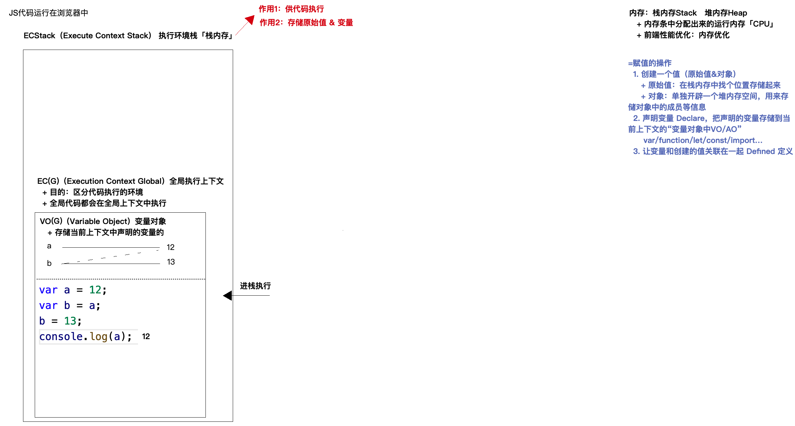

# JS中的数据类型

## 数据类型

### 原始值类型

1. Number :NAN Infinite
2. String:
3. boolean
4. null
5. undefined
6. symbol :唯一值

   应用场景:

   - 对象的唯一值
   - 宏管理标识,保证标识的唯一性
   - 底层原理
7. bigint

   - typeof(111n) //bigint

### 对象类型

1. 普通对象 :object
2. 特殊对象:Date/Array/Regexp/Math/Map
3. 非标准普通对象  Number/String/Symbol/Bigint
4. 可调用的对象 function

## 数据类型检测

### typeof

`typeof 操作返回一个字符串`

返回值:

1. typeof 返回的是所属的字符串,'number','string'
2. 不能检测null typeofnull =>object
3. 箭头函数,构造器函数返回的都是函数
4. typeof 检测一个未被定义的值,返回的就是undefined

### instanceof [构造函数]

> 用来检测当前的实例是否属于这个类

`原理:首先按照构造函数[Symbol.hasInstance]([实例]),如果存在这个属性方法,则方法执行的返回结果就是最后检测的值,如果不存在这个属性和方法,则会查找当前实例的原型链一直查找到当前的实例的原型链一直找到Objext.prototype为止,如果找到了则返回的结果就是true`

#### insatnceof 原理的实现

```js
 // instanceof  原理的分析
        function _instance(obj, ctor) {
            //判断当前obj传入的数据类型
            if (obj == null) return false
            if (!/^(object|function)$/.test(typeof obj)) return false
            let prototype = Object.getPrototypeOf(obj)
            //先检测是否有Symbol.hasInsatnce这个属性

            if (typeof ctor[Symbol.hasInstance] === 'function') return ctor[Symbol.hasInstance]
            while (prototype) {
                if (prototype === ctor.prototype) return true
                prototype = Object.getPrototypeOf(prototype)
            }
            return false
        }


```

### constructor

[对象].constructor===[构造函数]]

arr.constructor===Array

> 原理就是获取对象的构造函数,所以他也存在很多的弊端

### Object.prototype.toString.call()]

原理:

> 首先找到Object.prototype.toString方法,把to
>
> String执行之后,让方法中的this变为要检测的值,toString内部会返回对应this的数据类型的结构

## 数据类型转换规则

### 其他类型的原始值抓换成Object

### 其他类型转换成数字

```js
//对象转换成数字同字符串
```

1. Number()

   Number(null || ' ' || false) 为0

   Number(undefined)  NaN
2. parseInt() ||  praseFloat()

   `会将传入的值转变成字符串,从字符串的第一个字符来时查找,查到有效数字为止,parseFloat多识别一个小数点`

   parseInt(null || ' ' || false || undefined)  都是NaN

   ```js
   //Number()
   Number('1122.1122哈哈')//Na
   //parseInt
   parseInt('1122.111222哈哈哈')
   //1122
   //parseFloat
   parseFloat('1122.1122哈哈')
   1122.1122
   ```

   `进制之间的转换`

   parseInt(value,radix)

   radix:进制的取值

   如果radix不在2-36之间[排除0],则返回的是NaN

   `如果 `parseInt `遇到的字符不是指定 `radix `参数中的数字，它将忽略该字符以及所有后续字符，并返回到该点为止已解析的整数值。 `parseInt` 将数字截断为整数值。 允许前导和尾随空格。`

   ```js
   parseInt(23555,4)
   //此时parseInt操做的结果就是
   parseInt(23,4)
   //3*4^0+2*4^1=11
   ```

### 其他类型转换成字符串

1. toString()

   bigint 转成字符串会去除n

   `对象转换成字符串是比较特殊的:Object.prototype.toString.call()是用来检测数据类型的`
2. 可以用来进行字符串的拼接 +

   ```js
   ''+{} //"[object Object]"
   {}+''//0 此时返回的就是0
   ```
3. 不是所有的对象都是字符串的拼接

   `字符串拼接的时候会先调取对象的Symbol.toPrimitive的属性`

   ```js
   11 + {[Symbol.toPrimitive](){
     return 11
   }}
   //log 22
   ```

   `再去调用对象的valueOf属性,获取原始值`

   ```js
   ({}).valueOf() //{}
   //此时获取的不是原始值
   ```

   `如果获取的不是原始值,再去调用对象的toString方法转换成字符串`

   ```js
   ({}).toString()
   //"[object Object]"
   ```
4. +new Date()

   ```js
   //转换过程
   + new Date()
   //new Date()['valueOf']
   ```

```js
(10n).toString()//'10'
(Symbol(0)).toString()//'Symbol(0)'
({name:"哈哈"}).toString()//"[object Object]"
```

### 其他类型的值转换成布尔值

`规则`

> 只有0 NaN null undefined 空字符串会变成false 其他的都是true

1. Boolean(value)
2. ! 数值取反
3. !!数值进行布尔值转换的操作

## js中比较两个值是否相等

### ==

`如果两边的类型不一样,首先会隐式转化为相同的类型,然后在做出比较`

对象==字符串   会将对象转换成===> 字符串

null==undefined

NaN==NaN //fasle

Symbol()==Symbol()   false

剩余的情况 都是转换成数字,在进行比较

```js
//数据转化规则:
/*
![]==false //true
//![]转成布尔值是false 所以false==false

[]==false //true
//都需要转换成数字
//对象转换成数字,同抓成字符串
Number([])0

*/


```

### ===

绝对相等,要求两边的值和类型都要相等

# js执行上下文和堆栈内存

## js代码的运行环境

- 浏览器内容引擎
- node环境
- webview

## 栈内存

`浏览器能够执行的原因`

```js
//1.浏览器会待在计算机中的内存中(内存条)中分配出一块内存,用来供代码执行,==>栈内存 执行环境栈ECStack

//2.为了区分是哪个环境(全局或者是函数等)下的执行代码,会产生一个执行上下文==>全局执行上下文EC(G)

//3.vo(G)(全局变量对象):variable Object 存储当前全局上下文中声明的变量

//4.在变量对象中会有变量的声明和赋值 : var xxx=xxx
//此时先定义值,在生命变量,defined值,如没有值则是undefined
```

流程:

```js
/*
形成执行环境栈===>全局执行上下文EC(G)====>执行上下文中的变量====>近栈执行====>存储值=====>声明变量======>赋值给变量
*/
```



## 堆内存

```js
//首先是开辟执行栈
//其次是全局执行上下文
//全局执行上下文
//浏览器遇到引用类型的数据,开辟堆内存,进行存储,随后生成十六进制的地址,存储在栈内存中,
//对象引用的都是堆内存中一个地址,所以对值进行修改之后,堆里面的值也发生了变化,
//var a={n:11}
//var b=a
//b['n']=15
//对象成员的访问
/*
b首先基于地址找到堆内存
把堆内存中的成员为n的值修为15
*/

```

在堆内存中形成全局对象 GO

`存放浏览器提供的JS调用/属性/方法`

VO(G)和GO的区别

```js
//1. VO(G)是全局形成的变量对象 如自定义的变量  GO是全局对象:window setTimeOut() JSON 
//2.VO是栈内存中的对象, GO是堆内存中的对象

```

案例:

```js
var a={n:1}
var b=a
a.x=a={n:2}
//此时a.x会先进行计算 然后再对a进行赋值
```

js优先级的问题:

https://developer.mozilla.org/zh-CN/docs/Web/JavaScript/Reference/Operators/Operator_Precedence


|                                                                                                                          优先级 | 运算类型                                                                                                                  | 关联性          | 运算符    |
| --------------------------------------------------------------------------------------------------------------------------------: | :-------------------------------------------------------------------------------------------------------------------------- | :---------------- | :---------- |
|                                                                                                                              20 | [`圆括号`](https://developer.mozilla.org/zh-CN/docs/Web/JavaScript/Reference/Operators/Grouping)                          | n/a（不相关）   | `( … )`  |
|                                                                                                                                 | [`成员访问`](https://developer.mozilla.org/zh-CN/docs/Web/JavaScript/Reference/Operators/Property_Accessors#点符号表示法) | 从左到右        | `… . …` |
| [`需计算的成员访问`](https://developer.mozilla.org/zh-CN/docs/Web/JavaScript/Reference/Operators/Property_Accessors#括号表示法) | 从左到右                                                                                                                  | `… [ … ]`     |           |
|                           [`new`](https://developer.mozilla.org/zh-CN/docs/Web/JavaScript/Reference/Operators/new) (带参数列表) | n/a                                                                                                                       | `new … ( … )` |           |
|                                             [函数调用](https://developer.mozilla.org/zh-CN/docs/Web/JavaScript/Guide/Functions) | 从左到右                                                                                                                  | `… ( … )`     |           |
|    [可选链（Optional chaining）](https://developer.mozilla.org/zh-CN/docs/Web/JavaScript/Reference/Operators/Optional_chaining) | 从左到右                                                                                                                  | `?.`            |           |

# js中函数的底层执行机制

## 创建函数的过程

1. 开辟一个堆内存空间,有个十六进制的地址
2. 存储的内容
   - 函数体中的代码当做字符串进行存储
   - 当做普通对象也会存一些键值对
3. 创建函数的时候,`声明了其作用域[scoped]`
4. 并把堆内存的地址放在栈中供函数(变量)去调用

## 函数执行的过程

1. 函数执行的时候,会形成自己的私有执行上下文,EC(FN),在私有上下文中会形成自己的私有变量AO(FN)
2. 初始化作用域链 scoped-chain 左侧是自己的私有上下文,右侧是函数的作用域,(函数形成的作用域)

   `函数形成的作用域只和自己创建的上下文有关,和执行的上下文无关`
3. 初始化this指向
4. 初始化arguments[实参集合]
5. 形参赋值,形参变量是自己的私有变量,会在私有变量对象中存储
6. 变量提升
7. 代码执行

`函数执行完成以后,当前形成的上下文都会被出栈释放,存储的私有变量也会被释放,`

`但是如果当前上下文的某些东西[一般称为堆内存],被当前上下文以外的事物所占用,则当前上下文不能出栈释放,之前的私有变量也都被存储起来了`简称`闭包`

### 闭包

> 闭包是一种机制,函数执行产生的上下文,一方面可以保护里面的私有变量不会被污染,另一方面,如果不被释放,私有的相关变量及相关信息也都会被保存起来.这种保存和保护的机制,被称为闭包

### 垃圾回收机制

# 变量提升的处理机制

## 定义:

> 在当前的上下文中(全局/私有/块级),js的代码自上而下指向之前,浏览器会提前处理一些事情(语法解析),语法解析一定是在代码执行之前,会把当前所有带var 和function的关键字进行提前的声明和定义

## 场景

```js
//函数的变量提升
//函数表达式
fn() //此时会报错:Uncaught TypeError: fn is not a function   
var fn=function(){
}

//function 普通创建函数
fn() //此时会执行函数的
fn(){}


var fn=function fn1(){}
//此时匿名函数
```

`变量提升阶段,表达式阶段,函数是声明不定义; 普通函数创建过程中,函数是声明+定义`

## let 和 var 的区别

**js代码的执行**

1. 首先进行语法解析
2. 形成上下文
3. 形成全局对象
4. 变量提升\
5. 代码执行

   ..........

### var VS let

```js
//*
1.let 不存在变量提升
2.let 不允许重复声明
3.全局上下文中,var声明的变量保存在GO中,let 声明的变量保存在 VO(G)中
4.暂时性死区

//typeof 检测一个未被定义的值,返回的是undefined
typeof (x) //undefined
//此时会出现报错   
typeof(x)
let x=''


5.块级作用域
/*
作用域:块级作用域
*/
块级作用域[如果在{}中](排除函数和对象的大括号)中出现let /const /function ,则当前的{}会成为一个块级私有的上下文
块级作用域内形成的全局对象是VO


*/
```

#### 块级作用域执行的过程

1. 首先会形成自己的全局上下文EC(block)
2. 形成全局的变量对象 VO
3. 初始化作用域链
4. 没有this,this指向的是上级上下文中的this[类似于箭头函数]
5. 没有ARGUMENTS
6. 没有形参赋值
7. 变量提升  但是var 是不受块级作用域的影响

```js
  <button>anniu</button>
    <button>anniu</button>
    <button>anniu</button>
    <button>anniu</button>
    <button>anniu</button>


    <script>
        let btns = document.querySelectorAll('button'),
            i = 0, len = btns.length;

        for (; i < len; i++) {
            let index = i;
            btns[i].onclick = function () {
                console.log(i);
                console.log(index)
            }
        }
    </script>
```

### this指向的问题

> 函数执行的主体:
>
> `函数创建的主体是上下文,this>谁执行了函数`

> 事件绑定 函数执行 构造函数 箭头函数 基于call/apply.bind强制修改的this指向

函数的执行

`正常普通函数的执行:看函数前是否有点 . 有点 . 前面是谁,this就是谁,没有点,this就是window`

`匿名函数:`

函数表达式:等同于普通函数或者是事件 绑定的机制

自执行函数:this一般就是window或者是undefined

回调函数:一般是window/undefined,但是如果是在另外的函数执行中,对回调函数执行做了处理,以自己处理的为主

```js
//案例F分析
				 var x = 3,
            obj = { x: 5 };
        obj.fn = (function () {
            this.x *= ++x;
            return function (y) {
                this.x *= (++x) + y;
              //this.x=this.x*((++x)+y)
                console.log(x); 
            }
        })();
        var fn = obj.fn; 
        obj.fn(6);//return后的结果
        fn(4);
        console.log(obj.x, x);

//自执行函数只执行一次,后面所执行的数据都是关于这个函数执行后返回的数据
/*
自执行函数在创建的时候,只执行一次,然后后面obj.fn执行的是自执行函数的返回值


*/
```

```js
//this指向的问题
 var num = 10; // 60
        var obj = {
            num: 20 //30
        };
        obj.fn = (function (num) {
            +//此处需要注意num是形参,会有形参赋值
            this.num = num * 3;
            num++;//
            return function (n) {
                this.num += n;
                num++;
                console.log(num);
                console.log('this.name', this.num);
            }
        })(obj.num);
        var fn = obj.fn;
        fn(5);
        obj.fn(10);
        console.log(num, obj.num);

```

### 新老版本浏览器执行的机制

```js
{
    function foo(){}
    foo=1
}

/*
案例分析
1.在老版本浏览器的执行中,没有块级作用域的概念,所以在执行的时候会先对函数进行定义和赋值
所以后面执行的时候,会再次对foo进行赋值,所以此时foo的值就是1

2.
新版浏览器的执行,如果function出现在除函数和对象的大括号中,则在变量提升阶段,只声明不进行定义.
 新版浏览器中出现了块级作用域,所以在创建的时候,会形成私有的块级作用域,所以foo在全局中有一个定义,在私有的块级作用域中也有一份私有的foo定义
3.在块级作用域中对foo执行亲的操作,会被映射到全局变量中
 

*/
```

**函数中使用了ES6的形参赋值默认值时浏览器的执行机制":**

1. 一方面需要兼容ES5的语法;
2. 一方面还需要兼容ES6的新语法
3. 执行机制:

   如果当前的函数中使用了ES6的形参赋值默认值[不论是否生效],并且在函数体中有基于let/const/var声明的变量[无论变量名是否和形参一致 ]则函数在执行的时候,除了形成一个私有的上下文,而且还会把函数体{}当做一个私有的块级上下文[并且块级上下文的上级上下文是私有的那个上下文]
4. 如果函数中声明的变量和形参变量一致,最开始的时候同步给同名的私有变量一份

案例:

```js
 var x = 1;
        function func(x, y = function an() { x = 2 }) {
            x = 3;//2
            y();
            console.log(x);//2
        }
        func(5)
        console.log(x)//1


 var x = 1;
        function func(x, y = function an() { console.log(x); x = 2; console.log(x) }) {
            //func(x, y = function an() { console.log(x); x = 2; console.log(x) }) 此处会形成私有的作用域 , 形参赋值 x=5
            /*
            {
                //func(x, y = function an() { console.log(x); x = 2; console.log(x) }) 此处会形成私有的作用域 , 形参赋值 x=5

                var x = 3;
                y();
                console.log(x);//2
             }
             此处会形成私有的块级上下文,当私有块级作用域和私有上下文的变量和形参一致时,会相互传递参数


            */
            console.log('x', x)
            var c = 3;
            console.log('c', c);
            y();
            console.log(x);//2
        }
        func(5)
        console.log(x)//1


```

# js高级编程技巧

## 单例设计模式

## 惰性函数

```js
//获取当前的元素的样式  元素.style.xxx 获取行内样式
/*
1.盒子模型属性 getBoundingClientRect()
2.获取经过浏览器计算过的属性
标准:getComputedStyle
IE6-8 currentStyle

*/
```

//惰性函数的案例

```js
var t ;
function foo(){
  if(t)return t
  t=newDate()
  return t
}


//基于惰性函数进行构造
function foo(){
  var t=new Date()
  foo=function(){
    return t
  }
  return foo()
}
```

## 柯里化函数

一点补充:

`在(console.log())控制台或者是alert中进行 函数输出的时候,会将函数转成字符串,所以最后输出的时候,会调用函数上的Symbol.toPrivimate或者是toString()的方法`

```js
				const curring=?
      
       	let add = curring();
        let res = add(1)(2)(3);
        add = curring();
        res = add(1, 2, 3)(4);
        console.log(res); //10
        add = curring();
        res = add(1)(2)(3)(4)(5);
        console.log(res) //15;
				//设置curring的值,使其输出以上的值
//
```

## 防抖和节流

防抖:

```js
function debounce(func,wait,immediate){
    var timer=null,
        isFirst=immediate
    return function proxy(){
        if(isFirst){
            func();
            isFirst=false
        }else{
            if(timer) clearTimeOut(timer)
         timer = setTimeout(() => {
                        //规范写法,定时器执行完成以后需要随时进行清除
                        if (timer) {
                            clearTimeout(timer)
                            timer = null
                        }
                        console.log('走到了里面')
                        func(...params)
                    }, wait);
  
    }
  
        }
  
  
}


```

节流函数的实现

```js
function throttle(func,wait){
    var pre=0,
        timer=null
    return function proxy(){
        var now=+new Date(),
            remaining=wait-(now-pre)
        if(remaining<=0){
            func();
            pre=+new Date()
        }else if(!timer){
            timer=setTimeOut(()=>{
                if(timer) clearTimeOut
                (timer); timer=null
                func();
                 pre=+new  Date()
            },remaining)
        }
  
  
  
    }
  
  
}


```

# 面向对象

## 构造函数和普通通过函数执行的差异

1. 创建上下文之后,浏览器会默认帮助我们创建一个对象"实例对象",

   把当前的Fn函数当做一个类"构造函数"

   创建的对象就是这个类的一个实例
2. 初始this的时候,让this指向当前创建的实例对象
3. 在代码执行完,返回值的时候

   如果函数没有写return,或者返回的是一个基本数据类型值,则浏览器会默认吧创建的实例对象返回

   如果函数本身返回的就是一个引用数据类型值,还是以自己返回的为主

## 原型和原型链

`1.大部分数据类型的值都具备prototype属性,属性值本身是一个对象==>prototype 是一个对象[浏览器会默认为其开辟个堆内存,存储当前类的实例可以调用的公共属性和方法],prototype:{ constructor:属性值是当前函数/类的本身 } `

`构造函数中Fn.prototype.__proto__指向的是Object.prototype`

`2.每一个对象数据类型的值,都具备一个属性__proto__属性值指向自己所属类的prototype,所有对象都是Object的实例`

```js
  let arr = [];
        console.log(arr.hasOwnProperty('push'))
//(arr.hasOwnProperty 的执行过程
arr=>arr.__proto__ => Array.prototype===>Array.prototype.__proto__===>Object.prototype
//按照这样的查找机制,arr才可以使用hasProperty的属性
```

## 重写new执行

```js
function _new(ctor, ...params) {
            //1.创建一个对象,将对象的__proto_指向ctor构造函数的prototype属性
            let obj = {};
            obj.__proto__ = ctor.prototype;
            //2.执行构造函数,将this指向实例对象
            let result = ctor.call(obj, ...params)
            //3.判断返回的结果
            if (/(function|object)/.test(typeof result)) return result
            return obj
        }
```

## 重写object.create()方法

```js
 // 实现Object._create()
        function _create(ctor) {
            function Proxy() { }
            Proxy.prototype = ctor
            //返回实例对象
            return new Proxy
        }
```

## 构造函数的原型重定向

应用场景

```js
function fun(){}
fun.prototype = {
            b: function () {
                this.a = 20;
                alert(this.a);
            },
            c: function () {
                this.a = 30;
                alert('这是c的a' + this.a)
            }
        }
//此时的操作就是给原型进行重新的赋值

```

问题:原型重定向以后,原始的浏览器开辟的原型对象会被释放,这样就导致之前原型对象上的属性和方法不在能够被使用,同时原来所具的constructor属性也会给销毁

解决方法:

1.如果原型上没有其余的属性和方法,直接手动添加constructor属性即可

2.如果不确定,则需要进行对象的浅拷贝,重新赋值给新的原型对象[对象合并处理]

## 函数的多种角色

首先是在作为函数:普通函数和构造函数

其次是作为对象:键值对的形式

```js
//所有的函数和构造函数都是Function的实例
//而每一个对象类型的数据值都具有一个__proto__属性
function fun(){}
fun.__proto__===Function.prototype

Function.prototype===Function.__proto__

Object.__proto__===Function.prototype

Object.__proto__.__proto__===Object.prototype
```

```js
//函数的多重角色的练习题:

function Foo() {
            getName = function () {
                console.log(1);
            };
            return this;
        }
        Foo.getName = function () {
            console.log(2);
        };
        Foo.prototype.getName = function () {
            console.log(3);
        };
        var getName = function () {
            console.log(4);
        };
        function getName() {
            console.log(5);
        }
        Foo.getName();
        getName();
        Foo().getName();
        getName();
        new Foo.getName();//运算优先级 先执行 Foo.getName() 在执行new
		new Foo().getName();//先new 再执行.方法
        new new Foo().getName();
```

# 关于this的指向问题

1. 给当前元素的某个事件绑定方法的时候this指向的是当前元素的本身
2. 方法执行,看方法前面是否有点,有点,点前面是谁this就是谁,没有点this就是undefined

   自治性函数中的this指向的就是undefined

   回调函数的this指向的一般也是undefined
3. 构造函数执行this指向的就是当前类的实例
4. 箭头函数没有this

## 手动实现call/bind的方法

```js
//call方法的实现
function _call(context,...params){
   //判断context是否是复杂数据类型
    context==null?context=window:null
    let self=this,
        key=Symbol('key'),
        result
 
       context[Symbol('key')]=self
    result= context[Symbol('key')](params)
    delete context[Symbol('key')]
    return result
   
}


```

# js中多种继承方式

## 原型继承

```js
function Parent(){}
function Child(){
 
};
Child.prototype=new Parent

//Child的原型继承父类的实例
```

原型继承的特点:

- 父类中私有的属性方法都变成子类公有的属性和方法

## call继承方式

```js
function Parent(){}
function Child(){
   Parent.call(this)
}
//在子类构造函数中,把父类当做普通方法执行,此时this指向的shiwindow,所以使用call来改变this的指向
```

- call继承,只能继承父类私有的不能继承父类公有的

## 寄生组合式继承

```js
//所谓寄生组合是指 call继承+原型继承
function Parent(){}
function Child(){
   Parent.call(this)
}
Child.prototype.__proto__=Parent.prototype//
//兼容写法 
Child.prototype=Object.create(Parent.prototype)
Child.prototype.constructor=Child
```

# 浏览器的渲染机制

## 渲染机制

从服务器中基于http网络请求返回的数据

- 十六进制的文件流
- 浏览器把它解析成为字符串
- 按照C3规则标识为一个个的节点
- 生成DOM树

## 一些补充

### 进程

一个程序(浏览器打开一个页面,就相当于开了一个进程)

### 线程

进程中具体执行事务的东西,一个线程同时只能干一件事情

### 浏览器的线程分析

浏览器是可以开辟多个线程和进程的,

```js
 *    + GUI渲染线程：渲染页面
 *    + JS引擎线程：渲染JS代码的
 *    + HTTP网络线程，可以开辟N多个：从服务器获取资源和数据的
 *    + 定时器监听线程
 *    + DOM监听线程
........


```

### 异步和同步

```
异步的宏任务
```

1. ```
   定时器
   ```
2. DOM事件
3. http的请求

异步的微任务

1. promise(resolve/reject/then)
2. async await
3. requestAnimationFram
4.

# 对象的深浅合并和深浅克隆

## 深浅合并

## 深浅克隆
