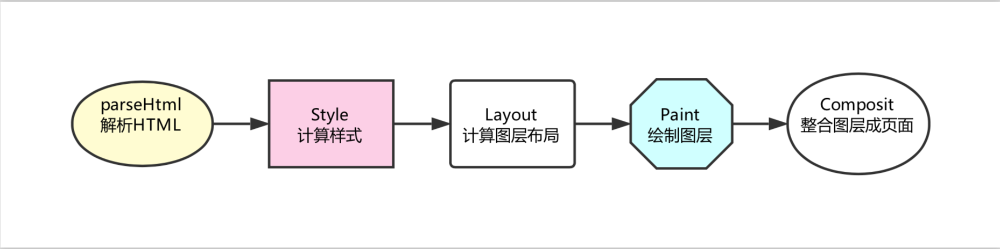

# 前端性能优化原理和实践

## 网络篇 webpack 优化和 Gzip 原理

### webpack 的优化方案

#### 不要让 loader 做太多的事情

- 使用 include 和 exclude
- 给 loader 增加相应的参数设定 ` loader : babel-laoder?cacheDirectory=true`

#### 不要放过第三方库

DllPlugin 处理第三方库的打包
经过 DllPlugin 编译的文件,在 dist 文件夹中会出现以下的两个文件:
vendor-mainfest.json
vendor.js

#### Happypack---将 loader 由单线程转为多线程

webpack 是单线程,就算存在多个任务,也只能排队一个一个去等待处理,happypack 会充分的释放 cpu 在多核并发方面的优势,帮我们把任务分解到子进程中并发执行,进而大大提高了打包的效率

#### 删除冗余的代码

tree-sharking

> tree sharking 的原理 ES6 Module 引入进行静态的分析,故而编译的时候能正确判断到底加载了哪些模块;静态分析程序流,判断哪些模块和变量未被使用或者是引用,进而删除对应的代码;

`一点补充`
commonjs 和 ES6 模块引入的区别
commonJS require('')引入 exports 或者是 module.exports.xxx 或者是 module.exports=xxx 或者是 this.xxx 的方式导出
ES6 默认导出 export default, 使用 import 的方式引入, 也可以按需导出 export 引入全部 import \* as xx from"路径"

- commonJS 模块输出的是一个值的拷贝,es6 模块输出的是值的引用;
- commonJS 模块是运行时加载,es6 是编译时输出接口;
- commonJS 是单个值的导出,es6 可以导出多个
- commonJS 是动态语法可以写在判断里面,es6 静态语法只能写在顶层;
- commonJS 的 this 指向的是当前的模块,es6 中的 this 是 undefined
- commonJS 是同步加载,es6 是异步加载

#### 按需加载

vue 和 react 中的按需加载

#### Gzip 压缩的原理

如何开启 Gzip 的压缩:`accept-encoding:gzip`;

## 存储篇 浏览器的缓存机制与缓存策略

### 浏览器的缓存机制有四个方面,

- Memory Cache
  MemoryCache，是指存在内存中的缓存。从优先级上来说，它是浏览器最先尝试去命中的一种缓存。从效率上来说，它是响应速度最快的一种缓存。

内存缓存是快的，也是“短命”的。它和渲染进程“生死相依”，当进程结束后，也就是 tab 关闭以后，内存里的数据也将不复存在。

那么哪些文件会被放入内存呢？

事实上，这个划分规则，一直以来是没有定论的。不过想想也可以理解，内存是有限的，很多时候需要先考虑即时呈现的内存余量，再根据具体的情况决定分配给内存和磁盘的资源量的比重——资源存放的位置具有一定的随机性。

虽然划分规则没有定论，但根据日常开发中观察的结果，包括我们开篇给大家展示的 Network 截图，我们至少可以总结出这样的规律：资源存不存内存，浏览器秉承的是“节约原则”。我们发现，Base64 格式的图片，几乎永远可以被塞进 memory cache，这可以视作浏览器为节省渲染开销的“自保行为”；此外，体积不大的 JS、CSS 文件，也有较大地被写入内存的几率——相比之下，较大的 JS、CSS 文件就没有这个待遇了，内存资源是有限的，它们往往被直接甩进磁盘。

- Service Worker Cache
  Service Worker 是一种独立于主线程之外的 Javascript 线程。它脱离于浏览器窗体，因此无法直接访问 DOM。这样独立的个性使得 Service Worker 的“个人行为”无法干扰页面的性能，这个“幕后工作者”可以帮我们实现离线缓存、消息推送和网络代理等功能。我们借助 Service worker 实现的离线缓存就称为 Service Worker Cache。

Service Worker 的生命周期包括 install、active、working 三个阶段。一旦 Service Worker 被 install，它将始终存在，只会在 active 与 working 之间切换，除非我们主动终止它。这是它可以用来实现离线存储的重要先决条件。

- Http Cache
- Push Cache

### Http 缓存机制

http 缓存,分为强缓存和协商缓存,优先级较高的是强缓存,在命中强缓存失败的情况下,才会走协商缓存

#### 强缓存

> 是利用 http 头中的 Expires 和 Cache-Control 两个字段来进行控制的,强缓存中当请求再次发出的 时候,浏览器会根据其中的 expires 和 cache-control 判断目标资源是否命中强缓存,若命中则直接从缓存中获取资源,不会再跟服务端发生通信

`expires` 是一个时间戳,对比本地时间和 expires 的时间戳,如果本地的时间小于 expires 设定的过期时间,则会直接去缓存汇总获取这个资源;
由于时间戳的局限性
http1.1 新增了 cache-control

`cache-control: max-age=31536000`;
max-age 来控制资源的有效期。max-age 不是一个时间戳，而是一个时间长度。在本例中，max-age 是 31536000 秒，它意味着该资源在 31536000 秒以内都是有效的，完美地规避了时间戳带来的潜在问题。
`cache-control: max-age=3600, s-maxage=31536000 `

no-store 与 no-cache
no-cache 绕开了浏览器：我们为资源设置了 no-cache 后，每一次发起请求都不会再去询问浏览器的缓存情况，而是直接向服务端去确认该资源是否过期（即走我们下文即将讲解的协商缓存的路线）。

no-store 比较绝情，顾名思义就是不使用任何缓存策略。在 no-cache 的基础上，它连服务端的缓存确认也绕开了，只允许你直接向服务端发送请求、并下载完整的响应。

#### 协商缓存

> 协商缓存机制下,浏览器需要向服务器去询问缓存的相关信息,进而判断是重新发起请求还是从本地缓存的资源

如果服务器提示资源未更改,资源会被重定向到浏览器的缓存中,这种情况下网络请求对应的状态码是 304;

Last-Modified 是一个时间戳，如果我们启用了协商缓存，它会在首次请求时随着 Response Headers 返回：

Last-Modified: Fri, 27 Oct 2017 06:35:57 GMT

随后我们每次请求时，会带上一个叫 If-Modified-Since 的时间戳字段，它的值正是上一次 response 返回给它的 last-modified 值：

If-Modified-Since: Fri, 27 Oct 2017 06:35:57 GMT

服务器接收到这个时间戳后，会比对该时间戳和资源在服务器上的最后修改时间是否一致，从而判断资源是否发生了变化。如果发生了变化，就会返回一个完整的响应内容，并在 Response Headers 中添加新的 Last-Modified 值；否则，返回如上图的 304 响应，Response Headers 不会再添加 Last-Modified 字段。

服务器并没有正确感知文件的变化。为了解决这样的问题，Etag 作为 Last-Modified 的补充出现了

Etag 是由服务器为每个资源生成的唯一的标识字符串，这个标识字符串是基于文件内容编码的，只要文件内容不同，它们对应的 Etag 就是不同的，反之亦然。因此 Etag 能够精准地感知文件的变化。

Etag 在感知文件变化上比 Last-Modified 更加准确，优先级也更高。当 Etag 和 Last-Modified 同时存在时，以 Etag 为准。

### 关于 CDN 的一点补充

> CDN （Content Delivery Network，即内容分发网络）指的是一组分布在各个地区的服务器。这些服务器存储着数据的副本，因此服务器可以根据哪些服务器与用户距离最近，来满足数据的请求。 CDN 提供快速服务，较少受高流量影响。

CDN 的核心有两个,一个是缓存,一个是回溯
缓存是我们把资源 copy 一份到 CDN 服务器上的过程;
回溯:CDN 发现自己没有这个资源,转头向根服务器去要这个资源的过程;

## 渲染篇:浏览器背后的运行机制

解析 HTML
在这一步浏览器执行了所有的加载解析逻辑，在解析 HTML 的过程中发出了页面渲染所需的各种外部资源请求。

计算样式
浏览器将识别并加载所有的 CSS 样式信息与 DOM 树合并，最终生成页面 render 树（:after :before 这样的伪元素会在这个环节被构建到 DOM 树中）。

计算图层布局
页面中所有元素的相对位置信息，大小等信息均在这一步得到计算。

绘制图层
在这一步中浏览器会根据我们的 DOM 代码结果，把每一个页面图层转换为像素，并对所有的媒体文件进行解码。

整合图层，得到页面
最后一步浏览器会合并合各个图层，将数据由 CPU 输出给 GPU 最终绘制在屏幕上。（复杂的视图层会给这个阶段的 GPU 计算带来一些压力，在实际应用中为了优化动画性能，我们有时会手动区分不同的图层）

DOM 树：解析 HTML 以创建的是 DOM 树（DOM tree ）：渲染引擎开始解析 HTML 文档，转换树中的标签到 DOM 节点，它被称为“内容树”。

CSSOM 树：解析 CSS（包括外部 CSS 文件和样式元素）创建的是 CSSOM 树。CSSOM 的解析过程与 DOM 的解析过程是并行的。

渲染树：CSSOM 与 DOM 结合，之后我们得到的就是渲染树（Render tree ）。

布局渲染树：从根节点递归调用，计算每一个元素的大小、位置等，给每个节点所应该出现在屏幕上的精确坐标，我们便得到了基于渲染树的布局渲染树（Layout of the render tree）。

绘制渲染树: 遍历渲染树，每个节点将使用 UI 后端层来绘制。整个过程叫做绘制渲染树（Painting the render tree）。

### 回流和重绘

回流:当我们对 DOM 的修改引发了 DOM 几何尺寸的变化(修改元素的宽高或者是隐藏元素)时,浏览器需要重新计算元素的几何属性,(其他元素的集合属性和位置也会因此收到影响,)然后再将计算的结果绘制出来;这个过程就是回流(也叫重排);
重绘:当 DOM 的样式发生变化,未影响到几何属性时,浏览器不需要计算元素的几何属性,直接为该元素绘制新的样式
,这个过程就是重绘;
重绘不一定会导致回流,回流一定会导致重绘;

## vue 的性能优化

### 编码阶段

尽量减少 data 中的数据,data 中的数据都会增加 setter 和 getter,会收集对应的 watcher
如果需要使用 v-for 给每一项元素绑定事件的时候,使用使用事件代理
spa 页面采用 keep-alive 缓存组件
在更多的情况下,使用 v-if 代替 v-show
key 值保证唯一
使用路由的兰记载/异步组件
防抖和节流
第三方模块按需导入
图片的懒加载

### 用户体验

骨架屏
PWA
还可以使用缓存优化,服务端开启 Gzip 压缩

### SEO 优化

预渲染
服务端渲染

### 打包优化

压缩代码
tree sharking
使用 cdn 加载第三方模块
多线程打包 happypack
splitChunks 抽取公共文件
sourceMap 优化
