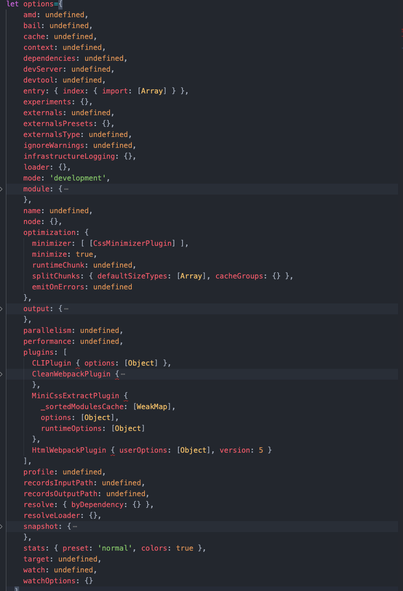
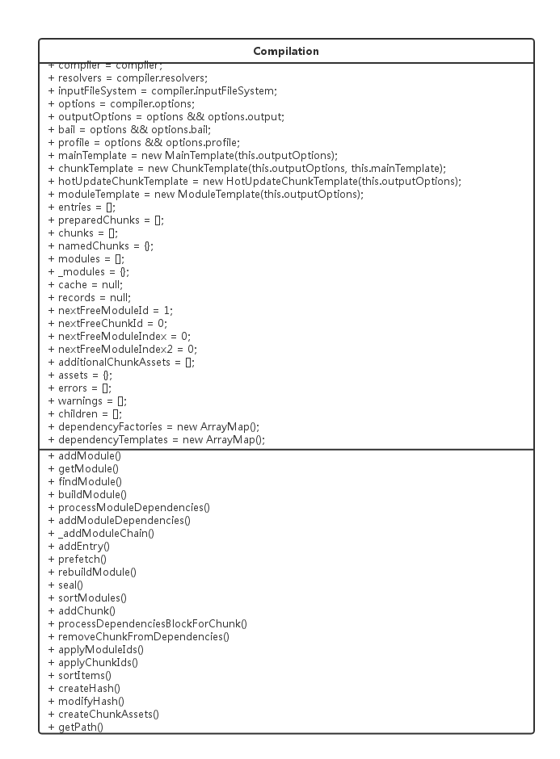
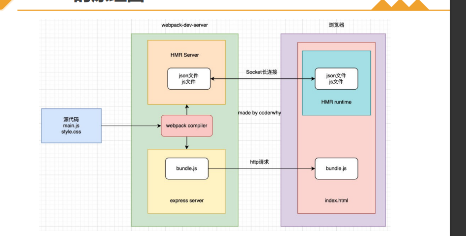
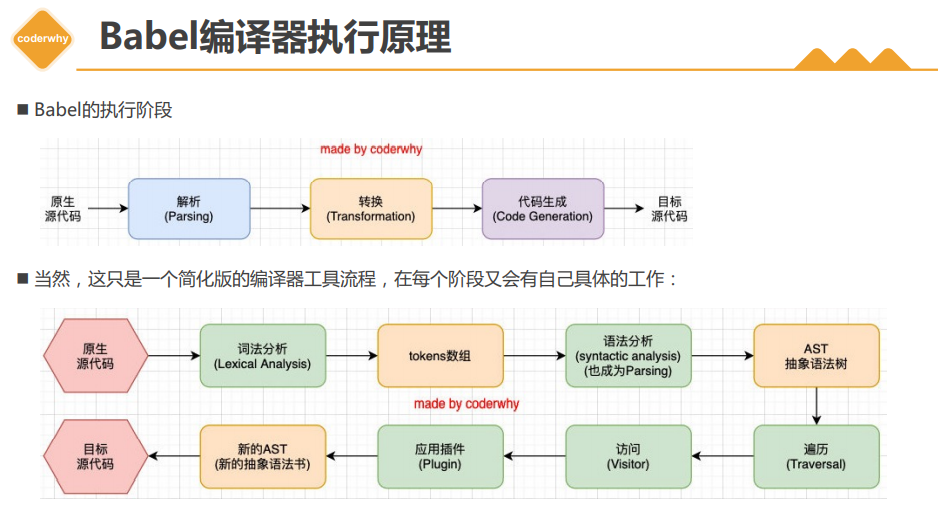

## 常用的规范

### commonJS

> commonJS 是 node.js,特就是服务器端广泛使用的模块化机制.
>
> 该规范的主要内容是,模块必须通过 module.exports 导出的变量或者是接口,通过 require()
>
> 来导入其他模块的输出到当前的模块作用域

根据这个规范，每个文件就是一个模块，有自己的作用域，文件中的变量、函数、类等都是对其他文件不可见的。

1.定义模块

在每个模块内部，module 变量代表当前模块。它的 exports 属性是对外的接口，将模块的接口暴露出去。其他文件加载该模块，实际上就是读取 module.exports 变量。

```javascript
var x = 5
var addX = function (value) {
  return value + x
}
module.exports.x = x
module.exports.addX = addX
123456
```

2.加载模块

require 方法用于加载模块，后缀名默认为.js

```javascript
var app = require('./app.js')
1
```

模块加载的顺序，按照其在代码中出现的顺序

根据参数的不同格式，require 命令去不同路径寻找模块文件。

- 如果参数字符串以“/”开头，则表示加载的是一个位于绝对路径的模块文件。
- 如果参数字符串以“./”开头，则表示加载的是一个位于相对路径的模块文件
- 如果参数字符串不以“./“或”/“开头，则表示加载的是一个默认提供的核心模块（node 核心模块，或者通过全局安装或局部安装在 node_modules 目录中的模块）
  入口文件
  一般都会有一个主文件（入口文件），在 index.html 中加载这个入口文件，然后在这个入口文件中加载其他文件。

可以通过在 package.json 中配置 main 字段来指定入口文件。

3.模块缓存

第一次加载某个模块时，Node 会缓存该模块。以后再加载该模块，就直接从缓存取出该模块的 module.exports 属性。

加载机制
CommonJS 模块的加载机制是，输入的是被输出的值的拷贝。也就是说，一旦输出一个值，模块内部的变化就影响不到这个值。

### AMD

AMD(异步模块定义)是为浏览器环境设计的,因为 commonJS 模块系统是同步加载的,当前浏览器还没准备好同步加载的模块条件;

requirejs 即为 AMD 规范的模块化工具;

requireJS 的基本思想是通过 define 方法,将代码定义为模块,通过 require 方法,实现代码的模块加载

1.定义模块

define 方法用于定义模块，RequireJS 要求每个模块放在一个单独的文件里。

按照是否依赖其他模块，可以分成两种情况讨论。第一种情况是定义独立模块，即所定义的模块不依赖其他模块；第二种情况是定义非独立模块，即所定义的模块依赖于其他模块。

2.独立模块

```javascript
define(function(){
    ……
    return {
        //返回接口
    }
})
123456
```

define 定义的模块可以返回任何值，不限于对象。

3.非独立模块

````javascript
define(['module1','module2'],function(m1,m2){
    ……
    return {
        //返回接口
    }
})
​```javascript
要定义的模块依赖于module1和module2，那么第一个参数就是依赖的模块的数组。
第二个参数是一个函数，仅当依赖的模块都加载成功后才会被调用。此函数的参数m1，m2与前面数组中的依赖模块一一对应。

此模块必须返回一个对象，供其他模块调用。


````

4.加载模块

同样使用 require（）方法来加载模块，但由于是异步的，因此使用回调函数的形式。

```javascript
require(['foo','bar'],function(foo,bar){
    ……
})
123456789101112131415161718
```

上面方法表示加载 foo 和 bar 两个模块，当这两个模块都加载成功后，执行一个回调函数。该回调函数就用来完成具体的任务。

require 方法也可以用在 define 方法内部。

```javascript
define(function (require) {
  var otherModule = require('otherModule')
})
123
```

require 方法允许添加第三个参数，即错误处理的回调函数。

```javascript
require(['backbone'], function (Backbone) {
  return Backbone.View.extend({
    /* ... */
  })
}, function (err) {
  // ...
})
123456789
```

5.配置

require 方法本身也是一个对象，它带有一个 config 方法，用来配置 require.js 运行参数。

```javascript
require.config({
  paths: {
    jquery: 'lib/jquery',
  },
})
12345
```

paths：paths 参数指定各个模块的位置。这个位置可以是同一个服务器上的相对位置，也可以是外部网址。可以为每个模块定义多个位置，如果第一个位置加载失败，则加载第二个位置。上面就是指定了 jquery 的位置，那么就可以直接在文件中 require（[‘jquery’],function($){}）

shim：有些库不是 AMD 兼容的，这时就需要指定 shim 属性的值。shim 可以理解成“垫片”，用来帮助 require.js **加载非 AMD 规范的库**

```javascript
require.config({
  paths: {
    backbone: 'vendor/backbone',
    underscore: 'vendor/underscore',
  },
  shim: {
    backbone: {
      deps: ['underscore'],
      exports: 'Backbone',
    },
    underscore: {
      exports: '_',
    },
  },
})
123456789101112131415
```

6.使用

在主页面 index.html 中先通过 script 标签引入 require.min.js。
再通过 script 标签引入一个入口文件 main.js，此入口文件一般用于配置（require.config），以及引入其他模块。

CommonJS 与 AMD
CommonJS 规范加载模块是同步的，也就是说，只有加载完成，才能执行后面的操作。
AMD 规范则是异步加载模块，允许指定回调函数，在回调函数中执行操作。
由于 Node.js 主要用于服务器编程，模块文件一般都已经存在于本地硬盘，所以加载起来比较快，不用考虑非同步加载的方式，所以 CommonJS 规范比较适用。但是，如果是浏览器环境，要从服务器端加载模块，这时就必须采用非同步模式，因此浏览器端一般采用 AMD 规范。

AMD 规范允许输出的模块兼容 CommonJS 规范，这时 define 方法需要写成下面这样：

```javascript
define(function(require,exports,module){
    var someModule = require("someModule");
    var anotherModule = require("anotherModule");
    ……
    exports.asplode = function(){

    }
})
12345678
```

### ES6 Module

ES6 正式提出了内置的模块化语法，我们在浏览器端无需额外引入 requirejs 来进行模块化。

ES6 中的模块有以下特点：

- 模块自动运行在严格模式下
- 在模块的顶级作用域创建的变量，不会被自动添加到共享的全局作用域，它们只会在模块顶级作用域的内部存在；
- 模块顶级作用域的 this 值为 undefined
- 对于需要让模块外部代码访问的内容，模块必须导出它们

  1.定义模块

使用 export 关键词将任意的变量/函数/或者是类公开给其他的模块

```js
//导出变量
export var color = 'red'
export let name = 'cz'
export const age = 25

//导出函数
export function add(num1, num2) {
  return num1 + num2
}

//导出类
export class Rectangle {
  constructor(length, width) {
    this.length = length
    this.width = width
  }
}

function multiply(num1, num2) {
  return num1 * num2
}

//导出对象，即导出引用
export { multiply }
```

2.重命名模块

重命名想导出的变量、函数或类的名称

```javascript
function sum(num1, num2) {
  return num1 + num2
}

export { sum as add }
12345
```

这里将本地的 sum 函数重命名为 add 导出，因此在使用此模块的时候必须使用 add 这个名称。

3.导出默认值

export default 命令用于指定模块的默认输出,显然,一个模块只能有一个默认输出,因此 export default 命令只能使用一次,

本质上,export default 就是输出一个叫做 default 的变量或者是方法,然后系统允许你为它取任意的名字,

模块的默认值是使用 default 关键字所指定的单个变量、函数或类，而你在每个模块中只能设置一个默认导出。

```javascript
export default function (num1, num2) {
  return num1 + num2
}
123
```

此模块将一个函数作为默认值进行了导出， default 关键字标明了这是一个默认导出。此函数并不需要有名称，因为它就代表这个模块自身。对比最前面使用 export 导出的函数，并不是匿名函数而是必须有一个名称用于加载模块的时候使用，但是默认导出则无需一个名字，因为模块名就代表了这个导出值。

也可以使用重命名语法来导出默认值。

```javascript
function sum(num1, num2) {
  return num1 + num2
}

export { sum as default }
```

4.加载模块

在模块中使用 import 关键字来导入其他模块。
import 语句有两个部分，一是需要导入的标识符，二是需导入的标识符的来源模块。此处是导入语句的基本形式：

```javascript
import { identifier1, identifier2 } from './example.js'
1
```

- 大括号中指定了从给定模块导入的标识符
- from 指明了需要导入的模块。模块由一个表示模块路径的字符串来指定。

当从模块导入了一个绑定时，你不能在当前文件中再定义另一个同名变量（包括导入另一个同名绑定），也不能在对应的 import 语句之前使用此标识符，更不能修改它的值。

## webpack 的简介

webpack 属于一个工具 使用的 node 开发的一款打包工具 使用的是 node 的一个框架(express 进行的开发)

配置 webpack 的时候需要使用,module.exports={},因为 webpack 是基于 node 的,所以需要使用 commonJS 的语法

> webpack 的构建是运行在 node.js 环境中的,它的配置文件遵循的是 CommonJS 规范,webpack.config.js 导出的是一个对象或者是一个 Function 或者是一个 Promise 函数,也还可以是一个数组包含多个配置.webapck 从入口文件开始,识别出源码中的模块化导入语句,递归找出所有的依赖,然后把入口文件和所有依赖打包到一个单独的文件中(即一个 chunk 中),这就是所谓的模块打包

六个核心的概念:

Entry:入口,这是 webpack 执行构造的第一步,可以理解为输入,webpack 执行构建的第一步就是将从入口开始搜寻及递归解析出所有入口依赖的模块.

Module:模块,在 webpack 中一切都是模块,一个模块即为一个文件.webpack 从 Entry 中开始递归找出所有的依赖模块;

Chunk:代码块,一个 Chunk 是由多个模块组合而成,用代的分割和合并

Loader:模块转换器,用于将模块的原内容按照需求转成新的内容

Plugin:拓展插件,在 webpack 构建过程的特定时机注入拓展的逻辑,用来改变或者优化构建的结果

Output:输出结果,源码在 webpack 中经过一系列的处理后而得出最终的结果;

### Entry

> Entry:入口,这是 webpack 执行构造的第一步,可以理解为输入,webpack 执行构建的第一步就是将从入口开始搜寻及递归解析出所有入口依赖的模块.

Entry 有三种参数类型

array string object

### Output

output 配置如何输出最终想要的代码,output 是一个 object,里面包含一系列的配置项,

配置项:

#### filename

filename:'sdsa.js'

filename:'[name].js'

除此之外还是有以下的变量

filename:'[name] [id] [hash:8] [chunkhash].js'

#### chunkFilename

配置无入口的 Chunk 在输出时候的文件名称.,chunkFilename 是用于指定在运行过程中生成的 Chunk 在输出时候的文件名称

常见的场景:

在使用 CommonChunkPlugin 和 import('../../)动态加载时候

#### path

配置输出文件存放在本地的目录必须是 string 类型的绝对路径。通常通过 Node.js 的 `path` 模块去获取绝对路径：

```js
path: path.resolve(__dirname, 'dist_[hash]')
```

#### publicPath

配置发布到线上资源的 url 前缀,

如:

publicPath:"./dist"

`path和publicPath`都支持字符串模板,内置变量只有一个:hash 代表一次编译操作的 hash 值

### Module

配置处理的模块

#### 配置 Loader

rules 配置模块的读取和解析规则,通常用来配置 loader.类型是一个数组,数组的每一项都描述了如何处理部分的文件:

配置 rules 大致通过以下的方式

1. 条件匹配:通过 test/include/sxclude 三个配置项命中 loader 要应用的规则文件
2. 应用规则:对选中后的文件通过 use 配置项来应用 loader,可以给 loader 传入参数
3. 重置顺序:使用 enfoce 强制将执行顺序放到最前或最后

parser:`parser` 属性可以更细粒度的配置哪些模块语法要解析哪些不解析，和 `noParse` 配置项的区别在于 `parser` 可以精确到语法层面， 而 `noParse` 只能控制哪些文件不被解析。

noParse:hulve 对没有采用模块化的文件进行递归的解析和处理

`忽略的文件不能包含import require define等模块化的语句,不然会导致构建代码中包含无法在浏览器环境下执行的模块化语句`

example:

```js
module: {
  rules: [
    {
      test: /\.js$/,
      use:['babel-loader?cacheDirectory']
      //或者是以下写法
      use: [
        {
          loader: "babel-loader",
          options: {
            cacheDirectory: true,

          },
            enforce:'post'//把改loader的执行顺序放到最后 pre是放到前面
        },
      ],
       include:path.resolve(__dirname,'src'),
       exclude:path.resolve(__dirname,"node_modules"),
        noParse: /jquery|chartjs/
       parser:{
         amd: false, // 禁用 AMD
      commonjs: false, // 禁用 CommonJS
      system: false, // 禁用 SystemJS
      harmony: false, // 禁用 ES6 import/export
      requireInclude: false, // 禁用 require.include
      requireEnsure: false, // 禁用 require.ensure
      requireContext: false, // 禁用 require.context
      browserify: false, // 禁用 browserify
      requireJs: false, // 禁用 requirejs

       }
    },
  ];
}


```

### Resolve

> Webpack 在启动后会从配置的入口模块出发找出所有依赖的模块，Resolve 配置 Webpack 如何寻找模块所对应的文件。

#### alias

通过别名把原导入路径映射成一个新的导入路径

#### extensions

用于存在尝试过程中用到的后缀列表

默认是['.js','.json']

```js
resolve: {
  alias: {
    components: './src/components'
  }
  extensions: ['.js', '.json']
}
```

### Plugin

> plugin 用于拓展 webpack 功能,各种各样的 plugin 几乎让 webpack 可以做任何构建相关的事情

plugins 配置项接受一个数组,数组的每一项都是一个要使用的 Plugin 的实例

```js
const CommonsChunkPlugin=require('webpack')


module.exports={
    plugins:[
    //将所有的页面用到的公共代码提取到common代码块中
    new webpack.optimize.CommonsChunkPlugin({
      name:"",
      chunk:[]


    });


    ]


}

```

### 基于 webpack 构建离线应用

#### 离线应用

> 离线应用是指通过离线缓存技术,让资源在第一次加载后缓存在本地,下次访问它的时候就直接返回本地文件,就算没有网络连接

优点:

1. 在没有网络的情况下也能够打开网页
2. 加快加载速度,对于网站的运营者来说可以减少服务器的压力,以及传输流量费用

### 离线缓存技术

#### AppCache

目前已经在 web 中删除

#### Service Workers

> Service Workers 是一个在浏览器后台运行的脚本,它的生命周期完全独立页面,无法访问 DOM,但是就可以通过 postMessage 接口发送消息来和 UI 进行通信.拦截网络请求时 Service Workers 的一个重要功能,通过它能完成离线缓存/编辑响应/过滤响应等功能

#### webpack 中的插件

使用[serviceworker-webpack-plugin](https://github.com/oliviertassinari/serviceworker-webpack-plugin)

```js
const ServiceWorkerWebpackPlugin = require('serviceworker-webpack-plugin')

module.exports = {
  plugin: [
    new ServiceWorkerWebpackPlugin({
      // 自定义的 sw.js 文件所在路径
      // ServiceWorkerWebpackPlugin 会把文件列表注入到生成的 sw.js 中
      entry: path.join(__dirname, 'sw.js'),
    }),
  ],
}
```

Loader 和 Plugin 的区别:

不同的作用:

1. Loader(加载器):Webpack 将一切的文件视为模块,但是 webpack 原生是只能解析 js 文件,如果想将其他的文件打包的话,就需要用到 loader.所以 loader 的作用就是让 webpack 拥有了加载和解析的非 js 文件的能力
2. Plugin(插件):Plugin 可以拓展 webpack 的功能,让 weopack 更具有灵活性.在 webpack 运行的声明周期中会广播出许多的事件,Plugin 可以监听这些事件,在合适的时机通过 webpack 提供的 api 改变输出的结果;

不同的用法:

1. Loader 在 module.rules 中配置,也就是说,他作为模块解析规则而存在,类型为数组,每一项都是一个 Object,里面的描述了对于什么类型的文件,使用什么加载和使用的 参数;
2. Plugin 在 plugin 中单独配置,类型是数组,每一项都是一个 plugin 的实例,参数都用过构造函数传入;

#### 常用的 loder,用过哪些 loder

`css-loader：`加载 CSS，支持模块化、压缩、文件导入等特性

`style-loader：`把 CSS 代码注入到 JavaScript 中，通过 DOM 操作去加载 CSS

`postcss-loader：`扩展 CSS 语法，使用下一代 CSS，可以配合 autoprefixer 插件自动补齐 CSS3 前缀

`babel-loader：`把 ES6 转换成 ES5

`file-loader：`把文件输出到一个文件夹中，在代码中通过相对 URL 去引用输出的文件 (处理图片和字体)

`url-loader：`与 file-loader 类似，区别是用户可以设置一个阈值，大于阈值会交给 file-loader 处理，小于阈值时返回文件 base64 形式编码 (处理图片和字体)

`vue-loader：`加载 Vue.js 单文件组件

`mini-css-extract-plugin提供的loader:` 使用 link 标签引入 外联的 css 文件

#### 常用的 plugin 使用过哪些 plugin

`html-webpack-plugin：` 设置渲染页面的模板

`terser-webpack-plugin:` 支持压缩 ES6 (Webpack4)

`mini-css-extract-plugin:`分离样式文件，CSS 提取为独立文件，支持按需加载

`clean-webpack-plugin:`目录清理

`commons-chunk-plugin`:提取公共的代码

`define-plugin：`定义环境变量

`DllPlugin`:此插件用于在单独的 webpack 配置中创建一个 dll-only-bundle。 此插件会生成一个名为 manifest.json 的文件，这个文件是用于让 DllReferencePlugin 能够映射到相应的依赖上

### webpack 的构建流程

1. 初始化参数,从配置文件和 shell 语句中读取和合并参数,得出最终的参数(获取 options 对象);
2. 开始编译:用于上一步得到的参数初始化 complier 对象,加载所有配置的插件,执行对象的 run 方法开始进行编译;编译的过程中会进一步构建出 Compilation 对象
3. 确定入口:根据配置中的 entry 找出所有的入口
4. 编译模块: 编译阶段会创建两个模块工厂(NormalModuleFactory 和 ContextModuleFactory),从入口文件开始出发,调用所有配置的 loader 对模块进行编译,再找出该模块依赖的模块,再递归此步骤,知道所有的入口依赖文件都经过了此步骤的处理;
5. 完成模块的编译:在所有经过上一步中使用的 loader 编译完所有的模块以后,得到了每个模块被编译后的最终内容以及它们之间的依赖关系
6. 输出资源:根据入口和模块之间的依赖关系,组装成一个个包含多个模块的 Chunk,再把每个 Chunk 转换成一个单独的文件加入到输出的列表,此步骤可以修改输出内容的最后机会
7. 输出完成:在确定号输出内容后,根据配置确定输出的路径和文件名,把文件内容写入到文件系统;

大致分为三个阶段:

初始化:启动构建,读取和合并配置,加载 plugin,实例化 Compiler

编译阶段:从 Entry 触发,针对每个 Module 串行调用对用的 Loader 去翻译文件的内容,再找到该 module 依赖的 module,递归地进行编译处理

输出:对编译后的 Module 组合成 chunk,把 chunk 转换成文件,输出到文件系统

`options对象:`获取到 webpack 传入的对象,并对传入的 options 挂载到 compiler 的 options 属性上面



`Compilation对象:`

> 作用:负责组织整个打包过程,包含了每个构建环节已结输出环节对应的方法;该对象每部存储着所有 module,chunk,生成的 asset 以及用来生成最后打包文件的 template 的信息



`NormalModuleFactory:钩子函数`

该`NormalModuleFactory`模块由`Compiler`用于生成模块。从入口点开始，它解析每个请求，解析内容以找到进一步的请求，并通过解析所有文件和解析任何新文件来不断爬行文件。在最后阶段，每个依赖项都成为一个 Module 实例。

`ContextModuleFactory 钩子:`

该`ContextModuleFactory`模块用于`Compiler`从 webpack 特定的[require.context](https://webpack.js.org/api/module-methods/#requirecontext) API 生成依赖项。它解析请求的目录，为每个文件生成请求并过滤传递的正则表达式。匹配的依赖项然后通过[NormalModuleFactory](https://webpack.js.org/api/normalmodulefactory-hooks)。

的`ContextModuleFactory`类扩展`Tapable`和提供了下列生命周期钩。它们可以像编译器钩子一样被点击：

`tapable在webpack的使用:`

tapable 是一个基于事件流的框架,或者叫做发布订阅模式,或者是观察者模式;

`webpack的构建流程图如下:`


## webpack 热更新的原理

> Webpack 的热更新又称热替换（Hot Module Replacement），缩写为 HMR。
> webpack-dev-server 会创建两个服务:提供静态资源的服务和 Socket 服务;
> express server 负责提供静态资源的服务(打包后的资源直接被浏览器请求和解析)
> HMR Socket Server,是一个 socket 的长连接:

- 长连接有一个最好的好处是建立连接后双方可以通信(服务器可以直接送到客户端)
- 当服务器监听到对应模块发生变化,会生成两个文件,.json 和.js
- 通过长连接,可以直接将这两个文件主动发送到客户端(浏览器);
- 浏览器拿到两个新的文件后,通过 HMR runtime 机制,加载这两个文件,并且针对修改的模块进行更新



这个机制可以做到不用刷新浏览器而将新变更的模块替换掉旧的模块。 HMR 的核心就是客户端从服务端拉去更新后的文件，准确的说是 chunk diff (chunk 需要更新的部分)，实际上 WDS 与浏览器之间维护了一个 Websocket，当本地资源发生变化时，WDS 会向浏览器推送更新，并带上构建时的 hash，让客户端与上一次资源进行对比。客户端对比出差异后会向 WDS 发起 Ajax 请求来获取更改内容(文件列表、hash)，这样客户端就可以再借助这些信息继续向 WDS 发起 jsonp 请求获取该 chunk 的增量更新。 后续的部分(拿到增量更新之后如何处理？哪些状态该保留？哪些又需要更新？)由 HotModulePlugin 来完成，提供了相关 API 以供开发者针对自身场景进行处理，像 react-hot-loader 和 vue-loader 都是借助这些 API 实现 HMR.


首先需要知道 server 端和 client 端都做了处理工作

1. 第一步就是,在 webpack 的 watch 模式下,文件系统的某一个文件夹发生改变,webpack 监听到文件的变化,根据配置文件对模块进行重编译打包,并将打包后的代码通过简单的 js 对象保存到内存中
2. webpack-dev-serve 和 webpack 之间的接口交互名主要是 dev-server 的中间件 webpack-dev-middleware 和 webpack 之间的交互 webpack-dev=middleware 调用 webpack 暴露的 api 对代码进行监控,并告诉 webpack,进而将代码打包到内存中去
3. webpack-dev-server 对文件变化的一个监控,这一步不同于第一步,并不是监控代码变化重新打包.当我们在配置文件中配置了 devServer.watchContentBase 为 true 的时候,Server 会坚硬到这些配置文件夹中静态文件的变化,变化以后会通知浏览器对应用进行 live reload.这里是浏览器的刷新,和 HMR 是两个不同的概念
4. 第四步也是 webpack-dev-server 代码的工作，该步骤主要是通过[sockjs](https://link.zhihu.com/?target=https%3A//github.com/sockjs/sockjs-client)（webpack-dev-server 的依赖）在浏览器端和服务端之间建立一个 websocket 长连接，将 webpack 编译打包的各个阶段的状态信息告知浏览器端，同时也包括第三步中 Server 监听静态文件变化的信息。浏览器端根据这些 socket 消息进行不同的操作。当然服务端传递的最主要信息还是新模块的 hash 值，后面的步骤根据这一 hash 值来进行模块热替换。
5. webpack-dev-server/client 端并不能够请求更新的代码，也不会执行热更模块操作，而把这些工作又交回给了 webpack，webpack/hot/dev-server 的工作就是根据 webpack-dev-server/client 传给它的信息以及 dev-server 的配置决定是刷新浏览器呢还是进行模块热更新。当然如果仅仅是刷新浏览器，也就没有后面那些步骤了。
6. HotModuleReplacement.runtime 是客户端 HMR 的中枢，它接收到上一步传递给他的新模块的 hash 值，它通过 JsonpMainTemplate.runtime 向 server 端发送 Ajax 请求，服务端返回一个 json，该 json 包含了所有要更新的模块的 hash 值，获取到更新列表后，该模块再次通过 jsonp 请求，获取到最新的模块代码。这就是上图中 7、8、9 步骤。
7. 而第 10 步是决定 HMR 成功与否的关键步骤，在该步骤中，HotModulePlugin 将会对新旧模块进行对比，决定是否更新模块，在决定更新模块后，检查模块之间的依赖关系，更新模块的同时更新模块间的依赖引用。
8. 最后一步，当 HMR 失败后，回退到 live reload 操作，也就是进行浏览器刷新来获取最新打包代码。

### 文件监听原理的实现

轮训监听判断文件的最后编译时间是否变化,

某个文件发生变化以后并不会立即去通知监听者,而是先缓存起来,而是等 aggregateTimeOut

## devserver

### proxy实现的原理

> proxy是webpack提供的代理服务,基本行为就是接收客户端发送的请求后转发给其他的服务器

`proxy的工作流程:`

```js
//proxy工作原理实质上是利用 http-proxy-middleware 这个http代理中间件,实现请求转发给其他的服务器
```

跨域问题:

```js
//跨域问题只存在在浏览器中,服务器端是不存在跨域问题的,

```

最终实现:

```js
//通过设置webpack proxy实现代理请求后，相当于浏览器与服务端中添加一个代理者

//当本地发送请求的时候，代理服务器响应该请求，并将请求转发到目标服务器，目标服务器响应数据后再将数据返回给代理服务器，最终再由代理服务器将数据响应给本地
```


## 提升 webpack 的编译速度

1.使用新版本的 webpack.我们会经常进行性能优化.保持最新的 nodejs 也能够保持性能.除此之外,保证包管理工具为最新也能保证性能,较新的版本也能够保持更高效的模树以及提高解析速度

2.将 loader 应用于最少的必要模块中;

3.使用 DllPlugin 将更改不频繁的代码进行单独的编译.这将改善引用程序的编译速度,即使它增加了构建过程的复杂性

4.较少编译的整体大小,以提高构建性能,尽量保持 chunks 小巧,使用更少的/更小的库,在多页面程序中使用 CommonsChunksPlugin.在多页面应用程序中以 async 模式使用 CommonsChunksPlugin.移除不适用的代码.只编译你当前正在开发部分的代码.

5.使用 cache-loader 启用持久化缓存,使用 package.json 中 postinstall 清除缓存的目录

6.基础包的分离:使用 html-webpack-externals-plugin,将基础包通过 CDN 引入,不打入,bundle 中使用 SplitChunkPlugin 进行(公共脚本/基础包/页面公共文件)替代了 CommonsChunkPlugin 插件

7.多进程/多实例构建,HappyPark thread-loader

## 优化 webpack 构建

### 优化开发体验

#### 优化构建速度

##### 减少文件搜索范围

1. 优化 loader 配置:使用 include 去命中需要处理的文件
2. 优化 resolve.modules 配置: modules 的查找机制是上一级的 node_modules 上上一级 node_modules 直到找到为止,在使用第三方模块的时候,只使用当前的路径,较少寻找.
3. 优化 resolve.alias 配置:默认情况下,我们引入 react 的时候,此时 webpack 会请入口文件./node_modules/react/react.js 开始递归和解析依赖的文件,所以会比较的耗时,通过 aliias 配置的时候,我们可以使用完整的 react.min.js 文件 配置:alias:{'react':path.resolve(\_\_dirname,'./node_modules/react/dist/react.min.js')}
4. 优化 resolve.extensions 配置,配置的列表越长,,webpack 的尝试的时间就越长,所以再导入文件的时候,需要尽可能的完整导入,require('./1.json')

##### 使用 DllPlugin

##### 使用 HappyPack

原理:让 webpack 同一时刻去处理多个任务,发挥多核 cpu 电脑的为例.把(loader)任务分解给多个子进程去并发的执行,子进程处理完以后再发给主进程,减少总的构建时间.

```js
const HappyPack = require('happypack');

module.exports={
    new HappyPack({
      // 用唯一的标识符 id 来代表当前的 HappyPack 是用来处理一类特定的文件
      id: 'babel',
      // 如何处理 .js 文件，用法和 Loader 配置中一样
      loaders: ['babel-loader?cacheDirectory'],
      // ... 其它配置项
    }),
    new HappyPack({
      id: 'css',
      // 如何处理 .css 文件，用法和 Loader 配置中一样
      loaders: ['css-loader'],
    }),

    }
```

##### 使用 ParallelUgifyPlugin

当 wepack 中有多个 js 文件需要输出和压缩的时候,原本会使用 UglifyJS 一个个压缩输出,但是 ParallelUglifyPlugin 则会开启多个子进程，把对多个文件的压缩工作分配给多个子进程去完成，每个子进程其实还是通过 UglifyJS 去压缩代码，但是变成了并行执行。 所以 ParallelUglifyPlugin 能更快的完成对多个文件的压缩工作。

```js
const ParallelUglifyPlugin = require('webpack-parallel-uglify-plugin');

// 使用 ParallelUglifyPlugin 并行压缩输出的 JS 代码
    new ParallelUglifyPlugin({
      // 传递给 UglifyJS 的参数
      uglifyJS: {
        output: {
          // 最紧凑的输出
          beautify: false,
          // 删除所有的注释
          comments: false,
        },
        compress: {
          // 在UglifyJs删除没有用到的代码时不输出警告
          warnings: false,
          // 删除所有的 `console` 语句，可以兼容ie浏览器
          drop_console: true,
          // 内嵌定义了但是只用到一次的变量
          collapse_vars: true,
          // 提取出出现多次但是没有定义成变量去引用的静态值
          reduce_vars: true,
        }
      },
    }),

```

#### 优化使用体验

##### 使用自动刷新

##### 开启模块的热更新

> 原理:当一个源码发生变化的时候,只需要重新编译发生变化的模块,再用重新输出的模块替换掉浏览器中对应的老模块
>
> 模块的热替换的原理,都需要往要开发的网页中主语一个代理客户端用于连接 DevServe 和网页,不同在于模块热替换的独特的替换机制

优势:

1. 实时预览反应更快,等待的时间更短
2. 不刷新浏览器,能够保留当前网页的运行状态,

### 优化输出质量

#### 减少用户感知加载速度(提升首页加载速度)

##### 区分环境

基于 process.env.NODE_ENV 获取当前的环境

##### 压缩代码

压缩 js 代码:

使用 UglifyJSPlugin 和 ParallelUglifyPlugin 两个插件进行 js 的压缩

压缩 ES6:
使用 UglifyES

压缩 CSS 插件:

使用 cssnano 插件 css-loader 已经内置此插件

use:['css-loader?minimize']

##### CDN 加速

> CDN 又叫内容分发,通过吧资源部署到世界各地,用户访问的时候,按照就近原则,从距离用户最近的服务器获取资源,从而加速资源的获取速度

CDN 其实是用过优化物理链路层传输过程中的网速有限/丢包等问题来提升网速

##### 使用 Tree Shaking

> Tree Sharking 可以用来剔除 js 中用不上的死代码,它依赖静态的 ES6 的模块化语法

##### 提取公共代码

通过 webpack 提取公共的代码

CommonsChunkPlugin

##### 按需加载

基于 webpack 使用按需加载

```js
//文件加载成功后执行文件导出的函数
import(/* webpackChunkName:"show" */,'./show).then(show=>{show('webpack')})

///* webpackChunkName:"show" */,Webpack内置了对import(*)语句的支持,wenbpack遇到了类似的语句会这样处理:
1.以'./show.js'为入口新生成一个Chunk
2.当代码执行到import所在的语句的时候才会去加载由Chunk对应生成的文件.
3.import 返回一个promise,当文件加载成功的时候,回到用then方法获取到导出的内容

outout:{
    chunkFilename:'[name].js'
    }
```

#### 提升流畅度,提升代码的性能

##### 使用 Prepack

Prepack 在保持运行结果一致的情况下，改变源代码的运行逻辑，输出性能更高的 JavaScript 代码。 实际上 Prepack 就是一个部分求值器，编译代码时提前将计算结果放到编译后的代码中，而不是在代码运行时才去求值。

工作原理:

1. 通过 babel 把 js 源码解析成抽象语法树,以方便更细粒度地分析源码
2. prepack 实现了一个 js 解释器,用于执行源码,借助这个解释器,才能掌握源码具体是如何执行的,并把执行的过程中的结果返回到输出中

##### 开启 Scope Hoisting

Scope Hoisting 可以让 Webpack 打包出来的代码文件更小、运行的更快， 它又译作 "作用域提升"

````js
new webpack.optimize.ModuleConcatenationPlugin();
```
## babel的使用

### babel的底层原理

`babel是如何将一段es6的代码转化成es5的`

> babel就是一个编辑器,babekl拥有自己的工作流,解析阶段, 转换阶段,生成阶段

babel的执行流程图


````
