# 计算机网络协议

## iso 和 osi 参考模型

- 应用层
- 表示层
- 会话层
- 传输层
- 网络层
- 数据链路层
- 物理层

总结起来的绕口令就是(自下而上就是)物联网淑慧适用
自上而下的三层就是资源子网(数据处理)
自下而上的三层就是通信子网(数据通信的层面)
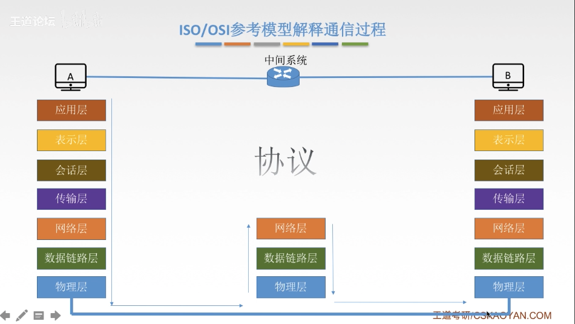

各个网络层之间的功能

## TCP 和 IP 参考模型

- 应用层
- 传输层
- 网际层
- 网络接口层

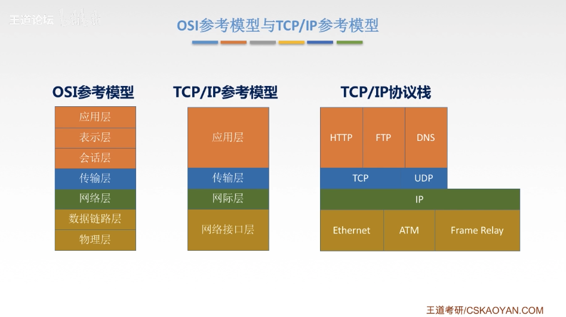

## OSI 参考模型和 TCP 和 IP 参考模型的异同点:

相同点: 1.都分层 2.基于独立的协议栈的概念 3.可以实现异构网络互联

不同点:
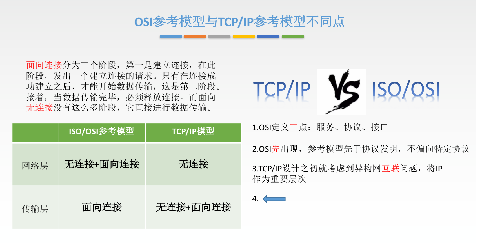

## 5 层参考模型:综合 OSI 和 TCP/IP 的优点

- 应用层 (支持各种网络应用) FTP Http
- 传输层 (进程-进程的数据传输) TCP 和 UDP
- 网络层 源主机到目的主机的数据分组路由和转发 IP ICMP
- 数据链路层 把网络层传下来的数据报组转成帧 PPP
- 物理层 比特传输

## 数据通信

### 三种通信方式

从通信双方信息的交互方式来看,可以由三种基本的方式:

- 单工通信: 只有一个方向的通信而没有反方向的交互,仅需要一条信道;
- 半双工通信: 通信双方都可以发送或者是接收信息,但是任何一方都不能同时发送或者是接受,需要两条信道;
- 全双工通信 通信双方可以同时发送和接受信息,也是需要两条信道;

### 两种数据传输方式

传输方式:

- 串行传输:
  速度慢 费用低 适合远距离
- 并行传输:
  速度快, 费用高 适合近距离
  (用于计算机内部的数据传输)

## 码元 波特 速率 带宽相关概念

### 码元:

> 码元是指用一个固定时长和信号波形(数字脉冲),代表不同离散值数值的基本波形,在这个时长内的信号被称为 k 进制码元,

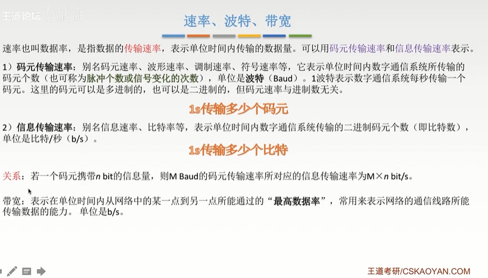

## 编码和调制

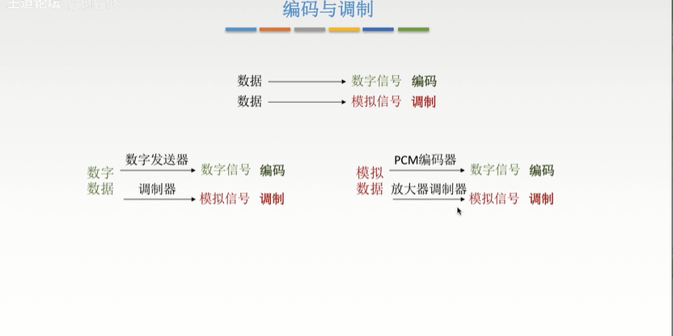

### 数字数据编码为数字信号

- 非归零编码 (高 1 低 0 上下波动)
- 曼彻斯特编码
- 差分曼彻斯特编码
- 归零编码 (信号电平在一个码元内部都要恢复到零的这种编码成编码方式)
- 方向不归零编码 `信号电平翻转表示0,信号电平不变表示1`
- 4b/5b 编码

非归零编码和归零编码的区别:

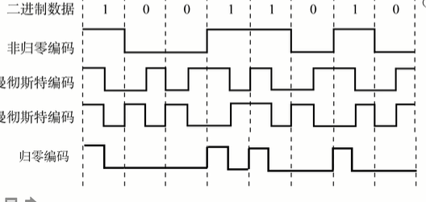

非归零编码和反向不归零编码的区别:

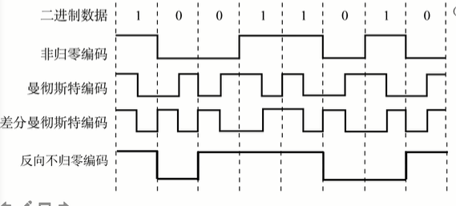

### 模拟数据编码成数字信号

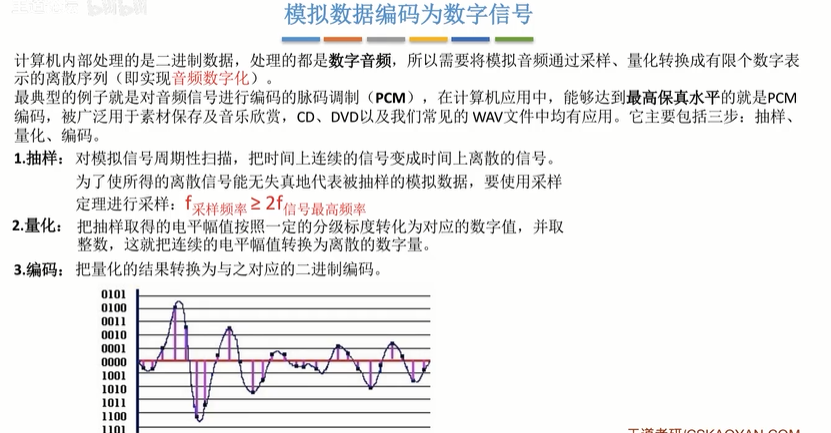

### 模拟数据调制为模拟信号

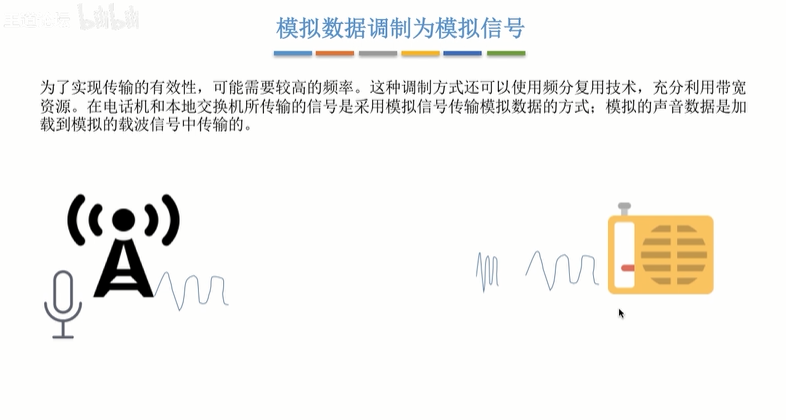

## 奈氏准则和香农定律

### 失真

失真的一种现象--码间串扰

> 码间串扰:接收端收到的信号波形失去了码元之间清晰界限的现象
> 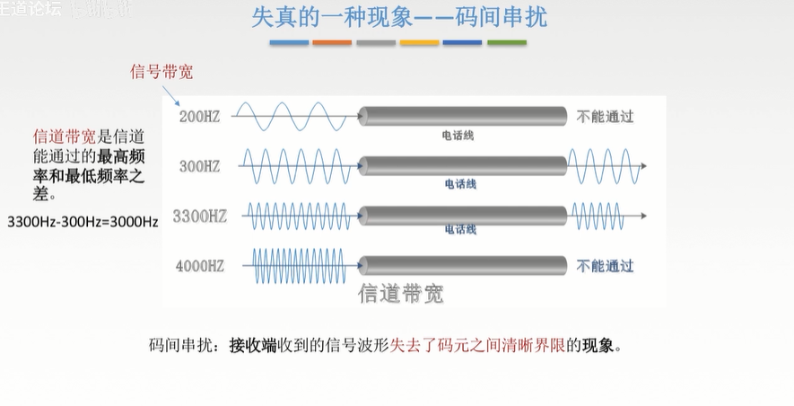

### 奈氏准则

> 在理想低通(无噪声,带宽受限)的条件下,为了避免码间串扰,极限码元传输速率为 2W Baud W 是信道带宽, 单位是 Hz

### 香农定理

> 基于噪声对通信的影响,提出的信噪比的概念

信噪比=信号的平均功率/噪声的平均功率

香农定理:

> 在带宽受限且有噪声的信道中,为了不产生误差,信息的数据传输速率有上限值

## 物理层的传输介质:

### 传输介质以及分类

传输介质也被称为传输媒体/传输媒介,它就是数据传输系统中在发送设备和接收设备之间的物理通路
传输媒体并不是物理层.

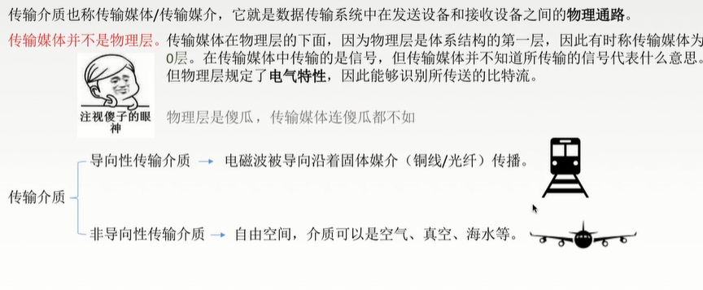

### 数据交换方式比较和总结

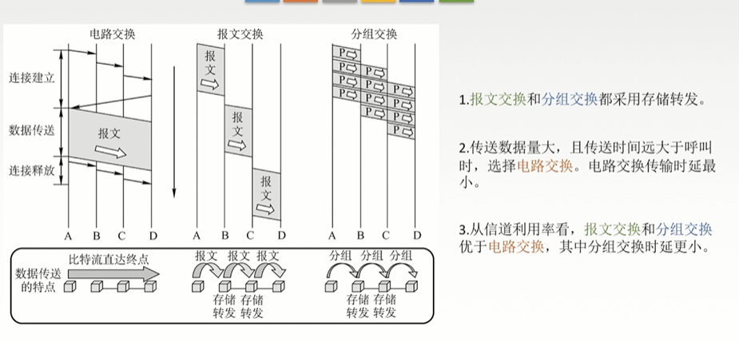

## 数据链路层

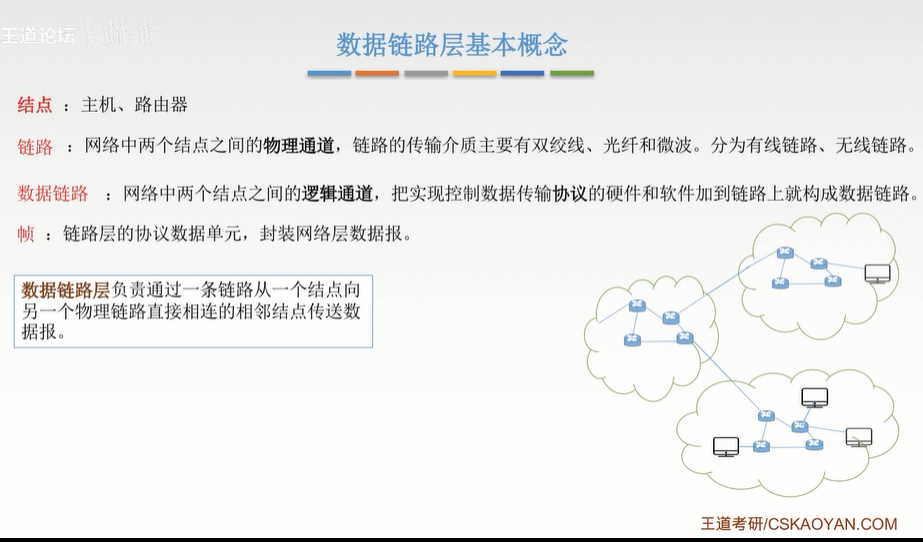

### 功能

> 数据链路层的主要作用是加强物理层传输原始的比特流的功能,将物理层提供的可能出错的物理连接改造成为逻辑上无差错的数据链路,

- 为网络层提供服务,无确认无连接服务,有确认无连接服务,有确认面向连接服务
- 链路管理,连接的建立/维持和释放\
- 組帧(在一段数据的前后部分添加首部和尾部)
- 流量控制
- 差错控制

### 链路层的两种信道

### 局域网/广域网

### 链路层的设备
